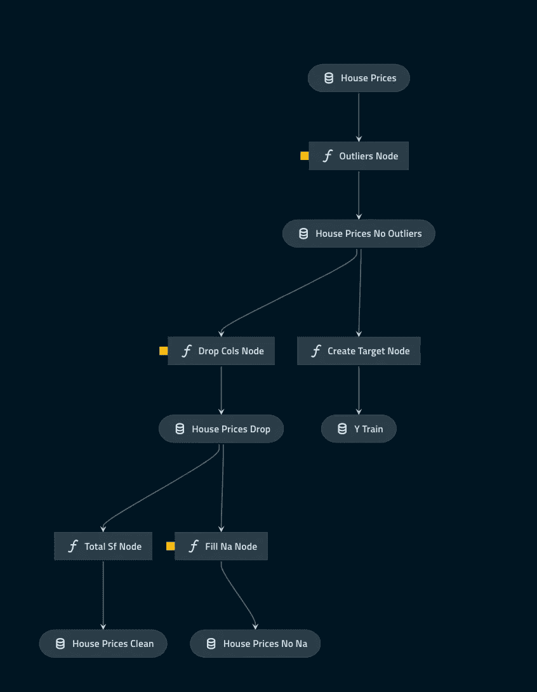
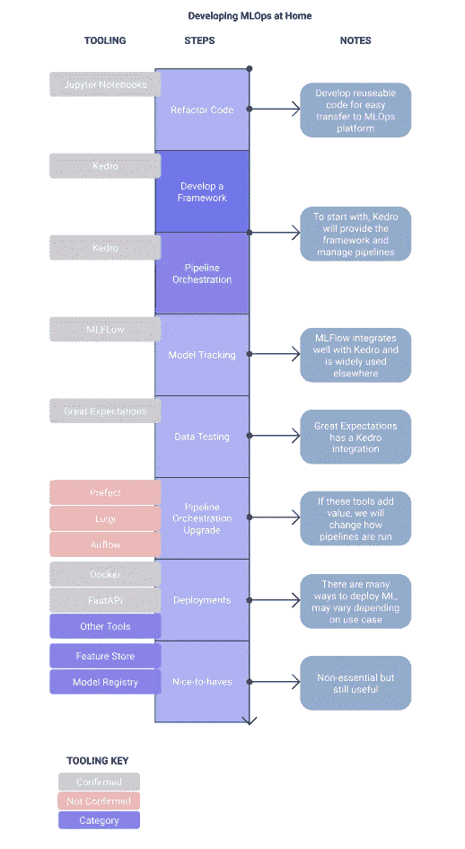

# 如何使用 Kedro 来编排您的 MLOps 管道

> 原文：<https://towardsdatascience.com/pipelines-with-kedro-298504d254e5?source=collection_archive---------21----------------------->

## 从这里开始您的动手实践之旅


米赞·拉提夫在 [Unsplash](https://unsplash.com?utm_source=medium&utm_medium=referral) 上的照片

# 介绍

MLOps 是一套很难在家学习的概念。如果没有生产环境，很难模拟真实世界中发生的事情。我一直在研究在家开发 MLOps 的方法，并选择了一些实现这些概念并能正常工作的工具。这篇文章涵盖了由麦肯锡公司的 [QuantumBlack 开发的工具 Kedro。](https://medium.com/u/777702680128?source=post_page-----298504d254e5--------------------------------)

官方文件将其描述为…

> 一个开源 Python 框架，用于创建可复制、可维护和模块化的数据科学代码。它从软件工程最佳实践中借用概念，并将它们应用于机器学习代码；应用的概念包括模块化、关注点分离和版本控制。

在本文中，我们将看看 Kedro 如何帮助我们构建被称为**管道**的**可重复**、**自动化**代码。

# 目录

*   [拿笔记本](#237d)
*   [创建一个 Kedro 项目](#dc61)
*   [将 Python 包添加到 Requirements.txt](#ccd9)
*   [配置数据目录](#60ba)
*   [创建管道](#9f13)
*   [创建节点](#b087)
*   [建造管道](#099b)
*   [参数字典](#9dbe)
*   [完成 Nodes.py 和 Pipeline.py 及参数字典](#0893)
*   [完成数据目录](#72b5)
*   [注册管道](#e857)
*   [运行项目](#dffa)
*   [结论](#69cd)

# 去拿笔记本

我已经准备了一个笔记本，上面有很好的重构代码，准备好变成一个 Kedro 项目。你可以使用你自己的，但是你可能需要做一些额外的争论和代码重构。

为了平稳地从笔记本过渡到管道，您需要确保您已经重构了代码，以将任何转换编写为函数。这些功能将成为我们 Kedro 管道中的*节点*。

**要了解如何重构你的代码，请点击这里查看我的文章:**

</mlops-at-home-part2-3c4282df7714>  

**如果你只是想要笔记本，不用多说:**

<https://github.com/AdamShafi92/mlops-at-home/blob/main/1-refactoring_code/3%20Refactored.ipynb>  

包含完整 Kedro 项目的最终回购位于以下位置:

<https://github.com/AdamShafi92/mlops-at-home/tree/main/2-pipelines/hpmlops>  

# 创建一个 Kedro 项目

我们现在准备开始进入 MLOps。

在计算机上的某个位置创建一个新文件夹。导航到该文件夹并打开一个终端或 bash 窗口。

从创建一个全新的环境开始，我推荐使用 Conda 来管理您的环境。 **Kedro 建议每个项目有一个环境。**

```
conda create -n house_prices_mlops python=3.8 anaconda
```

确保您激活了环境

```
conda activate house_prices_mlops
```

然后使用以下命令安装 Kedro

```
conda install -c conda-forge kedro
```

现在初始化一个新的 kedro 项目。您将被要求为项目的不同部分提供 3 个名称，您可以将所有这些都称为 *house_prices_mlops* 。

```
kedro new
```

最后，如果需要，您可以初始化 git repo。这次我没有这样做。

在一个以您的项目名命名的文件夹中，您应该得到下面的文件夹结构，我们称之为*项目名*。这看起来确实很复杂，但是我们现在可以忽略很多东西。实际上只需要很少的配置就可以开始了。

```
**├──** **conf**
   ├── base
      ├── catalog.yml
      ├── logging.yml
      ├── parameters.yml
   ├── local 
      ├── credentials.yml
**├──** **data**
   ├── 01_raw
   ├── 02_intermediate
   ├── 03_primary
   ├── 04_feature
   ├── 05_model_input
   ├── 06_models
   ├── 07_model_output
   ├── 08_reporting
**├──** **docs**
   ├── source
      ├── conf.py
      ├── index.rst
**├──** **logs**
   ├── journals
**├──** **notebooks** **├──** **src**
   ├── project_name
      ├── __pycache__
      ├── pipelines
         ├── __init__.py 
      ├── __init__.py
      ├── __main__.py
      ├── cli.py
      ├── hooks.py
      ├── pipeline_registry.py
   ├── tests
      ├── pipelines
         ├── __init__.py
      ├── __init__.py
      ├── test_run.py 
   ├── requirements.in
   ├── requirements.txt
   ├── setup.py
├── pyproject.toml
├── README.md
├── setup.cfg
```

如果您已经下载了我的笔记本，您可以将其添加到笔记本文件夹中，*。/house _ prices _ mlops/notebooks*

# 将 Python 包添加到 Requirements.txt

对于导入到笔记本中的每个包，您需要在 requirements.txt 文件中有一个条目。这是一个包含项目使用的所有 Python 包的文件。这些是作为 Kedro 初始化步骤的一部分安装的。

如果您想要一种从 Jupyter 笔记本中提取需求的简单方法，请看这里:

</generating-a-requirements-file-jupyter-notebook-385f1c315b52>  

创建文件后，将内容复制到 Kedro 的等效文件中，该文件位于:

```
├── conf
├── data
├── docs
├── logs
├── notebooks**├──** **src**
   **├── requirements.txt**
```

注意我们使用的是 ***。txt*** 文件，而不是

*我完成的 requirements.txt 文件位于主 repo 中，[这里](https://github.com/AdamShafi92/mlops-at-home/blob/main/2-pipelines/hpmlops/src/requirements.txt)。*

# *配置数据目录*

*数据目录是一个**。Kedro 用来加载和保存数据的 yml** 文件。这意味着我们可以使用数据集名称而不是文件路径来访问数据。*

***你读入或保存的每一个数据集都需要在数据目录中注册。***

*目录位于以下位置:*

```
***├──** **conf
** **├── base****├── catalog.yml**
      ├── logging.yml
      ├── parameters.yml
├── data
├── docs
├── logs
├── notebooks
├── src*
```

*首先，将原始数据文件复制到下面的目录中。*

```
*├── conf
**├──** **data
** **├── 01_raw** ├── docs
├── logs
├── notebooks
├── src*
```

*然后，在 **catalog.yml** 文件中注册您的原始数据。我的数据集被命名为 *house_prices* ，因此在 **catalog.yml** 文件中需要的行是:*

```
***house_prices:**
 **type**: pandas.CSVDataSet
 **filepath**: data/01_raw/train.csv*
```

*我们现在可以在 Kedro 的其他区域引用这个数据集。*

***此时，您可以保存并关闭 catalog.yml 文件。***

# *创建新管道*

*管道是一系列被称为**节点**的转换。**要创建一个，我们需要 2 个 Python 文件:***

*   *一个**节点**文件，这是用于单独转换的 Python 函数*
*   *一个**管道**文件，指定了 python 函数的顺序和参数。*

*我们需要在这里创建一些文件和文件夹来开始。每个管道都应该在自己的文件夹中有自己的管道和节点文件。通常为不同的阶段创建不同的管道，例如 EDA、数据处理、模型训练。让我们创建一个数据处理管道。*

*创建文件夹和空 Python 文件以匹配下面的结构，*斜体*中的项目是需要创建的项目。*

```
*├── conf
├── data
├── docs
├── logs
├── notebooks**├──** **src**
**├── project_name
****├── pipelines**
         ├── __init__.py
         *├── data_processing
*            *├── __init.py__
*            *├── nodes.py
*            *├── pipeline.py**
```

*首先打开你新创建的 **__init__。py** 文件并添加下面一行代码。然后保存并关闭它。*

```
*from .pipeline import create_pipeline*
```

# *创建节点*

*一个节点是 3 项的 Kedro 术语，一个 Python **函数**、**输入**位置和参数以及一个**输出**位置。如果你用的是我上面的笔记本，这些步骤已经变成了简单的函数，我们可以很容易地把它们变成节点。*

*要创建 **nodes.py** 文件，*

*   *打开您在上一步中创建的文件*
*   *将所有 Python 包导入复制到文件的顶部。*
*   *将笔记本中的每个函数复制到 nodes.py 文件中。*

*这里有一个笔记本功能的例子。*

```
*import pandas as pddef remove_outliers(train):
   train = train.copy()
   train = train.drop(
   train[(train[‘GrLivArea’]>4000) & 
   (train[‘SalePrice’]<30000)].index)
   return train*
```

***注:**我们可能想要改变 GrLivArea 等参数，在本教程中，我们将使用**参数字典**来完成。这是一个中央字典，包含了我们函数的所有值。我们可以在进行实验时，用这个从一个位置改变这些。*

*在更新参数字典之前，我们将这个函数添加到一个**管道**中。*

# *建设管道*

*管道只是将节点缝合在一起，并定义每个函数的关键字参数。它还定义了每个函数的输出应该保存在哪里。你不必在每一步之间都存钱，但我觉得这样更容易。让我们看一个例子。*

```
*node(
 func=remove_outliers,
 inputs=[“house_prices”, “parameters”],
 outputs=”house_prices_no_outliers”,
 name=”outliers_node”,)*
```

*   **func:* 要使用的函数名，来自 nodes.py 文件。*
*   **输入:*在这个例子中，列表包含数据源(使用 Kedro 名称，在数据目录中定义)和 Kedro parameter.yaml 文件，该文件由 Kedro 命名为 Parameters。*
*   **输出:*另一个 Kedro 数据源，在数据目录中定义*
*   **名称:*节点的名称*

*因为我们已经指定了一个输出名称，所以这个名称也需要在数据目录中，以便 Kedro 能够理解。因为我们将为每个节点创建一个数据集，所以稍后我们将批量更新它。*

*每个节点都应该位于管道中，如下所示，每个节点都包含上面括号中格式的处理代码。*

```
*def create_pipeline(**kwargs):
   return Pipeline(
        [
           node(),
           node(),
           node(),])*
```

# *参数字典*

*参数字典为我们管理管道中的任何参数提供了一种简洁的方式，例如函数关键字参数、模型超参数或加载的文件路径。*

***字典是一个. yml 文件，位于:***

```
***├──** **conf
** **├── base**      ├── catalog.yml
      ├── logging.yml
**├── parameters.yml**
├── data
├── docs
├── logs
├── notebooks
├── src*
```

***为了利用这一点，我们需要三样东西***

*   *字典中包含我们需要的信息的键值对。*
*   *在节点和管道文件中指定的参数字典。*
*   *字典需要在每个被使用的函数中被调用。*

*比方说，我们想在不同的层次上尝试丢弃异常值。*

*在参数字典中，我们需要给值一个名称。我通过将 *GrLivArea* 和 *SalePrice* 变量放入*异常值*中来嵌套它。*

```
*outliers: 
  GrLivArea: 4000
  SalePrice: 300000*
```

*在 Python 中，你可以用标准的方式访问这个字典，例如*

```
*parameters['outliers']['GrLivArea']>>> 4000*
```

*我们现在可以更新我们的函数来包含参数字典。*

*   *包含参数字典作为关键字参数。*
*   *在函数的相关部分调用它。*

```
*def remove_outliers(train, parameters):
   train = train.copy()
   train = train.drop(
   train[(train[‘GrLivArea’]>parameters[‘outliers’][‘GrLivArea’]) & 
   (train[‘SalePrice’]<parameters[‘outliers’][‘SalePrice’])].index)
   return train*
```

*目前，“参数”只是一个关键词。我们在 pipeline.py 文件中提供了字典本身。parameter.yaml 文件在 Kedro 中有自己的名称，所以我们只需在管道中包含字符串“parameters”。*

```
*node(
  func=remove_outliers,
  inputs=[“house_prices”, “parameters”],
  outputs=”house_prices_no_outliers”,
  name=”outliers_node”,*
```

# *完成 Nodes.py 和 Pipeline.py 以及参数字典*

*现在，您应该已经用一个函数更新了这些文件，删除了异常值。原来的笔记本还有很多我们用来处理数据的功能，这些也要注册。*

## *Nodes.py*

*将每个函数添加到节点文件中，并确保包含所有相关的导入。*

*我们在 parameters 字典中注册我们想要改变的任何内容，并确保 parameters 是函数中的一个关键字参数。*

*完成的节点文件在这里。*

## *管道. py*

*我们现在可以注册管道中的每个节点。这相当简单——我们只需添加每个节点的名称和输入/输出，就像我们之前做的那样。*

*[完成的管道文件在这里。](https://github.com/AdamShafi92/mlops-at-home/blob/main/2-pipelines/hpmlops/src/hpmlops/pipelines/data_processing/pipeline.py)*

## *参数字典*

*确保你添加的任何东西是一个参数也在字典里，[我完成的文件在这里。](https://github.com/AdamShafi92/mlops-at-home/blob/main/2-pipelines/hpmlops/conf/base/parameters.yml)*

# *完成数据目录*

*您会注意到，在节点中，我们使用字符串来定义每个函数的输入和输出。这些可能是**。csv** 文件(或其他兼容的文件类型)。我们必须告诉 Kedro 每个文件是什么，并给它一个名称。这些都在一个位置指定，即**数据目录**。我们已经添加了一个文件，但是让我们更详细地看看它。*

***数据目录是一个. yml 文件，位于:***

```
***├──** **conf
** **├── base**      **├── catalog.yml**
      ├── logging.yml
├── parameters.yml
├── data
├── docs
├── logs
├── notebooks
├── src*
```

*定义一个数据源至少需要三样东西，名称、数据类型和数据的文件路径。我们之前添加了 or house_prices 数据集，它应该看起来像这样。*

```
*house_prices:
   type: pandas.CSVDataSet
   filepath: data/01_raw/train.csv*
```

*然而，在我们的第一个节点**中，我们还定义了一个输出数据集**，“house_prices_no_outliers”。Kedro 也需要知道在哪里保存它，它是以同样的方式定义的。*

```
*house_prices_no_outliers:
   type: pandas.CSVDataSet
   filepath: data/02_intermediate/house_prices_no_outliers.csv*
```

*我们将在每个处理步骤后保存 csv 文件，所以现在让我们定义其余的。*

```
*y_train:
  type: pandas.CSVDataSet
  filepath: data/05_model_input/y_train.csvhouse_prices_drop:
  type: pandas.CSVDataSet
  filepath: data/02_intermediate/house_prices_drop.csvhouse_prices_no_na:
  type: pandas.CSVDataSet
  filepath: data/02_intermediate/house_prices_no_na.csvhouse_prices_clean:
  type: pandas.CSVDataSet
  filepath: data/02_intermediate/house_prices_clean.csv*
```

# *注册管道*

*我们现在已经定义了所有的数据源、参数，创建了节点，并将它们连接在一个管道中。*

*我们现在可以将这些放在管道注册表中。*

***这是一个*。py* 文件存储在:***

```
*├── conf
├── data
├── docs
├── logs
├── notebooks**├──** **src**
**├── project_name
****├── pipeline_registry.py***
```

*在这个文件中，我们简单地将 pipeline.py 文件映射到一个名称。如果有任何其他管道，它们也应该在这里定义，但我们目前只有一个。*

# *运行项目*

*我们现在拥有了运行项目和处理数据所需的一切！*

*要实际运行管道，只需导航到根目录(包含 conf、data、docs 等文件夹的目录)并在命令行中输入以下内容:*

```
*kedro run*
```

*凯卓现在将管理你所有的管道。由于软件包贬值或没有 git repo，您很可能会得到一些错误消息。目前来看，这些都可以忽略。您应该在命令行中看到以下内容*

```
*INFO — Completed 5 out of 5 tasks
INFO — Pipeline execution completed successfully*
```

*理解你的步骤的一个简便方法是产生一个观想。要做到这一点，您需要 pip 安装 kedro-viz。你可以在这里了解更多。*

```
*pip install kedro-viz*
```

*只需在命令行中运行以下命令，即可获得以下交互式可视化效果。下面的截图中有我没有包括的滤镜和设置，但是你的应该看起来很像。*

**

*显示我们 Kedro 管道中每一步的流程图。图片作者。*

# *结论*

*我们现在已经建立了一种自动化管道的方法。与简单的 Jupyter 笔记本相比，Kedro 提供了一种更强大、标准化的数据处理方式。代码是高度可重用的。然而，完整的好处可能还不清楚，因此我们需要开始集成其他工具来自动化预处理、测试和模型跟踪。*

*下图显示了我个人在家开发 MLOps 的计划。您可以看到，我们已经开发了一个框架，并开始管理管道。事情还没有完全自动化，我们还有很长的路要走，但这是一个好的开始！*

**

*在家开发 MLOps。图片作者。*

## *了解更多信息*

*</tabnet-e1b979907694> [## TabNet:梯度推进的终结？

towardsdatascience.com](/tabnet-e1b979907694)*