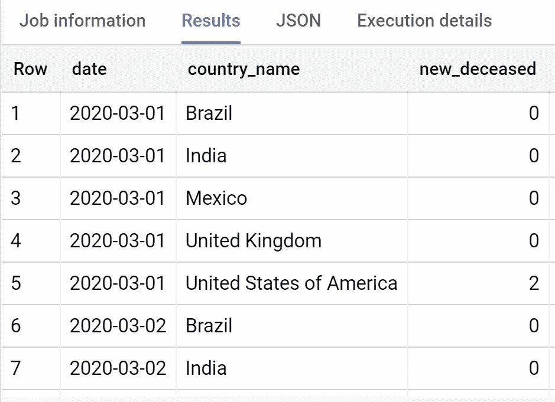
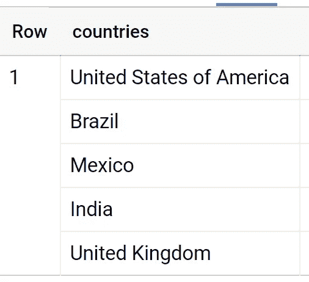
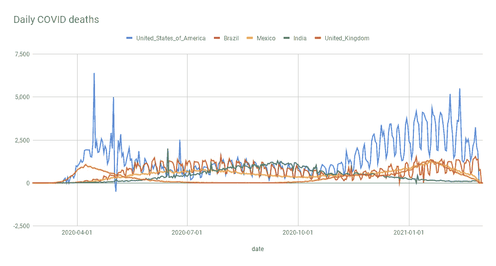

# BigQuery 中的透视和脚本

> 原文：<https://towardsdatascience.com/pivot-and-scripting-in-bigquery-cb096ff0eca2?source=collection_archive---------24----------------------->

## 使用 Google BigQuery 中的脚本构建您自己的 pivot 函数

自从写了这篇文章，谷歌[已经发布了官方的枢纽和取消枢纽](https://cloud.google.com/bigquery/docs/release-notes#May_10_2021)功能。然而，作为一个使用脚本的例子，你可能仍然会觉得这篇文章很有趣。]

分析数据时的一个常见需求是需要获取存储在单独行中的信息，并将其翻转，以便按列显示。这通常被称为旋转。在电子表格中，这真的很简单:你只需从一个菜单中选择透视表，选择你想看到的字段和一些其他选项，工作就完成了。当您使用数据库时，事情就不那么简单了。

这篇文章通过一个例子提供了使用 Google 的 BigQuery 中的脚本特性来透视数据的分步指南。

## 源数据

我们将使用 Google 托管的公共数据集中的一个例子。表格" big query-public-data . covid 19 _ open _ data _ eu . COVID 19 _ open _ data "包含自 2020 年初以来按日期分列的 COVID 病例数和死亡数的统计数据。该表包括各国和各国内部各地区每天的大量统计数据，包括死亡、住院和确诊病例的数字。我们的目标是制作一个时间序列图表，比较累计死亡总数最高的 5 个国家的每日死亡人数。

以下查询查找这前 5 名，然后选择这些国家的每日计数。

请注意，基础表包含国家/地区和城市的行。`aggregation_level = 0`确保我们只包含包含每个国家整体数据的行。

该查询生成了一个如下所示的表。



我们希望透视这些结果，以生成一个每个日期一行，每个国家一列的表格。

概括地说，在 SQL 中这样做的方法如下:

1.  按日期和国家名称分组，以确保每对国家和日期最多有一行，并聚合(如 SUM，AVG)要显示的值。
2.  对于我们想要透视的字段(即国家名称)，创建一组`CASE WHEN`语句，将给定国家的值映射到一个新列。因此，对于巴西，我们会有类似于`CASE WHEN country_name='Brazil' THEN total_deceased END AS brazil`。
3.  使用 MAX 或 SUM 对这些语句进行聚合，同时按日期进行分组，以便为每个日期创建一行。

这种方法总是可行的，但是它有两个潜在的严重缺陷。首先，如果您的 pivot 字段包含许多不同的值，那么您将需要写出大量的 SQL 代码。这既费时又产生难以阅读和维护的代码。

更基本的是，为了编写 SQL 代码，您需要提前知道 pivot 字段的所有不同值。在我们的示例中，死亡人数最多的国家的集合可能会随着时间的推移而改变，我们希望避免每次运行分析时都必须手动更新查询代码。同样，我们可能希望查看排名前 10 或 20 位的国家，这样做无需重写查询的大部分内容。

# 创建动态 SQL 的脚本

BigQuery 中问题的解决方案是[脚本](https://cloud.google.com/bigquery/docs/reference/standard-sql/scripting)，它允许我们动态生成 SQL 查询的文本。我们可以使用一个循环来创建上面第 2 步中的重复 CASE WHEN 语句，这使我们可以灵活地选择 pivot 生成的列的数量和命名。

结合[存储过程](https://cloud.google.com/blog/products/data-analytics/command-and-control-now-easier-in-bigquery-with-scripting-and-stored-procedures)和[用户定义函数](https://cloud.google.com/bigquery/docs/reference/standard-sql/user-defined-functions)，我们拥有一套非常强大的工具来创建可重用的函数，以改善我们在 BigQuery 中处理和分析数据的方式。下面的例子只解决了这个特定的透视问题，但是它相对容易概括来创建一个可重用的透视函数。

我们将根据以下大纲构建我们的脚本:

*   获取前 5 个国家名称并存储在一个数组中；
*   使用循环生成这 5 个国家的 CASE WHEN 语句；
*   将这些语句添加到模板 SQL 查询中并运行。

## 获取前 5 个国家名称

我们首先运行一个简单的查询来获取排名前 5 的国家。然而，我们将在脚本中完成这项工作，并将查询结果存储在变量`countries`中。变量需要在脚本的开头声明，因此我们最终得到如下结果:

*请注意，该查询的“处理位置”需要设置为 EU。*这会产生以下结果。



## 生成 CASE WHEN 语句

我们脚本的下一部分为每个国家名创建了一个 CASE WHEN 语句。这个循环很简单，但是我们需要小心转义引号并生成有效的字段名。BigQuery 字段名中唯一有效的字符是下划线、a-z、A-Z 和数字 0-9，但不能作为第一个字符。

以下脚本定义了几个可能导致非法字段名称的名称测试示例，以检查正则表达式是否正常工作。

该脚本生成以下字符串(为了便于阅读，我添加了换行符):

```
SUM(CASE WHEN countries_name='U. S. A.' THEN new_deceased ELSE 0 END) AS U__S__A_, 
SUM(CASE WHEN countries_name='bad & name' THEN new_deceased ELSE 0 END) AS bad___name, 
SUM(CASE WHEN countries_name='123 something else' THEN new_deceased ELSE 0 END) AS piv_123_something_else,
```

我们已经创建了有效的字段名称，并且字符串被正确地用单引号括起来。请注意，这不处理任何边缘情况—例如，如果 pivot 字段本身包含一个引号字符，我们的代码将不起作用。

## 将动态生成的文本添加到模板 SQL

现在，我们可以合并前面两个步骤的结果，并将结果字符串插入到从相关源表中选择数据的查询中:

这给了我们想要的结果——每个日期一行，前 5 个国家一列。然后，很容易将这一小组结果导入到 Google Sheets 来绘制时间序列。



# 最后的想法

虽然上面的代码是针对这个例子的，但是它很容易推广到其他数据。如果你以前没有接触过脚本，希望这篇文章也可以作为对脚本的介绍。

脚本是 BigQuery 的一个非常强大的扩展。在我作为数据科学家的工作中，这意味着更多的管道处理可以完全在 BigQuery 中完成——而不是在将数据返回到 BQ 表之前必须将数据提取到 Python 中。例如，我最近一直在使用上面讨论的技术将存储在数组中的单词嵌入转换成列，以便在 [BigQuery ML](https://cloud.google.com/bigquery-ml/docs) 分类模型中使用它们作为特性。也许在另一篇文章中会有更多的介绍。