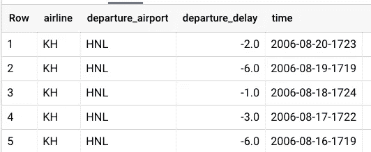
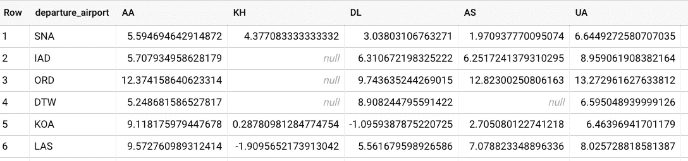
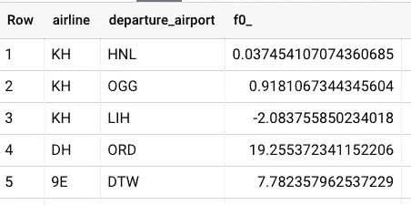
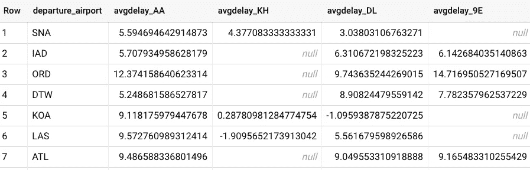
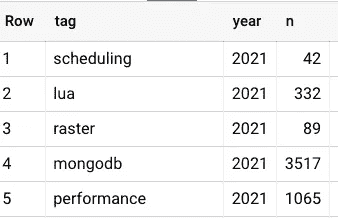
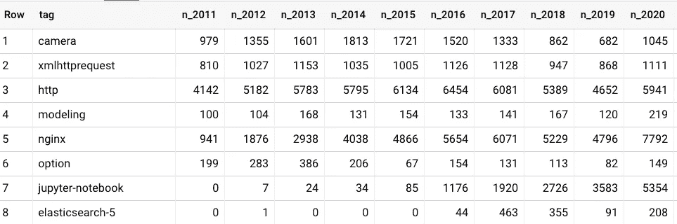
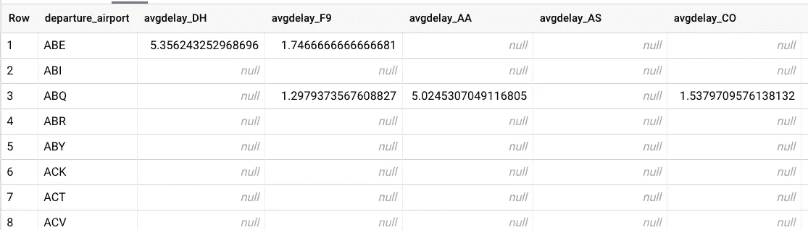

# BigQuery 中的透视

> 原文：<https://towardsdatascience.com/pivot-in-bigquery-4eefde28b3be?source=collection_archive---------2----------------------->

## 将行转换为列

有时，您可能想要重新格式化表格结果，以便为每个唯一值设置单独的列。这被称为数据透视表——通常，它只是 BI 工具支持的一个显示功能。但是，在 SQL 中创建数据透视表有时会很有帮助。下面是如何在 Google BigQuery 中使用 PIVOT 操作符来创建数据透视表。


图片由[皮克斯拜](https://pixabay.com/?utm_source=link-attribution&utm_medium=referral&utm_campaign=image&utm_content=2034023)的 Gerd Altmann 提供

## Pivot 是做什么的？

透视将行更改为列。例如，假设我们有一个航班和航班延误表，如下所示:



我们希望输出获得每个机场-航空公司对的平均出发延迟，其中航空公司代码是列:



我们会做一个旋转。请注意，如果我们只是想要平均出发延误，并且接受不同行上的平均值，我们可以简单地做:

```
SELECT 
  airline,
  departure_airport,
  AVG(departure_delay)
FROM `bigquery-samples.airline_ontime_data.flights`
GROUP BY 1, 2
```

并获得:



事实是我们需要它**像 2D 桌子**一样摆放，需要一个支点。

## 枢轴语法

BigQuery 中的 [Pivot 操作符](https://cloud.google.com/bigquery/docs/reference/standard-sql/query-syntax#pivot_operator)需要您指定三件事:

*   *起输入作用的 from_item* 。航班表中的三列(航空公司、出发机场、出发延误)是我们的 from_item。
*   *聚合*因为输出表的每个单元格都由多个值组成。这里，这是出发延迟的 AVG
*   *pivot_column* ，其值构成输出表中的列的列。不幸的是，这需要是一个常量——您不能在其中放入查询。

让我们看几个例子。

## 航班表透视

我们想要机场和航空公司的起飞延迟。透视查询是:

```
SELECT * FROM
(
  -- #1 from_item
  SELECT 
    airline,
    departure_airport,
    departure_delay
  FROM `bigquery-samples.airline_ontime_data.flights`
)
PIVOT
(
  -- #2 aggregate
  AVG(departure_delay) AS avgdelay
  -- #3 pivot_column
  FOR airline in ('AA', 'KH', 'DL', '9E')
)
```

请注意这三个部分，将出发延误转换成一个由出发机场和航空公司代码组织的表。因为 pivot_column 需要是一个常量，所以我们必须显式地列出它们。

结果:



使用前缀 avgdelay 的原因是我们将聚合称为 avgdelay。

## 堆栈溢出枢纽

让我们按年份创建一个带有给定标签的问题数量的枢纽

```
 SELECT
    tag,
    EXTRACT(YEAR from creation_date) AS year,
    COUNT(*) AS n
  FROM 
    `bigquery-public-data.stackoverflow.posts_questions`,
    UNNEST(SPLIT(tags, '|')) AS tag
  WHERE tags IS NOT null
  GROUP BY 1, 2
```



其中行是标签，列是年份:

```
SELECT * FROM 
(
  -- #1 from_item
  SELECT
    tag,
    EXTRACT(YEAR from creation_date) AS year
  FROM 
    `bigquery-public-data.stackoverflow.posts_questions`,
    UNNEST(SPLIT(tags, '|')) AS tag
  WHERE tags IS NOT null
)
PIVOT
(
  -- #2 aggregate
  COUNT(*) AS n
  -- #3 pivot_column
  FOR year in (2011, 2012, 2013, 2014, 2015, 2016, 2017, 2018, 2019, 2020)
)
```



## 动态生成透视列值

如果不能事先列出所有可能的值或透视列，该怎么办？一种解决方案是使用脚本。在这里，我创建了一个名为 airlines 的变量，它以正确的格式打印出字符串(尝试一下):

```
DECLARE airlines STRING;
SET airlines = (
  SELECT 
    CONCAT('("', STRING_AGG(DISTINCT airline, '", "'), '")'),
  FROM `bigquery-samples.airline_ontime_data.flights`
);
```

然后，我可以使用 EXECUTE IMMEDIATE 运行实际的查询:

```
**EXECUTE IMMEDIATE format**("""
SELECT * FROM
(
  SELECT 
    airline,
    departure_airport,
    departure_delay
  FROM `bigquery-samples.airline_ontime_data.flights`
)
PIVOT
(
  AVG(departure_delay) AS avgdelay
  FOR airline in **%s**
)
ORDER BY departure_airport ASC
""", **airlines**);
```

这导致:



尽情享受吧！