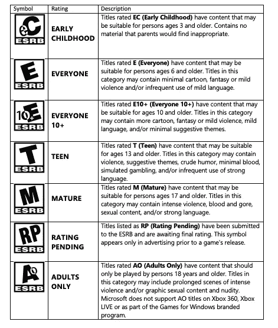
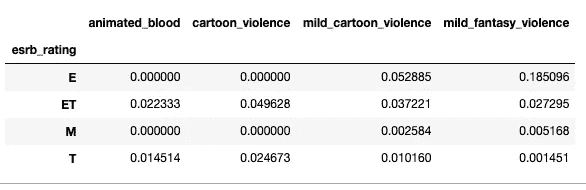
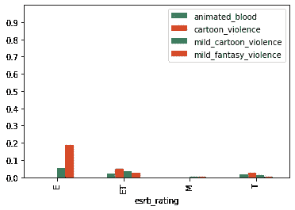

# Python 中的数据透视表既快速又简单

> 原文：<https://towardsdatascience.com/pivot-tables-are-quick-and-easy-in-python-a0ffee66381a?source=collection_archive---------5----------------------->


照片由 [Cookie 在](https://unsplash.com/@cookiethepom?utm_source=unsplash&utm_medium=referral&utm_content=creditCopyText) [Unsplash](https://unsplash.com/s/photos/angry-computer?utm_source=unsplash&utm_medium=referral&utm_content=creditCopyText) 上的 Pom 拍摄

## 如何使用 Pandas 库在 Python 中创建和可视化数据透视表。

几年前，我看到有人在推特上说自己是 excel 专家，然后他们的老板让他们做一个数据透视表。根据推文，那个人立即惊慌失措，离开了他们的工作。这条推文很有趣，我可以理解，因为起初，它们看起来很混乱，尤其是在 excel 中。但是不用担心，数据透视表很棒，在 Python 中，它们又快又简单。数据透视表是数据科学中一个方便的工具。任何开始数据科学之旅的人都应该熟悉它们。让我们快速地看一下这个过程，在这个过程结束时，我们将消除你对数据透视表的恐惧。

# 什么是数据透视表？

数据透视表是一种重新排列或“透视”数据以汇总某些信息的技术。

例如，考虑一个产品销售数据集。其中一列可能是“年龄类别”，如年轻、中年和老年。如果您想查看每个年龄类别的平均销售额，数据透视表将是查看该分析的一个很好的工具。它将为您提供一个新的表格，显示该列中每个类别的平均销售额。

让我们来看一个真实的场景，在这个场景中数据透视表很有用。我们可以用它来分析数据，甚至得出一些结论。

为了说明这个工作流程，让我们采取以下步骤。

1.  提出一个问题或假设
2.  查找数据
3.  使用熊猫创建一个数据透视表
4.  用条形图形象化我们的发现
5.  根据我们最初的问题或假设得出结论

# 我们试图回答的问题

假设一群愤怒的父母认为电子游戏又一次太暴力了。这一次，他们说视频游戏开发商制作了太多带有卡通和虚构风格暴力的游戏。《ESRB》认为这些游戏适合儿童，这意味着开发者可以向更广泛的受众出售他们的游戏。对这个群体来说，大多数儿童游戏都有这种卡通暴力风格。让我们看看是否能找到一些数据，看看他们的说法是否有任何有效性。

> “谁能为孩子们想想！”—海伦·洛夫乔伊

在我们开始提出问题或假设之前，我们首先需要了解视频游戏的收视率。ESRB 有一个评级系统，我们需要先熟悉它，然后才能继续前进。这些评分在他们的[网站](https://www.esrb.org/ratings-guide/)上有详细描述，但我也在下表中总结了这些评分。



我们这群愤怒的父母在他们的指控中相当含糊，但让我们对他们的主张采取一些自由。会预测他们认为会被定义为“多数”的游戏的百分比，所以我们可以做一个假设。

由于 EC 的分级明确表示“不含父母认为不合适的内容”，我们可以提出第一个假设。如果任何“EC”游戏都有这种暴力风格，那么分级系统一定有问题。我们可以用下面的假设来表达这一点。

*超过 0%被评为“EC”的电子游戏含有某种形式的卡通暴力。*

如果这个假设是真的，那么父母是正确的，评级系统有问题。

如果我们的假设是错误的，那么父母是不正确的，评级系统是如何设计的。

我们还需要一个评级为“E”的游戏的假设。《e》是为 6 岁以上的儿童设计的，但它可能包含卡通暴力。假设超过 50%是多数，并使用以下假设。

超过 50%被评为“E”级的电子游戏都有某种形式的卡通暴力。

如果我们的假设是真的，那么父母是正确的，暴力现在正被偷偷带入面向儿童的游戏中。如果我们的假设是错误的，那么我们就可以在晚上睡得很好，因为我们知道分级为“E”的视频游戏中没有太多的暴力。

# 数据

[Kaggle](http://kaggle.com/) 有一个名为[的完美数据集，被“ESRB”](https://www.kaggle.com/imohtn/video-games-rating-by-esrb)评为视频游戏。从描述中，我们可以看到该数据集包含 1895 个游戏，具有 34 个 ESRP 评级描述符和 ESRB 给定评级。每个描述符都以二进制值的形式列出，其中 1 表示描述符是否存在，0 表示描述符不存在。数据集还有几列，但我们只关心评级描述符。让我们下载该数据集，并将其导入 [Jupyter 笔记本](https://jupyter.org/)。使用 Jupyter Notebook 将允许我们导入我们需要的 Python 库，并给我们一个显示结果的好方法。

# 用熊猫做一张数据透视表

Pandas 库是 Python 中任何类型的数据操作和分析的主要工具。如果你没有安装，请参考这个[链接](https://pandas.pydata.org/getting_started.html)。

首先，我们需要导入 pandas，然后我们可以将 Kaggle 数据集转换成一个带有 [pandas.read_csv](https://pandas.pydata.org/pandas-docs/stable/reference/api/pandas.read_csv.html) 的[数据帧](https://pandas.pydata.org/pandas-docs/stable/reference/api/pandas.DataFrame.html)。

```
import pandas as pdratings = pd.read_csv("Video_games_esrb_rating.csv")
```

现在，我们需要决定哪些评级描述符将被视为卡通或动画。我们用以下几个描述词吧:动画 _ 热血，漫画 _ 暴力，轻度 _ 漫画 _ 暴力，轻度 _ 幻想 _ 暴力。我们将把这些列名存储在一个列表中。

```
cartoon_cols = ["animated_blood", "cartoon_violence", "mild_cartoon_violence", "mild_fantasy_violence"]
```

我们的 DataFrame 有一个名为 [pivot_table](https://pandas.pydata.org/pandas-docs/stable/reference/api/pandas.DataFrame.pivot_table.html) 的方法，它将为我们构建数据透视表。在这个例子中，我们将使用两个参数。第一个参数是**指数**，这将是评级。把索引想象成我们分组所依据的值。第二个参数是**值**，这将是我们之前制作的列表。还有一个很重要的参数， **aggfunc。**该参数将决定如何汇总我们的信息。因为这些列都是布尔值，所以查找平均值的缺省值是完美的。这些列的平均值将给出每个描述符中包含 1 的游戏的百分比。

```
pivot = ratings.pivot_table(index="esrb_rating", values=cartoon_cols)
pivot 
```



厉害！让我们分析一下这个输出告诉我们什么。

1.  我们只在 4 个不同的评级中看到这些内容描述符:E(每个人)，ET(E+10)，T(青少年)，M(成熟)。**这告诉我们，EC(早期儿童)游戏不包含任何这种卡通风格的暴力。**
2.  在被评为“E”级的游戏中，没有一款含有血腥或卡通暴力。大约 5%的人有轻度卡通暴力，大约 18.5%的人有轻度幻想暴力。
3.  2%的 ET('E+10 ')游戏有动画血，5%有漫画暴力，4%有轻度漫画暴力，约 3%有轻度幻想暴力。
4.  成熟游戏在这些类别中很少有暴力，青少年游戏有一些这种类型的暴力，但比“E+10”级游戏少。

**用条形图可视化数据透视表**

数据透视表在几秒钟内给了我们一些快速信息。如果直观地展示，人们往往更容易理解。我们可以用熊猫和数据透视表做一个条形图。

由于本演练是基于使用 Jupyter 笔记本，我们需要第一行来查看条形图。我们还使用 [numpy.arange](https://numpy.org/doc/stable/reference/generated/numpy.arange.html) 作为快捷方式，在 y 轴上制作 10 个刻度，从 0 开始，以 0.1 的增量递增。我们创建的数据透视表实际上是一个数据框架，允许我们在其上调用 [plot.bar 方法](https://pandas.pydata.org/pandas-docs/stable/reference/api/pandas.DataFrame.plot.bar.html)。如果我们不指定 x 轴上的值，则使用索引。在这种情况下，这是完美的，因为它将使用我们的“ESRB”评级。y 轴将显示每个描述符生成的值。

```
%matplotlib inline
import numpy as np
pivot.plot.bar(ylim=(0,1),yticks=np.arange(0,1,.1))
```



卡通暴力不同分级的条形图

相当酷！现在我们可以将数据透视表中的信息可视化。

# **我们的结论**

我们立刻看到我们的第一个假设是错误的。没有一个卡通/动画暴力描述符出现在“EC”评级中。这太棒了！3 岁以下的孩子还是安全的。

第二个假设有点复杂。问题源于视频游戏可以有多个描述符。对于这个例子，因为我们正在尝试看看是否超过 50%的游戏有卡通暴力，我们可以说没有，因为. 052885 + .0185096 是. 237981。这个数字远远小于 0.50，所以我们可以放心地得出这个结论。然而，如果我们的假设说超过 20%的游戏有这种类型的暴力，我们需要看看有多少游戏既有轻度卡通暴力又有轻度幻想暴力。这样，我们可以在进行评估时适当地考虑重叠部分。

这一分析有些令人吃惊。在评级为“E”的游戏中，18.5%有他们所谓的轻度幻想暴力。与其他评级相比，这似乎真的很高。也许父母发现了什么。这可能是需要进一步探索的。

# 最后的想法

这太简单了！多亏了熊猫，我们能够快速创建一个数据透视表并将其可视化。数据透视表帮助我们看到数据中的某些模式，这些模式可以帮助回答问题、分析数据，甚至帮助我们为机器学习模型设计新功能。