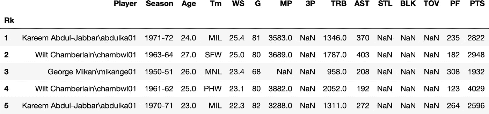
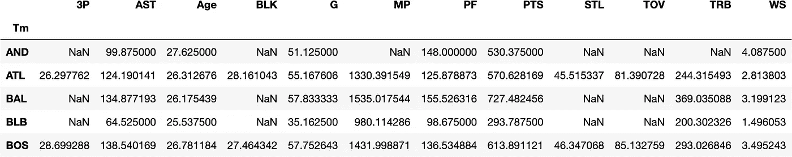
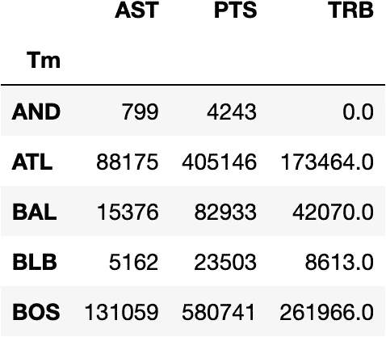
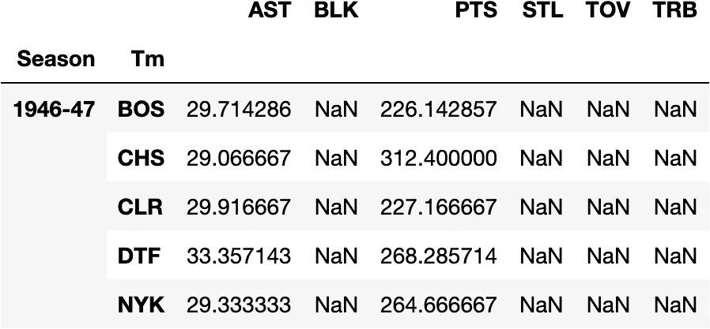
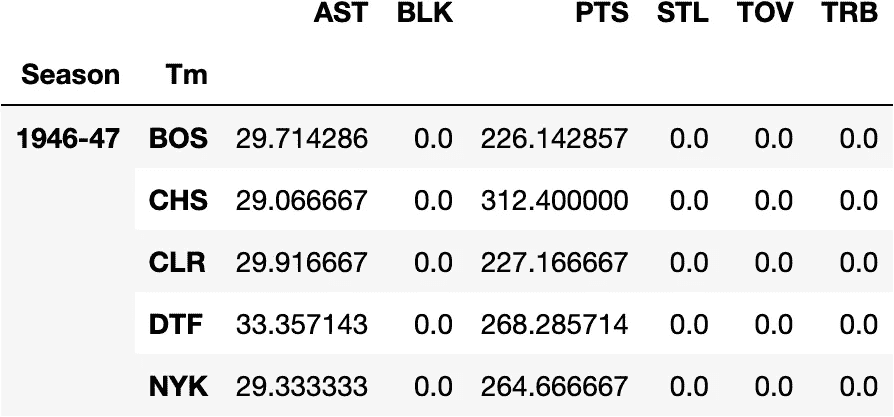
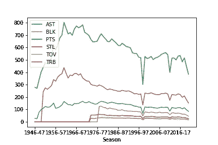

# 有熊猫的数据透视表

> 原文：<https://towardsdatascience.com/pivot-tables-with-pandas-7d1078167d62?source=collection_archive---------13----------------------->

## Python 中的 Excel 收藏夹


卢卡斯·布拉塞克在 [Unsplash](https://unsplash.com?utm_source=medium&utm_medium=referral) 上的照片

几乎每个处理过任何类型数据的人都可能使用过[微软 Excel 的数据透视表](https://support.microsoft.com/en-us/office/create-a-pivottable-to-analyze-worksheet-data-a9a84538-bfe9-40a9-a8e9-f99134456576)功能。这是一个快速、用户友好的工具，允许用户计算、汇总和总结数据集，从而进一步分析模式和趋势。Excel 提供了一个直观的 GUI，使分析师只需点击、拖放数据，就可以轻松应用他们选择的任何聚合函数。这是一个非常棒的工具，可以用来帮助构建商业演示的 Excel 可视化。

Python 的 Pandas 库——专门研究表格数据，类似于 Excel——也有一个 ***。pivot_table()*** 作用于同一概念的函数。这是一个强大的方法，带有许多可定制的参数，应该在每个分析师的 Python 工具箱中。理解方法背后的语法需要一些时间，但是一旦你熟悉了，它比 Excel 快得多，也更有效率。

让我们深入一个 NBA 统计数据集，看看熊猫的 ***。pivot_table()*** 功能作品！

```
**#importing required libraries** import pandas as pd
import numpy as np**#reading in the data & selecting needed columns** df = pd.read_csv('../Data/NBA_Player_seasonal.csv', index_col = 0)
df = df[['Player', 'Season', 'Age', 'Tm','WS', 'G','MP','3P','TRB','AST','STL','BLK', 'TOV', 'PF','PTS']]**#displaying first 5 rows of dataframe**
df.head()
```



熊猫数据框

上面，我们可以看到我们的数据集的预览。这是自 1947 年联盟成立以来每个 NBA 和 ABA 球员的赛季总数。它是按照最高的" [**WS**](https://www.basketball-reference.com/about/glossary.html) "预先排序和排名的——获胜份额，一个计算玩家为他们的团队贡献的估计获胜次数的指标。假设我们希望看到这些信息，但是这些信息是由团队汇总的。我们可以这样做:

```
**#creating a pivot table where team is the index**
df.pivot_table(index = 'Tm')
```



默认情况下， **pivot_table()** 引入所有*数字*列，并使用其**平均值来聚合数据。假设我们只关心这些列中的几列，而不是平均值，我们想要看到总数。**

```
**#pivot table with selected columns & summed**
df.pivot_table(df[['PTS', 'AST', 'TRB']], #selected columns
               index = 'Tm', #indexed by team
               aggfunc = np.sum) #aggregated by sum
```



现在，我们可以只查看我们感兴趣的统计数据，并查看总数而不是平均值。您可以为 **aggfunc** 参数传入一个库，允许用户选择应该对每一列执行哪种类型的聚合。

更进一步， **pivot_table()** 允许用户拥有多个索引来进一步分析数据。下面是同一个数据集的一个例子，但是经过多年的团队统计。

```
**#multi-index pivot table**
df.pivot_table(df[['PTS', 'AST', 'TRB', 'STL','BLK', 'TOV']],
              index = ['Season', 'Tm'],
              aggfunc = np.mean).head()
```



在上面的数据透视表中，我们汇总了缺失的数据，甚至一些基本的统计数据直到 1947 年第一个季度之后才被记录下来。假设我们想在分析中用零填充它们。我们可以通过简单地添加数据透视表参数来实现这一点。

```
**#filling in NaN values w/ 0's**
df.pivot_table(df[['PTS', 'AST', 'TRB', 'STL','BLK', 'TOV']],
              index = ['Season', 'Tm'],
              aggfunc = np.mean,
              fill_value = 0).head()
```



该功能还使用户能够用更少的代码快速可视化他们的数据，而不是直接从原始数据集编码。作为一个例子，让我们通过一个数据透视表线图来绘制联盟多年来的季节性平均水平。

```
**#plotting pivot table**
df.pivot_table(df[['PTS', 'AST', 'TRB', 'STL','BLK', 'TOV']],
              index = ['Season',],
                aggfunc = np.mean,
                fill_value = 0).plot()
```



这不是最漂亮的视觉效果，但是它很快并且提供了一些重要的信息。你可以很快识别出 1999 年的停摆赛季，与通常的 82 场比赛相比，这个赛季只打了 50 场比赛。

这些是几个 **pivot_table()** 参数，您可以使用它们来定制/重塑您的数据集。还有其他参数，如**页边距**，它将列和行的总和相加。另一个是**列**，它提供了一种额外的方式来分割你的数据集。最后，每个数据透视表输出一个新的数据框架，这允许您执行任何标准的数据框架功能/方法，例如根据特定标准进行过滤，例如，如果我们只想查看波士顿凯尔特人队的数据。

希望这个快速教程对理解熊猫的透视表功能有多强大有帮助！如有任何问题或留下任何反馈，请随时联系我们。

## 参考

*   [https://pandas . pydata . org/docs/reference/API/pandas . pivot _ table . html](https://pandas.pydata.org/docs/reference/api/pandas.pivot_table.html)
*   [https://support . Microsoft . com/en-us/office/create-a-pivot table-to-analyze-worksheet-data-a9a 84538-bfe 9-40 a9-a8e 9-f 99134456576](https://support.microsoft.com/en-us/office/create-a-pivottable-to-analyze-worksheet-data-a9a84538-bfe9-40a9-a8e9-f99134456576)