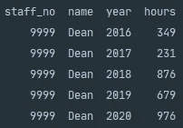
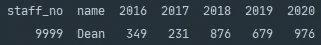

# 旋转熊猫数据框架

> 原文：<https://towardsdatascience.com/pivoting-a-pandas-dataframe-c8ddfae35d2?source=collection_archive---------13----------------------->

## 两行代码节省了我几个小时的工作

[斯科特·格雷厄姆](https://unsplash.com/@sctgrhm?utm_source=medium&utm_medium=referral)在 [Unsplash](https://unsplash.com?utm_source=medium&utm_medium=referral) 上拍照

# 介绍

作为一名数据分析师或开发人员，最有趣的时刻之一是遇到你大三时写的代码。这个时刻最近发生了，当一个利益相关者要求更新我第一次加入时提供的摘录时。要求是分析现有工作人员每个日历年的临时工作时间。令人尴尬的是，我天真的方法是在主 select 语句中使用子查询创建列来分隔年份。虽然这种方法有效，但是查询的整体性能非常糟糕。

# 更好的方法

我最初的方法是合计 1 月 1 日到 12 月 31 日之间的临时工作时间，然后以年份命名该列。以这种方式构建查询会产生技术债务，因为每年我都需要创建一个新列来捕获数据。

输入[熊猫](https://pandas.pydata.org/)；Pandas 是用 [Python](https://www.python.org/) 编写的强大开源库。它提供了易于使用的现成功能来接收和分析关系数据。对于那些刚刚接触数据科学或者还没有接触过 Python Pandas 的人，我们建议首先从 [Pandas 系列& DataFrame Explained](/pandas-series-dataframe-explained-a178f9748d46) 或 [Python Pandas 迭代 DataFrame](/python-pandas-iterating-a-dataframe-eb7ce7db62f8) 开始。这两篇文章都将为您提供安装说明和今天文章的背景知识。

# 透视数据

Pandas 提供了使用其内置的`.pivot()`函数来解决上述问题的能力。我们在下面为您提供了熊猫技术文档的一个片段。

上面的 Python 片段显示了 Pandas 内置 pivot 函数的语法。

参数`index`允许您从现有的数据帧中传递列名，为结果数据帧创建一个新的索引。使用`columns`参数传递列，这将决定最终数据帧中的列。您可以使用`values`参数来指定哪些值将填充新创建的 DataFrame 列。

# 结果

我们在下面包含了一个 Python 片段，以创建一个类似于我们最初请求的数据的数据帧。执行下面的代码片段后，您将创建一个包含虚拟数据的四乘五的数据帧。如果您在运行以下脚本时遇到问题，请参考 [Pandas 系列& DataFrame 解释](/pandas-series-dataframe-explained-a178f9748d46)来仔细检查您的安装。

上面的 Python 片段将创建一个包含虚拟数据的 DataFrame。

上面的截图显示了执行上面的 Python 代码片段的结果。

现在你已经创建了数据帧，我们将在`year`和`hours`列上调用 Pandas `.pivot()`函数。我们在下面提供了一个片段，您可以使用它来实现这一点。

上面的 Python 片段将基于年和小时列透视数据帧。

上面的屏幕截图显示了旋转原始数据框架的结果。

从上面的截图可以看出熊猫`.pivot()`功能的强大。`.pivot()`函数获取列的唯一值，并将它们作为单独的列扩展到新的数据框架中。

# 摘要

Pandas `.pivot()`函数是一个非常强大的工具，当您需要根据列值重塑数据框架时，可以使用它。这种方法具有时效性，不需要在久而久之增加新年栏目。

感谢您花时间阅读我们的故事，我们希望您发现它有价值！