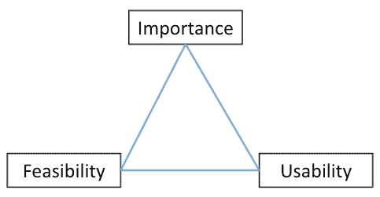

# 将 ML 应用引向成功

> 原文：<https://towardsdatascience.com/pivoting-ml-apps-to-success-9bfcb032e0c6?source=collection_archive---------30----------------------->

## 3 精益验证，以确保你在正确的道路上

照片由[像素](https://www.pexels.com/photo/red-leaf-trees-near-the-road-33109/?utm_content=attributionCopyText&utm_medium=referral&utm_source=pexels)的[皮克斯拜](https://www.pexels.com/@pixabay?utm_content=attributionCopyText&utm_medium=referral&utm_source=pexels)拍摄

# **是什么让人工智能应用如此特别**

AI 和一般开发的主要区别之一是所需的评估范围。通过了解做什么和如何做，验证需求并保持简单，你几乎是安全的。但在人工智能应用上，你可以拥有最好的研究、顶级开发人员和精英产品团队，但仍会面临失败。原因是更高的不确定性在许多方面上升。早在 2015 年，斯卡利等人通过描述他们的**隐含** [**技术债务**](https://en.wikipedia.org/wiki/Technical_debt) ，讨论了 ML 应用的[独特性；虽然大多数人认为 ML 代码是他们的主要成分，但事实是这只是人工智能应用程序所需开发的一个小摩擦。使用**人工智能成功三角**的**重要性、可行性**和**可用性**我们可以格式化一组验证，以确保在我们成功的道路上避免任何隐藏的警告。](https://papers.nips.cc/paper/2015/hash/86df7dcfd896fcaf2674f757a2463eba-Abstract.html)

ML 系统中 ML 代码的一小部分，来自 Sculley 等人的论文

# **使用成功三角评估不确定性**

人工智能成功三角形通过突出关键因素来帮助绘制可能的风险；第一个也是最直接的一个是**重要性**(确保开发具有高价值并且对业务很重要)，其次是**可行性**(确保目标可以实现)，最后是**可用性**(确保它可以被很好地利用)。一个直观的例子是试图猜测彩票号码——预测下一个号码非常重要(赢得一等奖),很容易利用(只需提交这些号码),但不太可行(除非你是魔术师)。预测之前的数字是可行的(只需在网上搜索)，但极难利用(除非你能回到过去)。评估在应用程序生命周期的 3 个主要阶段完成；**在**之前(构思)**在**期间(开发)**在**之后(面向客户)。每一个都有不同的风险因素，但总的来说都可以用相同的成功三角来描绘。成功的人工智能应用程序必须准备好[快速旋转](https://www.forbes.com/sites/theyec/2020/07/03/how-to-pivot-successfully-in-business/?sh=74ad1a2a7316)；无论是因为数据稀缺、业务改变了想法，还是算法似乎没有收敛。我们应该通过在正确的时间问正确的问题来不断确保我们在正确的道路上。下面是验证内容、时间和方式的详细信息。

人工智能成功三角

# **之前——应用构思阶段**

初始阶段也是最容易关注的阶段(没有花费精力)，因此它是大多数验证应该完成的地方。假设我们的任务是预测[客户流失](https://en.wikipedia.org/wiki/Customer_attrition)的可能性。重要性(要节省的钱)是很明显的。对许多公司来说，这足以让他们开始研究这个话题。对我们来说，看着成功三角，我们应该再问两个问题——如果客户有流失的危险，你将如何防止？(**可用性**)由于客户流失预测应用大多需要整体数据视图，因此“客户数据的可访问性如何？如何才能做到这一点？”(**可行性**)。可用性评估可能会揭示这样一个事实，即使我们设法开发了应用程序，也不确定它能够实现我们的计划。可行性评估可能揭示出隐含的更高成本。考虑这些因素可能会说服我们转向。即使没有，它也将使我们能够提前修复它(在某些情况下，确保[应用程序更具可操作性](https://medium.com/agileinsider/5-steps-to-make-sure-your-ml-app-is-useful-8a9ada30c1eb)就足够了)。因为这是最便宜的支点，所以在决定继续下一阶段——开始开发应用程序——之前，我们应该花很多时间来确保验证已经设置好。

# **在应用开发阶段**

一旦我们开始开发应用程序，枢轴价格随着时间的推移而增加(更多的工作被浪费)。因此，我们应该预先确定关键的内部里程碑和确认点。看看成功三角，重要性和可用性已经在构思阶段得到验证，因此风险较小。**可行性**是我们应该在**数据和技术**可行性上花费大部分验证时间的地方。由于多种因素，数据可能不可行。例如，我们可能会发现一个重要的历史数据片段没有被收集，标签不可用，或者推断所需的数据仅在稍后阶段可用。还有很多技术问题会影响 app 的可行性。例如，我们可能会发现我们所依赖的论文在现实生活中不起作用，它需要的资源太多，或者我们包含了一个在 edge 设备上不受支持的 python 库。只要提前**发现这些问题，很多问题都很容易解决。这就是为什么设置内部确认点如此重要。此外，在许多情况下，一旦有了一个最小的 MVP，向前跳并重新验证我们的可用性假设是有意义的——它将如何被服务，它是否适合我们拥有的软件生态系统，等等。问这些问题可能需要回到上一阶段，以更好地定义我们试图解决的需求。请记住，在早期阶段发现应用程序与 edge 的使用不兼容，与在大型发布活动中发现它是两码事。在素描室失败比在舞台上失败要容易得多。**

发展阶段三角形

# **之后——生产阶段的应用程序**

一旦我们开始向客户部署我们的应用程序，其重要性和可行性就不那么麻烦了(当我们设法开发它时)，可用性成为监控的主要障碍。通用 pivot 相关性较小(重新开发 app 会超级贵)。更相关的是 UX/用户界面支点；如何更好地吸引客户，提升应用价值等。**可用性**可以分为两种主要的度量方式——直接**和间接**。回到流失预测的例子，直接可用性测量主要的价值主张(流失客户的数量应该会减少)，间接可用性测量次要的动机(如一般使用和利用率)。重要的是，要避免在糟糕的直接评估反馈后得出快速结论的诱惑(被搅动的客户数量是相同的- >失败)。在许多情况下，成功需要一些用户指导，因此对间接测量的深入分析也是至关重要的。让我们假设我们决定添加一个反馈部分，以便更好地衡量我们的流失预测应用程序。问题是我们选择的措辞。在询问警报是否有用时得到负面反馈可能是因为错误，但也可能是因为太迟了(这是完全不同的反馈)。一个简单的解决方案是在反馈表单上添加一个自由文本区域。我们不仅应该监控和收集反馈，还应该以一种能让我们从中获得可操作的见解的方式来做。确保我们做出的决定是基于真实的数据。

生产阶段三角形

# **最后——保持简单**

这听起来像是一句咒语，但要记住的最重要的任务是保持简单。看着花哨的架构、庞大的数据集和闪亮的新库，很容易匆忙投入开发，但后来发现这是一个错误。在评估上多花一分钟可以避免以后的转变，从而节省大量的时间。