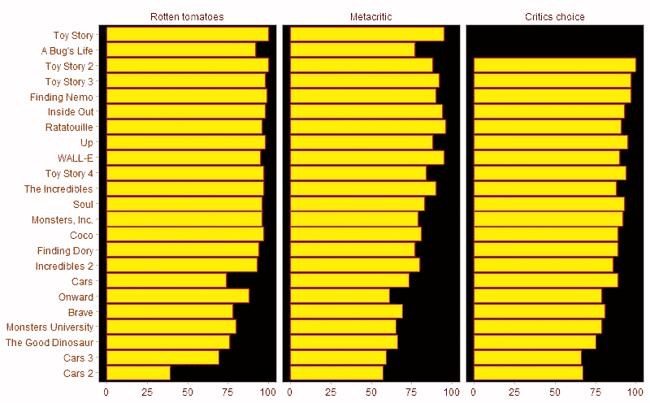
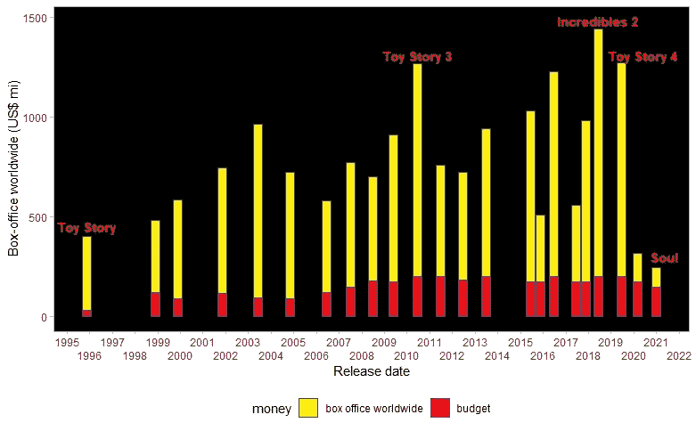
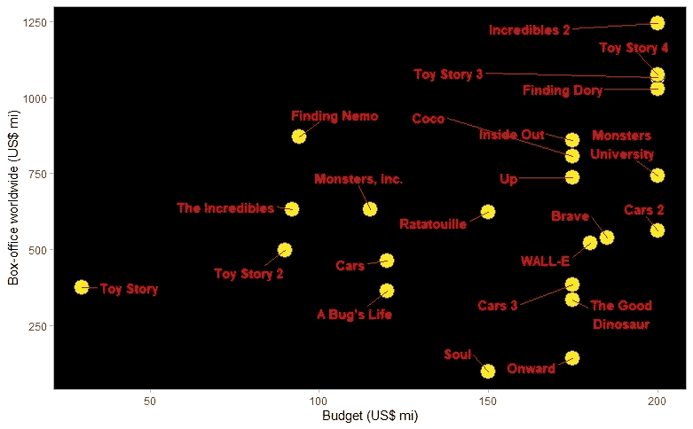
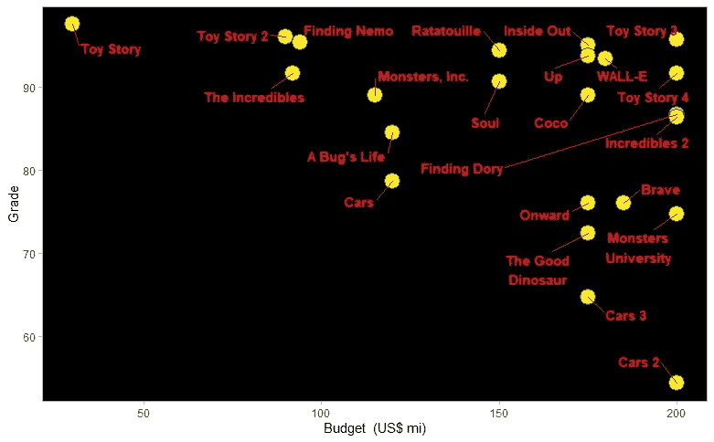
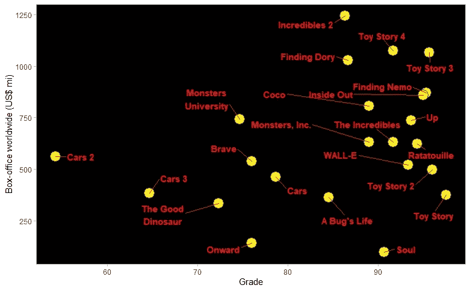
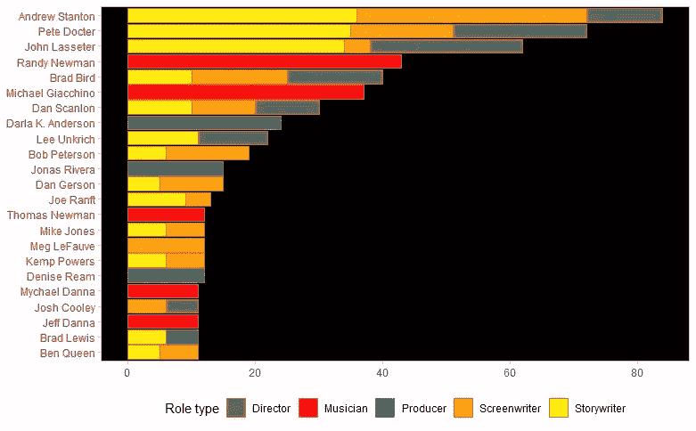

# 皮克斯:一个数据故事

> 原文：<https://towardsdatascience.com/pixar-a-data-story-a3a2cad95081?source=collection_archive---------26----------------------->

## 从 pixarfilms R 包中探索关于 Pixar 电影的数据

米凯尔·弗里沃尔德在 [Unsplash](https://unsplash.com/s/photos/light-fixture?utm_source=unsplash&utm_medium=referral&utm_content=creditCopyText) 上拍摄的照片

# 皮克斯和美好的回忆

你终于 18 岁了。你正准备去上大学。你甚至可能离开父母的家，搬到另一个城市。也许你会带一些让你想起童年记忆的物件。或者谁知道，也许你是这个新的独立存在的父亲或母亲。你为你的儿子或女儿将要走的路而心痛。也许你正在*玩具总动员 3* 中实现自己。你是安迪或者你是安迪的父母。

无论你是安迪的父母之一还是安迪本人，你都有可能在最近几年看过皮克斯的大部分电影。你一定被*海底总动员*的绝望所苦恼，从*汽车*中吸取了一些教训，被*瓦力*的末日般的未来所惊吓，等等。

在这篇课文中，任务是让你不感到孤独。意识到电影屏幕上讲述的冒险是共同的情感，深受公众和评论家的喜爱。让我们用皮克斯最具代表性的系列电影《玩具总动员》*的颜色，通过数据和图形来看看这一点。带上你的氦气球，让我们一起踏上这段旅程。*

# *预算，票房…和评论家*

*我不是这个故事中的安迪。我是他的父亲。我儿子和我以前看过皮克斯的所有电影。我记得的第一个是*车*。我们看了几十遍了。也许是因为不同的原因。就我而言，我过去喜欢看装饰艺术和 20 世纪 50 年代和 60 年代的精神，这在电影中很容易识别。*

*如果我们的首选是*汽车*，毫无疑问这不是一个共同的观点。在下面的第一张图中，排名显示了其他选择。*

**

*评论家评分。作者图片*

*如上图所示，我最喜欢的*汽车*在列表的底部。但是，没关系。也许影评人没看懂这部电影。*

*《玩具总动员》 (1995)是皮克斯的第一部电影。上图是被*Roten tomatos*评价最好，被 *Metacritic* 列入前三。平均分排名第二的是皮克斯的第二部电影《一只虫子的生活》(1998)。因为似乎第一部电影有时比最近的电影评价更好，也许看电影的时间线是个好主意，但现在衡量与它们相关的预算和票房。*

**

*关于票房和预算信息的时间线。作者图片*

*正如你在上面看到的，当我们比较与金钱相关的变量时，*《玩具总动员》*告诉我们一个与其他电影不同的故事。它的预算很少，票房也远远达不到皮克斯最重要的大片所达到的良好表现。也许与评论家的观点相比，公众对这部电影有不同的看法。没那么快。我不是专家，但也许这种现象可以用 25 年前制作一部动画所隐含的不同成本来解释，甚至整个时期的通货膨胀也会影响最终结果。我邀请你来做这项研究。
当看时间线时，令人瞩目的是*《超人特工队 2》*、*《玩具总动员 3》*和*《玩具总动员 4》*的表现。这些电影是皮克斯的主要利润来源。不幸的是，对于*灵魂*就不能这么说了。我还没有看过，但我的大多数朋友都告诉我这是一部很棒的电影。疫情也许对这些结果有很大的影响。*

*当我们谈论预算和票房时，出现的一个问题是:当我们看到这些变量的散点图时，我们能找出任何关系吗？这个问题用下图来回答。*

**

*预算 x 票房。作者图片*

*我们的图表中显示了四象限法则。我们看到一些电影两个变量的值都很小。这些是*玩具总动员、汽车*和*玩具总动员 2* 的案例。我们还可以在像《超人总动员》和《海底总动员》这样的电影中看到小预算和高票房。就皮克斯的表现而言，也有失败类型的代表:*灵魂，汽车总动员 3* 和*好恐龙*。这些是大预算小票房的电影。最后，我们可以注意到以*超人总动员 2、玩具总动员 4、玩具总动员 3* 和寻找*多莉*为代表的伟大大片。在这些情况下，这就是我们从常识中所期待的:巨额预算与巨额收入相关。*

*另一个值得尝试的关系是预算和评论家评分的平均值之间的关系。和我一起分析。*

**

*预算 x 评论家等级。作者图片*

*在上图中，我们注意到不存在评级低的低预算象限。要分析的第一个象限是与具有高评论家评级的低预算电影相关联的象限。在这种情况下，《玩具总动员》是目前为止最好的代表。当我们将其与之前分析的图表进行比较时，这一发现完全改变了这部电影的画面。另一方面，我们看到一些预算大、成绩差的电影。对*车*和*车 3* 的备注。最后，我们很容易注意到人们对常识的期望高度集中:高平均分的大预算。这里的亮点是*玩具总动员 3* 和*玩具总动员 4* 。*

*请注意，我们在上图中看到的票房冠军《超人前传 2》属于常识类。然而，事实证明，它的平均成绩与这部电影所获得的观众成功并不相符。这引发了另一个问题:观众的成功与评论家的成功有关吗？给你的气球充上氦气，让我们在下一张图停下来继续旅程。*

**

*x 级票房。作者图片*

*在我们最后的分析中，似乎很清楚的是，批评的评价并不总是与公众的评价相一致，这里所代表的是电影所取得的票房。我们看到有*魂*和*玩具总动员 2* 等批评成功的案例，但收入较低。*玩具总动员*在这个象限，但是正如我们之前指出的，很难根据电影的收入来评价它是大众的相对失败，因为这是二十多年来的数据。另一方面，你会发现其他大多数电影都有巧合，尤其是在最佳评论电影和票房表现的象限中。对于这些案例，*玩具总动员 3、*玩具总动员 4、*海底总动员*似乎是最好的例子。*

# *继续游*

*所以我们已经到了课文的结尾。我们已经看到，皮克斯讲述的故事是世界各地的儿童、青少年、年轻人和他们的父母所共有的一系列记忆的一部分。甚至是那些在报纸上写自己观点的讨厌的人(嘿，这是个笑话)。*

*对于我们这些注意到孩子生命中不断变化的阶段的父母来说，他们现在将会用其他的可能性和经历来面对这个世界，记住《海底总动员》的海报是值得的。*

*这个世界将充满鲨鱼、水母，还有 Nemos、Dorys、鲸鱼和海龟。在一天结束时，最重要的似乎是那句名言:继续游泳。*

# *信用*

*因为没有别的办法，我们必须留下电影的演职员表。这里的选项是使用数据可视化资源。我在下面展示了在电影结尾出现最多的 23 位专业人士。*

*非常感谢斯坦顿、多科特、拉塞特和他们一伙。愿更多的动画留在我们的情感记忆中。继续游。*

**

*最终学分。图片作者。*

*我也要感谢埃里克·梁，皮克斯电影公司包的作者。对于像这样的数据探索来说，这无疑是一个简单而伟大的想法。*

# *代码和数据*

*本[要点](https://gist.github.com/fernandobarbalho/72137bd127d047ea0f293b3bd87d997d)中有代码和数据。*

*你可以在[推特](https://twitter.com/barbalhofernand)上找到我。*