# PixelCNN 的盲点

> 原文：<https://towardsdatascience.com/pixelcnns-blind-spot-84e19a3797b9?source=collection_archive---------12----------------------->

## [思想和理论](https://towardsdatascience.com/tagged/thoughts-and-theory)

## PixelCNN 的局限性以及如何修复它！

由[沃尔特·雨果·洛佩兹·皮纳亚](https://twitter.com/Warvito)、[佩德罗·f·达·科斯塔](https://twitter.com/thepfcosta)和[杰西卡·达弗伦](https://twitter.com/jessdafflon)编剧

大家好！今天，我们将继续关于自回归模型的系列，我们将重点关注 PixelCNNs 的最大限制之一(即盲点)以及如何改进以解决它。

**总结**

1.  [自回归模型— PixelCNN](/autoregressive-models-pixelcnn-e30734ede0c1)
2.  [多通道建模数据](https://medium.com/@pedro.hpf.costa/modelling-coloured-images-acd0ebde0102)
3.  PixelCNN 的盲点及其修复方法—门控 PixelCNN
4.  使用门控像素 CNN 的条件生成
5.  带裁剪卷积的门控像素 CNN
6.  提高性能— PixelCNN++
7.  缩短采样时间—快速 PixelCNN++
8.  使用注意机制——pixels nail
9.  生成多样化的高保真图像——VQ-VAE 2

对于每个主题，代码都可以在这个[库](https://github.com/Mind-the-Pineapple/Autoregressive-models)中找到。

# 介绍

在前两篇文章中，我们介绍了生成模型，PixelCNN 背后的概念，并研究了彩色 pixel CNN 的工作原理。回想一下，PixelCNNs 是一种生成模型，它学习像素的概率分布，这意味着未来像素的强度将由先前的像素决定。在这个 blogpost 系列中，我们实现了两个 PixelCNNs，并注意到性能并不出色。在之前的帖子中，我们提到了改善模型性能的方法之一是修复盲点问题。因此，在本帖中，我们将介绍盲点的概念，讨论像素 CNN 是如何受到影响的，并提出一种解决方案——门控像素 CNN **。**我们开始吧！

# 盲点

正如你从以前的帖子中回忆的那样，PixelCNN 学习图像中所有像素的条件分布，并使用这些信息进行预测。还记得 PixelCNNs 将从左到右和从上到下学习像素的分布。因此，为了确保“未来”像素(即预测像素右侧或下方的像素)不能用于给定像素的预测，通常使用掩码(图 1A)。如图 1A 所示，掩码将当前预测像素“之后”的像素清零，这对应于掩码中心的像素。然而，由于这种选择，不是所有的“过去的”像素将被用于计算新点，并且信息的丢失将导致盲点的产生。

为了理解盲点问题，让我们看看图 1B。在图 1B 中，暗粉色的点( *m* )是我们想要预测的像素，因为它位于过滤器的中心。因为我们用的是 3x3 的蒙版(1A。)，像素 *m* 依赖于 *l，g，h，i.* 另一方面，那些像素依赖于之前的像素。例如，像素 g 依赖于 *f，a，b，c，*而像素 i 依赖于 *h，c，d，e.* 从图 1B 中，我们还可以看到，尽管出现在像素 *m 之前，*像素 *j* 在计算 *m* 的预测时从未被考虑。类似地，如果我们想要对 *q、* j、n、o 进行预测，则从不考虑(图 1C。).并非所有先前的像素都会影响预测的事实被称为盲点问题。

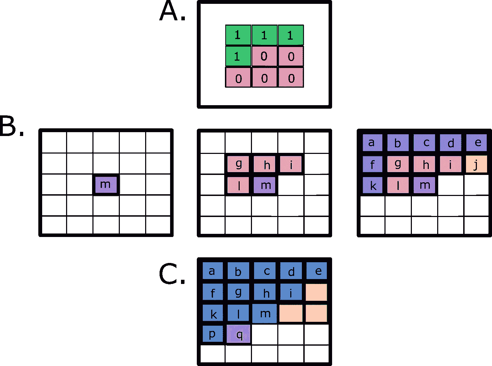

图 1: A .举例说明了一个 3×3 掩码的例子，该掩码可用于确保只有“过去的”像素用于计算预测。只有绿色的像素将用于计算蒙版中心的像素。b .如何在 5x 5 图像上使用掩模来预测像素 m 的示例。只有像素 l、g、h、I 将用于计算暗粉色(m)的像素。但是，我们需要记住，l，g，h，I 也依赖于之前的像素(a，b，c，d，e，f，k；显示为淡紫色)。从 B 中的第三张图可以看出，j(橙色)将不会被使用，从而形成一个盲点。c .如果我们将遮罩的中心下移，现在预测像素 q，我们可以看到橙色的像素永远不会被考虑在内(图片由作者提供)。

我们将首先从 PixelCNNs 的实现以及盲点如何影响结果开始。下面的代码片段显示了使用 Tensorflow 2.0 框架从 PixelCNN 实现遮罩。

查看原始 PixelCNN 的感受野(在图 2 中用黄色标记),我们可以看到盲点以及它如何在不同层上传播。在这篇博文的第二部分，我们将描述 PixelCNN 的下一个版本，门控 PixelCNN，它引入了一种新的机制来避免盲点的产生。

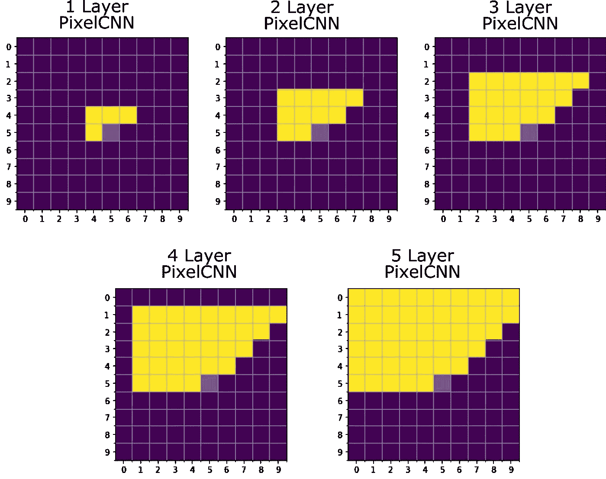

图 PixelCNN 上盲点的演变(图片由作者提供)。

# 门控像素 CNN

在前两篇博文中，我们介绍了 PixelCNN 然而，这种模型性能较低，并且存在我们上面介绍的盲点问题。

为了解决这些问题， [van den Oord 等人(2016)](https://arxiv.org/abs/1606.05328) 引入了门控 PixelCNN。门控像素 CNN 在两个主要方面不同于像素 CNN:

1.  它解决了盲点问题
2.  它使用门控卷积图层提高了模型的性能

# 1.门控像素 CNN 如何解决盲点问题

这个新模型通过将卷积分成两部分:垂直和水平叠加，解决了盲点问题。让我们看看垂直和水平堆栈是如何工作的。

**纵横书库**

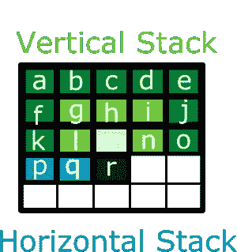

图 3:垂直堆栈(绿色)和水平堆栈(蓝色-作者提供的图片)。

在垂直堆栈中，目标是处理当前行之前所有行的上下文信息。用于确保使用所有先前的信息并且保持因果关系(即，当前预测的像素不应该知道它右边的信息)的技巧是将掩模的中心分别向上移动一行到被预测的像素。如图 3 所示，虽然垂直掩码的中心是浅绿色像素( *m* ，但是由垂直堆栈收集的信息将不会用于预测它，而是用于预测它下面的行中的像素( *r* )。

然而，单独使用垂直堆栈会在黑色预测像素( *m* )的左侧产生盲点。为了避免这种情况，由垂直堆栈收集的信息与来自水平堆栈的信息相结合( *p-q* 在图 3 中用蓝色表示)，水平堆栈预测预测像素左侧的所有像素( *m* )。水平和垂直堆栈之间的组合解决了两个问题:(1)不使用预测像素右边的信息，(2)因为我们作为一个块来考虑，所以我们不再有盲点。

在 [van den Oord et al. (2016)](https://arxiv.org/abs/1606.05328) 中，实现了垂直叠加，使得每个卷积的感受野具有 2×3 格式。我们通过使用一个 3×3 卷积来实现这一点，最后一行被屏蔽掉。在水平堆栈中，卷积层将预测值与来自被分析像素的当前行的数据相关联。这可以使用 1×3 卷积来实现，其中我们屏蔽未来像素以保证自回归模型的因果条件。与 PixelCNN 类似，我们实现了一个 A 型遮罩(用于第一层)和一个 B 型遮罩(用于后续层)。

我们修改了以前的掩蔽卷积层，以便能够实现这些新配置。下面的代码片段显示了使用 Tensorflow 2.0 框架实现的掩码。

通过在网络上添加这两个堆栈的特征图，我们获得了一个具有一致感受野的自回归模型，并且不会产生盲点(图 4)。

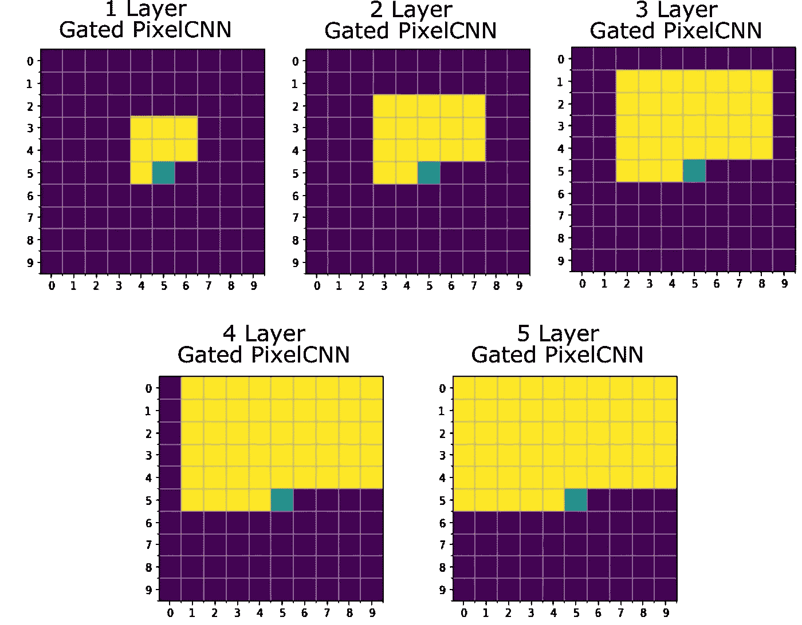

图 4:门控 PixelCNN 感受野概述。我们注意到，使用垂直和水平堆栈的组合，我们能够避免在 PixelCNNs 的初始版本中观察到的盲点问题(图 3 —作者提供的图片)。

# 2.门控激活单元(或门控块)

从普通像素 CNN 到门控 CNN 的第二个主要改进是引入了门控块和乘法单元(以 LSTM 门的形式)。因此，不像原始的 pixelCNN 那样在屏蔽卷积之间使用校正线性单元(ReLUs );门控像素 CNN 使用门控激活单元来模拟特征之间更复杂的相互作用。这种门控激活单元使用 sigmoid(作为遗忘门)和 tanh(作为实际激活)。在[的原始论文](https://arxiv.org/pdf/1606.05328.pdf)中，作者提出这可能是 PixelRNN(使用 LSTM 的)优于 PixelCNN 的一个原因，因为他们能够通过递归的方式更好地捕捉过去的像素——他们可以记住过去的信息。因此，门控 PixelCNN 使用了以下内容:

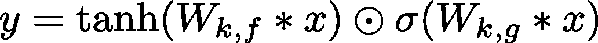

σ是 sigmoid 非线性度， *k* 是层数，⊙是逐元素乘积，∵是卷积算子， *W* 是来自前一层的权重。让我们更详细地看一下 PixelCNN 中的一个层。

# 门控像素 CNN 中的单层块

堆栈和门是门控 PixelCNN 的基本模块(图 5)。但是它们是如何连接的，信息将如何处理？我们将把它分成 4 个处理步骤，我们将在下面的会议中讨论。

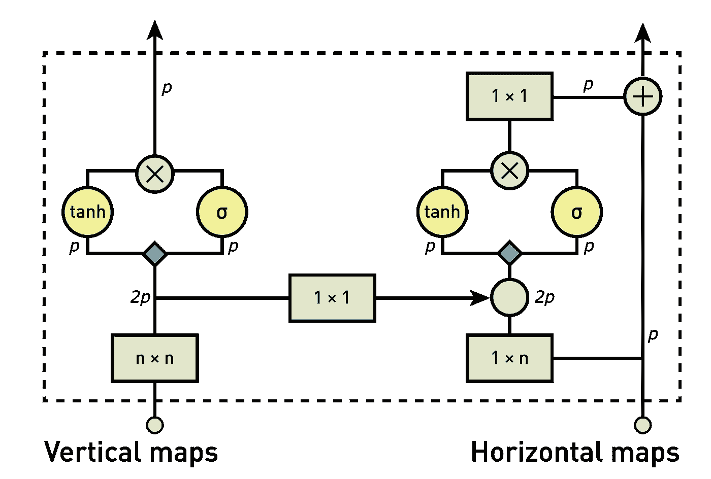

图 5:门控 PixelCNN 架构概述(图片来自[原始论文](https://arxiv.org/pdf/1606.05328.pdf))。颜色代表不同的操作(即，绿色:卷积；红色:元素间的乘法和加法；蓝色:与权重卷积

***1。计算垂直叠加特征图***

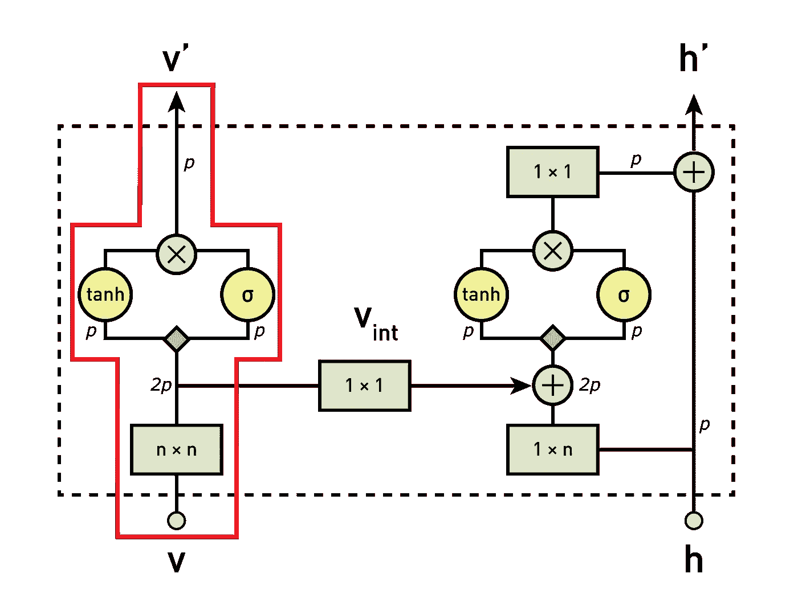

(图片改编自[原纸](https://arxiv.org/pdf/1606.05328.pdf))

作为第一步，来自垂直叠加的输入由我们的 3×3 卷积层和垂直掩模处理。然后，得到的特征图通过门控激活单元，并被输入到下一个块的垂直堆栈中。

***2。将垂直地图送入水平堆栈***

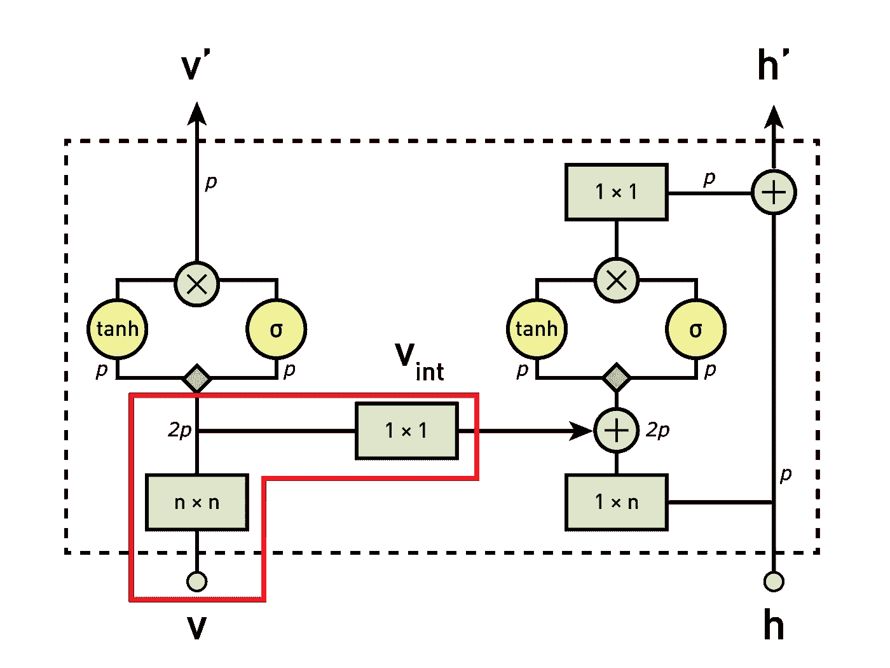

(图片改编自[原图](https://arxiv.org/pdf/1606.05328.pdf))

对于我们的自回归模型，需要结合纵向和横向堆栈的信息。为此，在每个块中，垂直堆栈也被用作水平层的输入之一。由于垂直堆栈的每个卷积步长的中心对应于被分析的像素，所以我们不能仅仅添加垂直信息。这将打破自回归模型的因果关系条件，因为它将允许未来像素的信息用于预测水平堆栈中的值。这是图 8A 中第二幅图的情况，其中黑色像素右侧(或未来)的像素用于预测它。因此，在将垂直信息输入水平堆栈之前，我们使用填充和裁剪将其下移(图 8B)。).通过对图像进行零填充并裁剪图像的底部，我们可以确保垂直和水平堆栈之间的因果关系得以保持。我们将在以后的文章中深入探讨关于裁剪如何工作的更多细节，所以如果细节不完全清楚，请不要担心。

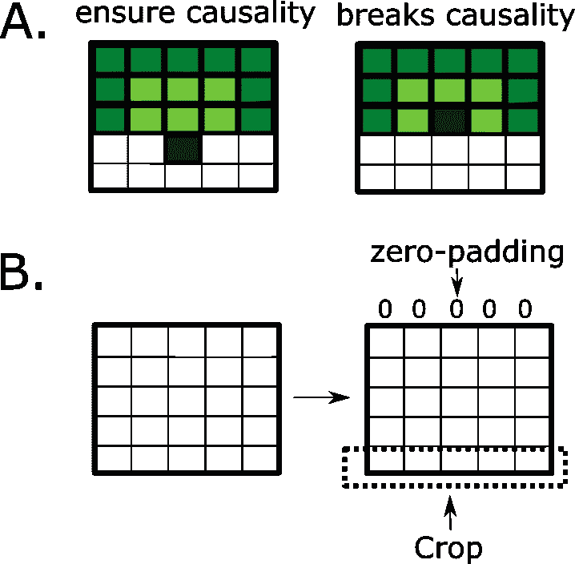

图 8:如何确保像素之间的因果关系得以保留(图片由作者提供)

***3。计算水平特征图***

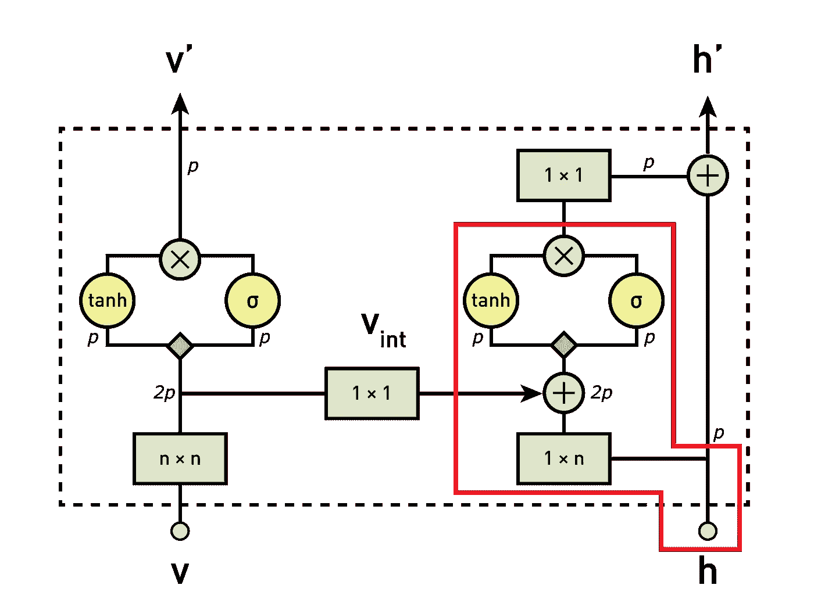

(图片改编自[原文](https://arxiv.org/pdf/1606.05328.pdf))

在这一步中，我们处理水平卷积层的特征图。事实上，第一步包括对从垂直到水平卷积层输出的特征图求和。该组合的输出具有理想的接收格式，其考虑了所有先前像素的信息。最后，特征图通过门控激活单元。

***4。计算水平堆栈上的剩余连接*T3**

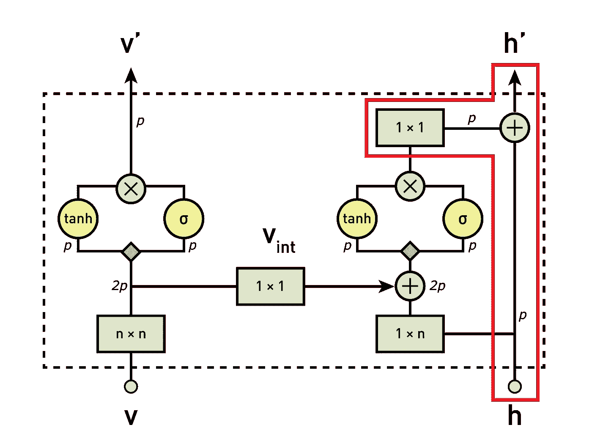

(图片改编自[原创论文](https://arxiv.org/pdf/1606.05328.pdf))

在这最后一步中，如果块不是网络的第一个，剩余连接将组合前一步的输出(通过 1x1 卷积处理)，然后馈入下一个块的水平堆栈。如果是网络的第一块，那么就没有剩余连接，跳过这一步。

使用 Tensorflow 2。我们实现了上述方案，如下所示:

总之，使用门控块，我们解决了感受野上的盲点并改善了模型性能。

# 体系结构

在 Oord et al. 2016 中，PixelCNN 使用了以下架构:第一层是带有 7x7 滤波器的掩蔽卷积(A 型)。然后，使用 15 个残差块。每个模块使用 3×3 层卷积层和标准 1×1 卷积层的组合来处理数据。在每个卷积层之间，有一个非线性 ReLU。最后，剩余块还包括剩余连接。

在下一篇文章中，我们将看看如何进一步改善门控像素 CNN 的性能。我们还将介绍有条件的 PixelCNN，敬请期待！

# 结果

我们训练了 PixelCNN 和门控 PixelCNN，并比较了下面的结果。

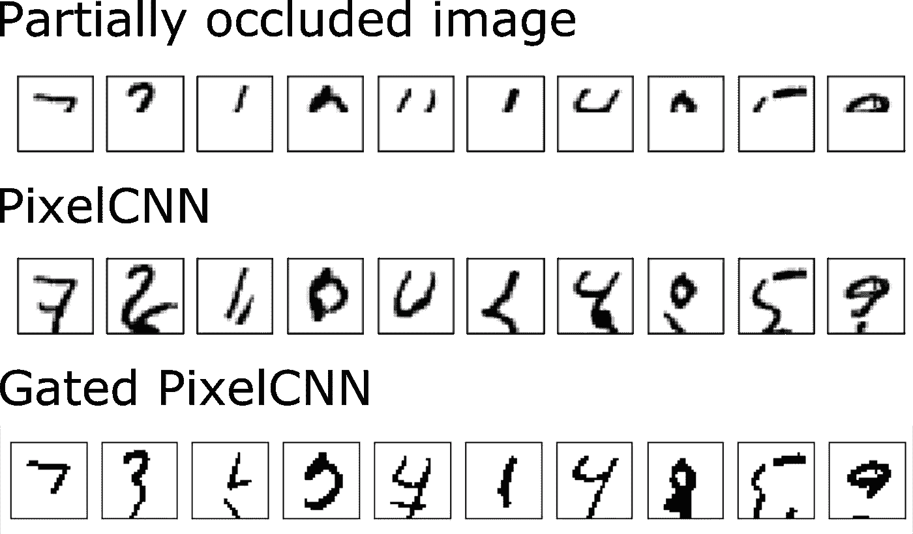

图 11:PixelCNN 和门控 pixel CNN 的比较(图片由作者提供)

当比较 PixelCNN 和门控 PixelCNN 的 MNIST 预测(图 11)时，我们没有观察到 MNIST 数据集有很大的改善。一些以前被正确预测的数字现在被错误地预测了。但是，这并不意味着不应考虑 PixelCNNs。在下一篇博文中，我们将讨论门控 PixelCNNs 和 PixelCNN++以及它们将如何提高模型的性能。敬请关注！

# 参考

[https://youtu.be/1BURwCCYNEI](https://youtu.be/1BURwCCYNEI)

[https://openreview.net/pdf?id=Hyvw0L9el](https://openreview.net/pdf?id=Hyvw0L9el)

[https://www . slide share . net/suga 93/conditional-image-generation-with-pixel CNN-decoders](https://www.slideshare.net/suga93/conditional-image-generation-with-pixelcnn-decoders)

[https://sergeiturukin.com/2017/02/24/gated-pixelcnn.html](https://sergeiturukin.com/2017/02/24/gated-pixelcnn.html)