# 像素并非生而平等

> 原文：<https://towardsdatascience.com/pixels-are-not-created-equal-b3ae4b36ffbc?source=collection_archive---------35----------------------->

## [思想和理论](https://towardsdatascience.com/tagged/thoughts-and-theory)

## 利用低秩结构来寻找图像中最重要的像素。

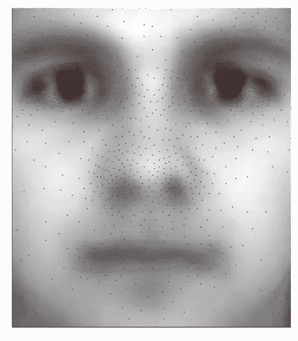

在 32 256 个像素中，只有不到 3%的像素(此处为红色)与从扩展的耶鲁 B 数据库中重建人脸相关。图片由作者提供。

图像空间极其广阔。想一想。如果考虑一个简单的 8 乘 8 像素的网格，其颜色使用单个位(即黑色或白色)进行编码，则可以构建 18 446 744 073 709 551 616 个图像。如果你现在使用 8 位对灰度进行编码，或者考虑百万像素的图像，这个数字就超出了天文数字。比已知宇宙中的原子数量还要多！图像空间是如此之大，以至于你能想到的任何图像都存在于其中。这包括你此刻盯着屏幕的画面，或者你(未来)的孩子骑着自行车的画面。还有一个你打扮成拿破仑的形象，骑着恐龙和维京人战斗，而背景是一群熊在杂耍。这是多么广阔的图像空间。图像空间是被模仿的*维度诅咒*。然而，我们经常在这个巨大的数学空间中执行极其复杂的运算。这怎么可能呢？利用数据中的低秩结构就是这样一种可能性。

工程和工业中使用的数据集往往是高度结构化和标准化的。例如，用于制成品异常检测的图像必须遵循特定的规范。不同角度的高分辨率图像是在物体坐在离相机特定距离处并处于预定的闪电条件下拍摄的。然而，有用的信息存在于一个比纯粹的图像尺寸更小的维度空间中。数据集的这种高度标准化的性质通常意味着某种形式的底层低秩结构，这种结构可以为我们所用。在本帖中，我们将看到如何使用简单的线性代数技术来识别标准化图像中最相关的像素，并仅使用这些有限的测量值来重建人脸图像。这是受到华盛顿大学合作者最近一系列文章的启发。

## 扩展耶鲁人脸数据库 B

[扩展的耶鲁人脸数据库 B](http://vision.ucsd.edu/~leekc/ExtYaleDatabase/ExtYaleB.html) 是一个经典的数据集，用来说明图像处理算法。它包含 28 个人类对象在 9 种姿势和 64 种照明条件下的 16 128 幅图像。为了简单起见，我们将使用它的裁剪版本。图像的总数约为 2000 张，对于这篇介绍性文章来说，这是一个更容易处理的数据集。这些面的随机子集如下所示。

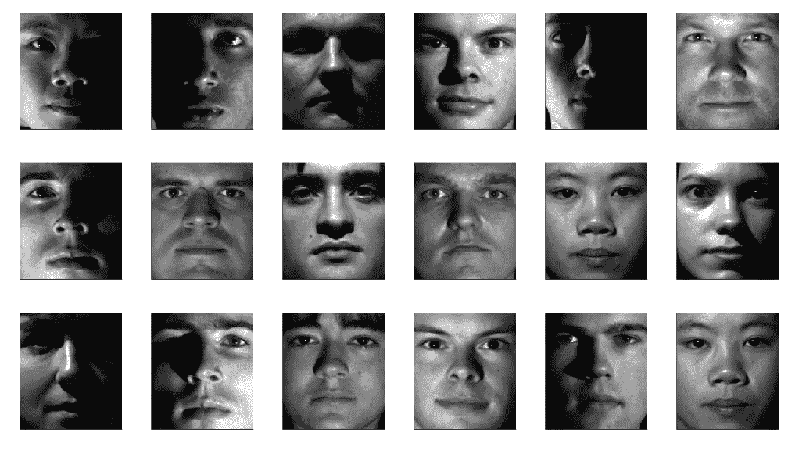

来自裁剪的扩展耶鲁人脸数据集 b 的随机图像。

在这篇文章的其余部分，我们将尝试确定哪个像素子集对图像重建最重要。

# 稀疏传感器放置

我们试图解决的问题是*稀疏传感器放置*，即您应该在哪里放置有限数量的传感器(或者在这种情况下测量哪个像素)以最佳地估计您的系统状态(或者重建您的图像)。数学上，我们有以下等式

其中 **x** ∊ ℝⁿ是我们想要测量的高维对象(在我们的例子中是图像的矢量化版本，n = 192 × 168 ),而 **C** 是我们想要设计的 m× n 未知测量矩阵。最后，矢量 **y** ∊ ℝᵐ是我们想要从中推断出 **x** 的有限测量值。如果没有关于数据的潜在结构的额外假设，这是一个大规模欠定问题(即未知数比方程多),允许有无限多的解。关于数据的不同假设产生了这个问题的解决方案。一个这样的例子，尽管不是本文的主题，是[压缩传感](https://en.wikipedia.org/wiki/Compressed_sensing#:~:text=Compressed%20sensing%20(also%20known%20as,solutions%20to%20underdetermined%20linear%20systems.)，其中假设 **x** 在适当的基础上表达是稀疏的。这里，我们将改为假设 **x** 可以在低秩基础上表示，即

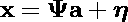

用**ψ**表示 n × r 低秩基(用 r ≪ n)， **a** ∊ ℝʳ表示 **x** 在这个特殊基中的表示， **η** 是 **x** 不在**ψ**跨度内的(希望是小的)分量。

将这种扩展引入我们的测量方程，得到

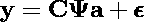

其中 **ε** 为 **η** 引起的测量噪声。这可以改写为

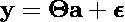

其中𝚯=**cψ**是我们的低维未知测量矩阵。该系统的解决方案由下式给出

因此，我们的目标是设计矩阵 **C** ，使得𝚯 **和**尽可能处于良好状态，以避免测量噪声爆炸。

最简单的形式是，这是一个很难处理的组合问题，因为必须测试传感器的每一种可能的组合。已经提出了不同的算法来将这个问题简化成一个更简单的问题。讨论它们的数学细节超出了这篇文章的范围。可以说，如果将自己限制为逐点测量(即图像情况下的单像素测量)，可以很容易地从具有列旋转的 [QR 分解中获得准最佳解决方案](https://en.wikipedia.org/wiki/QR_decomposition#Column_pivoting)

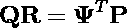

这里 **P** 是一个矩阵，迭代地选择**ψ**ᵀ的列，使得 **R** 的对角元素不减少(在数量上)。如果通过提取与每个枢轴 pᵢ相关联的**ψ**的行来构造低维测量矩阵𝚯，这个简单的过程确保𝚯的行列式在每次迭代中最大化。因此，这个测量矩阵是条件良好的。更多详情，感兴趣的读者可参考[原创研究文章](https://arxiv.org/abs/1701.07569)。

# 扩展耶鲁人脸数据集 B 上的插图

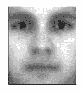

平均脸来自扩展的耶鲁人脸数据库。

现在让我们在数据集上演示这种方法。随机选择 75%的图像作为训练集的一部分，剩余的 25%形成测试集。每个图像被转换成一个矢量，并堆叠在数据矩阵 **X** 中(即 **X** 的每一列对应一个不同的图像)。在分析之前，减去平均面(显示在左边)。

## 降维和特征脸

我们的图像是高度标准化的，因此意味着潜在的低等级结构的存在。解开这种结构的标准方法是数据矩阵的奇异值分解 **X**

在统计界，奇异值分解等价于主成分分析(直到一个常数标度)。它旨在提供数据矩阵 **X** 的近似低秩分解。

在人脸图像的特定上下文中， **U** 的列被称为*特征脸*。主要的如下图所示。

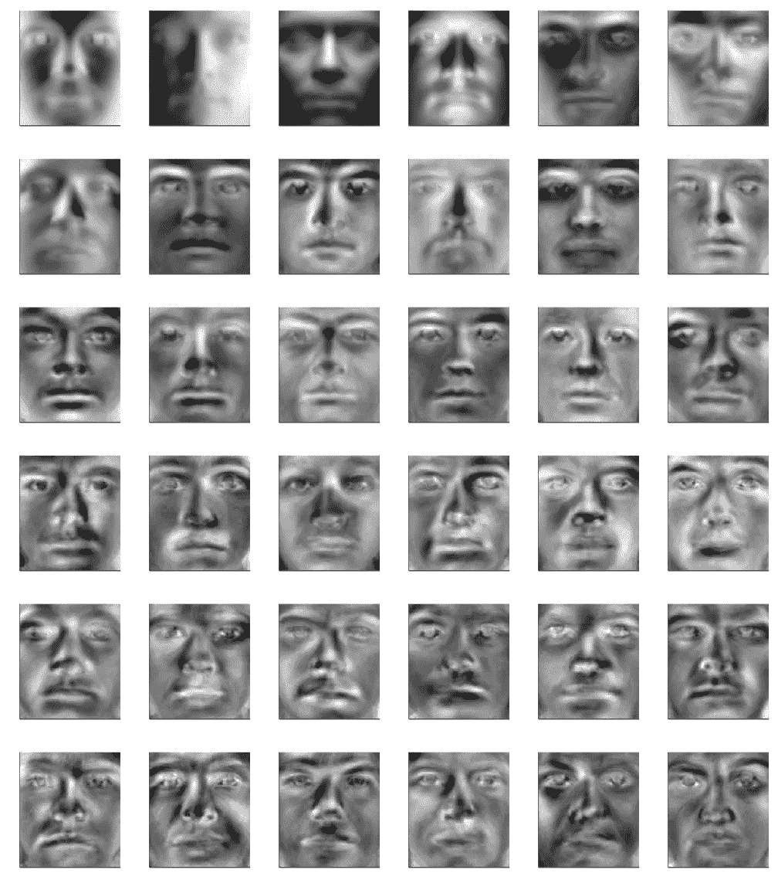

前 36 个特征面(从左到右和从上到下)。图片由作者提供。

这些特征脸捕捉人脸的各种特征和不同的照明条件。在剩下的部分，我们要考虑的每张图像都将被转换成这些特征脸的线性组合。但是我们需要多少这样的特征脸呢？

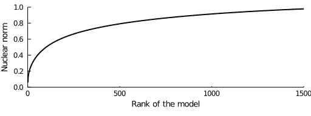

核范数是所考虑的特征面基秩的函数。图片由作者提供。

左边的图显示了作为其秩的函数的奇异值 **X** (近似的核范数)的累积分布。仅使用几百个本征面就可以获得合理的近似。此后我们将考虑其中的 500 个。因此，在这种特定基础上表示图像的低维向量 **a** 将是 500 维的，远小于图像中像素数量所暗示的 32 256 维。

下图使用适当的线性组合，将测试集中的一些图像与其近似值进行了比较。

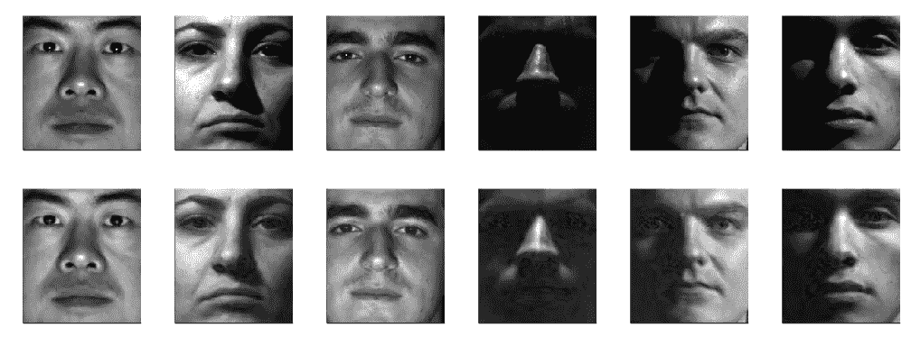

顶行:测试集中的面。底行:使用前 500 个特征脸(加上平均脸)重建的相应图像。图片由作者提供。

可以观察到极好的一致性，尽管丢失了次要的细节。然而，必须考虑原始图像的所有像素，并将其投影到特征面的跨度上。假设我们的基础是 500 维的，那么相同的任务实际上最多需要 500 个像素，这还不到原始图像大小的 2%。现在让我们找出最相关的！

## 稀疏传感器放置

给定我们的低秩基础的最有信息量的像素可以从其具有列旋转的 QR 分解来计算。这个标准的数值过程在所有主要的科学编程语言中都有实现。下面的两段代码说明了如何使用 Python 和 Julia 来计算它。

传感器放置算法的 Python 实现。告诉过你这非常简单。

传感器放置算法的 Julia 实现。就像在 Python 中一样简单。

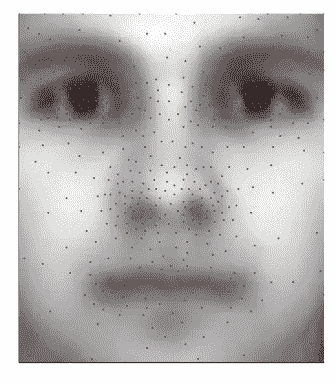

叠加在平均面上的 500 个最相关像素的位置。图片由作者提供。

枢轴的线性指数可以容易地转换成图像中相应像素的坐标。这些位置显示在左侧，叠加在平均面上。该算法识别的最具信息性的区域是眼睛、鼻子和嘴。从生物学的角度来看，这些区域对应于我们试图识别某人时目光倾向于聚焦的地方，这是一个令人惊讶的结果，因为我们的算法和大脑如何工作之间不存在明显的联系(至少就我所知)。

## 从少量像素测量值重建图像

识别出最相关的像素后，低维测量矩阵

可以简单地通过提取**ψ**矩阵中的相应行来构建，产生以下线性方程组

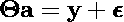

可以使用两种不同的策略从这些稀疏测量值 **y** 中推断出低维表示 **a** 。在没有额外信息的情况下，最好的办法就是简单地解这个方程组，即

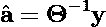

或者，数据矩阵 **X** 的 SVD 为我们提供的不仅仅是本征脸。它还提供了关于特征面基中每个坐标**和** ᵢ的分布的信息。利用这些额外的知识，可以获得未知人脸的估计表示 **a** 作为以下约束最小化问题的解决方案

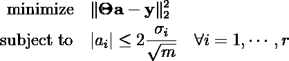

其中不等式约束确保估计的 aᵢ在训练集中观察到的两个标准偏差内( *m* 是训练样本的数量)。下面是这两种方法的 Julia 代码。使用 Python，可以使用 [SciPy LP 解算器](https://docs.scipy.org/doc/scipy/reference/generated/scipy.optimize.linprog.html)或 [cvxopt](https://cvxopt.org/) 编写类似的代码。

下面显示了由两种方法为来自测试集的图像的随机子集提供的重建的比较。

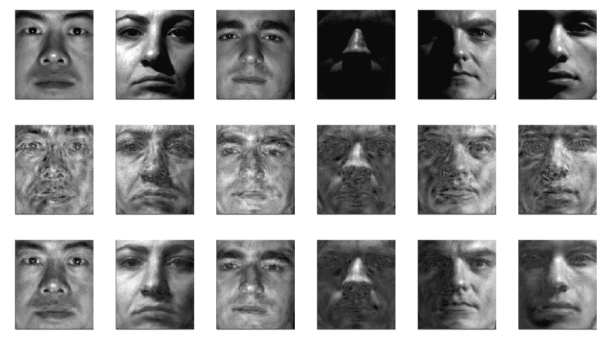

顶行:来自测试集的地面真实图像。中间一行:通过低维测量矩阵的直接反演进行重建。底部一行:使用约束最小二乘公式进行重建。在所有情况下，仅使用 500 像素的测量值(即少于图像中总像素的 3%)来重建图像。图片由作者提供。

虽然直接对低维测量矩阵𝚯求逆提供了合理的重建，但是利用关于训练数据的低秩结构的额外信息比特以计算成本的微小增加为代价产生了好得多的重建。请记住，这些重建只依赖于原始图像中不到 3%的总像素的测量，当你想到这一点时，这是非常了不起的。尽管图像空间很大，但利用我们数据下面的低秩结构使得这些令人难以置信的性能成为可能！最后，由于需要非常少的像素测量，该技术可以容易地与预训练的分类器(例如，逻辑回归或 SVC)结合，以在低存储设备(例如，Raspberry Pi 或 Arduino)上操作简单的人脸识别软件。这是一个有趣的项目，我现在正在做。

# 结论

在过去的十年里，深度学习吸引了大量的注意力，并使仅仅基于线性代数的技术黯然失色。然而，线性代数仍然有很多优点，特别是对于工程和工业中流行的高度结构化和标准化的数据集，或者对于在计算资源有限的低存储设备上部署模型。在这里，我们一直在利用数据的低秩结构，仅通过几个像素测量值来重建图像。然而，这种技术可以用在与科学和工程更相关的环境中。马诺哈尔等人。使用它来研究在全球范围内何处放置一组有限的传感器来估计海面温度。他们还在流体动力学中使用它来确定在气流中放置传感器的位置，以推断速度场是什么，这在空气动力学和闭环反馈控制中非常重要。

因为它依赖于相当简单的数值线性代数技术，这种稀疏传感器放置方法也可以很容易地扩展到处理这个问题的变化。例如， [Clark *et al.*](https://arxiv.org/pdf/1805.03717.pdf) 已经考虑到空间的某些区域可能更难探测(即在那里部署传感器更昂贵)，或者您可能可以使用不同传感器的组合(例如压力、温度和速度传感器)，每个传感器都有其感测精度和运行成本。它还被扩展到受控系统，在这些系统中，人们必须决定使用哪种类型的致动器，以及将它们放置在哪里，以便对系统具有最大的权威。我不怀疑许多其他实际工程问题可以在这个特别简单的框架内重新表述。你的问题呢？

我是一个有使命的线性代数狂热者。这篇文章是即将到来的系列文章的第一篇，旨在恢复线性代数的荣誉徽章，特别强调科学和工程的数据驱动技术。敬请期待更多精彩！

PS:如果你想了解更多，建议你看看 Brunton & Kutz 的新书， [*数据驱动的科学与工程——机器学习、动力系统与控制*](https://www.cambridge.org/core/books/datadriven-science-and-engineering/77D52B171B60A496EAFE4DB662ADC36E) ，你可以从他们的网站(【http://databookuw.com/】)免费下载。你也可以看看他们的 YouTube 频道(这里[这里](https://www.youtube.com/c/Eigensteve/videos)和[这里](https://www.youtube.com/channel/UCoUOaSVYkTV6W4uLvxvgiFA/videos))。

> 想看更多这方面的内容？*查看我其他关于* [*低秩结构和数据驱动建模*](https://loiseau-jc.medium.com/list/lowrank-structure-and-datadriven-modeling-8f39635a90ea) 的文章或者干脆我的[机器学习基础知识](https://loiseau-jc.medium.com/list/machine-learning-basics-0baf10d8f8b5) *！*

 [## 时间序列分析中反对主成分分析的一个案例

### 如何对时间序列使用线性降维？

towardsdatascience.com](/a-case-against-pca-for-time-series-analysis-ac66b47629e0)