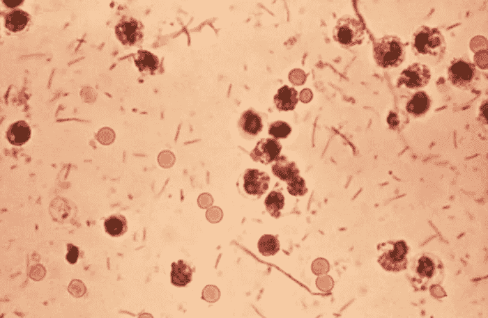
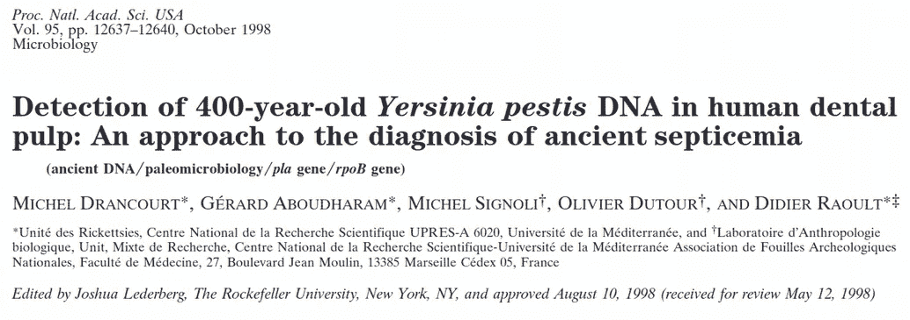
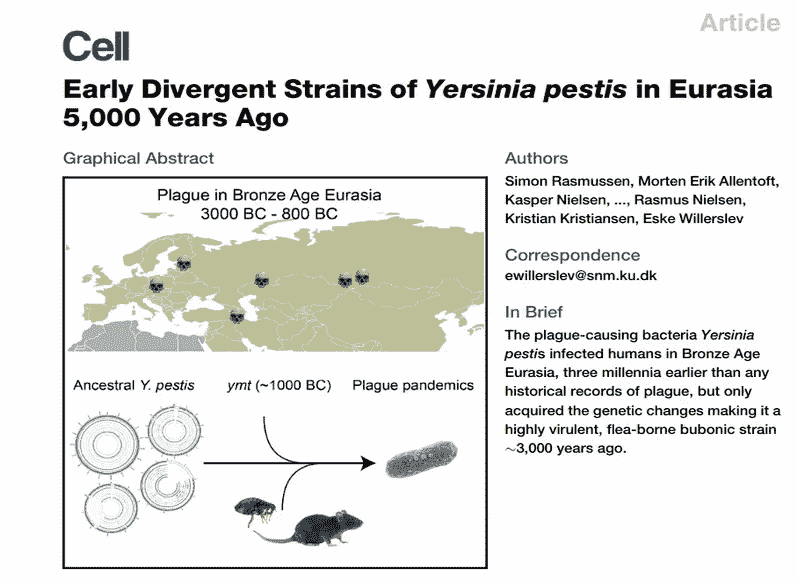
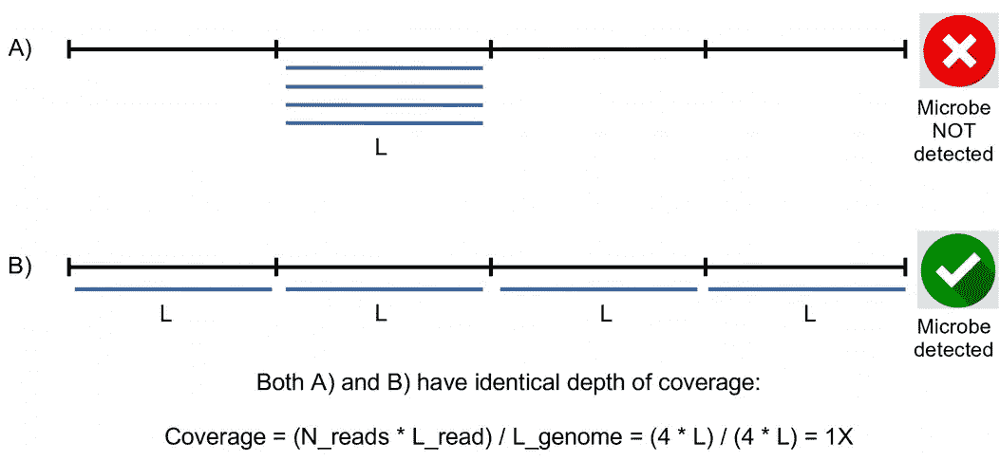
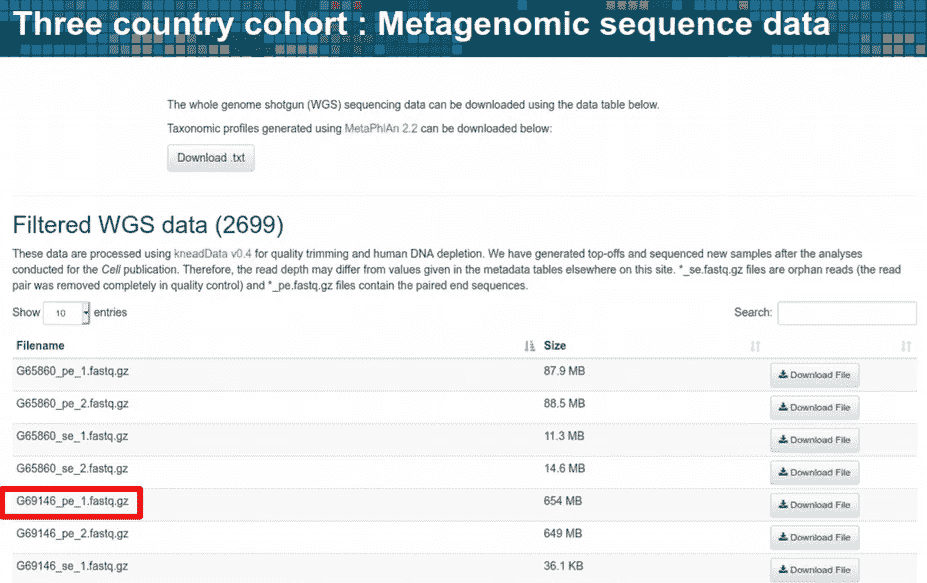
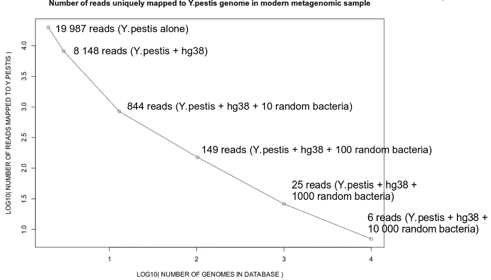
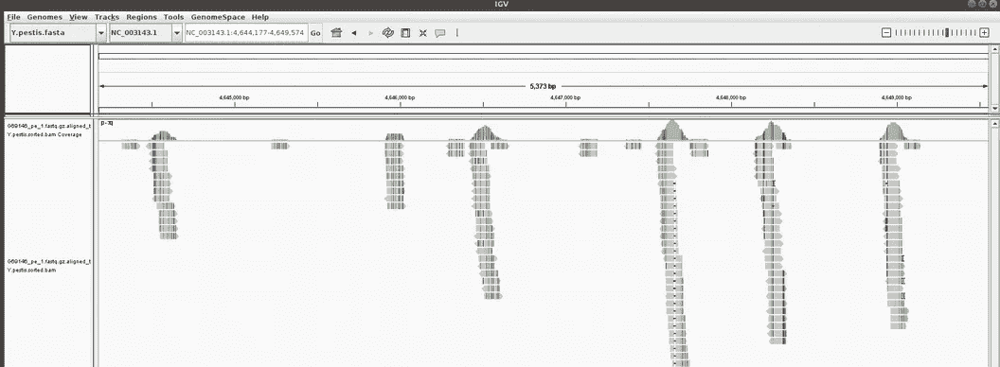

# 古今 DNA 中的瘟疫

> 原文：<https://towardsdatascience.com/plague-in-ancient-and-modern-dna-f8e52e3d8a11?source=collection_archive---------18----------------------->

## [思想与理论](https://towardsdatascience.com/tagged/thoughts-and-theory)，生命科学的数理统计与机器学习

## 如何在任何随机样本中找到鼠疫杆菌病原体

彼得·勃鲁盖尔《死亡的胜利》，马德里普拉多博物馆，[图片来源](https://en.wikipedia.org/wiki/The_Triumph_of_Death)

这是我的专栏 [**生命科学的数理统计和机器学习**](https://towardsdatascience.com/tagged/stats-ml-life-sciences?source=post_page---------------------------) 中的**第二十三篇**文章，在这里我用通俗易懂的语言讨论了一些计算生物学中常见的神秘分析技术。应用于考古材料的 DNA 测序技术极大地丰富了我们关于人类过去的知识。例如，分析历史墓葬中人类遗骸的 DNA 可以提供关于古代大流行的大量信息，如由 ***鼠疫*** 细菌引起的 [**瘟疫**](https://en.wikipedia.org/wiki/Plague_(disease)) 。然而，检测**古代病原体**的普通方法往往缺乏特异性，可能导致错误发现。在本文中，我将展示如何将[序列比对](https://en.wikipedia.org/wiki/Sequence_alignment)与常见病原微生物检测标准(如[覆盖深度](https://en.wikipedia.org/wiki/Coverage_(genetics)))一起应用于现代[宏基因组](https://en.wikipedia.org/wiki/Metagenomics)样本，从而轻松发现不应该存在的*鼠疫杆菌*。我还将讨论为什么在解释古代病原体发现时需要**谨慎**，以及如何使用**更好的指标**，如**覆盖面**可以更可靠地进行病原体检测。

# 在垃圾堆里搜寻

[DNA 测序](https://en.wikipedia.org/wiki/DNA_sequencing)技术的出现有益于许多研究领域，包括[个性化医疗](https://en.wikipedia.org/wiki/Personalized_medicine)、[群体遗传学](https://en.wikipedia.org/wiki/Population_genetics)和[古代 DNA (aDNA)](https://en.wikipedia.org/wiki/Ancient_DNA) 。从历史上看，aDNA 研究围绕着**人类进化**展开，其中主要**人类 aDNA** 被提取、测序和分析。然而，最近已经证明，对来自内源**微生物群落**的 aDNA 进行分析，可以带来关于**古代大流行**、生活方式和过去人口迁移的极其有价值的信息，这在以前常常被视为副产品。

[患有志贺氏痢疾的粪便样本，图片来源:维基百科公共资源](https://en.wikipedia.org/wiki/Pathogen)

早在 1998 年，可能就有第一篇发表在 [PNAS 日报](https://www.pnas.org/)上的科学文章证明了在一个 16 世纪的古代人的人类牙髓中存在*鼠疫耶尔森氏菌*病原体(导致 [**鼠疫**](https://en.wikipedia.org/wiki/Plague_(disease)) )。

[Drancourt 等人，美国国家科学院院刊，1998 年 10 月 13 日；95(21):12637–40.doi: 10.1073/pnas](https://pubmed.ncbi.nlm.nih.gov/9770538/)

随着[下一代测序(NGS)](https://en.wikipedia.org/wiki/DNA_sequencing) 技术的发展，从**数百个古代样本**中筛选微生物群落成为可能。这导致了许多惊人的发现。例如，有证据表明*鼠疫耶尔森菌*在 [**青铜时代**](https://en.wikipedia.org/wiki/Bronze_Age) 就已经存在，而不仅仅是之前认为的[中世纪](https://en.wikipedia.org/wiki/Middle_Ages)。

[拉斯姆森等人，细胞。2015 年 10 月 22 日；163(3):571–82.doi: 10.1016/j.cell.2015.10.009，PMID: 26496604](http://Rasmussen S, Allentoft ME, Nielsen K, Orlando L, Sikora M, Sjögren KG, Pedersen AG, Schubert M, Van Dam A, Kapel CM, Nielsen HB, Brunak S, Avetisyan P, Epimakhov A, Khalyapin MV, Gnuni A, Kriiska A, Lasak I, Metspalu M, Moiseyev V, Gromov A, Pokutta D, Saag L, Varul L, Yepiskoposyan L, Sicheritz-Pontén T, Foley RA, Lahr MM, Nielsen R, Kristiansen K, Willerslev E. Early divergent strains of Yersinia pestis in Eurasia 5,000 years ago. Cell. 2015 Oct 22;163(3):571-82\. doi: 10.1016/j.cell.2015.10.009\. Epub 2015 Oct 22\. PMID: 26496604; PMCID: PMC4644222.)

从那以后，[的许多研究](https://pubmed.ncbi.nlm.nih.gov/?term=Yersinia%20pestis)报道了在人类和动物的古代样本中发现微生物病原体。虽然在这里我并不质疑这些发现，因为它们中的大多数都提供了彻底的验证，但我仍然想表达一句谨慎的话。下面，我将展示在任何随机的[宏基因组](https://en.wikipedia.org/wiki/Metagenomics)样本中错误地“检测”*鼠疫杆菌*是多么容易，因为病原体的存在毫无意义。

# 覆盖深度可能会产生误导

通常，在参加科学 aDNA 研讨会和会议时，我会听到以下在古代样本中发现病原体的典型报告方式:

> *检测到鼠疫耶尔森菌*病原体，绘制了约 5000 个读数，1.2 倍基因组覆盖范围

这里，“读出”是指通过测序技术读出其[核苷酸](https://en.wikipedia.org/wiki/Nucleotide)序列的**小 DNA 片段**。然后将“读数”与所讨论的生物的 **参考基因组**进行比对。在上面的例子中，大约 5000 个小 DNA“读数”与*鼠疫耶尔森菌*参考基因组进行了比对。这是相当多的，这似乎是一个很好的证据，证明*鼠疫杆菌*确实存在于样本中。所谓“1.2X 基因组覆盖”，我们通常是指鼠疫耶尔森菌参考基因组中的任何随机位置平均被大约 1.2 个“读数”覆盖。数字越大，更具体地说称为**覆盖深度**，测序和比对的质量越好，样品中存在*鼠疫耶尔森菌*的可能性越大。****

然而，当处理[宏基因组](https://en.wikipedia.org/wiki/Metagenomics)数据的分析时，即当对多种微生物进行同时比对时，覆盖深度可能是一个**误导性指标**。更具体地说，用来自多种生物的序列工作，很难确定与特定微生物生物的参考基因组比对的序列真的来自该生物，而不是来自另一种生物。[aDNA](https://en.wikipedia.org/wiki/DNA_damage_(naturally_occurring))的降解和[损伤，以及与参考数据库的进化分歧，不完整和被污染的数据库，现代](https://en.wikipedia.org/wiki/Ancient_DNA)[污染](https://en.wikipedia.org/wiki/Contamination)，[跨生物体的 DNA 保守](https://en.wikipedia.org/wiki/Conserved_sequence)和[水平基因转移](https://en.wikipedia.org/wiki/Horizontal_gene_transfer)使得对特定生物体(包括*鼠疫耶尔森氏菌*等病原体)的序列确定变得复杂。

具有相同覆盖深度的两种比对方案:在一个区域 a)中比对的读数，以及在参考基因组 b)中均匀分布的读数，作者图像

在上图中，我展示了短(蓝色)序列与参考(黑色)基因组比对的两种情况。假设序列的长度为 L，为简单起见，参考基因组的长度为 4*L。当使用例如[Integrative Genomics Viewer(IGV)](https://software.broadinstitute.org/software/igv/)工具可视化比对时，人们经常会遇到所有读数/序列都在一个区域中进行比对的情况。这是一个不幸的场景，表明序列和排列存在问题。另一种情况是，当读数在参考基因组中均匀分布时，这是我们想要观察的，因为这是成功作图的证据。然而，如上图所示，计算覆盖深度可能会导致这两种截然不同的制图场景产生**相同的**值。覆盖深度度量的一个更好的替代方法是**覆盖广度(覆盖均匀度)**，它简单地计算被至少一个序列/读数覆盖的参考基因组的**部分。**

# 在随机样本中检测鼠疫耶尔森菌

为了证明人们如何能够错误地检测出鼠疫耶尔森氏菌(耶尔森氏菌，T2 鼠疫耶尔森氏菌)病原体，让我们使用来自布罗德研究所(Broad Institute)的糖尿病免疫数据库(三个国家队列)，从一名现代婴儿身上随机抽取粪便样本。

随机宏基因组样本取自布罗德研究所的糖尿病免疫项目，[图片来源](https://diabimmune.broadinstitute.org/diabimmune/three-country-cohort/resources/metagenomic-sequence-data)

现在，让我们使用 [Bowtie2](http://bowtie-bio.sourceforge.net/bowtie2/index.shtml) mapper 将样本中的序列与[鼠疫耶尔森氏菌*的*](https://www.ncbi.nlm.nih.gov/genome/153?genome_assembly_id=299265)参考基因组进行比对。然而，首先我们必须为鼠疫耶尔森菌的参考基因组建立一个 Bowtie2 指数。

在这里，我们惊奇地发现 **19 987** 阅读序列可以映射到*鼠疫耶尔森菌*参考基因组。这是一个很大的数字，但没有什么意义，因为这是一个随机的现代婴儿 T21 样本，很难相信耶尔森氏鼠疫杆菌会出现在那里。请注意，通过说“19 987 个映射读数”，我们使用**覆盖深度**作为病原体检测的标准。上述分析中一个明显的缺陷是，我们只提供了*鼠疫耶尔森菌*病原体参考基因组用于绘图，而这是一个应该包含大量人类 DNA 的人类粪便样本。因此，许多与*鼠疫耶尔森氏菌*参考基因组比对的读数可能实际上来自人类，它们可能已经定位到 [**保守/直向同源**](https://en.wikipedia.org/wiki/Conserved_sequence) 区域。为了解决这个问题，让我们将一个**人类参考基因组**添加到*鼠疫杆菌*参考基因组中，并再次执行作图。

现在，我们可以看到“只有” **8 148** 个读数与*鼠疫耶尔森氏菌*参考基因组对齐，而它们被给予了与人类 hg38 参考基因组对齐的选择。随着所用数据库大小的增加(2 个基因组而不是 1 个)，分析变得更加稳健，因为在这里**我们不强制**读数仅与*鼠疫耶尔森菌*比对。然而，我们仍然发现许多明显的假阳性序列与鼠疫耶尔森氏菌*的序列比对。那些可能是微生物序列，在分类学上[更接近](https://en.wikipedia.org/wiki/Taxonomy_(biology))鼠疫杆菌*而不是[真核生物](https://en.wikipedia.org/wiki/Eukaryote)。由于除了*鼠疫耶尔森氏菌* 之外**没有提供** **(包括在数据库中)微生物参考基因组，许多实际上来自**非耶尔森氏菌微生物**的序列被迫与*鼠疫耶尔森氏菌*进行比对。为了解决这个问题，我们需要下载所有可用的细菌参考基因组，随机选取其中的 10、100、1000 和 10 000 个，与*耶尔森氏鼠疫杆菌* +人类参考基因组合并，并对大小不断增长的数据库进行比对。每次，我们都要检查唯一映射到鼠疫耶尔森氏菌的读数数量，同时记住这些读数可能与其他微生物有更高的亲和力。****

随着更多的基因组被添加到数据库中，绘制鼠疫耶尔森氏菌图谱的读数数量减少，图片由作者提供

我们可以看到，随着 **数据库大小**的**增长** **，鼠疫耶尔森氏菌**与*唯一比对**的读数在减少，当我们将 10 000 个随机细菌纳入数据库时，读数会变得与 **6** 一样多。因此，我们得出结论，有限大小的数据库可能导致微生物的假阳性检测，因为我们得到越来越多的与*鼠疫耶尔森菌*相关的读数，这显然是一个假阳性的发现，我们提供的用于竞争性图谱的基因组越少。此外，富含病原微生物**的数据库**可能导致在古代和现代宏基因组样本中**错误发现**病原体。***

# 诀窍在哪里？

那么，为什么我们似乎在现代婴儿样本中检测到了不应该存在的鼠疫耶尔森菌呢？显然是因为我们简单地统计了映射到*鼠疫耶尔森菌*的读数，从而使用**覆盖深度**作为检测标准。这些读数很可能来自另一种 [**同源**](https://en.wikipedia.org/wiki/Homology_(biology)) 微生物，但由于其参考基因组不包括在数据库中，因此无法将其归属于该微生物。我们能过滤掉这些假阳性的发现吗？是的，我们可以！通过使用比覆盖深度/映射读取数更好的标准。如果我们使用覆盖的广度，即读数在参考基因组中的分布有多均匀，我们可以很容易地将鼠疫耶尔森氏菌作为假阳性结果过滤掉。

整合基因组浏览器(IGV)与鼠疫耶尔森氏菌参考比对的读数可视化，图片由作者提供

当使用整合基因组浏览器(IGV)工具可视化鼠疫耶尔森菌参考基因组比对时，假阳性变得明显，如上图所示。这些读数并不是沿基因组均匀分布的，而是与几个(最有可能是保守的)区域对齐。因此，在未来，一种更可靠、更令人信服的报告*鼠疫耶尔森氏菌* **在古代样本中真实存在**的方法如下(注意 85%的覆盖面):

> 检测到鼠疫耶尔森菌病原体，绘制了约 5000 个读数，1.2 倍基因组覆盖率，覆盖了 85%的参考基因组

# 摘要

在这篇文章中，我们了解到从古代样本的微生物群落中测序 DNA 可以提供关于在古代人类和动物中流行的疾病的惊人信息。然而，**可靠的检测古代微生物病原体**还是很有**挑战性的**。由于忘记应用多层次的验证，人们很容易以错误的发现告终，因此需要对每个古代样本进行定制和仔细的 **分析**以**准确地**筛选古代微生物病原体的存在。

像往常一样，让我在下面的评论中知道生命科学和计算生物学的哪些分析方法对你来说似乎**特别神秘**，我将在这个专栏中尝试解决它们。在我的 [github](https://github.com/NikolayOskolkov/PlagueRandomSample) 上查看帖子使用的文件。在**Medium**Nikolay Oskolkov 关注我，在**Twitter**@ NikolayOskolkov 关注我，并通过 [Linkedin](http://linkedin.com/in/nikolay-oskolkov-abb321186?source=post_page---------------------------) 联系我。在下一篇文章中，我们将讨论**如何在 UMAP 空间**聚集，敬请关注。