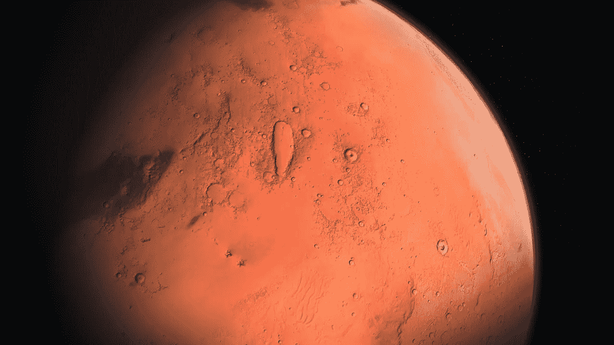
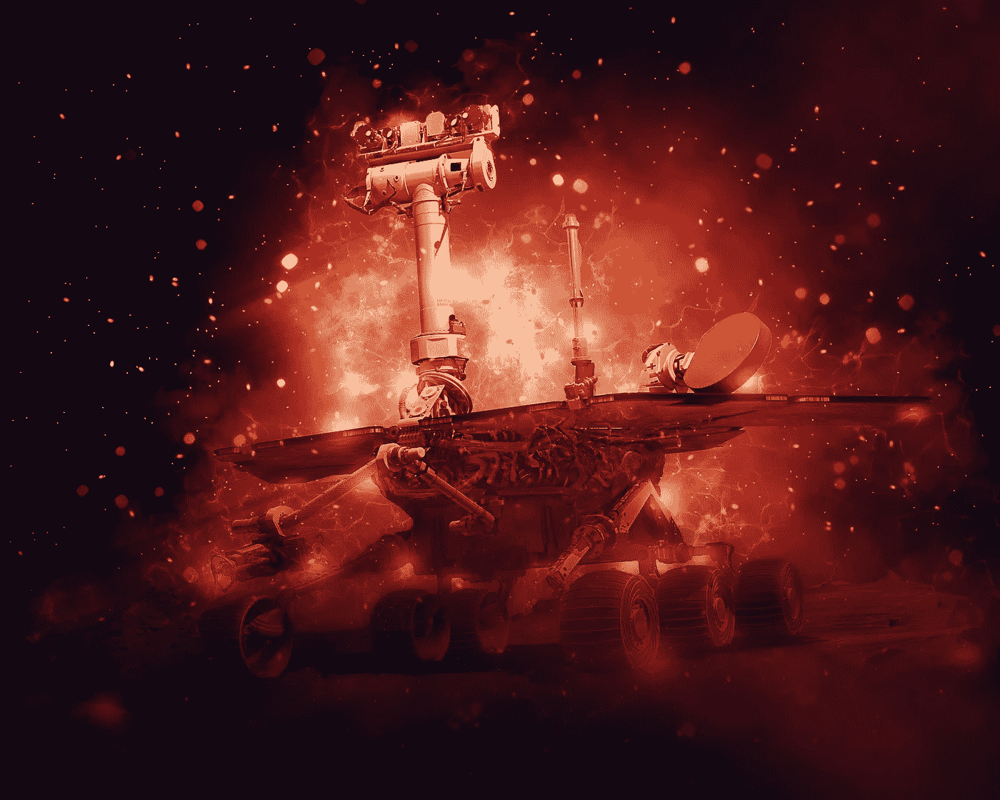

# 机器人星球

> 原文：<https://towardsdatascience.com/planet-of-the-robots-9eaba91bdf43?source=collection_archive---------22----------------------->

## 人工智能如何接管附近的星球

图片来自[皮克斯拜](https://pixabay.com/?utm_source=link-attribution&utm_medium=referral&utm_campaign=image&utm_content=2051748)的艾努尔·扎基罗夫

你可能会惊讶地发现，在离我们很近的地方，有一个由机器人统治的星球。那里没有人类居住。人口仍然相对较少，只有五个机器人在上面，但它正在稳步增长。这颗行星正是我们的姐妹行星火星。

图片由[布里吉特根据你的照片制作定制作品，非常感谢](https://pixabay.com/users/arttower-5337/?utm_source=link-attribution&utm_medium=referral&utm_campaign=image&utm_content=3401141)来自 [Pixabay](https://pixabay.com/?utm_source=link-attribution&utm_medium=referral&utm_campaign=image&utm_content=3401141)

事实上，美国国家航空航天局(NASA)自 1971 年以来共向这颗红色星球发送了 7 辆火星车，但其中两辆从未完成旅程。在其他 5 个中，Sojourner 在着陆后三个月失去了通信(1997 年)，Spirit 工作了六年(直到 2010 年)，但它的轮子陷入了沙子，而 Opportunity 由于一场严重的沙尘暴进入了冬眠(2018 年)。后两个，好奇号(2012)和恒心号(2021)，还在运营中。

毫无疑问，毅力漫游者是最先进的，它使用了复杂的人工智能(AI ),尽管它的处理器不如你的手机强大！选择 90s 处理器的原因是因为火星的大气层对有害辐射和带电粒子的保护远不如地球大气层。使用更老、更简单的芯片可以降低出错的几率。然而，这并不能阻止毅力做一些相当不可思议的事情。

首先，它成功地从地球飞行了 3 亿英里。着陆是最关键的部分，以至于他们称之为“恐怖的 7 分钟”。着陆是危险的，因为着陆点附近有悬崖和沙丘；然而，人工智能地形相对导航(TRN)来救了我们。它的机载相机拍了几张下降的照片；人工智能识别出飞船的位置，并把它导向一个安全的着陆点。“TRN”号成功地在离约定着陆点不到 40 米的地方着陆。这样的人工智能是至关重要的，因为在这 7 分钟内，航天器是靠自己的，从地球发出的任何纠正命令都不会及时到达它那里(因为它可能需要 40 分钟)。

人工智能也将有助于坚持其科学使命。自主探索采集增强科学系统(AEGIS)是一个智能定位软件，可以自主发现奇怪的岩石。然后，科学家可以向半径 7 米内的任何位置发射强大的激光，蒸发部分表面，并使用 ChemCam 或 SuperCam 分析其元素组成。

最新的火星漫游车也是一种自动驾驶车辆。人工智能可以在拍照、进行实验和避开障碍的同时，连续驾驶漫游车在地球上行驶。这种新型火星车的另一个令人兴奋的特点是可以在火星表面钻孔，收集土壤，并将样本放入试管中。火星登月舱(MAV)将在 2030 年左右收集这些管子，并将它们发射回地球。

毅力还拥有一架名为“独创性”的小型无人驾驶直升机。它可以在地面以上 5 米的地方飞行 90 秒，最远飞行 50 米。虽然它的飞行将被精心编写，但它可以使用自主控制，从而允许人工智能驾驶它。

欧洲南方天文台/M. Kornmesser

即使“机器人星球”不是外星人的接触，我们也可能在 2017 年遇到一些真正的外星人。当时，一颗名为 Oumuamua(或 scout)的流氓彗星被探测到接近地球。到目前为止没有什么奇怪的，但在 2018 年 6 月 27 日，天文学家注意到了一个与他们的计算不匹配的运动。起初，他们认为当物体靠近太阳时，气体从物体中蒸发，但科学家后来否定了这一理论。多年来有各种各样的理论，但似乎都站不住脚。

即使“机器人星球”不是外星人的接触，我们也可能在 2017 年遇到一些真正的外星人。当时，一颗名为 Oumuamua(或 scout)的流氓彗星被探测到接近地球。到目前为止没有什么奇怪的，但在 2018 年 6 月 27 日，天文学家注意到了一个与他们的计算不匹配的运动。起初，他们认为当物体靠近太阳时，气体从物体中蒸发，但科学家后来否定了这一理论。多年来有各种各样的理论，但似乎都站不住脚。

2018 年，哈佛大学天文系主任发表论文声称，经过仔细的数学分析；Oumuamua 可能是人工制造的轻型帆船。这种帆利用照射在大镜子上的阳光推动物体穿越太空。人类在 2010 年向金星发射 IKAROS 飞船时已经使用了轻型帆船。

Oumuamua 是否是外星飞船仍有争议，需要更多的数据才能有任何确定性。在那之前，让我们继续探索我们的太阳系，一次探索一颗行星。可以肯定的是，为了实现更雄心勃勃的太空任务，我们需要人工智能来导航我们的航天器穿越太空。自动驾驶汽车将分析外星世界，并将信息传回地球。利用技术作为我们延伸的臂膀，我们可以设法探索前人未曾涉足的领域。

如果你喜欢这篇文章并想联系我，请联系我🐦 [*碎碎念*](https://twitter.com/alexieidingli) *，🔗*[*LinkedIn*](https://www.linkedin.com/in/alexieidingli/)*，📷*[*insta gram*](https://www.instagram.com/alexieidingli/)*或者😊***。**

* [## 一个全新的人工智能世界

### 疫情之后人工智能的兴起

towardsdatascience.com](/a-whole-new-ai-world-6a5e9e49aa12)  [## 自工业革命以来最重大的变化

### 人工智能在当今工业中的应用概述

towardsdatascience.com](/the-most-significant-change-since-the-industrial-revolution-9b2b3dad199e)  [## 几分钟内从巴黎到伦敦

### 交通创新如何重塑我们的未来

medium.com](https://medium.com/dataseries/from-paris-to-london-in-a-handful-of-minutes-7657d978152) 

[**阿列克谢·丁力教授**](http://www.dingli.org/) 是马耳他[大学](https://www.um.edu.mt/)的 AI 教授。二十多年来，他一直在人工智能领域进行研究和工作，协助不同的公司实施人工智能解决方案。他的工作被国际专家评为世界级，并赢得了几个当地和国际奖项(如欧洲航天局、世界知识产权组织和联合国等)。他已经出版了几本同行评审的出版物，并成为马耳他[的一员。由马耳他政府成立的人工智能特别工作组，旨在使马耳他成为世界上人工智能水平最高的国家之一。](https://malta.ai/)*