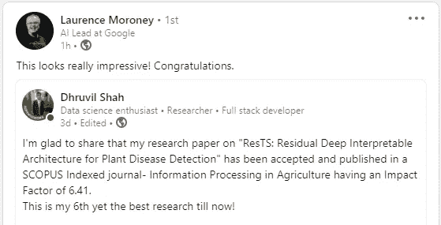
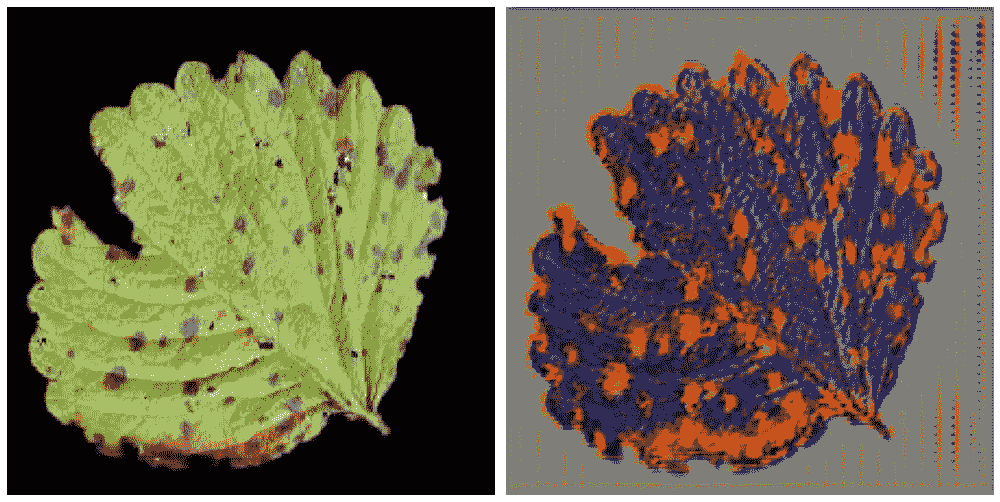
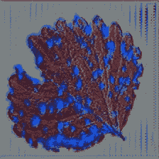
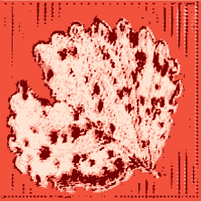
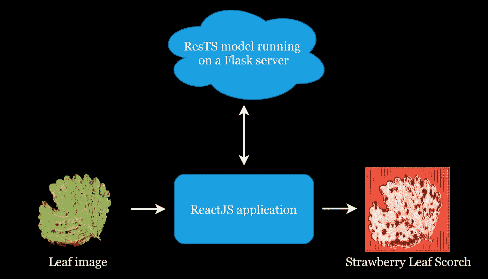
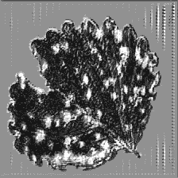
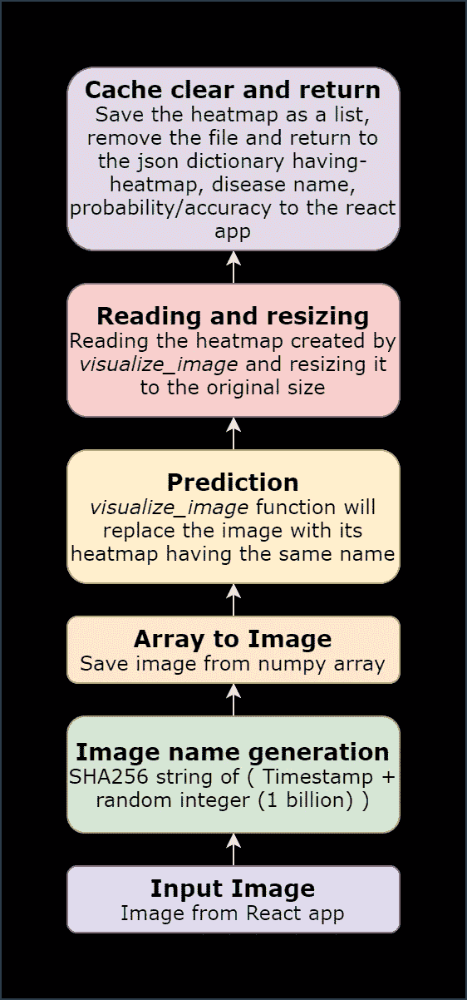
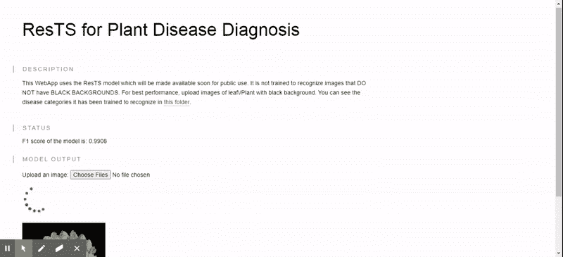

# 利用先进的深度学习和反应技术进行植物病害检测

> 原文：<https://towardsdatascience.com/plant-disease-detection-using-advanced-deep-learning-and-reactjs-6bb913d9e8a8?source=collection_archive---------8----------------------->

## 高级深度学习| FLASK | REACTJS

## 用于可视化和诊断植物疾病的最新架构！

大量的论文和文章可用于使用深度学习来检测叶子或植物疾病。卷积神经网络通过提供有助于准确检测植物疾病的模型，彻底改变了农业领域。但是检测疾病是不够的，人们还应该了解叶子或植物图像中的疾病症状。为了通过目标检测定位工厂中受影响的区域，使用了单触发多盒检测器(SSD)、更快的基于区域的卷积神经网络(更快的 RCNN)和基于区域的完全卷积网络(R-FCN)。此外，对于实时对象检测，采用了只看一次(YOLO)算法。所有这些算法都可以用于植物疾病的诊断和受影响区域的可视化，但是它们缺乏透明度，并且在实践中充当黑箱。

在开始我最新研究的文章之前，我想分享一个好消息:



[https://www . LinkedIn . com/posts/Laurence-moroney _ research-innovation-data science-activity-6810576125337718784-pblm](https://www.linkedin.com/posts/laurence-moroney_research-innovation-datascience-activity-6810576125337718784-pblm)

在这篇文章中，一个可解释的国家最先进的方法被采用，超越了所有以前提出的方法。最近在线发表在 Scopus 索引期刊《农业信息处理》上的一篇影响因子为 6.41 的研究论文被用作本文的基础。

<https://www.sciencedirect.com/science/article/pii/S2214317321000482>  

本文提出了一种高级深度学习架构 ResTS，Residual Teacher/Student 的缩写。它包含两个分类器，即 ResTeacher 和 ResStudent 以及一个解码器。rest teacher+Decoder 用作自动编码器，从输入图像中移除非鉴别特征，而 ResStudent 分类器有助于改善这种架构的重建损失。ResTS 输出一个热图，只突出显示叶部疾病和疾病类别的区别特征。它是在 PlantVillage 数据集(分段版本)上训练的。这种提出的结构优于先前发现的用于植物疾病的诊断和可视化的架构，最高 F1 分数为 0.991。figure 1–4 描述了休止符如何操纵输入图像。以下部分解释了这些图像是如何由模型构建的，以及如何通过几个重要的公式进行后处理的。



**图一。**输入图像 **2。**解码器用 matplotlib(范围 0..**①浮舟③。**解码器通过 OpenCV 重建的图像(范围 0..255 浮球) **4。** **来自 matplotlib 的热图**由**(cmap = ' red ')**

本文将构建一个 React 应用程序作为我们的前端，并在后端运行来自研究论文的高级深度学习架构- **ResTS** 。作为回应，系统将如图 5 所示进行机动。我们将创建整个系统并运行它，最后，看看是否所有的部分都适合在一起。

> **要访问已训练的 ResTS 模型，请参见下一节末尾的说明。**



图 5。系统的一般流程

首先，我们将设计 Flask 服务器来适应预先训练好的 ResTS 架构。服务器将合并一个路由来处理来自应用程序的输入图像，并将返回一个新的图像，该图像仅包含显著特征以及疾病名称和概率。其次，我们将开发一个简单的 React 应用程序，可以上传和显示图像。我们不会深入研究 ResTS 架构的细节。请参考原始论文，以了解该架构如何操作来诊断植物疾病。

# 要访问预训练的 ResTS 模型，

**1。在 LinkedIn 上的以下帖子中对您的请求提出适当的理由，我将分享个人链接，以各种格式访问预先培训的已保存模型:**

<https://www.linkedin.com/posts/dhruvilshah28_research-innovation-datascience-activity-6809383337841434624-b4b->  

## 2.按照这里的指示引用论文:[https://doi.org/10.1016/j.inpa.2021.06.001](https://doi.org/10.1016/j.inpa.2021.06.001)

## 3.只有当你的请求是可信的，并且论文被恰当地引用和注明时，你才会被授予访问权。

# 1.创建包含 ResTS(剩余教师/学生)模型的服务器

架构代码需要与服务器放在同一个文件中。然而，这是可以改变的，但由于一些错误，我决定把整个架构的代码放在同一个文件中，并加载权重。此外，只运行一个文件而不是管理多个文件也很好。

源代码访问:你可以从上面提到的文章中找到这篇文章的全部源代码和 ResTS 架构的链接。

首先，我们将所有必需的库导入到我们的 Flask 服务器文件中。

```
import os
from flask import Flask, request
import numpy as np
import matplotlib.pyplot as plt
import tensorflow as tf
import pandas as pd
import gevent.pywsgi
from flask_cors import CORS
from datetime import datetime
from tensorflow.python.keras.backend import set_session
from keras import backend as K
import tensorflow.compat.v1 as tf
import keras_preprocessing
from keras.applications.xception import preprocess_input as xception_preprocess_input
from keras_preprocessing import image
import json
from PIL import Image
from hashlib import sha256
###########################
from tensorflow.keras.layers import Input, Dense, Conv2D, Activation, MaxPool2D
from tensorflow.keras.layers import *
from tensorflow.keras.models import Model, Sequential
from tensorflow.keras.optimizers import Adam, SGD
import glob
import argparse
from keras import __version__
from keras.applications.xception import preprocess_input as xception_preprocess_input
from keras.preprocessing.image import ImageDataGenerator
from keras.optimizers import SGD
from keras import optimizers
from keras import callbacks
from keras.callbacks import ModelCheckpoint, LearningRateScheduler
from keras import backend as keras
from keras.regularizers import l2,l1
import pandas as pd
```

这将需要巨大的处理能力。下一步是用一些其他重要的变量和使用 *tf.session* 的会话来定义‘app’变量。*运行服务器时需要 tf.disable_v2_behavior()* 和 *tf.get_default_graph()* 来避免任何与图形相关的错误。

```
input_shape = (224,224,3)
nbr_of_classes=38
tf.disable_v2_behavior()
graph = tf.get_default_graph()app = Flask(__name__)
CORS(app)
sess = tf.Session()
set_session(sess)
```

*注意:如果在服务器启动阶段仍然出现错误，很有可能是由于 TensorFlow 的版本错误。在这种情况下，尝试搜索 Stackoverflow。*

定义会话后，将实现架构代码。ResTS 使用标准 Xception 架构作为 ResTeacher 和 ResStudent，解码器以与 Xception 架构完全相反的方式生成，以再现图像。深入讨论 ResTS 架构超出了本文的范围。要正确理解下面的代码，请参考原文。

```
**#ResTS ARCHITECTURE****#RESTEACHER** base_model1 = tf.keras.applications.Xception(include_top=False, weights='imagenet',input_shape = input_shape)
x1_0 = base_model1.output
x1_0 = Flatten(name='Flatten1')(x1_0)
dense1 = Dense(256, name='fc1',activation='relu')(x1_0) 
x = classif_out_encoder1 = Dense(38, name='out1', activation = 'softmax')(dense1) # Latent Representation / Bottleneck#Get Xception's tensors for skip connection.
...**#DECODER**
dense2 = Dense(256, activation='relu')(x)x = Add(name='first_merge')([dense1, dense2])
x = Dense(7*7*2048)(x)
reshape1 = Reshape((7, 7, 2048))(x)#BLOCK 1
...#BLOCK 2
...#BLOCK 3-10
...#BLOCK 11
...#BLOCK 12
...#BLOCK 13
...#BLOCK 14
...x = Conv2D(2, 3, activation = 'relu', padding = 'same',)(x)
mask = x = Conv2D(3, 1, activation = 'sigmoid',name='Mask')(x)**#RESSTUDENT**
base_model2 = tf.keras.applications.Xception(include_top=False, weights='imagenet',input_shape = (224,224,3))
x2_0 = base_model2(mask)
x2_0 = Flatten(name='Flatten2')(x2_0)
x2_1 = Dense(256, name='fc2',activation='relu')(x2_0) 
classif_out_encoder2  = Dense(nbr_of_classes, name='out2',activation='softmax')(x2_1)#Create ResTS Model and Load Pre-trained weights
ResTS = Model(base_model1.input, [classif_out_encoder1, classif_out_encoder2])
ResTS.load_weights('tf/RTS')
```

ResTS 架构的设计方式是，在自动编码器的帮助下，从树叶的输入图像中筛选出噪声区域。*遮罩*层是解码器的输出，用于可视化叶子图像的重要区域。ResTeacher 的输出 classif_out_encoder1 在 *softmax* 函数的帮助下，协助对疾病类别进行分类。

```
#For visualization impetuslayer_name ='Mask'
NewInput = ResTS.get_layer(layer_name).output
visualization = K.function([ResTS.input], [NewInput])
```

在上面的代码中， *visualization* 是一个函数，它帮助获得只包含叶子图像的重要特征的图像。接下来，我们将定义一些重要的函数，用于对从*可视化*函数接收到的图像的特征进行可视化。

```
def reduce_channels_sequare(heatmap):
    channel1 = heatmap[:,:,0]
    channel2 = heatmap[:,:,1]
    channel3 = heatmap[:,:,2]
    new_heatmap = np.sqrt(((channel1-0.149)*(channel1-0.149))+((channel2-0.1529)*(channel2-0.1529))+((channel3-0.3412)*(channel3-0.3412)))
    return new_heatmap
```

需要*reduce _ channels _ se quare*函数将重建的 RGB 图像转换为单通道图像。它间接找到重建图像中主色之间的距离(在此功能中称为热图)。

```
def postprocess_vis(heatmap1,threshould = 0.9):
    heatmap = heatmap1.copy()
    heatmap = (heatmap - heatmap.min())/(heatmap.max() - heatmap.min())
    heatmap = reduce_channels_sequare(heatmap)
    heatmap = (heatmap - heatmap.min())/(heatmap.max() - heatmap.min())
    heatmap[heatmap>threshould] = 1
    **heatmap = heatmap*255**
    return heatmap
```

*postprocess_vis* 函数执行基本的二进制阈值处理，将值大于 0.9 的像素设置为 1。热图(重建图像)然后乘以 255，这样我们就得到范围[0，255]内的值。

**注意:我们现在只处理单通道图像，而不是 RGB 通道。有必要在减少通道之前和之后标准化热图中的值，以便使用 OpenCV 获得如图 6 所示的最终热图。**

**注意，如果使用 OpenCV:如果我们没有乘以 255，我们将得到图 6 中的大部分黑色图像，因为像素值在范围[0，1]内。因为 OpenCV 考虑范围[0，255]并相应地输出图像。**

**注意，如果使用 Matplotlib (cmap= 'Reds '):如果我们没有乘以 255，那么使用 *cmap= 'Reds'* ，我们将得到与图 4 相同的输出。因为 matplotlib 在显示 RGB 图像时只要求特定的范围。**

```
def visualize_image(img_name):
    image_size = (224,224)
    original_image = image.load_img(img_name, target_size=image_size)
    img = image.img_to_array(original_image)
    img = np.expand_dims(img, axis=0)
    img = xception_preprocess_input(img)
    global sess
    global graph
    with graph.as_default():
        set_session(sess)
        **vis = visualization([img])[0][0]**
        disease = ResTS.predict(img)[0]
        probab = max(disease[0])
        disease = np.argmax(disease)
        heatmap = postprocess_vis(vis)
    img = plt.imshow(heatmap, cmap='Reds')
    plt.axis('off')
    plt.savefig(img_name, bbox_inches='tight')
    return disease, probab
```

这里， *vis* 变量由范围[0，1]内的浮点值组成。因此，如果您想对 *vis* 变量运行 *plt.imshow()* 方法，它将给出如图 2 所示的重建图像输出。**如果将 *vis* 变量乘以 255，浮点值将出现在【0，255】范围内，这是 *plt.imshow()* 方法不支持的，因为它要求“RGB”图像的浮点值在[0，1]范围内，整数值在[0，255]范围内。**现在，获得如图 3 所示的输出。，只需将 *vis* 乘以 255，使用 OpenCV 保存即可，如下所述。

```
#cv2.imwrite('vis.jpg',vis)
```

Matplotlib 的*cmap = ' red '*给出了如图 4 所示的红色热图。 *visualize_image* 函数用热图覆盖输入图像(具有相同的文件名)。

**注意:如果我们不使用 plt.imshow(heatmap，cmap = ' Reds ')，而是使用 cv2.imwrite(heatmap)，我们将得到如下输出图像。原因是我们已经在*后处理 _vis* 函数中生成了一个“单通道”热图，并且应用了二进制阈值。OpenCV 将根据像素值写入图像(255 像素值= '白色'区域，0 像素值= '黑色'区域，其他值为'浅灰色'区域)。**



图 6。带 OpenCV 的热图(不带 cmap = ' Reds ')

visualize_image 功能是这个系统的主干。它处理疾病的预测以及疾病症状可视化的生成。首先，通过从“/detect”路径传递的名称读取输入图像，并通过来自标准*异常*架构的默认*异常 _ 预处理 _ 输入*函数进行预处理。*可视化*函数被调用，得到解码器的输出，即重建图像。*。在模型上调用 predict()* 方法来获得 ResTeacher 的输出，即疾病的类别。它返回预测的疾病名称及其概率(表明模型对预测的置信度)。它保存具有相同文件名的*热图*，即覆盖原始文件。

## 创建路线'/detect '

/detect' route 从 React 应用程序获取图像，生成突出显示疾病鉴别特征的热图，并将其与疾病类别一起返回给应用程序。它还返回预测的概率。图 7。决定了这条路线的流向。



图 7。“/detect”路线的流程

下面是这条路线的代码改编。它以与图 7 所示完全相同的方式工作。因此，下面的代码是不言自明的。

```
@app.route('/detect', methods=['POST'])
def change():
    image_size = (224,224)
    img_data = request.get_json()['image']
    img_name = str(int(datetime.timestamp(datetime.now()))) + str(np.random.randint(1000000000))
    img_name = sha256(img_name.encode()).hexdigest()[0:12]
    img_data = np.array(list(img_data.values())).reshape([224, 224, 3])
    im = Image.fromarray((img_data).astype(np.uint8))
    im.save(img_name+'.jpg')
    disease, probab = visualize_image(img_name+'.jpg')
    img = cv2.imread(img_name+'.jpg')
    img = cv2.resize(img, image_size) / 255.0
    img = img.tolist()
    os.remove(img_name+'.jpg')
    return json.dumps({"image": img, "disease":int(disease), "probab":str(probab)})
```

# 1.1 要访问预训练的 ResTS 模型，

**1。在 LinkedIn 上的以下帖子中对您的请求提出适当的理由，我将分享个人链接，以访问各种格式的预培训保存模型:**

<https://www.linkedin.com/posts/dhruvilshah28_research-innovation-datascience-activity-6809383337841434624-b4b->  

## 2.按此处说明引用论文:【https://doi.org/10.1016/j.inpa.2021.06.001 

## 3.只有当你的请求是可信的，并且论文被恰当地引用和注明时，你才会被授予访问权。

# 2.创建简单的 ReactJS 应用程序

让我们直接进入 React 中的编码部分(App.js)文件。

首先，我们将导入一些库并定义全局变量。

```
import logo from './logo.svg';
import './App.css';
import React from 'react';
import * as tf from '@tensorflow/tfjs';
import cat from './cat.jpg';
import {CLASSES} from './imagenet_classes';
const axios = require('axios');const IMAGE_SIZE = 224;
let mobilenet;
let demoStatusElement;
let status;
let mobilenet2;
```

*imagenet_classes* 是一个包含所有类的名称和字典中相应数字的文件。不要介意变量名！这段代码经历了多次尝试，以获得手头任务的完美应用程序。接下来，我们将从“App”类开始。类中的第一个方法是构造函数方法。

```
constructor(props){
    super(props);
    this.state = {
      load:false,
      status: "F1 score of the model is: 0.9908 ",
      probab: ""
     };
     this.mobilenetDemo = this.mobilenetDemo.bind(this);
     this.predict = this.predict.bind(this);
     this.showResults = this.showResults.bind(this);
     this.filechangehandler = this.filechangehandler.bind(this);
  }
```

*加载*状态是针对加载图像之前的动画。*状态*是应用程序中的默认声明。*概率*每次图像通过时，状态都会发生变化，包含其预测的准确性。下面几节将讨论这四种方法。

现在，我们将为特定任务定义所有这 4 种方法。正如我之前提到的变量名，忽略它们。ResTS 架构使用*异常*架构，即使有些变量说 *mobilenet* 。

```
async mobilenetDemo(){
    const catElement = document.getElementById('cat');
    if (catElement.complete && catElement.naturalHeight !== 0) {
      this.predict(catElement);
      catElement.style.display = '';
    } else {
      catElement.onload = () => {
        this.predict(catElement);
        catElement.style.display = '';
      }
    }};
```

*mobilenetDemo()* async 方法通过调用 *prediction()* 方法，加载 app 第一次渲染时的第一张图片及其预测。 *prediction()* 方法以图像元素为输入，调用 Flask 服务器进行相关预测。服务器返回 3 个参数——疾病、概率和热图。

```
async predict(imgElement) {
    let img = tf.browser.fromPixels(imgElement).toFloat().reshape([1, 224, 224, 3]);
    //img = tf.reverse(img, -1);
    this.setState({
            load:true
    });
    const image = await axios.post('http://localhost:5000/detect', {'image': img.dataSync()});
    this.setState({
            load:false
    });
    // // Show the classes in the DOM.
    this.showResults(imgElement, image.data['disease'], image.data['probab'], tf.tensor3d([image.data['image']].flat(), [224, 224, 3]));
  }
```

最后，调用 *showResults()* 方法在 app 中显示结果。 *showResults()* 方法从 *prediction()* 方法中取 4 个值作为参数。该方法执行一些基本的 HTML 操作，将结果从服务器描绘到应用程序中。

```
async showResults(imgElement, diseaseClass, probab, tensor) {
    const predictionContainer = document.createElement('div');
    predictionContainer.className = 'pred-container'; const imgContainer = document.createElement('div');
    imgContainer.appendChild(imgElement);
    predictionContainer.appendChild(imgContainer); const probsContainer = document.createElement('div');
    const predictedCanvas = document.createElement('canvas');
    probsContainer.appendChild(predictedCanvas); predictedCanvas.width = tensor.shape[0];
    predictedCanvas.height = tensor.shape[1];
    tensor = tf.reverse(tensor, -1);
    await tf.browser.toPixels(tensor, predictedCanvas);
    console.log(probab);
    this.setState({
      probab: "The last prediction was " + parseFloat(probab)*100 + " % accurate!"
    });
    const predictedDisease = document.createElement('p');
    predictedDisease.innerHTML = 'Disease: ';
    const i = document.createElement('i');
    i.innerHTML = CLASSES[diseaseClass];
    predictedDisease.appendChild(i);

    //probsContainer.appendChild(predictedCanvas);
    //probsContainer.appendChild(predictedDisease); predictionContainer.appendChild(probsContainer);
    predictionContainer.appendChild(predictedDisease);
    const predictionsElement = document.getElementById('predictions');
    predictionsElement.insertBefore(
        predictionContainer, predictionsElement.firstChild);
  }
```

每当通过上传按钮上传图像时，就会触发 *filechangehandler()* 方法。

```
filechangehandler(evt){
    let files = evt.target.files;
    for (let i = 0, f; f = files[i]; i++) {
      // Only process image files (skip non image files)
      if (!f.type.match('image.*')) {
        continue;
      }
      let reader = new FileReader();
      reader.onload = e => {
        // Fill the image & call predict.
        let img = document.createElement('img');
        img.src = e.target.result;
        img.width = IMAGE_SIZE;
        img.height = IMAGE_SIZE;
        img.onload = () => this.predict(img);
      };// Read in the image file as a data URL.
      reader.readAsDataURL(f);
    }
  }
```

最后，我们要调用 *mobilenetDemo()* 方法来加载第一幅图像及其预测。对于此任务，我们将使用 *componentDidMount()* 生命周期方法。

```
componentDidMount(){
    this.mobilenetDemo();
  }render(){
    return (
        <div className="tfjs-example-container">
        <section className='title-area'>
          <h1>ResTS for Plant Disease Diagnosis</h1>
        </section><section>
          <p className='section-head'>Description</p>
          <p>
            This WebApp uses the ResTS model which will be made available soon for public use.It is not trained to recognize images that DO NOT have BLACK BACKGROUNDS. For best performance, upload images of leaf\/Plant with black background. You can see the disease categories it has been trained to recognize in <a
              href="https://github.com/spMohanty/PlantVillage-Dataset/tree/master/raw/segmented">this folder</a>.
          </p>
        </section><section>
          <p className='section-head'>Status</p>
          {this.state.load?<div id="status">{this.state.status}</div>:<div id="status">{this.state.status}<br></br>{this.state.probab}</div>}
        </section><section>
          <p className='section-head'>Model Output</p><div id="file-container">
            Upload an image: <input type="file" id="files" name="files[]" onChange={this.filechangehandler} multiple />
          </div>
          {this.state.load?<div className="lds-roller"><div></div><div></div><div></div><div></div><div></div><div></div><div></div><div></div></div>:''}<div id="predictions"></div>
        </section>
      </div>);
}
```

*render()* 方法包含不言自明的 HTML 元素。

# 3.集成先进的深度学习和 ReactJS 用于植物病害诊断

下面的 Gif 描述了与 flask 服务器连接的 web 应用程序的工作方式，该服务器包括预训练的 ResTS 模型。



Gif 1。反应应用程序

## 从[这里](http://linkedin.com/in/dhruvilshah28)在 LinkedIn 上与我联系。

# 参考

1.  D.Shah，V. Trivedi，V. Sheth，A. Shah，U. Chauhan，ResTS:植物病害检测的剩余深度可解释体系结构，农业信息处理(2021)，doi:https://doi.org/10.1016/j.inpa.2021.06.001