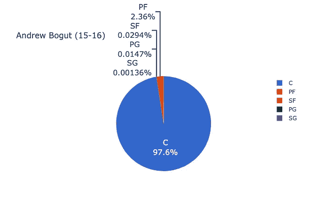

# NBA 中的球员、位置和概率

> 原文：<https://towardsdatascience.com/players-positions-and-probability-in-the-nba-c54360309616?source=collection_archive---------18----------------------->

## 使用监督机器学习构建 NBA 位置分类器


科比·布莱恩特在对阵萨克拉门托国王队的比赛中罚球。拉米罗·皮亚诺罗萨在 [Unsplash](https://unsplash.com/wallpapers/sports/nba?utm_source=unsplash&utm_medium=referral&utm_content=creditCopyText) 上的照片

让我们以一个重要的问题开始这篇博客:为什么你需要使用机器学习来根据位置对 NBA 球员进行分类？一个普通的篮球迷可能已经看了足够多的篮球比赛，以确定哪个球员打哪个位置。即使是一个对这项运动一无所知的人，也可以在 YouTube 上找到一些历史上最伟大球员的视频，以了解每个位置的作用。那么，机器学习算法可能为我们提供哪些额外的信息来证明它的用途呢？

嗯，当谈到分类的任务时，机器学习算法使用预测的概率来决定某样东西是否属于某个组。在 NBA 位置的情况下，机器学习算法将预测球员成为控球后卫、得分后卫、小前锋、大前锋或中锋的概率。该算法将为我们提供任何给定玩家的每个位置的概率。正是这些概率可能被证明对前台或 NBA 分析师之间的讨论是有用的。随着每一代 NBA 天才的出现，我们看到球员之间在技能组合方面有了更多的融合。中锋不再是严格意义上的靠近篮筐的低位球员，他们只是来到三分线前做掩护。现代中锋游离到三分线外投中三分球，有些人拥有有效快攻的必备技能。通过给一个球员分配位置概率，我们可以开始理解一个球员的多面性。如果我们知道一个队中每个球员的位置概率，那就可以用来分析你自己队或对手的阵容。

让我们也考虑这些位置概率的另一个用途。每年一个体育记者和广播员小组投票选出各种奖项，如最有价值球员、年度最佳防守球员和最佳 NBA 球队。根据 hoopsrumors.com 的一篇[文章](https://www.hoopsrumors.com/2018/12/hoops-rumors-glossary-designated-rookies-rose-rule.html)，如果球员符合以下标准，他们就有资格获得一份超高的合同(球队工资帽的 30%):

*   在前一个赛季或前三个赛季中的两个赛季组建一支全明星队
*   在前一个赛季或前三个赛季中的两个赛季被评为年度最佳防守球员
*   在前三个赛季中至少有一个赛季被评为最有价值球员

鉴于这些媒体成员的投票会影响球员未来的收入，我们在评估和比较球员时拥有公平的衡量标准是至关重要的。NBA 位置分类器算法的输入将是描述球员的表现和对比赛的影响的一些记录的统计数据组。该算法将接受这些输入，执行某种数学运算，并为我们提供位置概率。假设我们对输入做出了正确的假设，并对模型进行了适当的训练，我们可以生成如下内容:


勒布朗·詹姆斯在 2015-2016 赛季的位置概率。(图片由作者提供)

如果在两个潜在的 MVP 候选人之间做出决定，一个奖项的投票者可能会使用如上所示的工具，并决定选择位置多样性更大的球员。

# 数据收集

为了创建一个能产生上述概率的模型，我们首先要收集每个玩家的数据。从 basketball-reference.com 收集了[每 100 点拥有统计](https://www.basketball-reference.com/leagues/NBA_2018_per_poss.html)和[高级统计](https://www.basketball-reference.com/leagues/NBA_2018_advanced.html)。玩家跟踪数据是通过 Python 的`nba_stats_tracking`库从 stats.nba.com 收集的。这个库的文档可以在[这里](https://nba-stats-tracking.readthedocs.io/en/latest/#)找到。只使用了 2015-16 到 2018-19 赛季的球员数据。我选择不使用 2019-20 球员数据，因为新冠肺炎导致的突然暂停和常规赛比赛总数的不一致。NBA 网站上的球员跟踪数据只能追溯到 2013-2014 赛季。正如我们很快会看到的，NBA 在投篮选择方面经历了一点演变。在 NBA 的所有球队中，尝试和投中三分球的次数都有显著增加。通过使用明显属于 3 分时代的 4 个赛季的数据，我的目标是防止模型由于每年的统计差异而对球员做出不正确的假设。只使用了常规赛的数据。不同的来源被组合成一个单一的熊猫数据帧，使用球员的名字和赛季。每个球员都被视为单个观察值(即 2015–16 勒布朗詹姆斯不同于 2017–18 勒布朗詹姆斯)。我选择将每个玩家作为一个单独的观察对象，有三个原因:

1.  为了确保有足够的数据来训练和测试模型
2.  名册很少年年相同。一个新球员的引进，无论是选秀、交易还是自由球员，都可能导致教练不得不调整阵容，球员自己也可能为了球队的成功而改变他们的打法。
3.  就像其他人一样，NBA 球员每年都在变老。不管是因为年龄还是伤病，时间确实会影响球员的比赛。一个受了重伤的爆发力控球后卫在恢复后可能会更依赖跳投，更适合担任得分后卫，而让另一名球员负责进攻。

# 数据探索

为了建立我的最终模型，我最终为每个玩家使用了 51 个变量。很明显，生成和分析这些统计数据需要花费大量的时间，所以我在这篇博客中只列出了几个。我会在下面留下我的 Github repo 的链接，在那里你可以看到更多的分析和可视化。

我简单提到过，3 分投篮已经成为当今 NBA 越来越重要的技能。让我们按位置来看一下 4 个赛季的 3 分投篮:


3 分投篮命中率和尝试次数(图片由作者提供)

在过去的 4 个赛季中，每个位置每 100 次控球中的 3 分都在增加，我们也可以看到大前锋和中锋的比例随着时间的推移有所提高。虽然大前锋和中锋的三分球命中率不如外线位置，但这是一个证明球员天赋水平不断提高的指标


2 分投篮命中率和尝试次数(图片由作者提供)

我们看到，随着 3 分尝试次数的增加，2 分尝试次数必然会减少。就百分比而言，所有职位的总体趋势都是积极的。2 分率的逐年增加可能是因为在篮筐附近的 2 分投篮比中距离投篮更频繁。[这里](https://flowingdata.com/2019/01/15/goodbye-mid-range-shot/)是一篇很好的文章，看看 NBA 这些年来投篮选择是如何变化的。

让我们也来看看球员跟踪指标，如控球时间。


按职位划分的平均占有时间(按作者划分的图像)

这里需要注意的是，谁持球最多似乎有一个明确的等级顺序。我们可以看到位置之间的明确划分的统计数据只会有助于我们的分类模型更好地执行。类似于控球时间，当我们看每 100 次控球 3 分的尝试次数或每 100 次控球 2 分的百分比时，我们看到一些区别。

# 型号选择

在我们讨论我在这个项目中使用的最终模型之前，我将首先讨论一些我尝试过的其他模型，并讨论它们不适合的原因。

## 逻辑回归

为什么不适合:逻辑回归要求变量相互独立。

如前所述，我为每个玩家准备了 51 个输入变量来确定他们的位置。例如，我选择包括接球投篮的 3 分尝试，以及整体的 3 分尝试。随着接球投篮三分球尝试次数的增加，三分球尝试次数也会增加。我想说的是，当试图预测他们的位置时，接球投篮三分球的数量是一个重要的指标。与中锋相比，我们可能期望得分后卫有更大的比例去做接球投篮 3 分。

## k 个最近邻居

为什么它不是一个很好的适合:准确性分数充其量是平庸。

从 3 个邻居开始，模型精度仅为 64.5%。对更多的邻居重复这个过程只会导致精确度的增加。11 个邻居导致了 68.8%的模型准确度。虽然我们可以继续增加邻居的数量，希望精确度不断提高，但这可能会有风险。

为什么有风险？让我们用两个 NBA 球员来回顾一下 K 近邻算法是如何工作的

想象一下，我们试图仅仅根据场均助攻数和场均篮板数来对球员进行分类。如果我们要对每个球员绘图(x 轴是助攻，y 轴是篮板)，那么助攻和篮板数高的球员会聚集在一起，而助攻和篮板数低的球员会聚集在一起。勒布朗·詹姆斯职业生涯场均 7.4 次助攻(APG)和 7.4 个篮板(RPG)，拉塞尔·维斯特布鲁克场均 8.3 次助攻和 7.1 个篮板，贾森·基德场均 8.7 个 APG 和 6.3 个 RPG。拉塞尔·维斯特布鲁克和贾森·基德是控卫，而勒布朗·詹姆斯(至少在他职业生涯的大部分时间里)是小前锋。在这种情况下，最近邻算法会选择将勒布朗归类为控球后卫。显然，我们可以让勒布朗成为一个控球后卫(或者更好的是一个前锋)，但这是一个稍微不同的讨论。

## 随机森林

为什么不适合:过度适合的严重问题。

使用随机森林和 XGBoost，我能够分别获得 78.2%和 83.8%的训练准确率。遗憾的是，模型在测试集上的准确率分别只有 68.6%和 69.5%。显然，精确度的差异使得随机森林算法对于该问题不可行。当我们思考随机森林如何工作时，我们可以发展出一些直觉，为什么这个算法可能不适用于这个数据。本质上，随机森林只是一组决策树，每个决策树都在建立一个阈值，将我们的数据分成不同的组。如果随机森林中的一个决策树建立了一个阈值，所有平均得分至少为 5 PPG，5 APG 和 5 RPG 的球员都是小前锋，我们会很快发现这个决策树通常是错误的。毫无疑问，所有位置都有很多球员达到或超过了这些平均水平。如果我们有一个随机森林，上面描述的决策树应用于一个看不见的测试集，那些阈值可能不适用。

# 那么，什么模型起作用了呢？

该数据的最佳表现模型是支持向量机。我能够获得 74%的交叉验证训练准确率和 73%的测试准确率。这两个准确性分数非常接近，我们可以得出结论，我们有一个通用的模型，可以根据位置对 NBA 球员进行分类。作为参考，以下是使用`GridSearchCV`找到的该模型的最佳参数:

```
{'svc__C': 1,
 'svc_gamma': 'scale',
 'svc_kernel': 'linear',
 'svc_proability: True}
```

我们知道在 NBA 有很多球员有足够的天赋去打多个位置。这意味着我们可以忍受模型中的一些错误分类。为了更好地理解模型的表现，让我们来讨论一些数字并看看混淆矩阵(阅读这篇[文章](/multi-class-metrics-made-simple-part-i-precision-and-recall-9250280bddc2)来理解如何解释多类混淆矩阵)。


位置预测的混淆矩阵(图片由作者提供)

看上面的混淆矩阵，24%的大前锋被归为中锋，22%的小前锋被归为得分后卫，20%的得分后卫被归为小前锋。考虑到这些位置可能会根据玩家(和团队)的不同而互换，我们需要查看特定的玩家错误分类，以了解这些错误分类是否可以接受。

上面最糟糕的错误分类可能是一个中锋被预测为小前锋，两个得分后卫被预测为大前锋。我们也可以看看被错误归类为小前锋的 14 名大前锋。在今天的 NBA，如果这些大前锋中的一些人拥有必要的投篮能力和控球技术来打小前锋的位置，这并不奇怪。

# 快速闪回 2016 年 NBA 总决赛

*为了看到一个玩家的位置概率，我用一个叫做* `.position_breakdown()` *的方法创建了一个* `Player` *类，让我们可以很容易地看到模型是如何看到每个玩家的。方便的是，*[*【basketball-reference.com】*](https://www.basketball-reference.com/leagues/NBA_2018_play-by-play.html)*也有类似的功能，可以估算一个球员在某个位置上花费的时间百分比。这些估计可以为模型预测的位置概率提供基准。*

*我们将实例化一个玩家对象，并如下调用* `.position_breakdown()` *方法来生成之前看到的饼状图:*

```
LeBron = Player('LeBron', 'James', '15-16')LeBron.position_breakdown()
```

正如我在介绍中提到的，我们可以使用位置概率来评估不同的阵容，并希望了解这些阵容在与对手对抗时有什么优势或劣势。

首先，2015-2016 赛季克利夫兰骑士队:


2015-2016 赛季骑士首发阵容的位置概率(图片由作者提供)

2015–2016 金州勇士队:



2015-2016 赛季勇士首发阵容的位置概率(图片由作者提供)

除了安德鲁·博古特，我们有理由认为 2016 年 NBA 总决赛的首发球员能够胜任多个位置。当与比赛电影和球探报告搭配时，克里夫兰教练组可能会利用这些位置概率，通过可能迫使他转向一个更小更灵活的球员并利用这种不匹配来在进攻上利用安德鲁·博古特。教练组也可能选择让特里斯坦·汤普森换一名边锋，让凯文·乐福打中锋，勒布朗打大前锋。凯文·乐福三分球的能力可能会让博古特离开内线，让骑士队在勒布朗有更清晰的篮下路线的地方执行比赛。

通过进一步的模型调整，我们还可以查看这些位置概率以及加减统计数据，以便我们可以评估不同阵容的生产。

# 思考的食粮:年复一年的变化

这里有更多我认为感兴趣的玩家位置分析！篮球是一项团队运动，你在球场上的角色/位置会受到球场上其他人的影响。

以下是 2015-16 赛季俄克拉荷马雷霆队的凯文·杜兰特队与 2016-17 赛季金州勇士队的凯文·杜兰特队的比赛情况:


凯文·杜兰特位置概率的逐年比较(图片由作者提供)

这是拉塞尔·维斯特布鲁克在同一时期的位置概率:


拉塞尔·维斯特布鲁克位置概率的逐年比较(图片由作者提供)。回想一下，在 2016-17 赛季，拉塞尔·维斯特布鲁克自 1962 年奥斯卡·罗伯斯顿完成这一壮举以来，首次获得了场均三双。威斯布鲁克也是当年的 NBA MVP。

# **下一步措施和未来考虑事项**

现在我们有了一个可以预测位置概率的基线模型，我们当然希望改进它！改进该模型的一种可能方法是使用主成分分析来尝试并减少进行预测所需的特征数量。上述支持向量机使用了 51 个不同的变量，通过消除那些不重要的变量，我们可能能够提高模型的准确性。在向非技术利益相关者(如教练、球探或前台)解释模型性能和各种统计数据的重要性时，变量越少越有帮助。

一个未来的 NBA 位置分类器也可能在评估大学选秀前景或未签约的自由球员时有用。与他们的大学球队相比，某些大学球员可能更适合 NBA 球队的不同位置。不幸的是，其他国家的大学或篮球联盟并不容易获得球员跟踪数据。我认为为 WNBA 和女子大学篮球创造同样的模式也是有益的，但是在女子篮球中,[对球员跟踪系统的采用落后于](https://www.ladyscience.com/essays/strength-in-numbers-advanced-analytics-basketball)。

建立一个 NBA 位置分类器也提出了另一个重要的问题。有了一个 73%准确的模型，传统的 5 个位置是否仍然足以描述不同的比赛风格？我们看到，在 5 个位置中的 3 个位置上，至少有 25%的球员被错误分类。我认为，这些球员中的一些根本没有被错误分类，而是他们拥有足够多才多艺的技能，不适合五个传统位置中的一个。你可能听说过像组合后卫、3&D、伸展 4 或前锋这样的术语。虽然这些不是新词，而且有证据表明这些类型的球员可以追溯到 NBA 篮球的早期时代，但它们已经成为 NBA 词典中更频繁使用的术语。[幸运的是，已经有研究和分析试图更好地描述 NBA 名单上球员的不同角色](https://fansided.com/2020/03/02/nylon-calculus-optimizing-nba-lineup-fit/)(如果你对以上任何内容感兴趣，一定要阅读这篇文章)。

如果你做到了这一步，非常感谢你的阅读！这有点长，但我想写一篇对篮球迷和数据科学家都有深刻见解的博客。一如既往，欢迎任何反馈。你可以在我的 [Github](https://github.com/jeremy-lee93/building-an-nba-position-classifier) 中找到我的整个项目。

如果你想讨论更多关于数据科学或篮球分析的问题，请随时联系 [LinkedIn](https://www.linkedin.com/in/jeremyalee1/) 或 [Twitter](https://twitter.com/JALee93) ！