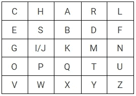
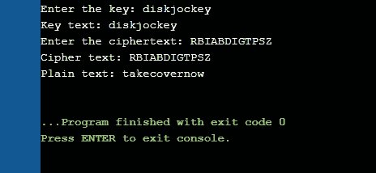
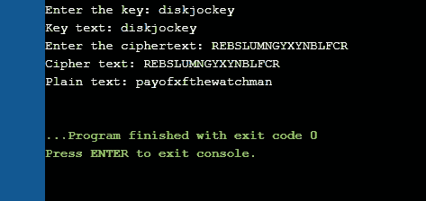
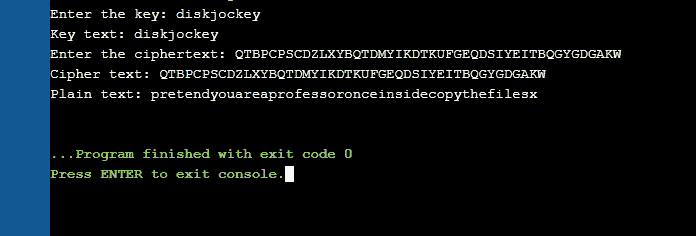

# 公平密码解密

> 原文：<https://towardsdatascience.com/playfair-cipher-decryption-c43b698b45bd?source=collection_archive---------11----------------------->

## 用于解密使用 Playfair 密码编码的字符串的 c 代码

如果你还没有读过这篇关于 Playfair 加密的文章，先去看看吧！它简要介绍了 Playfair 密码以及大部分代码背后的逻辑。

## 内容

1.  [公平竞赛密码](#f665)
2.  [解密规则](#5c06)
3.  [C 实现](#e358)
4.  [一些密文的输出](#d2ea)
5.  [延伸阅读](#70bc)


由 iMattSmart 在 [Unsplash](https://unsplash.com/photos/Vp3oWLsPOss) 上拍摄的照片

## 公平密码

假设关键字是' *Charles '，*解密过程如下。绘制一个 5x5 的矩阵，在每个单元格中填充字母，从关键字开始，后面是字母表中的字母。I/J 填充在同一个单元格中。所有重复的字母都被去掉了，给了我们这个矩阵-



作者图片-关键字'*查尔斯*'的公平矩阵

给定一个密文句子，它被分割成多个二元体。对于密文' *gddogdrqprsdhmembv '，*其二进制数为-

> *gd do gd rq pr sd hm em bv*

## **解密规则**

1.  矩阵同一行中的两个密文字母分别被左边的字母替换，该行的最后一个元素循环跟随第一个元素。

> sd 将由 eb 代替
> 
> gi 将被替换为 ng

2.落在矩阵的同一列中的两个密文字母被上面的字母替换，该列的底部元素循环地跟随顶部。

> 我的将被 dt 取代
> 
> yr 将由 ty 代替

3.否则，一对密文中的每一个字母都将被另一个密文字母所在的行和列所替换。

> 动力局会被我取代
> 
> do 将被 et 取代

遵循这些规则，明文变成了'*在桥上见我* ' (x 在最后被忽略，因为它是一个填充字母)。

## 实施情况

首先，我们导入所需的库，并定义一个足够大的大小来分配要解密的密文。

```
#include <stdio.h>
#include <stdlib.h>
#include <string.h> 
#define SIZE 100
```

现在，我们编写一个函数，使用 Playfair 密码对密文进行解密。字符串被转换为小写字母，并生成 5x5 键正方形。为此，首先使用一个 26 字符的 hashmap 来存储密钥字符串中每个字母的计数。使用这种方法，矩阵中的每个单元格首先用关键字字符串字母填充，并且通过减少 hashmap 中的计数只填充一次。然后填充剩余的字母表。

然后，在有向图中搜索密文中的每个字符，并找到其位置。根据字符对中字符的相对位置，遵循上述详细规则，执行解密，并返回解密后的字符对。一旦两个数字连在一起，就可以通过看字母而忽略填充字母如 x 等来造句。

加密和解密实现之间的主要区别在于极限情况；当字母在第一行或第一列时。在加密的情况下，最后一行或最后一列中的字母必须由第一行中的字母替换，这种代码由模数为 5 的运算处理。然而，对于解密，必须为这些极限情况编写单独的 if 子句。

```
// Function to decrypt using the Playfair Cipher
void PlayfairDeCrypt(char str[], char keystr[])
{
	char ps, ks, keyT[5][5];

	// Key
	ks = strlen(keystr);
	// ciphertext
	ps = strlen(str);

	// Convert all the characters of a string to lowercase
	// Can also use the library function toLower here, but a function was written for better understanding of ascii values.
	void toLowerCase(char plain[], int ps)
	{
		int i;
		for (i = 0; i < ps; i++) {
			if (plain[i] > 64 && plain[i] < 91)
				plain[i] += 32;
		}
	}

	// generates the 5x5 key square
	void generateKeyTable(char keystr[], int ks,
						char keyT[5][5])
	{
		int i, j, k, flag = 0, *dicty;

        // a 26 character hashmap to store count of the alphabet
		dicty = (int*)calloc(26, sizeof(int));

		for (i = 0; i < ks; i++) {
			if (keystr[i] != 'j')
				dicty[keystr[i] - 97] = 2;
		}
		dicty['j' - 97] = 1;

		i = 0;
		j = 0;
		for (k = 0; k < ks; k++) {
			if (dicty[keystr[k] - 97] == 2) {
				dicty[keystr[k] - 97] -= 1;
				keyT[i][j] = keystr[k];
				j++;
				if (j == 5) {
					i++;
					j = 0;
				}
			}
		}
		for (k = 0; k < 26; k++) {
			if (dicty[k] == 0) {
				keyT[i][j] = (char)(k + 97);
				j++;
				if (j == 5) {
					i++;
					j = 0;
				}
			}
		}
	}

	// Search for the characters of a digraph in the key square and return their position
	void search(char keyT[5][5], char a, char b, int arr[])
	{
		int i, j;

		if (a == 'j')
			a = 'i';
		else if (b == 'j')
			b = 'i';

		for (i = 0; i < 5; i++) {
			for (j = 0; j < 5; j++) {
				if (keyT[i][j] == a) {
					arr[0] = i;
					arr[1] = j;
				}
				else if (keyT[i][j] == b) {
					arr[2] = i;
					arr[3] = j;
				}
			}
		}
	}

	// Function to decrypt
	void decrypt(char str[], char keyT[5][5], int ps)
	{
		int i, a[4];
		for (i = 0; i < ps; i += 2) {
			search(keyT, str[i], str[i + 1], a);
			if (a[0] == a[2]) {
			    if(a[1]==0){
			        str[i] = keyT[a[0]][4];
			        str[i + 1] = keyT[a[0]][(a[3]-1)%5];
			    }
			    else if(a[3]==0){
			        str[i] = keyT[a[0]][(a[1] - 1)%5];
			        str[i + 1] = keyT[a[0]][4];
			    }
			    else{
			        str[i] = keyT[a[0]][(a[1] - 1)%5];
			        str[i + 1] = keyT[a[0]][(a[3]-1)%5];
			    }

			}
			else if (a[1] == a[3]) {
			    if(a[0]==0){
			        str[i] = keyT[4][a[1]];
			        str[i + 1] = keyT[(a[2]-1)%5[a[1]];
			    }
			    else if(a[2]==0){
			        str[i] = keyT[(a[0] - 1)%5][a[1]];
			        str[i + 1] = keyT[4][a[1]];
			    }
			    else{
			        str[i] = keyT[(a[0] - 1)%5][a[1]];
			        str[i + 1] = keyT[(a[2]-1)%5][a[1]];
			    }
			}
			else {
				str[i] = keyT[a[0]][a[3]];
				str[i + 1] = keyT[a[2]][a[1]];
			}
		}
	}
	ks = removeSpaces(keystr, ks);
	toLowerCase(str, ps);
	ps = removeSpaces(str, ps);
	generateKeyTable(keystr, ks, keyT);
	decrypt(str, keyT, ps);

	//plain text printed in lower case letters
	printf("Plain text: %s\n", str);
}
```

驱动程序代码只接受输入的密钥字符串和输入的密文，并调用 PlayfairDeCrypt 函数输出解密后的字符串。

```
// Driver code
int main()
{
	char str[SIZE], keystr[SIZE];

	//Key used - to be enered in lower case letters
	printf("Enter the key: ");
	scanf("%[^\n]s", &keystr);
	printf("Key text: %s\n", keystr);

	printf("Enter the ciphertext: ");
	scanf("\n");
	scanf("%[^\n]s", &str);
	printf("Cipher text: %s\n", str);

	//Calling the PlayfairDeCrypt function
	PlayfairDeCrypt(str, keystr);

	return 0;
}
```

## 一些密文的输出

使用密钥字符串' *diskjockey* '对上述代码进行编译、运行并对一些密文进行测试。

1.  RBIABDIGTPSZ
2.  REBSLUMNGYXYNBLFCR
3.  QTBPCPSCDZLXYBQTDMYIKDTKUFGEQDSIYEITBQGYGDGAKW



图片由作者-输出的一些密文使用 C 代码的公平游戏解密

本文中使用和解释的全部代码可以在[这里](https://github.com/ruthussanketh/cryptography/blob/main/playfair-cipher/codes/playfair_decrypt.c)找到。

## 进一步阅读

1.  [项目 Playfair 密码编译码的实现](http://homepages.math.uic.edu/~lenz/f15.m260/project1.html)
2.  艾琳·鲍德温[——一篇关于公平竞赛密码的论文](https://derekbruff.org/blogs/fywscrypto/files/2010/11/Baldwin-Essay-2.pdf)
3.  帕尔，拉马尼，艾扬格，苏尼塔。[公平游戏密码的一个变种](https://people.cis.fiu.edu/gubbisadashiva/wp-content/uploads/sites/9/2019/11/A-Variation-in-the-Working-of-Playfair-Cipher.pdf)