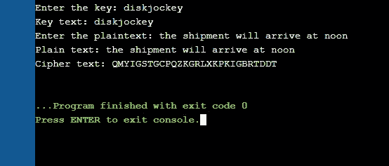
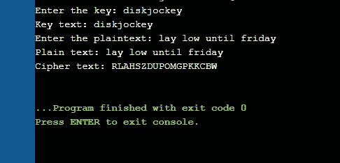
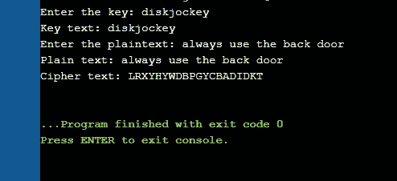

# 公平密码加密

> 原文：<https://towardsdatascience.com/playfair-cipher-encryption-fa8ed7df8ea5?source=collection_archive---------12----------------------->

## 使用 Playfair 密码加密字符串的 c 代码

## 内容

1.  [简介](#f665)
2.  [公平竞赛密码](#de39)
3.  [加密规则](#7722)
4.  [C 实现](#e358)
5.  [一些纯文本的输出](#d2ea)
6.  [延伸阅读](#70bc)


法比奥于 [Unsplash](https://unsplash.com/photos/oyXis2kALVg) 发表

## 介绍

密码学是秘密写作的科学或艺术。加密技术的基本目标是让两个人能够在不安全的信道上进行通信，使对方无法理解对方在说什么。目前使用的加密技术主要有两种

1.  **对称密钥加密**-加密和解密使用相同的密钥
2.  **非对称密钥加密**-一个密钥用于加密，另一个用于解密

还有许多其他类型的密码，如单表和多表、流和分组等。这篇文章着眼于 Playfair 密码及其使用 C 函数的应用。

## 公平密码

由查尔斯·惠斯通发明的公平密码(Playfair cipher)是一种多字母替代密码，这意味着一个字母可以在其加密中由不同的字母表示，这取决于给双方使用的关键字。例如，让我们假设关键字是'*查尔斯'*。绘制一个 5x5 的矩阵，在每个单元格中填充字母，从关键字开始，后面是字母表中的字母。I/J 填充在同一个单元格中。所有重复的字母都被去掉了，给了我们这个矩阵-


作者图片-关键字'*查尔斯*'的公平矩阵

给定一个明文句子，它被分割成两个字母组，去掉所有空格，并在字母数为奇数的情况下用字母 x 填充。重复的纯文本字母用填充字母(如 x)分隔。给定句子“*在桥上见我*”,两个数字将是-

> 在 eb ri dg ex 见我

## **加密规则**

1.  矩阵同一行中的两个明文字母分别被右边的字母替换，该行的第一个元素循环跟随最后一个元素。

> eb 将由 sd 代替
> 
> ng 将由 gi/gj 代替

2.落在矩阵的同一列中的两个明文字母被下面的字母替换，该列的顶部元素循环跟随底部元素。

> dt 将被我的
> 
> ty 将由 yr 代替

3.否则，一对中的每个明文字母都将被位于其自己的行中的字母和被另一个明文字母占据的列所替换。

> 我会被 gd 取代
> 
> et 将被 do 取代

遵循这些规则，密文变成 *'gd do gd rq pr sd hm em bv'* 。

这种密码比简单的替换更安全，但是通过对字母对进行统计频率计数，仍然容易受到纯密文攻击，因为每对字母总是以相同的方式加密。此外，短关键字使得 Playfair 密码更容易破解。

## 实施情况

首先，我们导入所需的库，并为要加密的字符串分配定义一个足够大的大小。

```
#include <stdio.h>
#include <stdlib.h>
#include <string.h> 
#define SIZE 100
```

现在我们编写一个函数来使用 Playfair 密码加密明文。字符串被转换为大写，所有空格都被删除。明文被填充为偶数长度，字母对变得不相同。生成 5x5 的关键正方形。为此，首先使用一个 26 字符的 hashmap 来存储密钥字符串中每个字母的计数。使用这种方法，矩阵中的每个单元格首先用关键字字符串字母填充，并且通过减少 hashmap 中的计数只填充一次。然后填充剩余的字母表。

然后在有向图中搜索明文中的每个字符，并找到它的位置。根据字符对中字符的相对位置，遵循上述详细规则，执行加密，并返回加密的字符对。

```
// Function to encrypt using the Playfair Cipher
void PlayfairCrypt(char str[], char keystr[])
{
    char keyT[5][5], ks, ps;

    // Key
    ks = strlen(keystr);
    // Plaintext
    ps = strlen(str);

    // Function to convert the string to uppercase
    // Can also use the library function toUpper here, but a function was written for better understanding of ascii values.
    void toUpperCase(char encrypt[], int ps)
    {
        int i;
        for (i = 0; i < ps; i++) {
            if (encrypt[i] > 96 && encrypt[i] < 123)
                encrypt[i] -= 32;
        }
    }

    // Function to remove all spaces in a string
    int removeSpaces(char* plain, int ps)
    {
        int i, count = 0;
        for (i = 0; i < ps; i++)
            if (plain[i] != ' ')
                plain[count++] = plain[i];
        plain[count] = '\0';
        return count;
    }

    // Function to generate the 5x5 key square
    void generateKeyTable(char keystr[], int ks, char keyT[5][5])
    {
        int i, j, k, flag = 0, *dicty;

        // a 26 character hashmap to store count of the alphabet
        dicty = (int*)calloc(26, sizeof(int));
        for (i = 0; i < ks; i++) {
            if (keystr[i] != 'j')
                dicty[keystr[i] - 97] = 2;
        }

        dicty['j' - 97] = 1;

        i = 0;
        j = 0;

        for (k = 0; k < ks; k++) {
            if (dicty[keystr[k] - 97] == 2) {
                dicty[keystr[k] - 97] -= 1;
                keyT[i][j] = keystr[k];
                j++;
                if (j == 5) {
                    i++;
                    j = 0;
                }
            }
        }

        for (k = 0; k < 26; k++) {
            if (dicty[k] == 0) {
                keyT[i][j] = (char)(k + 97);
                j++;
                if (j == 5) {
                    i++;
                    j = 0;
                }
            }
        }
    }

    // Function to search for the characters of a digraph in the key square and return their position
    void search(char keyT[5][5], char a, char b, int arr[])
    {
        int i, j;

        if (a == 'j')
            a = 'i';
        else if (b == 'j')
            b = 'i';

        for (i = 0; i < 5; i++) {

            for (j = 0; j < 5; j++) {

                if (keyT[i][j] == a) {
                    arr[0] = i;
                    arr[1] = j;
                }
                else if (keyT[i][j] == b) {
                    arr[2] = i;
                    arr[3] = j;
                }
            }
        }
    }

    // Function to make the plain text length even, and make pairs unidentical.
    int prepare(char str[], int ptrs)
    {
        int i, j, subs_s = ptrs;
        for (i = 0; i < subs_s; i += 2) {
            if(str[i]==str[i+1]){
                for(j=subs_s; j>i+1; j--){
                   str[j]=str[j-1];
                }
                str[i+1]='x';
                subs_s+=1;
            }
        }
        str[subs_s]='\0';

        if (subs_s % 2 != 0) {
            str[subs_s++] = 'z';
            str[subs_s] = '\0';
        }
        return subs_s;
    }

    // Function for performing the encryption
    void encrypt(char str[], char keyT[5][5], int ps)
    {
        int i, a[4];

        for(i=0; i<ps; i+=2){

            search(keyT, str[i], str[i + 1], a);

            if (a[0] == a[2]) {
                str[i] = keyT[a[0]][(a[1] + 1)%5];
                str[i + 1] = keyT[a[0]][(a[3] + 1)%5];
            }
            else if (a[1] == a[3]) {
                str[i] = keyT[(a[0] + 1)%5][a[1]];
                str[i + 1] = keyT[(a[2] + 1)%5][a[1]];
            }
            else {
                str[i] = keyT[a[0]][a[3]];
                str[i + 1] = keyT[a[2]][a[1]];
            }
        }
    }

    ks = removeSpaces(keystr, ks);
    ps = removeSpaces(str, ps);
    ps = prepare(str, ps);
    generateKeyTable(keystr, ks, keyT);
    encrypt(str, keyT, ps);
    toUpperCase(str, ps);
    //cipher text - printed in upper case letters
    printf("Cipher text: %s\n", str);
}
```

驱动程序代码只接受输入密钥字符串和输入明文，并调用输出加密字符串的 PlayfairCrypt 函数。

```
// Driver code
int main()
{
    char str[SIZE], keystr[SIZE];

    //Key used - to be entered in lower case letters
    printf("Enter the key: ");
    scanf("%[^\n]s", &keystr);
    printf("Key text: %s\n", keystr);

    // Plaintext to be encrypted - entered in lower case letters
    printf("Enter the plaintext: ");
    scanf("\n");
    scanf("%[^\n]s", &str);
    printf("Plain text: %s\n", str);

    //Calling the PlayfairCrypt function
    PlayfairCrypt(str, keystr);

    return 0;
}
```

## 一些纯文本的输出

使用关键字字符串' *diskjockey* '对上述代码进行编译、运行和测试。

1.  这批货将于中午到达
2.  周五之前保持低调
3.  永远走后门
4.  电话被窃听了



作者的图片——使用 Playfair 加密的 C 代码输出一些纯文本

本文中使用和解释的全部代码可以在[这里](https://github.com/ruthussanketh/cryptography/blob/main/playfair-cipher/codes/playfair_encrypt.c)找到。

## 进一步阅读

1.  [项目-实现 Playfair 密码的编码和解码](http://homepages.math.uic.edu/~lenz/f15.m260/project1.html)
2.  艾琳·鲍德温[——一篇关于公平游戏密码的论文](https://derekbruff.org/blogs/fywscrypto/files/2010/11/Baldwin-Essay-2.pdf)
3.  帕尔，拉马尼，艾扬格，苏尼塔。[公平游戏密码工作方式的变化](https://people.cis.fiu.edu/gubbisadashiva/wp-content/uploads/sites/9/2019/11/A-Variation-in-the-Working-of-Playfair-Cipher.pdf)
4.  [Playfair 密码解密](https://ruthussanketh.medium.com/playfair-cipher-decryption-c43b698b45bd)