# 和一个广义的人工智能下棋

> 原文：<https://towardsdatascience.com/playing-chess-with-a-generalized-ai-b83d64ac71fe?source=collection_archive---------12----------------------->

## 将 MuZero 和感知者 IO 结合起来创建一个通用的 AI

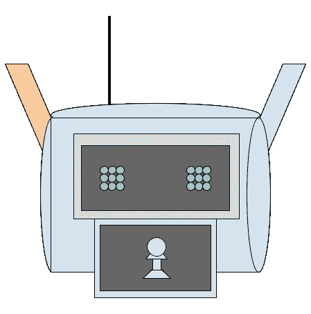

作者图片

大家好，今天我们将改进我们在我的[构建国际象棋引擎第二部分](https://medium.com/@bellerb/building-a-chess-engine-part2-db4784e843d5)中创建的国际象棋人工智能，将其转换为一个更通用的系统。这节课又是技术性的，所以请耐心听我说。我试图提供方程式和图表来帮助使事情变得简单一点。

对于这个新的人工智能，我们将通过使用其强大的搜索方法建立在[穆泽罗](https://arxiv.org/abs/1911.08265)的基础上。MuZero 是由 [DeepMind](https://deepmind.com/) 在一份白皮书中提出的，作为对 [AlphaZero](https://arxiv.org/abs/1712.01815) 的改进。在这份白皮书中，MuZero 在多个游戏中实现了超人的性能，而没有精确的模拟器使其成为一种独特的算法。

MuZero 的前身 AlphaZero 实现了超人的性能，使得两种算法之间的性能不相上下。然而，AlphaZero 在其规划算法中使用了外部模拟器，这使得它不如 MuZero 通用。对这些外部模拟器的依赖限制了 AlphaZero 使用预先制作的模拟器来完善知识游戏。然而，MuZero 已经取消了这些外部模拟器，允许它执行多种任务。移除外部模拟器可能会让你认为 MuZero 使用了某种形式的无模型强化学习(RL)。然而，这是不真实的，MuZero 使用一个学习模型来表示其手头任务的动态。

我们的人工智能将在某些方面与论文不同，因为我们将不会使用相同的模型架构，而是将使用基于[感知者 IO](https://arxiv.org/abs/2107.14795) 的架构。感知者 IO 是一个通用模型，可以处理各种数据类型。这种普遍性对我们很有吸引力，因为它与穆泽罗的一般性质很好地匹配。

# 搜索

MuZero 是直接从 AlphaZero 建立起来的，所以你会发现他们有很多相似的意识形态。这些类似的思想包括用深度学习模型指导[蒙特卡罗树搜索](https://en.wikipedia.org/wiki/Monte_Carlo_tree_search) (MCTS)算法的想法。然而，如上所述，MuZero 并不使用外部模拟器来预测其 MCTS，而是使用学习动力学模型。这个动力学模型是独特的，因为它不试图预测所选动作的精确表示，而只是试图预测隐藏状态表示。这种表示简化了学习过程，允许动态模型学习用于精确规划的规则。在这个新的搜索算法中，我们将改变旧的置信上限(UCB)公式。

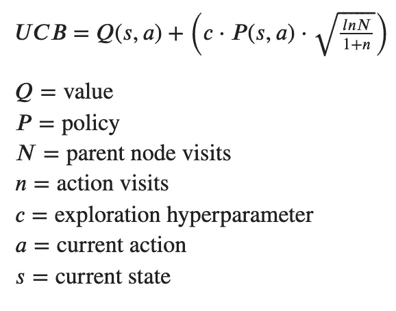

旧 UCB 方程式|作者图片

我们将用本文中找到的多项式上置信树(pUCT)方程代替我们的旧 UCB 方程。

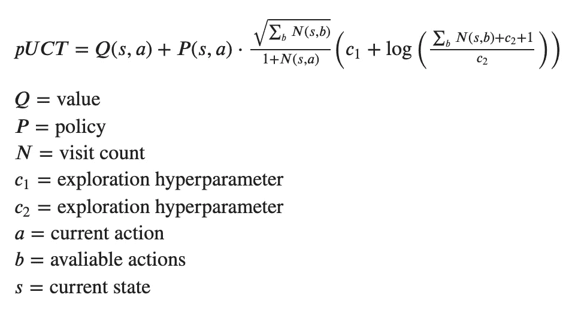

pUCT 方程式|作者图片

当比较这两个等式时，你会发现它们非常相似，都试图平衡 MCTS 问题中所面临的勘探和开采困境。新方程在我们的旧 UCB 方程中增加了一个额外的超参数(c2)。有了这个新的等式，c2 与父节点访问成比例地衰减。以这种方式缩小 c2 鼓励搜索算法对于频繁访问的父节点变得更少利用。我们的新 pUCT 公式的另一个不同之处是我们对 Q 值进行了归一化。将我们的 Q 值归一化会迫使它变成一个百分比。将我们的 Q 值作为百分比是有益的，因为它允许等式的探索部分具有更大的影响。

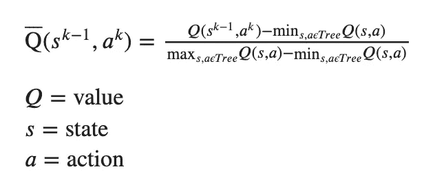

标准化 Q 方程|作者图片

我们采用的另一个技巧是在训练期间在根节点将[狄利克雷](https://en.wikipedia.org/wiki/Dirichlet_distribution)噪声添加到我们的策略值中。添加这种噪音增强了探索，允许人工智能在训练时思考更多的想法。这种噪声将导致性能差的节点被访问。然而，在进一步的搜索中，性能差的节点将被 pUCT 方程修剪掉。pUCT 等式修剪了性能差的节点，因为我们仅将噪声应用于等式的探索侧，这使得高价值移动的利用能够继续。

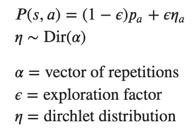

狄利克雷噪声方程|图片由作者提供

有了新的人工智能，我们也调整了节点反向传播过程中的更新值公式。父节点的值在 gamma 折扣的帮助下得到更新。

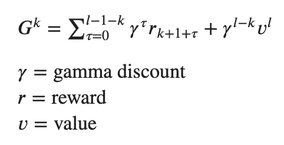

伽玛折扣公式|作者图片

更新节点时，gamma 折扣和预测值之和将被归一化。像这样更新节点值通过创建自然衰减实现了更好的近似，这将导致 AI 更喜欢接近当前节点的更高值。

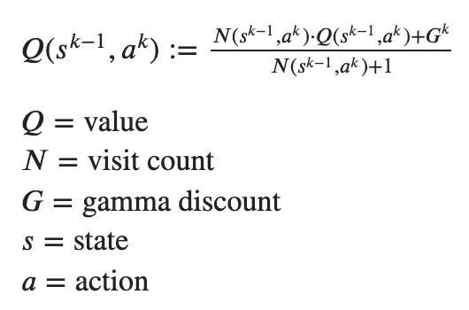

更新价值方程式|作者图片

经过这些改变，我们的新 MCTS 算法看起来像这样。

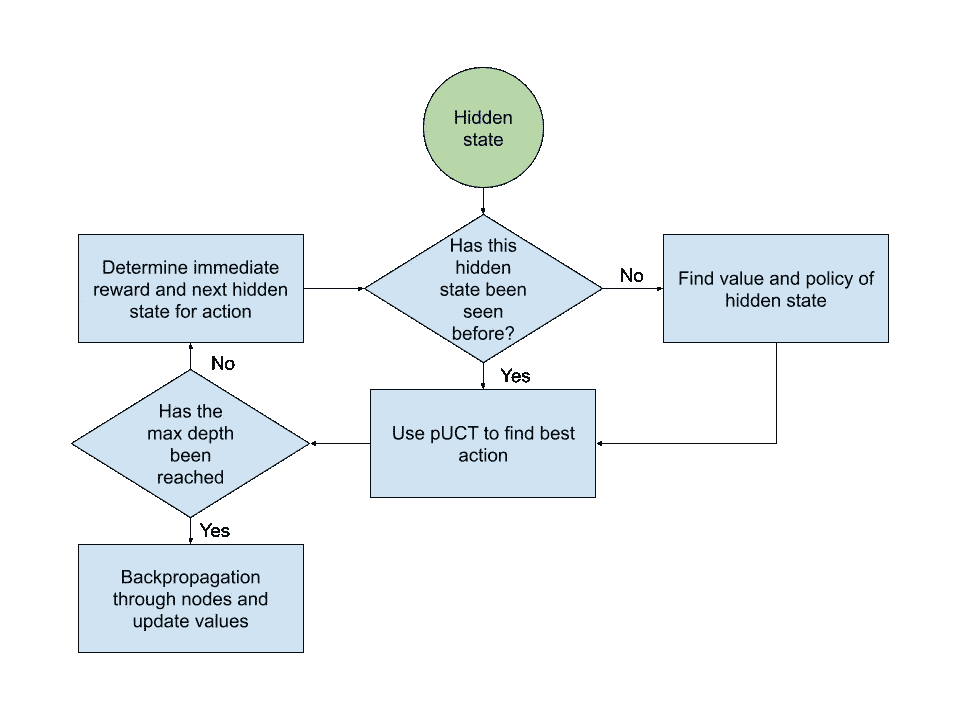

穆泽罗·MCTS |作者图片

在我们的游戏树上运行 MCTS 后，最好的行动是访问最多的节点。为了以概率分布的形式获得最佳动作，我们根据每个动作的访问次数对其进行归一化。据信，与单独使用我们的预测神经网络(NN)相比，像这样使用 MCTS 允许开发增强的策略。在训练过程中，我们根据当前游戏移动计数安排一个衰减到我们的温度变量，以增加每个游戏早期的探索。当我们的温度变量达到零时，我们选择最常访问的动作，允许 AI 利用它的 MCTS 知识。当评估 AI 时，我们将温度变量设置为 1，因此它没有影响。

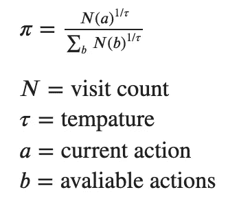

最佳动作方程式|作者图片

# 模型架构

正如引言所述，我们不会使用 MuZero 论文中的模型。相反，我们将使用一种感知者 IO 架构，这是 DeepMind 发布的一种新模型，是他们的 [Perciver](https://arxiv.org/abs/2103.03206) 模型的前身。

感知者模型是一种基于注意力的方法，试图解决普通[变形金刚](https://arxiv.org/abs/1706.03762)的一些缺点。香草变形金刚最近在很多领域都非常成功。然而，由于变压器中存在的二次缩放问题，大输入空间的实现并不成功。像变形金刚这样的感知者非常依赖注意力机制。因此，你可能会认为这个二次缩放问题仍然存在。然而，感知者使用多头交叉注意力和多头自我注意力的组合。这种组合通过将高维数据投影到较低的维度来克服这个问题。

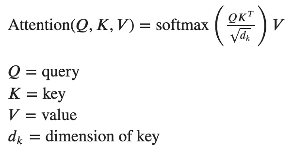

注意力等式|作者图片

自我关注使用相同大小的 Q 值、V 值和 K 值，迫使所有计算保持相同的大小。

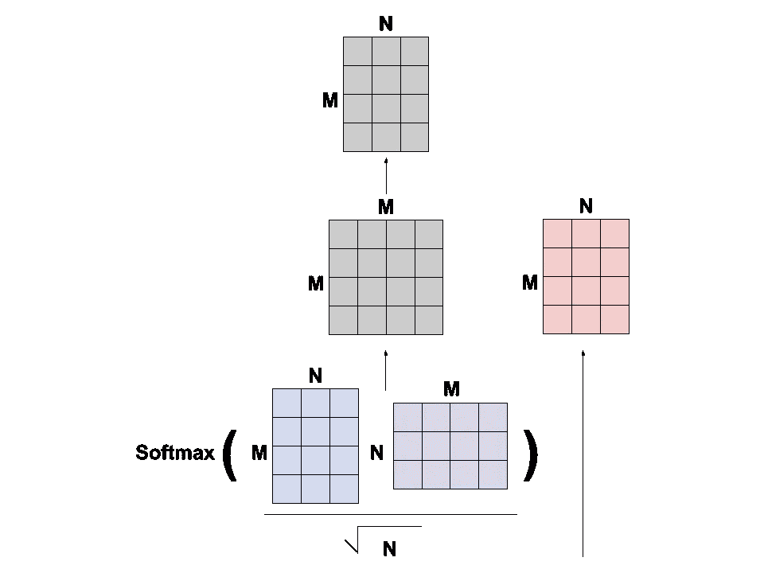

自我关注|作者图片

相反，交叉注意力使用不同大小的 Q 值，这有效地将计算缩放到与 Q 值相同的大小。

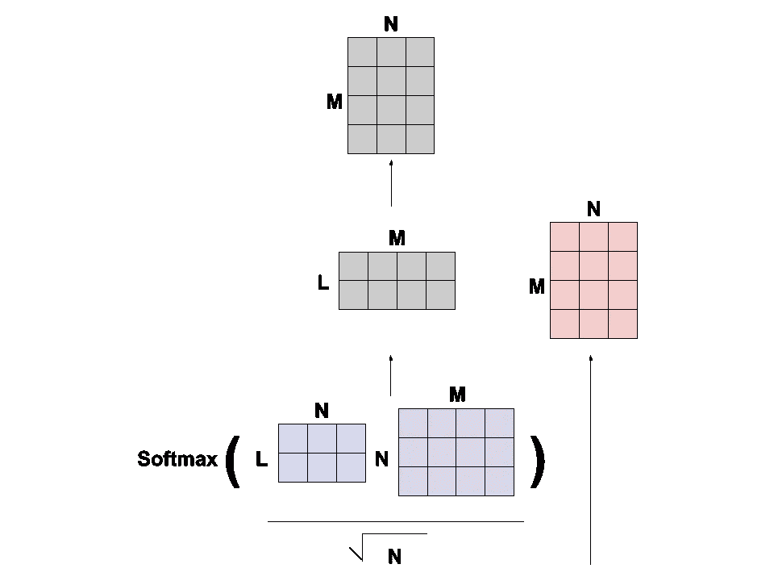

交叉关注|作者图片

既然我们理解了交叉注意和自我注意的区别，我将解释感知者如何将两者结合起来。

感知建筑|图片来自 https://arxiv.org/abs/2103.03206

感知者接收单个输入数组，在上面表示为字节数组。而被指定为潜在阵列的第二个变量是一组学习的权重。潜在数组作为 Q 值传递给交叉注意块，交叉注意块成功地缩小了输入(假设潜在数组小于输入)。像这样缩小输入阵列是感知者减轻二次缩放问题的方式。潜在变换器块然后对交叉关注块的结果执行自关注。潜在变换器块可以使用自我关注，而不会负面影响处理时间，因为输入大小的减小使得二次缩放影响较小。潜在转换器的输出被递归地传递给另一个潜在转换器，次数不限。在潜在变换之后，可以选择对结果潜在层和输入数据进行交叉关注。据信，这一步骤允许模型关注输入数据的其他部分，而这些部分可能是之前的交叉注意所遗漏的。这种信念来自于这样一个事实，即你的潜在阵列现在是不同的，因为它刚刚被先前通过这个模型块所转换。该交叉注意块的输出然后将进入另一个潜在变换器的递归。这种将潜在变形者的结果传递给另一个交叉注意模块的过程可以发生很多次。交叉关注块和潜在变换块之间的所有权重都可以选择在它们之间共享。这意味着我们可以将数据传递到同一个交叉注意模块/潜在转换模块，或者使用具有自己的一组权重的独立网络。

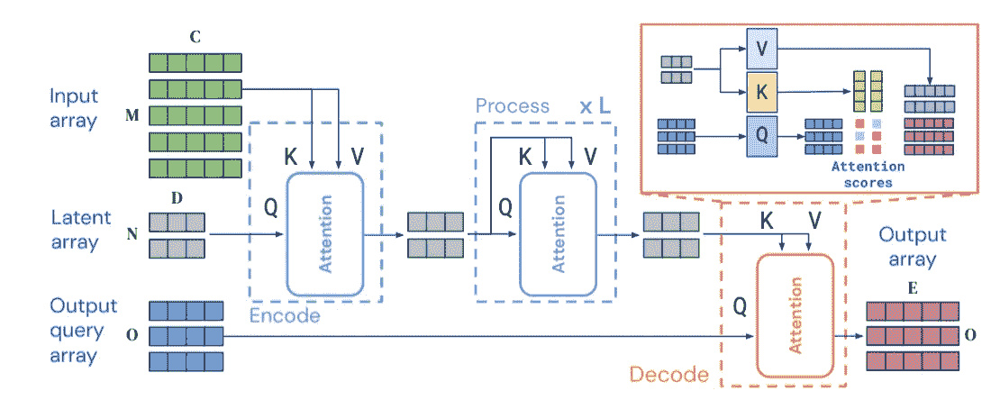

感知者 IO 建筑|图片来自[https://arxiv.org/abs/2107.14795](https://arxiv.org/abs/2107.14795)

既然我们理解了感知者的架构，那么感知者 IO 的架构就不会那么难了。Perciveir IO 为感知者添加了两个交叉注意力模块，以将输入和输出数据缩放到其所需的形状和大小。这个技巧是有益的，因为它允许在各种情况下使用这个模型，因为我们的数据的形状和大小不再具有影响力。

# 我们的模型

既然我们理解了在感知者 IO 架构中实现的基本思想，我可以解释它是如何适应这个人工智能的。

我们的人工智能通过拥有多个模型来使用与 MuZero 相同的基本思想。然而，我们并不坚持本文中提出的三模型格式，而是使用两个模型。

第一个模型是交叉注意模型，用于表示游戏的当前隐藏状态，与 MuZero 中的表示模型具有相同的目的。这个模型可以被认为是我们的感知者 IO 架构的输入模型，因为它将输入投射到我们的第二个模型可以处理的标准维度。这个模型接收了与我们在[构建国际象棋引擎第二部分](https://medium.com/@bellerb/building-a-chess-engine-part2-db4784e843d5)中的 AI 相同的编码游戏状态。

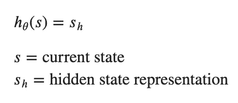

隐藏状态方程|作者图片

第二个模型稍微复杂一些，因为它是一个多任务模型。这个多任务模型处理 MuZero 中的预测功能和动态功能将执行的所有任务(价值、政策、奖励、下一状态)。由于任务之间的关系，我们在这里使用多任务模型而不是单个模型。这种关系使得多任务模型变得有益，因为它导致了每个任务之间共享特性的概念。这个模型由两部分组成，一个主干和独立的专用头。

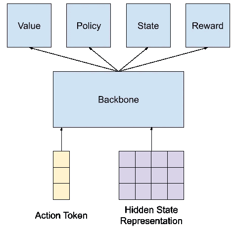

多任务架构|作者图片

骨干通过感知者网络学习广义的游戏知识，并充当该网络的自动编码器层。这一层获得一个隐藏状态表示和一个动作令牌作为输入。

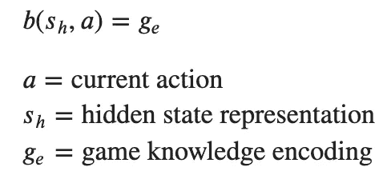

主干方程|作者图片

价值头是一个用来预测游戏结果的交叉注意力模型。这一层是我们感知 IO 架构的输出之一。这一层将主干作为输入，并将其投射到一个表示结果的值(-1:1)。

价值函数方程|作者图片

策略头是一个交叉注意力模型，用于预测采取每个动作的概率分布。这一层是我们感知者 IO 架构的另一个输出。这一层使用主干作为输入，并将其投影到一个向量，该向量表示采取每个动作的概率分布。

政策函数方程|作者图片

状态头是一个交叉注意模型，用于预测执行所需动作的隐藏状态表示。这一层是我们感知 IO 架构的另一个输出。这一层使用主干作为输入，并将其投射到执行所需动作的隐藏状态表示中。

下一个状态函数方程|作者图片

奖励头是一个交叉注意力模型，用于预测执行所需动作的即时奖励。这一层是我们感知 IO 架构的输出之一。这一层将主干作为输入，并将其投射到一个代表即时奖励的值(对于像国际象棋这样的棋盘游戏为零)。

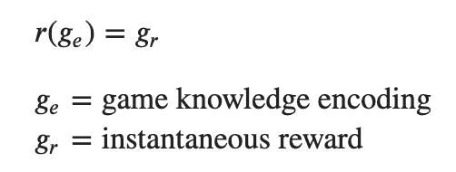

奖励函数方程|作者图片

# 培养

类似于 MuZero 和我们之前的 AI，我们的模型完全通过自我游戏来学习。通过我们的训练，我们通过拥有一个活跃的模型和一个新的模型来增加一个进化的方面。新模型通过自我发挥来训练自己，而主动模型是我们目前表现最好的模型。为了将潜在的收益递减最小化，这两个模型以循环赛的方式进行比赛。在这里，循环赛的获胜者将成为新的活动模型。

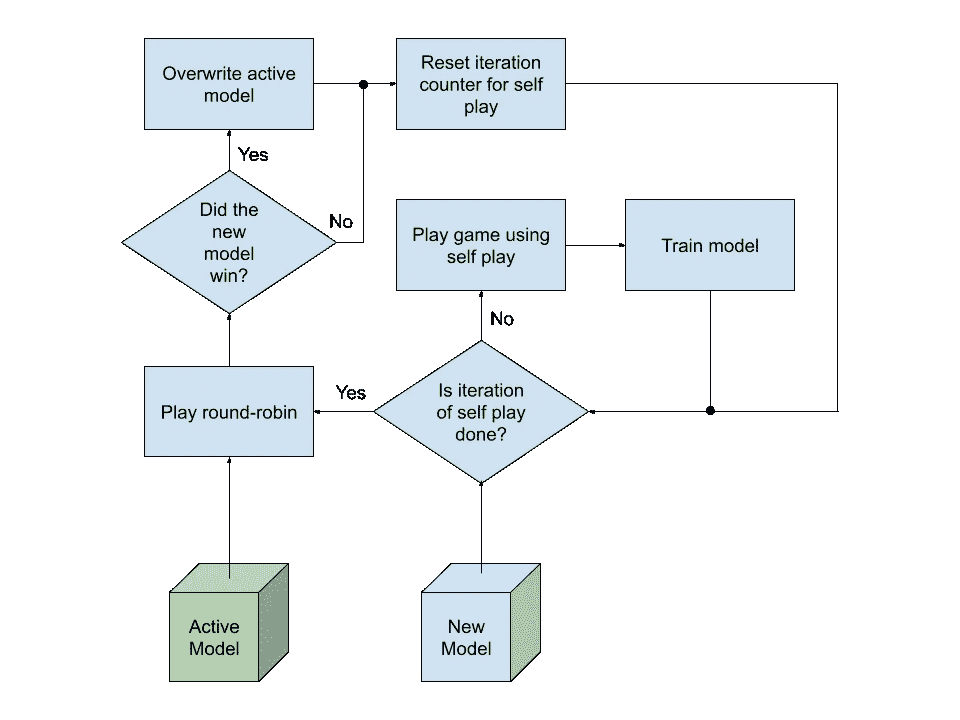

培训流程|作者图片

在训练时，我们将这两个模型分成五个独立的部分(价值、策略、下一状态、奖励、主干、隐藏状态)。我们以这种方式将两个模型分开，以单独微调第二个模型的每个头部。单独微调每个头部允许模型更有效地学习每个任务，因为不会受到其他头部梯度的干扰。在训练时，我们使用 Adam 优化器来微调所有五个部分。

为了训练我们的第二个模型的价值头，我们使用在每个自我游戏结束时发现的最终结果作为我们的目标价值。当训练该头部时，均方差(MSE)被用于我们的损失函数。我们在这里使用均方误差损失函数，因为我们这一层的输出是一个回归。

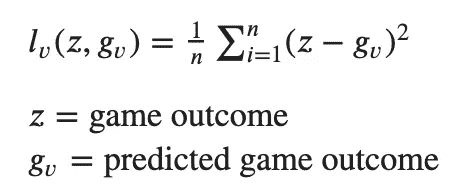

价值水头损失函数|作者图片

为了训练我们的第二个模型的策略头，我们使用在自我游戏期间发现的记录的 MCTS 策略作为我们的目标值。在训练这个头部时，二进制交叉熵(BCE)被用于我们的损失函数。我们在这里使用二元交叉熵损失函数，因为这个头部具有多变量分类输出。

保单水头损失函数|作者图片

为了训练我们第二个模型的下一个国家元首，我们从论文[有效零](https://arxiv.org/abs/2111.00210)中吸取了一些想法。高效零使用自我监督学习来提高训练 MuZero 的动力学模型的速度。

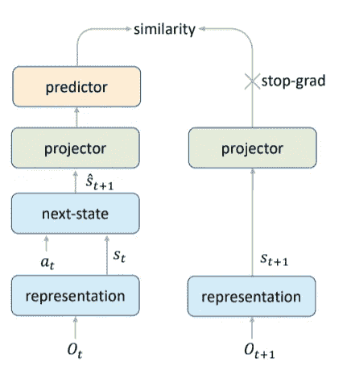

自我监督学习|图片来自 https://arxiv.org/abs/2111.00210

这里我们实现了同样的想法，将已知的下一个状态传递给隐藏状态模型。然后，我们将结果用作损失函数的均方误差计算中的目标值。我们在这里使用均方误差损失函数，因为这一层的输出是多变量回归。

下一个国家元首损失函数|作者图片

为了训练我们的第二个模型的奖励头，我们使用在自我游戏中发现的记录奖励作为我们的目标值。当训练该头部时，均方差(MSE)被用于我们的损失函数。我们在这里使用均方误差损失函数，因为我们这一层的输出是一个回归。

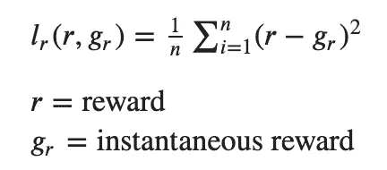

奖励人头损失功能|图片作者

为了训练我们的第二个模型的主干，我们使用单个头损失的总和作为总损失。在这里，我们将所有头部的损失相加，以了解所有任务的游戏表示。

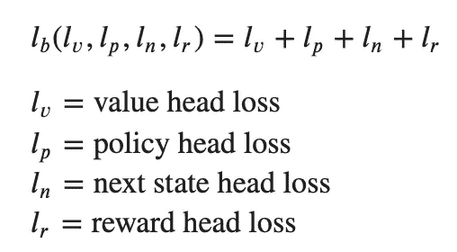

主干损失函数|图片由作者提供

为了训练我们的隐藏状态模型，我们将第二个模型的损失相加，将下一个状态的损失排除在总损失之外。我们已经排除了下一状态损失，因为隐藏状态模型的输出用于下一状态损失计算。

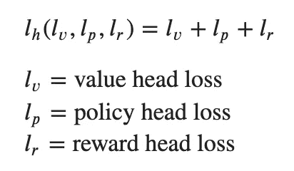

隐藏状态损失函数|作者图片

## 谢谢

现在你知道了，我们已经成功地将我们的国际象棋人工智能升级到一个更通用的系统。这个 AI 将在没有任何知识的情况下开始学习国际象棋的游戏，包括规则。它玩的训练游戏越多，表现就越好。你可以在我的 GitHub 上查看完整版本的代码。你也可以在这里看到我之前的 AI [。](https://medium.com/@bellerb/building-a-chess-engine-part2-db4784e843d5)

感谢阅读。如果你喜欢这样，可以考虑订阅我的账户，以便在我最近发帖时得到通知。

# 参考

*   【https://arxiv.org/abs/1911.08265 
*   [https://deepmind.com/](https://deepmind.com/)
*   [https://arxiv.org/abs/1712.01815](https://arxiv.org/abs/1712.01815)
*   [https://arxiv.org/abs/2107.14795](https://arxiv.org/abs/2107.14795)
*   [https://arxiv.org/abs/2103.03206](https://arxiv.org/abs/2103.03206)
*   [https://en.wikipedia.org/wiki/Dirichlet_distribution](https://en.wikipedia.org/wiki/Dirichlet_distribution)
*   [https://arxiv.org/abs/1706.03762](https://arxiv.org/abs/1706.03762)
*   [https://arxiv.org/abs/2111.00210](https://arxiv.org/abs/2111.00210)

<https://medium.com/mlearning-ai/mlearning-ai-submission-suggestions-b51e2b130bfb> 