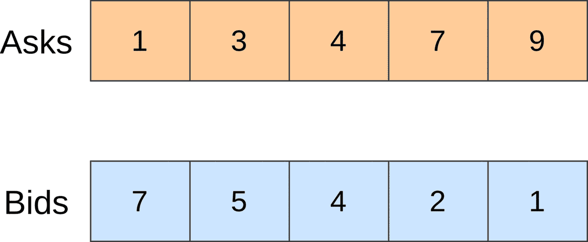
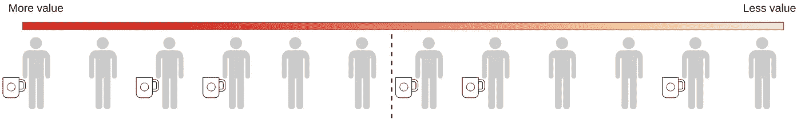
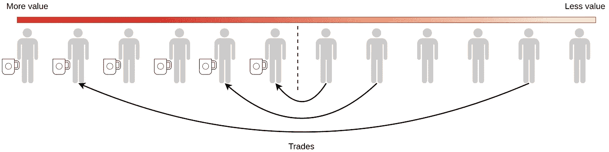
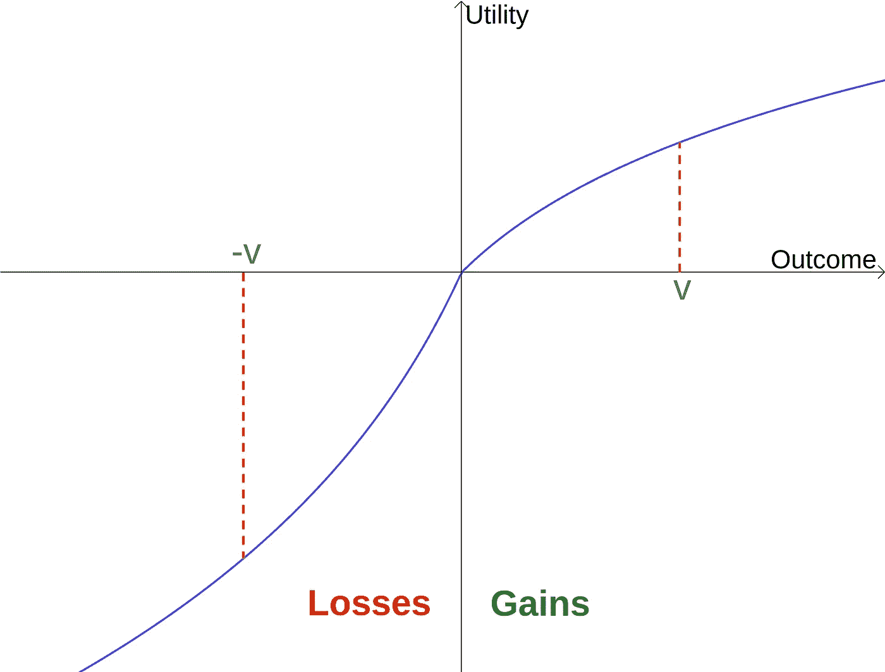
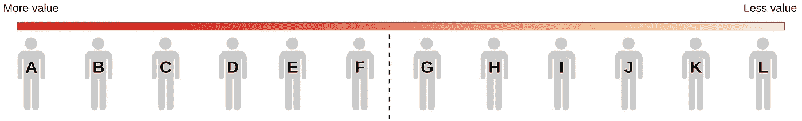
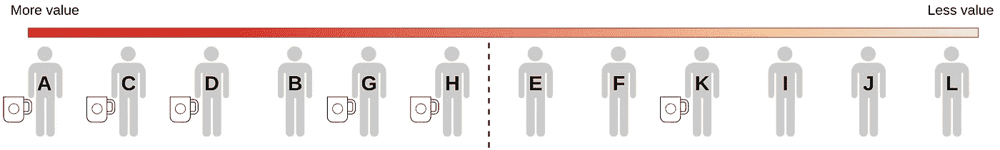
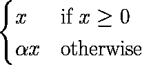

# 在 Python 中玩禀赋效应

> 原文：<https://towardsdatascience.com/playing-with-the-endowment-effect-in-python-2d288be4ee7b?source=collection_archive---------20----------------------->

## 如何在 35 行代码中融合经济学和心理学


艾米·巴夏礼在 [Unsplash](https://unsplash.com/s/photos/mugs?utm_source=unsplash&utm_medium=referral&utm_content=creditCopyText) 上拍摄的照片。

行为经济理论的支柱之一是**禀赋效应**。在本文中，我们将简要介绍它是如何工作的，为什么会工作，然后我们将编写一些代码行，以便用 Python 对其建模。

# 方案

想象一下一个房间里有 44 个人。随机选择其中的 22 个，给他们一个咖啡杯。之后，假设你创造了一个市场，任何人都可以交易咖啡杯。拥有咖啡杯的人会申报他们出售咖啡杯所需的最低金额(*询问*)。反之亦然，每个非所有者陈述他们愿意为咖啡杯支付的最高价格(*出价*)。一旦收集了所有的底价，我们就通过对比买卖双方来决定交易的数量。如果最高出价大于或等于最低要价，我们至少有一笔交易。如果第二高的出价大于或等于第二低的要价，我们至少有两笔交易，以此类推，直到出价低于要价(或者我们用完了底价)。所有的销售都以相同的价格进行，由接受的最高要价决定。



市场运作的例子。做了三笔交易，销售价格是 4。图片作者。

我们预计这个市场会有多少交易？根据传统的经济理论，我们可以用**科斯定理**【1】来回答。本质上，它认为在一个没有交易成本的市场中，资源将流向最大化其价值的用途。为了将这个定理应用到我们的场景中，让我们假设根据人们对咖啡杯的感知价值对他们进行分类，并将咖啡杯随机分配给一半人。



一个假设的感知价值量表。图片作者。

为了达到平衡，所有在天平下半部的咖啡杯必须流向最重视它们的人。因为我们随机分配了咖啡杯，所以我们希望一半的杯子放在下半部分。因此，我们可以预计交换的数量是现有咖啡杯的一半。



交易需要达到平衡。图片作者。

上面解释的设置正是 Kahneman 等人进行的实验[2]。1990 年。令人惊讶的是，他们发现真实世界场景中的平均交易次数为 2.25 次，远低于科斯定理预测的 11 次交易。这是为什么呢？

# 禀赋效应

上述现象可以用禀赋效应来解释。

> 禀赋效应(endowment effect)表明，人们更有可能保留他们拥有的物品，而不是在他们不拥有时获得同样的物品。

心理学对这种行为有明确的解释。**前景理论**【3】描述了个体如何不对称地评估他们的损失和收益的观点。这一理论与一种被称为**损失厌恶的认知偏见密切相关，即人类倾向于避免损失，而不是获得同等的收益。**

看待前景理论的一个有趣方式是通过上面显示的*价值函数*。它将一个人感知的效用与收益和损失联系起来。当一个人放弃某样东西时，他/她得到的痛苦远远大于他/她得到同样东西时得到的快乐。



前景理论价值函数。图片作者。

下图是实验情况。在收到咖啡杯之前，哈利对这件物品的评价低于其他人的上半部分。因此，他是转移的候选人，以防他收到杯子。但在收到杯子后，对该物体的感知有用性增加了，以至于他现在处于价值尺度的上半部分。因此，哈利不会卖掉他的杯子。同样的现象也发生在所有收到咖啡杯的人身上。

正因如此，价值尺度永远是不平衡的。上半部分将包含更多带杯子的人。它解释了为什么需要更少的交易来达到均衡。



送咖啡杯前的价值尺度。图片作者。



送完咖啡杯后的价值尺度。只需要一次交易(K → B)就可以达到均衡。图片作者。

# 用 Python 建模禀赋效应

最后，让我们写一些代码。首先我们声明一个名为 *Sim* 的类。在构造函数中，我们创建了一个名为 *prior_values* 的长度为 *m* 的列表来表示每个人对杯子的先验感知值。我们用随机值初始化它。之后，我们用 1 和 0 随机初始化一个名为 *mugs* 的列表，其中 1 表示这个人有一个咖啡杯，否则为 0。

*run()* 方法计算每个人对杯子的感知效用。它利用先验值和前景理论的价值函数。最后，我们计算遵循上述规则模拟市场的交易数量。

为了简单起见，我们用下面的分段线性函数来近似前景理论的价值函数。



这是代码。

接下来我们可能要做的是找到一个能够解释 Kahneman 等人[2]实验结果的价值函数。我们的价值函数只包含一个自由参数，所以挑战在于找到 *α* 的最佳值。这里 [Optuna](https://optuna.org/) 前来救援。

首先，我们定义一个要优化的*目标()*函数。我们使用均方误差(MSE)，这是一个众所周知的损失函数。由于模拟是随机的，我们用蒙特卡罗方法进行。给定 Optuna *、*建议的值 *α* ，我们运行模拟 *N* 次，并计算所有执行的二次误差(随机种子仅出于再现性目的而固定)。

该过程被重复 1000 次。在所有试验结束时，我们打印出找到的 *α* 的最佳值。注意，默认情况下，Optuna 使用树形结构的 Parzen Estimator 算法建议参数，但是其他算法也是可用的[。](https://optuna.readthedocs.io/en/stable/tutorial/10_key_features/003_efficient_optimization_algorithms.html)

```
>>> {'alpha': 8.378816205287283}
```

该模型的一个有趣的性质是，当(且仅当) *k = m/2* 时，价值函数的形状与先验值的分布无关。如果你想深化这一点，我建议你看一下 [GitHub](https://github.com/imcatta/endowment_effect_simulator) 上的完整例子。

*这篇文章的灵感来源于诺贝尔奖获得者理查德·h·泰勒(Richard h . Thaler)**写的惊人之作《* [行为不端:行为经济学](https://wwnorton.com/books/Misbehaving/) *》一书。*

[1] R. H .科斯，[社会成本问题](https://www.journals.uchicago.edu/doi/10.1086/466560) (1960)，《法律与经济学杂志》

[2] D .卡尼曼、J. L .克内奇和 R. H .泰勒，[禀赋效应的实验检验和科斯定理](https://www.jstor.org/stable/2937761) (1990)，《政治经济学杂志》

[3] D. Kahneman 和 A. Tversky，[前景理论:风险下的决策分析](https://www.jstor.org/stable/1914185) (1979)，计量经济学