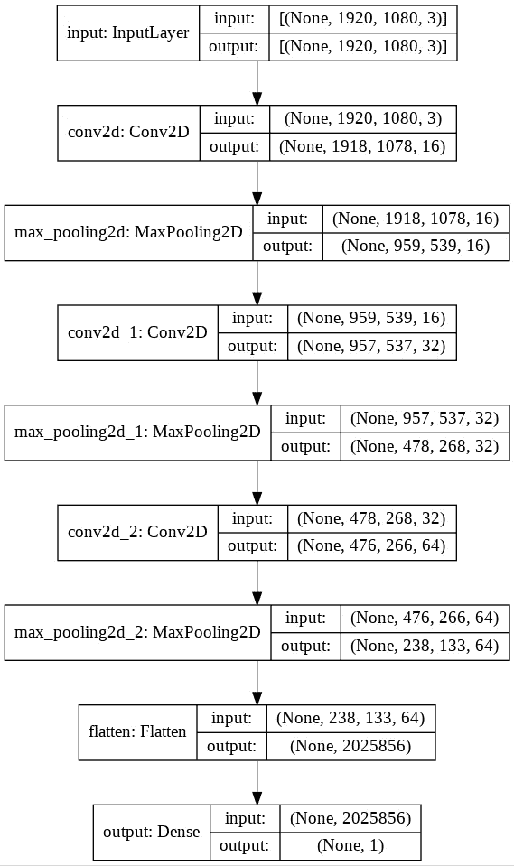

# 使用 Keras Functional API 绘制张量流模型

> 原文：<https://towardsdatascience.com/plot-a-tensorflow-model-with-keras-functional-api-f2db639dbbd8?source=collection_archive---------19----------------------->

## 在 TensorFlow 中可视化神经网络结构的快速指南

# 为什么要看这篇文章？

本文将向您展示如何使用 **Google Colab** 通过 Tensorflow 的 **eager execution** 和 **Keras Functional API** 实现一个卷积神经网络模型。然后我们将**以图形形式绘制**我们的模型:这种可视化允许我们有效地观察我们模型的**结构**，这是一个基本方面，尤其是在处理复杂模型时。

詹姆斯·哈里森在 [Unsplash](https://unsplash.com?utm_source=medium&utm_medium=referral) 上拍摄的照片

我们将得到如下图所示的图表:

模型结构—按作者分类的图像

## Keras 功能 API

Keras Functional API 允许您比传统的顺序配置更灵活有效地创建模型，后者通常用于生成简单的代理模型。functional API 允许您创建具有非线性拓扑结构、共享层、多输入和多输出的模型……本质上，我们正在创建一个**层图**。有了这个 API，我们可以创建[有向无环图](https://en.wikipedia.org/wiki/Directed_acyclic_graph)，但是如果再加上**自定义层**和**模型**，以及**自定义损失函数**和**优化器**，它就可以创建功能强大且完全可定制的神经网络模型。

## 代码

我们创建一个顺序卷积网络模型，仅用作示例。我们使用 Keras Functional API 中的一些有用工具:

*   [输入](https://keras.io/api/layers/core_layers/input/):用于实例化一个 Keras 张量。这种类似张量的物体只需要知道网络的输入和输出就可以建立一个 Keras 模型。我们指定输入形状(即全高清 RGB 图像:三维张量)和层的名称
*   [Conv2D](https://www.tensorflow.org/api_docs/python/tf/keras/layers/Conv2D) : 2D 卷积层(如图像上的空间卷积)。我们指定过滤器的数量和大小以及激活函数。
*   [MaxPooling2D](https://www.tensorflow.org/api_docs/python/tf/keras/layers/MaxPool2D):2D 空间数据的最大池操作。我们只需要指定池的大小
*   [展平](https://www.tensorflow.org/api_docs/python/tf/keras/layers/Flatten):展平输入
*   [密集](https://www.tensorflow.org/api_docs/python/tf/keras/layers/Dense):规则密集连接 NN 层

*model.summary()* 显示了模型属性的有用摘要。然而，图形可视化可能成为理解和保存模型图结构的另一个强有力的工具。

模型结构—按作者分类的图像

有趣的是注意到模型中**数据流**的显示，以及每一层的**名称**和与各种卷积和池层的应用相关的**大小变化**。让我们用均匀分布生成的一些数据来测试这个模型，均匀分布的形状与我们的模型输入一致，批量大小等于 1。我们还会使用指定的名称将图像自动保存为*“my _ model . png”*。

*tf.random.uniform* 对象返回**随机值**，具有均匀分布，具有指定的形状和类型。有趣的是，由于问题中的数据是**浮点数**，取值范围自动设置为*【0，1】*。如果需要，可以将最小和最大采样范围作为参数传递给该调用。

# 结论

本文就到这里，希望对你有用。你可以在这里找到[源代码](https://github.com/GitMarco27/TMML/blob/5727dc3f4f87885d1e05863427cbe4ae6b6ea1fe/Notebooks/004_Visualize_Model.ipynb)，在 GitHub 和 [YouTube](https://www.youtube.com/channel/UCExkeDZ9WC0tg9aoFMsNF0w) 上可以找到完整的[资源库](https://github.com/GitMarco27/TMML)。
下次见，
马可

## 3 分钟机器学习

3 分钟机器学习是一系列与人工智能、深度学习和数据科学相关的教程、视频和文章。你可以在 YouTube 上找到完整的视频集。GitHub [库](https://github.com/GitMarco27/TMML)包含了文章和视频中显示的所有 Google Colab 笔记本。希望这些内容对你有用，或者只是你感兴趣。欢迎任何反馈。

查看其他剧集:

*   [用神经风格转移和张量流生成图像](/images-generation-with-neural-style-transfer-and-tensorflow-a823b0353b06)
*   [猫 VS 狗卷积分类器](/cats-vs-dogs-convolutional-classifier-44ec04c8eb7a)