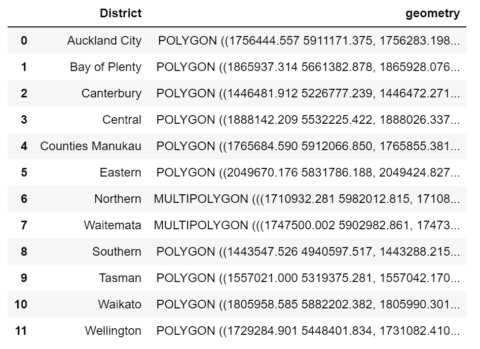
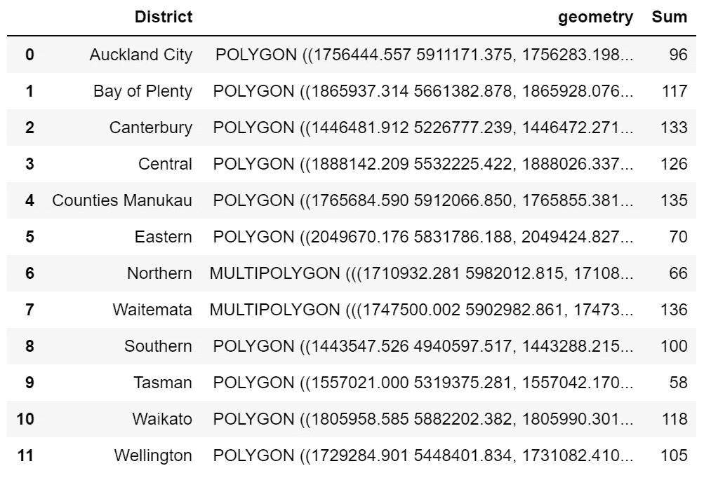
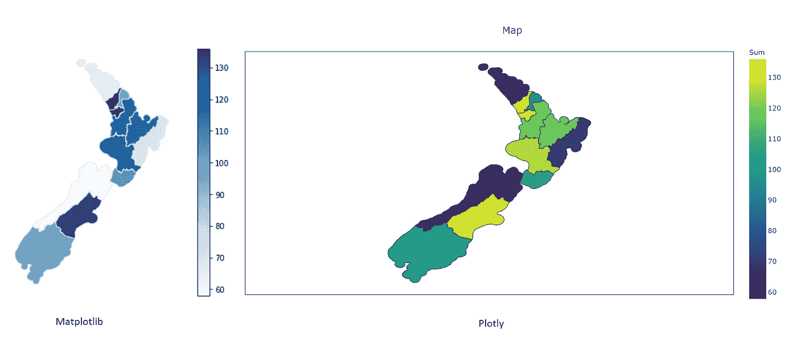

# 使用 Geopandas 绘制带有 shapefiles 的 choropleth 地图

> 原文：<https://towardsdatascience.com/plot-choropleth-maps-with-shapefiles-using-geopandas-a6bf6ade0a49?source=collection_archive---------11----------------------->

Choropleth 图是有用且强大的可视化工具，它通过根据值进行着色或图案化的区域或地区来呈现数据。这有点像热图，但在地理形状上有所不同。

我经常使用它，因为它对用户来说很清楚区域在哪里，也方便他们快速比较区域之间的数据。如果您正在创建一个交互式仪表板，choropleth maps 将帮助读者按区域进行切片和切块，并使仪表板更加生动，而不仅限于图表或表格。


杰克·斯台普顿在 [Unsplash](https://unsplash.com?utm_source=medium&utm_medium=referral) 上拍摄的照片

我以前在 Power BI 中使用 choropleth 地图的经验是，大量的形状都是默认的，没有自定义自己地图的灵活性。例如，在处理犯罪数据时，我希望按警区而不是城市或地区来显示数据，这是 Power BI shape map 无法实现的。使用 Python 中的 Geopandas 的好处是，只需几行代码就可以轻松实现。

# 先决条件:

*   Python 包:

```
import pandas as pd
import matplotlib.pyplot as plt #**if using matplotlib**
import plotly.express as px #**if using plotly** import geopandas as gpd
```

*   形状文件:

新西兰警区的文件是从 [Koordinates](https://koordinates.com/) 下载的。

# 为可视化准备数据

```
**#set up the file path and read the shapefile data**fp = "nz-police-district-boundaries.shx"
map_df = gpd.read_file(fp)
map_df.to_crs(pyproj.CRS.from_epsg(4326), inplace=True)**#read the csv data** df = pd.read_csv('District.csv')
```

您可能想要检查并查看 shapefile 的外观:

```
**#see what the map looks like** map_df.plot(figsize=(20, 10))
```


图 1:地图和表格

您可能注意到,' District.csv '和' map_df '之间有些不匹配，例如 csv 文件中的' ***县 Manukau*** '和地图文件中的' ***县/Manukau'*** 。因此，我们需要在创建地图之前整理这些内容:

```
**#rename one of the columns**
map_df = map_df.rename({'DISTRICT_N': 'District'}, axis = 'columns')**#drop a column**
map_df = map_df.drop(columns = 'DISTRICT_I')**#replace the values in the dataframe**
map_df = map_df.replace(['Counties/Manukau','Northland'],['Counties Manukau','Northen'])
```



图 2:表格 _ 修订版

创建 choropleth 图之前的最后一步是合并两个数据集。这个过程类似于 SQL:

```
df_merged = map_df.merge(df, **#map_df merge to df**
 left_on=[‘District’], 
 right_on=[‘District’])
```

然后我们得到一个新的数据帧:



图 3:合并的表格

# 用 Matplotlib 可视化:

```
fig, ax = plt.subplots(1, figsize=(10,6))
df_merged.plot(column='Sum', cmap='Blues', linewidth=1, ax=ax, edgecolor='0.9', legend = True)
ax.axis('off')
```

# 用阴谋想象:

```
fig = px.choropleth(merged, geojson=merged.geometry, 
                    locations=merged.index, color="Sum",
                    height=500,
                   color_continuous_scale="Viridis")
fig.update_geos(fitbounds="locations", visible=True)fig.update_layout(
    title_text='Map'
)fig.update(layout = dict(title=dict(x=0.5)))
fig.update_layout(
    margin={"r":0,"t":30,"l":10,"b":10},
    coloraxis_colorbar={
        'title':'Sum'})fig.show()
```



图 Matplotlib & Plotly 的 Choropleth 图

# 总而言之:

如今，Choropleth 地图在仪表板中使用得非常频繁。要创建地图，第一件事是获取您想要在个性化地图中应用的 shapefile 或 geo json 文件，然后相应地合并您的数据。

玩一玩吧🤪！有任何问题，请随时在这里或通过我的 LinkedIn 给我留言。