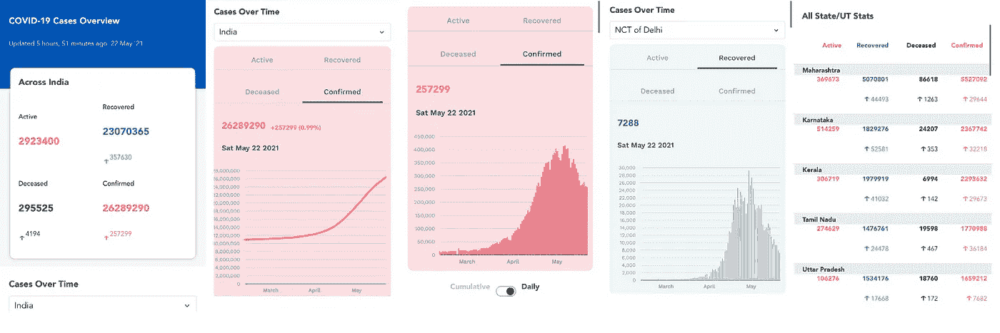
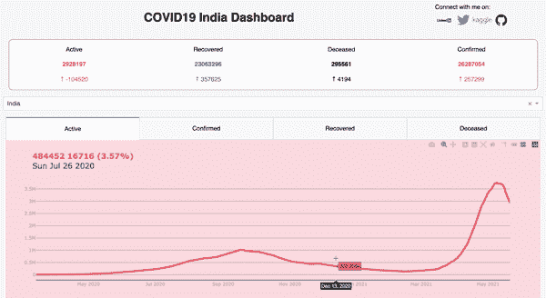
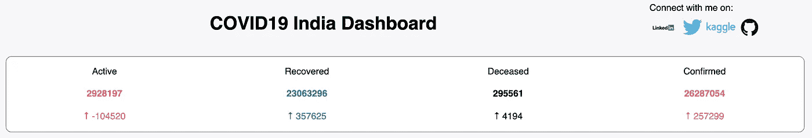
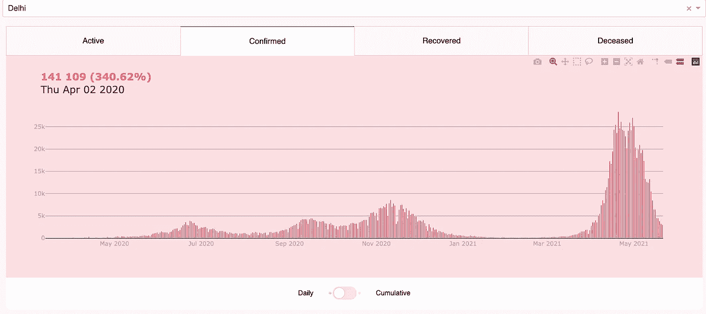
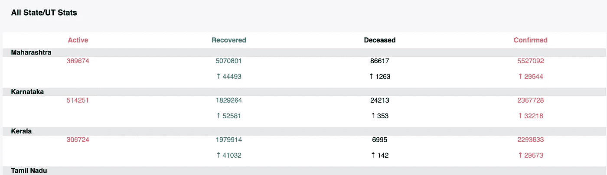
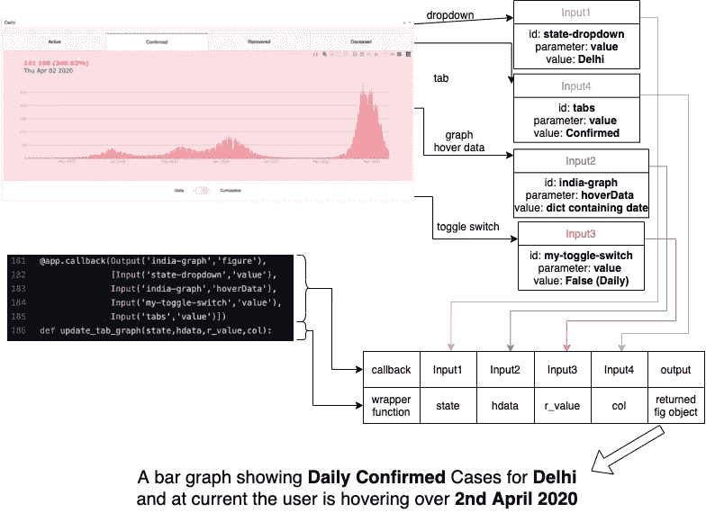

# Plotly Dash:从开发到部署

> 原文：<https://towardsdatascience.com/plotly-dash-from-development-to-deployment-c9500d16581a?source=collection_archive---------6----------------------->

## 一本关于 Plotly Dash 的简单易懂的实践教程。在这个过程中学习一点 **HTML** 、 **CSS** 、 **Python Decorators** ，以及 **Docker** 。


照片由[卢克·切瑟](https://unsplash.com/@lukechesser?utm_source=medium&utm_medium=referral)在 [Unsplash](https://unsplash.com?utm_source=medium&utm_medium=referral) 上拍摄

**Plotly Dash** 是一个惊人的框架，可以完全使用 Python 来构建交互式仪表盘。由于仪表板类似于一个网站，肯定也涉及到一点 HTML & CSS，但请放心，它是如此的基础，甚至我在创建我的第一个仪表板时就学会了。

在本教程中，我们将构建一个 COVID19 仪表板，显示印度 COVID19 病例、康复和死亡的增长/下降情况。使用这个[链接](https://covid-dashboard-india.herokuapp.com/)可以访问仪表板，使用这个 [GitHub 库](https://github.com/anshuls235/covid19-dashboard)可以访问底层代码。



截图来自 Aarogya Setu(COVID 更新部分)

下面是一张 GIF 图片，展示了我用 Plotly Dash 制作的仪表盘。我从 Aarogya Setu 应用程序中获得了灵感，因为我不认为我有设计头脑。此外，我觉得这款应用在阐述数据见解方面做得很好。



使用 Plotly Dash 构建的 COVID19 仪表板

开发和设置每个人都可以看到的仪表板的整个过程的步骤大致如下

1.  找出数据源💽
2.  创建静态仪表板📊
3.  让它互动💹
4.  集装箱化一切📦
5.  部署🖥️项目

现在，我将详细阐述每一点。

> 我建议总是为你所有的 Python 项目创建一个单独的环境。这使它变得很容易，因为你不会面临任何依赖问题，而且它对部署也很有帮助。Anaconda 是我的首选工具。

# 1.找出数据源

这是一项任务，可以像使用从 Kaggle 或任何其他数据平台下载的 CSV 文件一样简单，也可以像从网站上抓取大型数据集一样困难。

我在仪表板上使用的数据集来自[这个 API](https://github.com/covid19india/api) 。有多种 API，您可以根据需要使用它们。唯一需要记住的是，尽管所有的历史数据都存在，但是当天的数据每天都在刷新。因此，这是你在设计数据源时需要注意的一件事:新数据应该每天添加。

既然数据源已经弄清楚了，就需要一种存储数据的方法。它可以是任何东西，如 CSV，SQL 表，e.t.c。由于数据不多，为了保持简单，我使用 CSV 文件作为[我的数据库](https://github.com/anshuls235/covid19-dashboard/tree/master/data)，添加和更新记录的逻辑可以在这里[找到](https://github.com/anshuls235/covid19-dashboard/blob/master/dataset.py)。

# 2.创建静态仪表板

对于构建静态网页，你肯定需要了解 HTML 和 CSS，但对于 Plotly Dash 来说，情况并非如此。Dash 是一个 web 应用程序框架，它在 HTML、CSS 和 javascript 之上添加了纯 Python 抽象。说到这里，可以通过 [W3 schools](https://www.w3schools.com/) 学习 HTML 和 CSS 的基础知识。超级基础！(至少对于创建像我这样的仪表板来说是这样的😛)

> **注意**:对于要显示的 CSS 更改，请确保将您的 CSS 文件保存在文件夹路径`./assets/typography.css`(此处)。”表示主项目文件夹)。命名必须是这样的。此外，您可以使用 HTML 标记、id 或类来直接引用 app.py 文件中的组件。

Dash 为我们提供了许多现成的功能，但我不会一一介绍。以下是我用过的

*   [Dash HTML 组件](https://dash.plotly.com/dash-html-components):您不用编写 HTML 或使用 HTML 模板引擎，而是使用 Python 结构和`dash-html-components`库来构建您的布局。它提供了所有的 HTML 标签。
*   [Dash 核心组件](https://dash.plotly.com/dash-core-components) : Dash 配备了用于交互式用户界面的增压组件。由 Dash 团队编写和维护的一组核心组件可以在`dash-core-components`库中获得。
*   [Dash DAQ](https://dash.plotly.com/dash-daq) : Dash DAQ 包括一套强大的控制装置，使数据采集和控制更容易集成到您的 Dash 应用程序中。

基本的应用程序布局可以很容易地在教程中找到。下面，我将尝试解释我的仪表板的每一个组成部分，以及我是如何想出它的。

整个布局代码

**2.1 顶部截面**



仪表板的顶部

本部分包含标题以及我的一些广告(LOL ),随后显示了迄今为止的总指标以及它们与前一天相比的跳跃。这个部分肯定会每天发生变化，但是我们仍然可以创建它的静态版本。在上面的`layout.py`文件中，`lines 13–39`组成了这个部分。

> **注意**:为了让图像显示在你的仪表板上，它们应该存储在路径`./assets/`中。请注意“资产”文件夹的拼写。子文件夹可以命名为任何名称。

如果你仔细看，HTML 标签`<h1>COVID19 India Dashboard</h1>`变成了`html.h1(‘COVID19 India Dashboard’)`。可以使用参数发送 HTML 标签属性，以破折号 HTML 组件。

另一个例子``相当于`html.Img(src=’/assets/images/kaggle.png’,className=’img’)`

函数(如下)显示了用于从 pandas dataframe 创建表格(使用 dash HTML 组件)的函数。

用于生成顶部表格的代码

**2.2 中间部分**



仪表板的中间部分

这是仪表板的核心，包含下拉菜单、选项卡(活动、已确认、已恢复和已死亡)、图表(线+条)和拨动开关。第 40–64 行组成了上面所示的`layout.py`文件的中间部分。

*   `**dropdown**`很容易添加，这里的有很多例子供你参考。它是**仪表板核心部件**的一部分。
*   使用本文档中的[添加`**tabs**`。它是**仪表板核心部件**的一部分。](https://dash.plotly.com/dash-core-components/tabs)
*   `**graph**`也是**仪表板核心部件**的一部分，可以使用[这个](https://dash.plotly.com/dash-core-components/graph)来添加。dcc.graph()应该包含一个 plotly 图形对象。可使用 [plotly express](https://plotly.com/python/plotly-express/) 或 [graph objects](https://plotly.com/python/graph-objects/) 创建 plotly 图形对象。plotly express 是非常容易使用的 API，而 graph objects 有点不平凡，但提供了很多定制。
*   `**ToggleSwitch**`是**DAQ**的一部分，可以参照此链接添加[。](https://dash.plotly.com/dash-daq/toggleswitch)

**2.3 底部截面**



仪表板的底部

第 65–70 行构成了这一部分，它包含标题和一个显示州级细分的表格。该表将是动态的(因为状态的位置可以根据总的情况而改变)，所以我创建了一个函数来创建一个表，该表可以使用来自 pandas dataframe 的 **dash-html-components** 来显示。该函数几乎类似于 2.1 节中使用的函数。它的名字是[代码](https://github.com/anshuls235/covid19-dashboard/blob/74acf376755efdcc6a53c4e51f392c54ec585194/app.py)中的 generate_table()。

# 3.让它互动

通常，需要 JavaScript 来使网站具有交互性，但是不要担心，使用 plotly dash 创建仪表板时我们不需要知道它。你只需要懂 Python！

Dash 提供了 [**回调函数**](https://dash.plotly.com/basic-callbacks) ，这些函数不过是 Python **装饰器**，只要输入组件的属性发生变化，Dash 就会自动调用这些函数。参考[这个 Youtube 视频](https://www.youtube.com/watch?v=FsAPt_9Bf3U)了解更多关于装修工的信息。

如果你看过我的仪表盘或者顶部的 GIF 图，你会发现所有的交互都在图中

*   根据下拉列表中选择的状态进行更改。默认情况下，它显示整个印度的数据。
*   基于所选选项卡的更改:有效、已确认、已恢复或已死亡。
*   悬停时，在左上角显示值和日期。
*   基于拨动开关的变化:累积(折线图)或每日(条形图)。

所有的改变只发生在同一个图中，所以我们只需要一个回调函数。下面我试着用简单的话解释一下。



回调函数的解释。注意输入的顺序以及输入的 id、参数和值。

1.  `state-dropdown`是下拉列表的“id ”,我们将它的“value”参数的值作为第一个输入。默认值为**印度**。
2.  `india-graph`是图形本身的“id ”,但是这里我们将它的“hoverData”参数的值作为第二个输入。默认值为 **Null** 。(因为打开应用程序后，我们不会停留在图表上。)
3.  `my-toggle-switch`是 ToggleSwitch 的“id ”,我们将它的“值”参数的值作为第三个输入。默认值是**真**我假设是**累计**。
4.  `tabs`是选项卡组件的“id ”,我们将它的“value”参数的值作为第 4 个输入。默认值为**激活**。

回调的输出是一个图形，它的“id”是`india-graph`，输出被发送到图形的**图**参数。(如果您在理解过程中发现任何问题，请参考 [plotly graph objects 文档](https://plotly.com/python/graph-objects/)。)

> 因此，一旦您打开应用程序，您将看到印度的累积(3)活动(4) COVID19 案例(1)，没有任何 hoverinfo(2)，根据回调函数参数。括号中的数字显示了发送给回调函数的输入顺序。

你在回调函数中看到的**输入** & **输出**都是破折号依赖。如果这些是多个，那么它们需要作为一个列表发送(在上面的例子中是 4 个输入)。请记住，您需要将它们发送给装饰器/回调函数，下面您可以用任何名称定义一个函数，并为它们指定您喜欢的任何参数名称。

函数`update_tab_graph`接受回调中定义的 4 个输入:(可以将这些参数看作是回调输入的映射)

1.  状态=输入 1 中的值。
2.  hdata =输入 2 中的 hoverData。
3.  r_value =输入 3 中的值。
4.  col =输入 4 中的值。

输出是由函数返回的图形对象。

现在，如果有人改变了 4 个输入中的任何一个，回调将被触发，图形将被更新。*如上图所示为德里的一个例子。*

# 4.集装箱化一切

Docker 是一个创建容器的神奇工具，而且非常容易使用。最好的部分是容器是不可知的。大多数容器都是基于 Linux 的，但是可以在 Windows/Mac OS 上运行，没有任何问题，这要感谢一些令人敬畏的技术，这些技术超出了本文的范围。

Docker 本身是巨大的，不能在本文中肯定地解释。所以，我将试着用我自己简单的话来解释它。

假设您创建了一个 Python 项目。现在你想和你的朋友分享。一个简单的方法是共享整个项目文件夹。然后，您的朋友将创建一个新环境，并在 requirements.txt 文件中安装依赖项，然后就可以运行项目了。这种方法对于经验丰富的开发人员来说非常容易，但是对于刚刚开始或者甚至不太了解安装过程的人来说，肯定会面临很多问题。这就是码头工人来救援的地方。你的朋友只需要安装 Docker([Docker 桌面首选](https://www.docker.com/products/docker-desktop))，然后他/她就可以导入你的 Docker 镜像，然后运行它就可以看到你的项目了。基本上，如果你的 docker 容器运行在你的本地机器上，它肯定会运行任何其他的机器，而不管操作系统是什么。

为了消除困惑，你只需要知道这三件事就可以开始使用 Docker 了:

*   Dockerfile :这个文件包含了创建 Docker 图像的所有指令。
*   **图像**:包含 docker 文件的整个包/构建以及所有必需的项目文件(您可以通过在**中提及它们来忽略一些文件)。dockerignore** 文件)和所有安装的依赖项。
*   **容器**:按照 Dockerfile 文件中的步骤/层顺序运行的图像实例。

> 我在某处读到过一个惊人的类比:容器是一个 cookie，图像是用来创建 cookie 的模型，Dockerfile 是创建该模型的指令。

下面是我在项目中使用的 docker 文件。我会试着逐一解释所有的步骤/层次。

```
FROM python:3.8-slimWORKDIR /app COPY . . RUN pip install -r requirements.txt EXPOSE 8050 CMD [“python”, “app.py”]
```

*   `FROM python:3.8-slim`导入 python 镜像(基本上是 Linux OS 上安装的 python3.8)。我已经导入了苗条的版本，因为我想保持我的形象轻巧。
*   `WORKDIR /app`在我们的 python 映像中创建一个名为“app”的目录。
*   `COPY . .`将项目文件夹中的所有文件和文件夹复制到 app 目录中。中提到的文件/文件夹。忽略 dockerignore 文件。
*   运行命令行，在 requirements.txt 文件中安装所有的依赖项。该文件是在上一步中复制的。
*   `EXPOSE 8050`暴露 docker 端的端口 8050。将机器的端口映射到这个端口时需要小心。
*   `CMD [“python”, “app.py”]`管理你的项目。它完全类似于在本地机器上运行项目时使用的命令行(只是在空格处将文本分成一个列表)。

一旦 docker 文件完成，在同一个文件夹中执行下面的代码来构建你的 docker 映像。

```
docker build -t covid-dashboard-india .
```

最后，要运行您的容器，请执行下面的代码。注意我做的端口映射。这是使用-p 标记完成的，分号的左边是本地机器的端口，右边是容器的端口。

```
docker run -p 8050:8050 covid-dashboard-india
```

在端口 8050 上导航到您的本地主机，查看仪表板并使用它。

# 5.部署项目

如果您对一切都满意，那么最后一步就是选择一个可以部署 docker 映像的注册表。有太多的注册中心，比如 Heroku，AWS ECR，e.t.c .最好的事情是 Heroku 是免费的，我已经在我的这个项目中使用了它。

只需按照[链接](https://devcenter.heroku.com/articles/container-registry-and-runtime)中提到的所有步骤来部署您的映像。这很容易理解。

# 哒哒！您刚刚开发并部署了一个仪表板👏

我希望这篇文章对你有用。如有任何疑问，请随时联系我:)

## [LinkedIn](https://www.linkedin.com/in/anshuls235/)
[Gmail](http://anshuls235@gmail.com/)