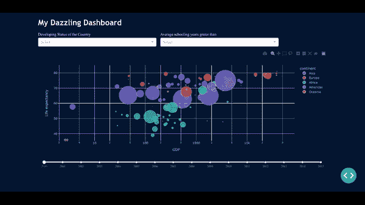

# 这就是我如何纯粹用 Python 创建令人眼花缭乱的仪表盘。

> 原文：<https://towardsdatascience.com/plotly-dashboards-in-python-28a3bb83702c?source=collection_archive---------1----------------------->

## Plotly dash 应用程序是用 python 构建生产级仪表板的最快方式。


作者[用 Python 创建的仪表盘截图。](https://thuwarakesh.medium.com)

我不需要说服你为什么我们需要一个交互式仪表板。但大多数人不知道的是，他们不必购买 *Tableau* 或 *PowerBI* 的昂贵授权。你也不必注册 JavaScript 课程。

***Dash*** 应用程序允许你纯粹用 Python 来构建交互式仪表盘。有趣的是，它可以达到流行的 BI 平台所不能达到的高度。此外，您可以在您的服务器和条款上托管它。

# 为什么是 Dash？为什么不是 Tableau，Power BI，或者一些 JavaScript 库？

像 **Tableau 和 PowerBI** 这样的 BI 平台做得非常出色。它甚至允许非技术管理人员自己进行数据探索。我对他们没有抱怨。

它们是对只读数据集执行分析的优秀工具。但是在大型数据科学项目中，你必须执行复杂的操作。例如，您必须触发一个后端功能，并开始模型再训练。

在这种情况下，我的最佳解决方案是从头开始构建一个 web 应用程序。 **JavaScript 数据可视化库**比如 HighCharts 就是很好的工具。它们对几乎每一个可能的用户操作都有回调。我用它们将数据发送回服务器，并更好地控制它。

但这不是在公园散步。我的数据科学团队擅长 Python 和 R，但不擅长 *JavaScript。N* ot 在 web 框架上，比如 Django 上。这还不够。要构建现代网络应用，你需要前端网络框架，比如 React 。

随着我们的进步，我们意识到残酷的事实。我们堆栈中的每项新技术都会成倍增加难度。

我们很幸运找到了达什。

如果你正在寻找一个轻量级的替代品，请查看[***Streamlit***](/how-to-create-stunning-web-apps-for-your-data-science-projects-c7791102134e)。如果您需要一个灵活、完整的 Python 仪表盘解决方案，请继续阅读。

现在，这就是我如何用 Python 创建令人眼花缭乱的仪表盘。

# 用 Python 构建您的第一个仪表板(不到 1 分钟。)

是的，在 Dash 中构建仪表板就是这么简单。用下面的命令安装 Pandas 和 dash，然后启动计时器。

```
pip install dash pandas
```

在您的项目目录中，使用以下内容创建一个名为 app.py 的文件。

最简单的 Plotly Dash 应用程序。

表演时间到了。让我们使用以下命令运行仪表板:

```
python app.py
```

您将看到它在端口 8050 启动一个服务器。如果您在浏览器上访问 [http://127.0.0.1:8050](http://127.0.0.1:8050) ，您会看到如下所示的仪表板:


仅在 Python 中创建的仪表板。—[作者](https://thuwarakesh.medium.com)

如果您已经使用 JavaScript 库创建了一个类似的应用程序，您会体会到其中的不同。Dash 通过消除大量样板代码节省了大量时间。即使是流行的 BI 工具也需要做大量的前期工作才能达到这一步。

太棒了。这对于激发你构建仪表板来说是相当重要的。但你可能已经意识到它还不耀眼。在接下来的部分中，我们将讨论如何

*   我们可以改进布局；
*   向小部件添加交互和回调，以及；
*   进一步设计应用程序。

有了这个，你就可以创建你需要的炫目的仪表盘了。浏览 [Plottly Dash 图库](https://dash.gallery/Portal/)获取更多此类仪表盘的灵感。

# 向布局添加更多小部件。

Dash 遵循类似 HTML 的元素层次结构。您可以将任何 Dash 的 HTML 组件或核心组件附加到应用程序的布局属性中。布局属性是 Dash 应用程序元素层次结构的根。

核心组件是一组预配置的小部件，如下拉菜单和滑块。

Dash 的 HTML 组件几乎涵盖了所有可用的 HTML 元素。要创建标题，可以使用`html.H1`和`html.P`创建段落。children 属性允许您将一个 HTML 组件嵌套在另一个组件中。

在 Plotly Dash 应用程序中使用组件。—作者[作者](https://thuwarakesh.medium.com)

在上面的代码中，我们包含了三个核心组件——两个下拉菜单和一个滑块。这些控制器元素允许我们过滤图表数据，并在下一部分创建交互性。

# 添加与组件回调的交互性。

Dash 的核心组件有回调来控制对用户动作的响应。这个特性是 Dash 应用程序胜过流行的 BI 平台的显著原因。

您可以使用这个回调来控制图表的重新呈现，或者触发大量的分析。查看我关于[执行大规模计算](/how-to-serve-massive-computations-using-python-web-apps-590e51624bc6)的文章，连同芹菜一起使用 Dash 应用程序。

在这篇文章中，我们使用回调来过滤图表数据。

在 Plotly Dash 应用程序中使用回调。—作者[作者](https://thuwarakesh.medium.com)

回调函数用@app.callback 装饰器进行了注释。这个装饰器的第一个参数是元素树中的输出组件。我们需要指定该元素的 id 和需要更改的属性。该属性将更改为回调函数的返回值。

那么修饰的将接受任意数量的输入参数。每一个都将被绑定到一个核心组件，就像我们附加输出组件一样。我们可以指定元素的 id 和发出更改值的属性。通常，这将是“价值”

装饰器中的每个输入应该在回调函数的定义中有各自的参数。

最后，我们将图形组件移到了回调函数中。每次我们运行回调函数时，它都会创建一个新的 figure 实例并更新 UI。

# 仪表板的样式。

您可以使用 Dash 应用程序中提供的内嵌样式选项。但是用很少的 CSS，你可以得到惊人的结果。

在 dash 中，您可以用三种不同的方式来设计元素的样式。

## 内嵌样式

每个 Dash 组件都接受一个样式参数。您可以传递一个字典并设计任何元素的样式。这是设计 Dash 应用程序最便捷的方式。

Dash 应用程序组件的内联样式。—作者[作者](https://thuwarakesh.medium.com)

## 本地样式表。

或者，您可以将类名属性传递给任何 Dash 组件，并使用单独的 CSS 文件对其进行样式化。您应该将这个 CSS 文件放在项目目录的资产文件夹中。Dash 会自动选择它，并将其样式应用到组件中。

Plotly Dash 应用程序中的本地样式表。—[作者](https://thuwarakesh.medium.com)

## 外部样式表。

您也可以使用互联网上的样式表。例如，dash 有这个预配置的样式表，附带了方便的实用程序类。您可以指定样式表，并在元素中使用它的类名，使元素更加美观。

Plotly Dash 应用程序中的外部样式表。—[作者](https://thuwarakesh.medium.com)

这里是应用程序的完整的源代码。我们使用了本地样式表，并以支持样式的方式组织 HTML。您可以在这个 [GitHub 资源库](https://github.com/ThuwarakeshM/geting-started-with-plottly-dash)中找到完整的代码和本地样式表。

用 Python 创建的仪表板的完整源代码。作者[作者](https://thuwarakesh.medium.com)

当您使用上述内容更新代码时，您的 web 应用程序会刷新。它可能看起来像下图——你的第一个令人眼花缭乱的仪表板版本。



用 Python 创建的基本样式仪表板的截屏。—[作者。](https://thuwarakesh.medium.com)

# 最后的想法

对于 Python 开发者来说，Dash 应用是一个不可思议的工具。由于大多数数据科学团队并不专门研究 JavaScript，所以用 Dash 构建仪表板节省了他们大量的时间。

我们可以使用 Tableau、PowerBI 和类似的 BI 平台进行数据探索和可视化。但是 Dash 应用程序比他们更出色，因为它们与后端代码紧密集成。

在本文中，我们探索了 Dash 应用程序的表面。我相信这会给你一个开始，让你不用担心可怕的技术堆栈，就能构建出色的仪表板。

作为下一步，我强烈建议探索 Dash 的文档页面和他们的示例库。

> 谢谢你的阅读，朋友。看来你和我有许多共同的兴趣。也一定要看看我的[个人博客](https://www.the-analytics.club/)。
> 
> ***在[LinkedIn](https://www.linkedin.com/in/thuwarakesh/)[Twitter](https://twitter.com/Thuwarakesh)[Medium](https://thuwarakesh.medium.com/subscribe)上跟我打招呼*。我会为你打破僵局。**

还不是中等会员？请使用此链接 [**成为会员**](https://thuwarakesh.medium.com/membership) 因为，不需要你额外付费，我为你引荐赚取一小笔佣金。