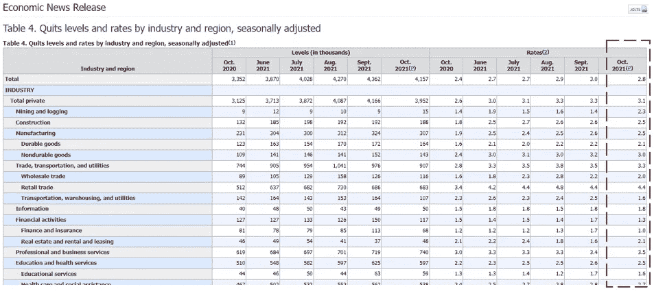
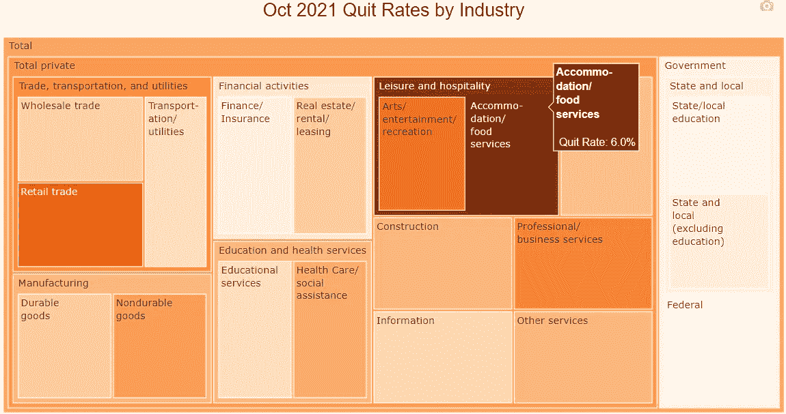
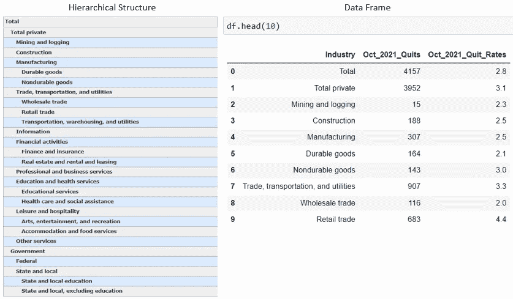
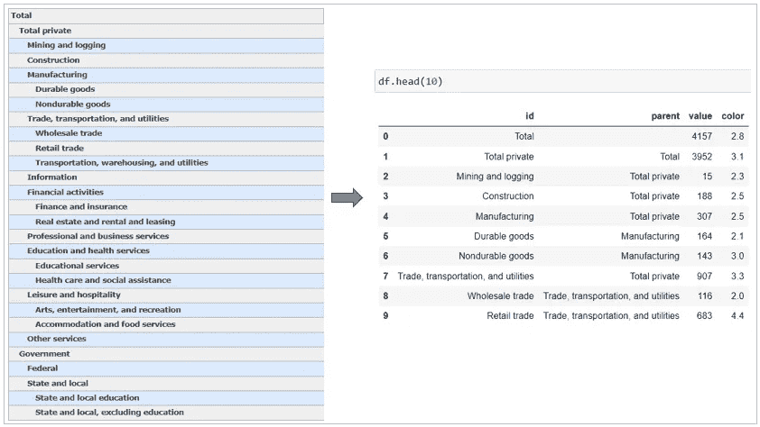
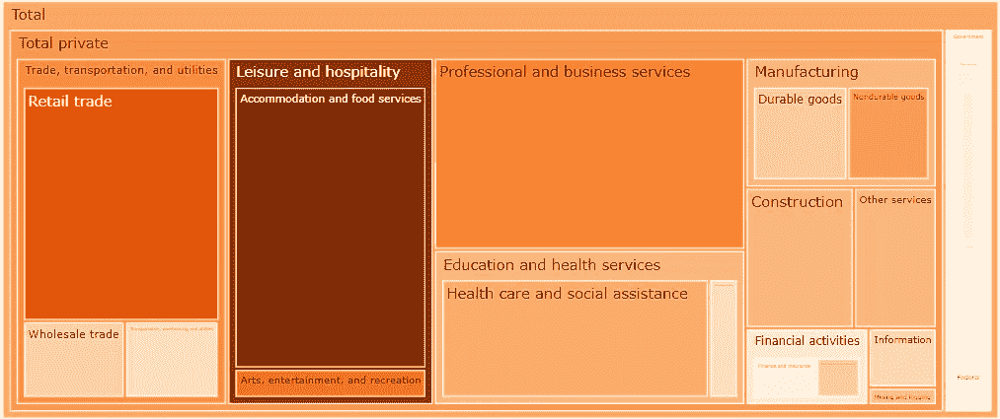
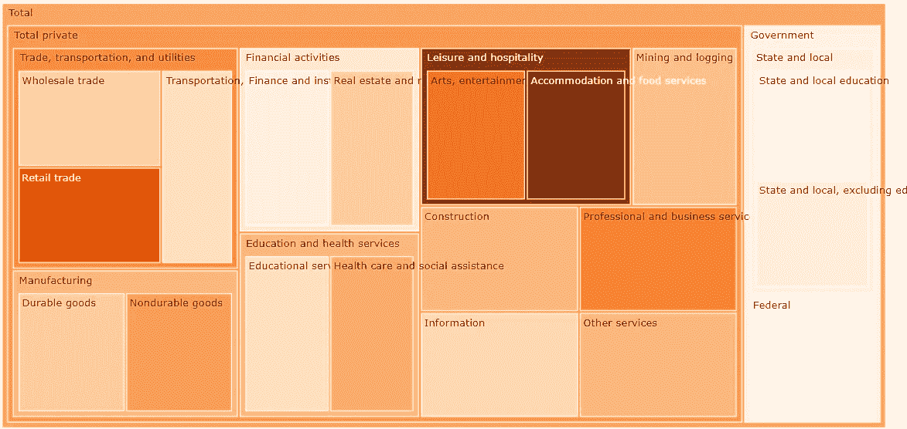
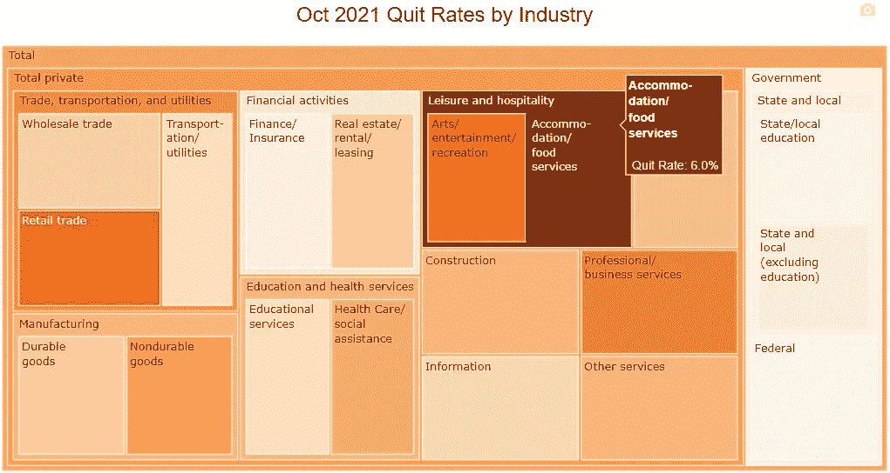
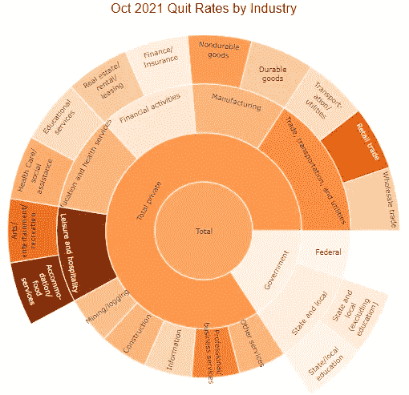
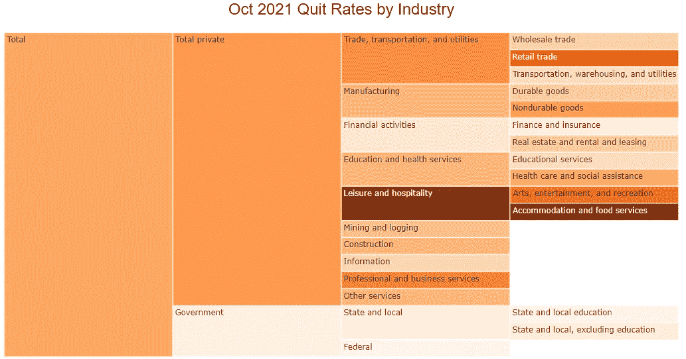

# 分层数据可视化的 Plotly:树形图和更多

> 原文：<https://towardsdatascience.com/plotly-for-hierarchical-data-visualization-treemaps-and-more-47b36c5db3eb?source=collection_archive---------15----------------------->

## 一步一步的教程，使用 Plotly 和 Treemaps 可视化美国大辞职

图片来源: [Pixabay](https://pixabay.com/photos/isolated-tree-green-tree-isolated-3544689/)

# 介绍

2021 年 12 月 8 日，美国劳工统计局发布了其最新的劳动力流动[数据](https://www.bls.gov/news.release/jolts.t04.htm)。从 6 月到 10 月，超过 2000 万美国人辞去了工作。10 月份的初步数据显示，当月有超过 400 万美国人辞职，比去年同期高出近 25%。

劳动统计局:[经济新闻发布](https://www.bls.gov/news.release/jolts.t04.htm)

劳动力流动数据还可以细分到不同的行业，在更精细的层次上提供丰富而深刻的信息。但是，请注意，这些数据是以表格格式呈现的，具有按行业划分的层次结构。这使得发现模式和快速识别需要注意的类别或子类别变得非常困难。

这是数据可视化发挥作用的典型场景！我们如何可视化这种类型的分层数据，以便它以易读的方式提供见解，同时有效地利用空间？

在本教程中，我们将使用 Plotly 创建一个树形图来可视化不同行业 10 月份的辞职率。树形图使用嵌套矩形显示分层数据，并使用每个矩形的大小和颜色来表示我们想要显示的不同指标。它是分层数据可视化的完美候选。

作为奖励，在教程的最后，我们还将构建一个 sunburst 图表和 icicle 图表，它们与 treemaps 非常相似，并且共享相同的输入数据格式。我们将要创建的树形图如下所示:

作者图片

# Plotly Express vs. Plotly Go

Plotly Python 库是一个交互式的开源图形库，涵盖了广泛的图表类型和数据可视化用例。它有一个名为 Plotly Express 的包装器，是 Plotly 的高级接口。

Plotly Express 可以轻松快捷地使用简单的语法创建最常见的图表，但在涉及更高级的图表类型或自定义时，它缺乏功能和灵活性。

与 Plotly Express 相反，Plotly Go(图形对象)是一个较低级别的图形包，通常需要更多的编码，但更具可定制性和灵活性。在本教程中，我们将使用 Plotly Go 创建如上所示的树形图。您还可以将代码保存为模板，以便在其他用例中创建类似的图表。

# 下载并准备数据

你可以从劳动统计局[经济新闻发布页面](https://www.bls.gov/news.release/jolts.t04.htm)获得本教程的数据。该数据显示了 2021 年 6 月至 10 月经季节性调整的各行业的对等水平(数字以千计)和比率。我将数据保存在一个 Excel 文件中，工作表名为“By_Industry ”,并直接在 Excel 中重命名列名，使它们更直观。

我们先把数据读入 python。由于我们只对 10 月份的辞职率感兴趣，我们将只在数据框中保留“行业”、“2021 年 10 月辞职”和“2021 年 10 月辞职率”列。请注意，数据框中的“行业”列没有反映出原始表中显示的等级结构-我们需要稍后将这一缺失的信息添加到数据框中，以便绘制树形图。

作者图片

# 用 go 创建一个树形图。树形图

要使用 Plotly Graph_Objects 制作树形图，我们至少需要“告诉”Plotly 以下内容:

1.  每个矩形的标签
2.  嵌套矩形的层次结构
3.  每个矩形的大小和颜色

在我们的数据框中，“行业”列显示了每个矩形的标签。“Oct_2021_Quits”列可用于表示每个矩形的大小，显示每个行业部门的辞职总数。“Oct_2021_Quit_Rates”列可用于表示每个矩形的颜色，颜色越深，该部门的周转率越高。

数据框中唯一缺少的信息是标签/矩形的等级。我们需要创建一个新列(我们可以将其命名为“parent”)来明确定义标签的层次结构。这是通过以下代码实现的:

作者图片

现在我们准备绘制树状图了！在下面的代码中，我们将首先创建一个 graph_objects 图形，然后使用 *go 向它添加 treemap 跟踪。图(去。Treemap())。*围棋之内。Treemap()，我们通过`values`和`parents`属性来定义层次结构。每个矩形的大小/面积由`values`属性定义，颜色由`marker`属性定义。我们也可以通过用 HTML 代码编辑`hovertemplate`属性来自定义工具提示。

作者图片

# 微调树形图

我们刚刚创建的树形图看起来不错！使用 Plotly 创建一个只有几行代码的树形图似乎非常简单方便！请注意，在上面的树形图中，一些行业被压缩成非常小的矩形，由于矩形的大小，标签难以辨认。让我们微调树形图来解决这些问题。

在我们的可视化中，由于我们主要对不同行业的辞职率感兴趣，而不是辞职的数量，我们可以从前面的代码中删除`value`属性。由于没有给`value`属性分配一个指标，一个类别的面积现在被平均分配给其父类别中的其他子类别。

我们也可以通过使用`uniformtext`布局参数来强制所有的文本标签具有相同的字体大小。`minsize`属性设置所需的字体大小。`mode`属性决定了不适合所需字体大小的标签会发生什么。你可以选择`hide`或者`show`溢出。

作者图片

现在标签看起来更清楚了，尽管标签溢出了矩形的边界还有一个小问题。不幸的是，Plotly 不能自动换行，所以我们需要手动修复它。

在下面的代码中，我们使用 HTML 代码通过
元素将长格式文本分成多行。HTML 元素
在文本中产生一个换行符，并且
之后的文本从文本块的下一行开始重新开始。我们可以将这个换行的文本列命名为“id2”。

现在让我们通过将‘id2’赋给`labels`属性来完成我们的绘图。我们还将添加一个图表标题，指定标题的字体大小，并将其放在树形图上方的中心位置。

树形图(图片由作者提供)

# 奖励:旭日图和冰柱图

在可视化分层数据时，还有一些其他图表类型与 treemaps 非常相似，比如 sunburst 图表和 icicle 图表。这两种图表类型的输入数据格式与树形图相同:层次结构由`labels`和`parents`属性定义。

要绘制旭日图和冰柱图，代码中唯一需要修改的就是替换 *go。带 *go 的树形图*。旭日()*或 *go。冰柱()。*下面的代码用于创建旭日图。旭日图直观地显示了从根到叶径向向外延伸的分层数据。

旭日图(图片由作者提供)

冰柱图使用矩形扇区从根到叶沿四个方向之一显示分层数据:上、下、左或右。冰柱图有一个带有两个参数`orientation`和`flip`的`tiling`属性。您可以结合使用这两个参数来创建四个方向中的每一个:水平、垂直、向左或向右。

冰柱图(图片由作者提供)

与条形图、折线图或饼图等其他图表类型相比，树状图、旭日图和冰柱图是不太常见的可视化形式。然而，当涉及到可视化分层数据时，它们绝对是完成工作的完美选择，既漂亮又高效！感谢您的阅读，我希望您发现这篇文章有助于提高您的绘图和数据可视化技能！

参考和数据来源:

1.  Plotly 官方文档页面:[https://plotly.com/python/treemaps/](https://plotly.com/python/treemaps/)
2.  数据来源:劳动统计局发布的经济新闻([https://www.bls.gov/news.release/jolts.t04.htm](https://www.bls.gov/news.release/jolts.t04.htm))。这是一个没有许可的开放数据集。

你可以通过这个[推荐链接](https://medium.com/@insightsbees/membership)注册 Medium 会员(每月 5 美元)来获得我的作品和 Medium 的其他内容。通过这个链接注册，我将收到你的一部分会员费，不需要你额外付费。谢谢大家！