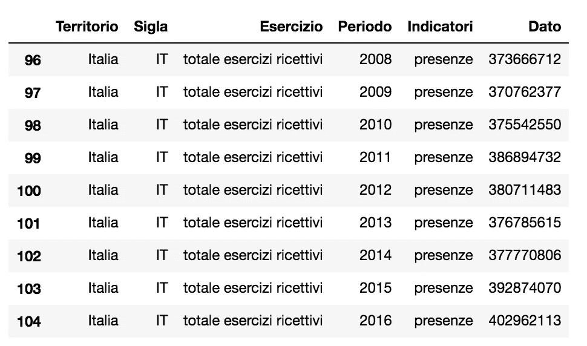
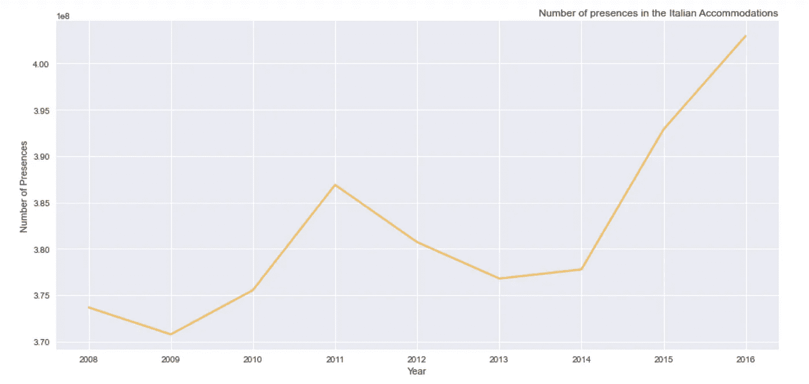
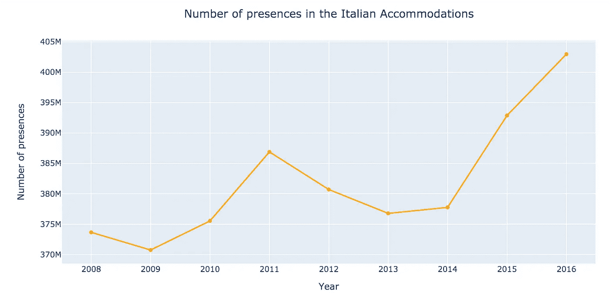

# plotly VS matplotlib:Python 中数据可视化最好的库是哪个？

> 原文：<https://towardsdatascience.com/plotly-vs-matplotlib-what-is-the-best-library-for-data-visualization-in-python-89a8b64a9471?source=collection_archive---------39----------------------->


图片来自 [Pixabay](https://pixabay.com/?utm_source=link-attribution&utm_medium=referral&utm_campaign=image&utm_content=2785979) 的 [Goumbik](https://pixabay.com/users/goumbik-3752482/?utm_source=link-attribution&utm_medium=referral&utm_campaign=image&utm_content=2785979)

在这个简短的教程中，我将向您展示如何使用`plotly`和`matplotlib`库快速构建一个基本的折线图。参考`plotly`，我将使用图形对象，它们是用于表示图形部分的`plotly`类。关于图形对象的详细信息，可以参考[官方 plotly 文档](https://plotly.com/python/graph-objects/)。

你可以从我的 [Github 库](https://github.com/alod83/data-science/blob/master/DataVisualization/PlotlyVSMatplotlib.ipynb)下载本教程的代码。

# 输入数据

首先，我将数据导入一个`pandas`数据框架。我使用`read_csv()`功能。该数据集包含在意大利住宿的游客数量，按城镇或总数划分。

```
import pandas as pddf = pd.read_csv('presenza_negli_alberghi.csv')
df
```


作者图片

# 数据过滤

如果你急着画图可以跳过这一节:)。

因为我想绘制存在的总数，所以我必须应用一些过滤器。我将`Sigla`列转换成一个字符串，以便执行一些比较，然后我只维护列`Sigla`中值的长度大于 2 的行。

```
import numpy as np
df['Sigla'] = df['Sigla'].astype('str')
regions = df['Sigla'].apply(lambda x: x if len(x) > 2 else np.nan).dropna().unique()
```

现在我过滤数据，以便只维护数据的总数。

```
df_it = df[(df['Territorio'] == 'Italia') & (df['Esercizio'] == 'totale esercizi ricettivi') & (df['Indicatori'] == 'presenze')]
df_it
```



作者图片

# Matplotlib

现在我利用`matplotlib`库来绘制基本线条。我可以通过`figure()`功能设置图形大小。这个函数必须在调用其他函数之前被调用。我调用了`plot()`函数，通过传递`x`和`y`作为前两个参数，以及线`color`参数(橙色)、`linewidth` (2)和`alpha`参数的值(0.7)来设置绘图透明度。我还通过`style.use()`函数定义了要使用的样式。然后我指定剧情标题(功能`title()`和`xlabel()`和`ylabel()`)。最后，我调用`show()`函数来绘制图表。

```
import matplotlib.pyplot as plt
plt.figure(figsize=(15,7))
plt.plot(df_it['Periodo'], df_it['Dato'], marker='', color='orange', linewidth=2, alpha=0.7)
plt.style.use('seaborn')
plt.title("Number of presences in the Italian Accommodations", loc='right', fontsize=12, fontweight=0)
plt.xlabel("Year")
plt.ylabel("Number of Presences")plt.show()
```



作者图片

# Plotly

通过`plotly`库可以绘制相同的图形。在导入`plotly.graph_objects`之后，我定义了一个`Figure()`，我们向其传递两个参数:`data`和`mode`。模式包含线条的类型(在我的例子中是`lines+markers`),而`data`包含一个`Scatter()`对象。在`Scatter()`对象中，我必须指定`x`和`y`以及`line`选项(颜色、宽度)。然后我调用`update_layout()`函数来定义绘图选项，比如标题以及 y 和 x 标签。最后，我通过`show()`函数绘制图表。

```
import plotly.graph_objects as go
import numpy as npfig = go.Figure(data=go.Scatter(x=df_it['Periodo'], y=df_it['Dato'],line=dict(color='orange', width=2),mode='lines+markers'))
fig.update_layout(
    title={
        'text': "Number of presences in the Italian Accommodations",
        'y':0.9,
        'x':0.5,
        'xanchor': 'center',
        'yanchor': 'top'},
    xaxis_title="Year",
    yaxis_title="Number of presences"

)
fig.show()
```



作者图片

# 讨论和总结

这两个被分析的库产生了相似的结果。然而，它们的方法大不相同，因为`matplotlib`为要执行的每个操作定义了一个函数，例如`title()`、`xlabel()`和`ylabel()`，而`plotly`定义了一个布局，它接收一个字典作为输入。哪个最好？没有最好的图书馆。看你的敏感程度了。我个人更喜欢`matplotlib`但是你可以随意使用。

事实上，Python 中还存在其他用于数据可视化的库，比如 [Vega Lite](https://vega.github.io/vega-lite/) 。如果你想了解这个图书馆，请继续关注…

如果你想了解我的研究和其他活动的最新情况，你可以在 [Twitter](https://twitter.com/alod83) 、 [Youtube](https://www.youtube.com/channel/UC4O8-FtQqGIsgDW_ytXIWOg?view_as=subscriber) 和 [Github](https://github.com/alod83) 上关注我。