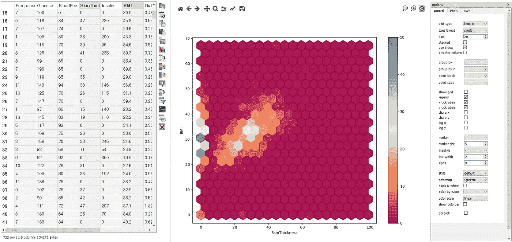
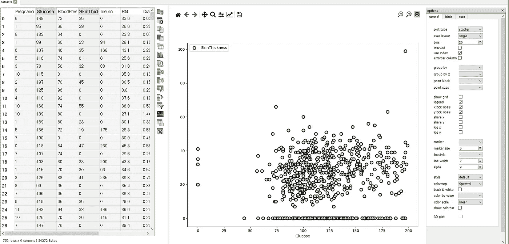
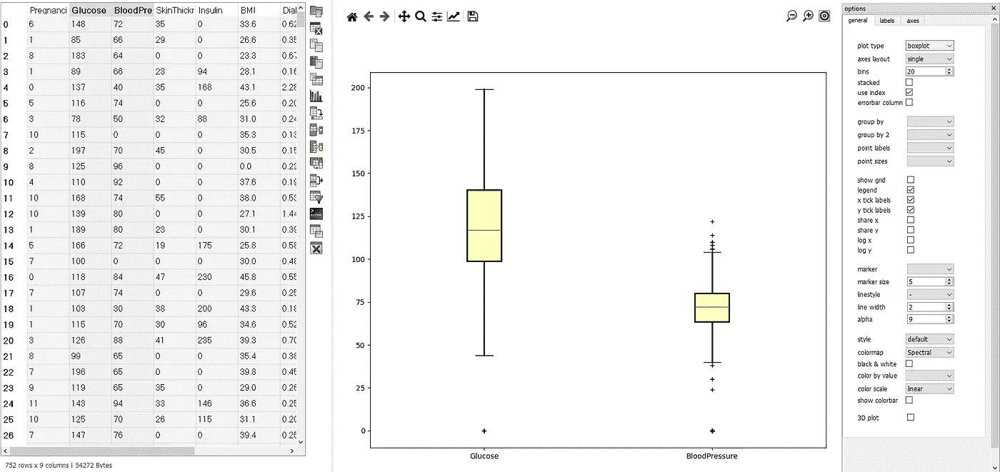

# 绘制和分析表格数据

> 原文：<https://towardsdatascience.com/plotting-analyzing-tabular-data-9557b85b81a0?source=collection_archive---------26----------------------->

## 使用 Tablexplore 替换电子表格

来源:作者

数据可视化是识别任何隐藏模式、数据点之间的关系等的最佳方式之一。这些数据通常不会以表格形式显示。不同的可视化有助于分析数据并生成有用的见解。

我们可以使用多个 Python 库来可视化和分析数据。分析 MS Excel、Google Spreadsheets、Tableau 等中数据的最常用工具。现在，这些库和工具的问题是，它们中的大多数要么是付费的，要么我们需要知道很多编码才能使它们工作。

Tablexplore 是一个基于 Python 的开源工具，可用于绘制和分析任何表格数据集。它有各种各样的功能，使它易于使用和高效。

在本文中，我们将探索 Tablexplore 并使用它创建一些可视化效果。

让我们开始吧…

# 安装 Tablexplore

为了安装 tablexplore for windows，我们可以从下面给出的链接直接下载 windows installer。

<https://dmnfarrell.github.io/tablexplore/>  

安装后，我们可以直接启动它，开始使用它。

主页(来源:作者)

现在，让我们加载一个数据集，开始创建不同的图，只需点击鼠标，不需要任何代码就可以分析数据。

散点图(来源:作者)

我们只需选择两列或更多列，然后单击图表按钮，我们可以从右侧菜单中选择图表类型。让我们再创建一个图表。

方框图(来源:作者)

这个工具是高度可定制的，这意味着我们可以使用颜色方案、图表大小等。还有许多其他选项，如合并、换位、聚合等。这使得它比市场上的任何其他工具都更有用。

尝试使用不同的数据集，创建不同的可视化效果，并在回复部分告诉我您的意见。

本文是与 [Piyush Ingale](https://medium.com/u/40808d551f5a?source=post_page-----9557b85b81a0--------------------------------) 合作完成的。

# 在你走之前

***感谢*** *的阅读！如果你想与我取得联系，请随时通过 hmix13@gmail.com 联系我或我的* [***LinkedIn 个人资料***](http://www.linkedin.com/in/himanshusharmads) *。可以查看我的*[***Github***](https://github.com/hmix13)**简介针对不同的数据科学项目和包教程。还有，随意探索* [***我的简介***](https://medium.com/@hmix13) *，阅读我写过的与数据科学相关的不同文章。**