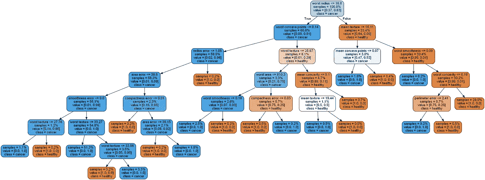

# 在内存中绘制决策树

> 原文：<https://towardsdatascience.com/plotting-decision-trees-in-memory-401219306d50?source=collection_archive---------47----------------------->

## 避免<10 lines

## **简介**中不必要的慢速磁盘操作

决策树本质上是可解释的分类器，也就是说，可以绘制它们来理解它们如何以及为什么做出某些决策。对于非技术专家使用 ML 的用例来说，这是一个非常重要的属性。例如，使用 ML 执行疾病检测的医生可以从图中推导出分类器做出的精确 if-else 决策。

## **绘制决策树**

绘制决策树最广泛使用的库是 Graphviz。它提供了命令行工具和 Python 接口，与 Scikit-learn 无缝集成。有了它，我们可以定制情节，他们只是看起来很好。问题是，Graphviz 大多支持写入文件，大多数教程只是将图像保存到文件，然后加载它。

此外，Graphviz 执行两阶段绘图。首先以点格式描述树结构([https://en . Wikipedia . org/wiki/DOT _(graph _ description _ language)](https://en.wikipedia.org/wiki/DOT_(graph_description_language)))，然后根据点文件绘制树。这意味着更多的磁盘操作。

## **为什么要避免磁盘操作？**

实际上，ML 模型并不在客户端计算机上运行。相反，服务器或基于云的计算引擎使用 API 为模型服务。通常会发回 JSON 和结果，例如 Base64 编码的图像。

一次处理许多客户端请求会给磁盘 I/O 带来沉重的负载，而且磁盘本身可能不是快速 SSD，而是较旧的硬盘驱动器—无论是为了降低云成本还是为了获得更大的可用空间。

通常，我们绘制树，将其发送给客户端并删除图像。这意味着将映像写入磁盘纯粹是浪费。我们必须对每个图像执行 6 个操作:保存点文件，加载点文件，保存图像，加载图像，删除点文件，删除图像。我们如何改善这种情况？

## **在内存中绘图**

虽然 Graphviz 总是写入类似文件的字节，但我们不需要将它们写入磁盘。相反，我们可以在 RAM 中执行整个操作。这意味着更快的内存访问和没有缓慢的磁盘操作。占用的空间不是问题，因为图像不是很大，而且几乎会被立即删除。我们也不需要记住删除文件，因为垃圾收集器会为我们做这件事。

很容易避免在 Graphviz 中使用点文件——通过设置适当的参数，它将点文件作为变量返回，而不是写入文件。但是，从内存中创建图像有点困难，因为绘图结果是作为字节缓冲区返回的。幸运的是，Numpy 可以从字节创建数组，OpenCV 可以将数组解码为图像。这样我们就完全避免了使用磁盘操作。

## **代码和时间比较**

这两个函数(内存和磁盘操作)的代码如下所示。如您所见，额外的好处是内存版本更短，不到 10 行(不包括空格和格式)。

内存版本:

磁盘操作版本:

两个版本绘制的决策树(图片由作者提供)

为了进行速度比较，我使用了 Scikit-learn 中包含的乳腺癌数据集，对两个代码版本重复了 100 次。比较平均时间，内存中的版本要快 **15%** ！这是在一个快速的固态硬盘上，几乎没有 I/O 操作。当在 I/O 负载较重且可能有硬盘驱动器的服务器上运行时，差异会大得多。

## **总结**

在本文中，您了解了如何使用 Graphviz 绘制决策树，无需磁盘操作，仅使用基本的库并实现了不到 10 行的较短代码。在为需要可伸缩性的实际情况部署 ML 时，像这样的考虑可能很重要。