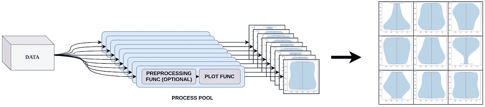
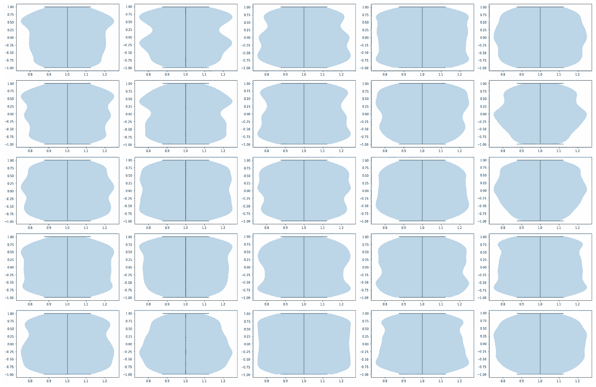
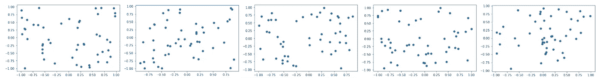

# 使用 matplotlib 和 python 并行绘图

> 原文：<https://towardsdatascience.com/plotting-in-parallel-with-matplotlib-and-python-f7efb3d944de?source=collection_archive---------10----------------------->

## [技巧和诀窍](https://towardsdatascience.com/tagged/tips-and-tricks)、[理解大数据](https://towardsdatascience.com/tagged/making-sense-of-big-data)

## 如何使用多重处理加速网格状绘图的创建

这是另一篇关于如何加快速度的文章。我并不是在反对`matplotlib`。事实上，它是我项目中的日常驱动力。但有时你需要额外的表演。

这里有一个例子。为了我的一项研究，我必须创造大量的小提琴情节。对于那些不熟悉它们的人，这里有一个非常简单的解释:基本上，这些图在某些方面类似于直方图，但你实际上可以在一个图中比较多个小提琴，这对于直方图来说很难。violin plots 不是计算离散频率，而是计算每个轴的核密度估计值(KDE )(连续函数)。然后他们画出最终的多边形。绘图在计算上相当便宜，但计算 KDE 却不便宜。我正在处理数以亿计的数据点和多个轴。因此，性能是关键。每个轴的 KDE 可以独立计算，甚至可以独立绘图(在共享轴上)。但是`matplotlib`是按顺序做的——唉！

我开始尝试让`matplotlib`使用多处理，但我不想只并行 KDE 计算，而是可以分成多个图的任何类型的图。Matplotlib 不是真正的线程安全，所以我的大多数方法都失败了。我确信有一些漂亮的方法来实现并行，也许我没有挖掘得足够深，但是我想要一个简单问题的简单解决方案，并想出了一个便宜的技巧。

我没有将`matplotlib`的内部并行化，而是将我的数据分配给不同的进程，然后让每个进程创建自己的绘图。然后每个情节被栅格化并反馈给主进程，主进程将所有的子情节组合成一个网格状的情节。

输出是一个完整的`matplotlib`图——您甚至可以将其输入 QT 后端，享受 GUI 的所有功能。但是每个子情节都是光栅化的图像。这意味着你不能放大，改变轴等。然而，如果你只是需要一种快速的方法来创建静态图，那么这种方法应该适合你。



工作原理概述。图片作者。

我在 GitHub 上发布了这个附带项目，但是还没有在 PyPi 上发布。如果只是想用，可以在这里不看了，直接装库。请阅读 GitHub 自述文件了解使用信息。

```
pip install git+https://github.com/paulgavrikov/parallel-matplotlib-grid/
```

但是如果你好奇的话，我也会用一个稍微精简的功能来解释这个原理。让我们深入研究一下。

首先，我们必须将数据分发给每个工人，然后汇集输出。我们可以通过使用池让多处理来处理这个问题。组装意味着我们只需创建支线剧情，并让每个情节通过`plt.imshow`显示光栅化的输出。

现在，是时候定义工人了。工人必须创建一个绘图，调用一个用户定义的函数，以任何方式将数据绘制到图形中，然后进行栅格化并返回输出。

`matplotlib`不太擅长在保存前计算每个图的边界。要么接受可能遗漏了一点情节的支线剧情，要么使用填充(默认完成)。

现在你可以用你的数据和你的自定义绘图程序调用`parallel_plot`，享受准并行绘图。

让我们创建一个 5x5 的小提琴网格:



5x5 小提琴绘图网格。图片作者。

或者一行 5 个散点图:



1x5 散点图网格。图片作者。

你可以创造任何你喜欢的情节，只要你的情节基于提供的`fig`和`axes`参数。只要记住`multiprocessing`不能很好地处理超过 4gb 的数据。

一点小提示。我很清楚，当谈到真正的并行性时，多处理并不是精英中的精英。但它在大多数情况下都足够好，我的主要用途是`jupyter`笔记本，我发现多处理是少数几个可靠工作的库之一。如果您想在`jupyter`之外使用它，并且想与工人共享更大的数据，您可能想考虑使用`ray`。

`ray`不使用`pickle`来序列化数据。因此，序列化速度更快，可以序列化大于 4gb 的数据。访问数据也更快，因为没有昂贵的反序列化。但是我也遇到了许多占用 RAM 的死进程的问题，并且从来没有让它在`jupyter`笔记本中工作过。