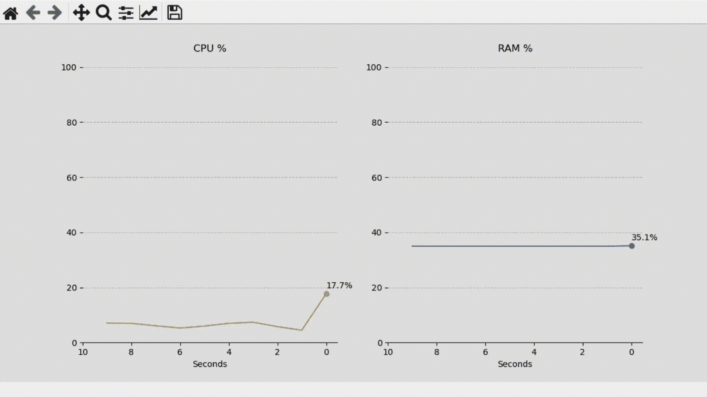
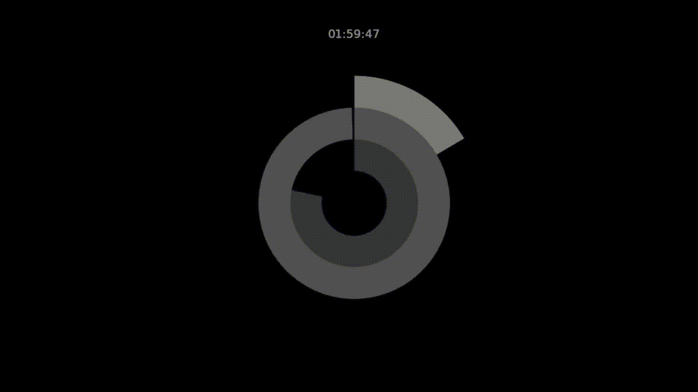
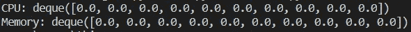
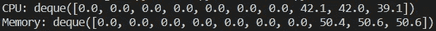
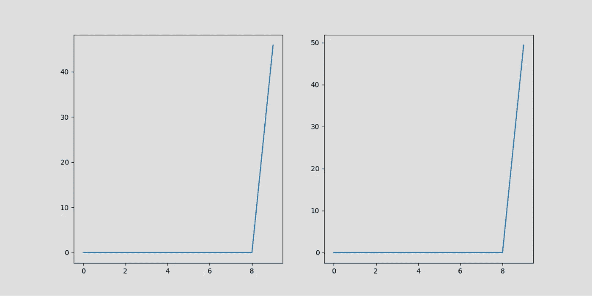
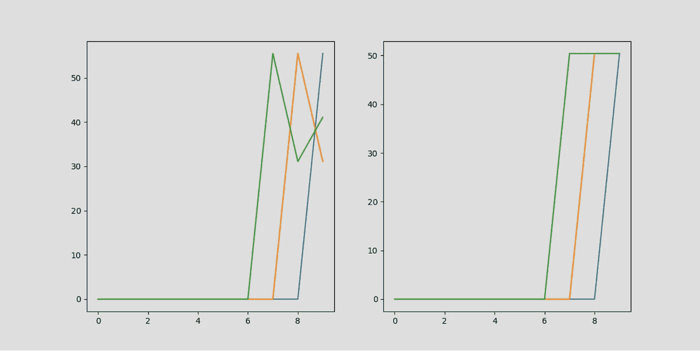
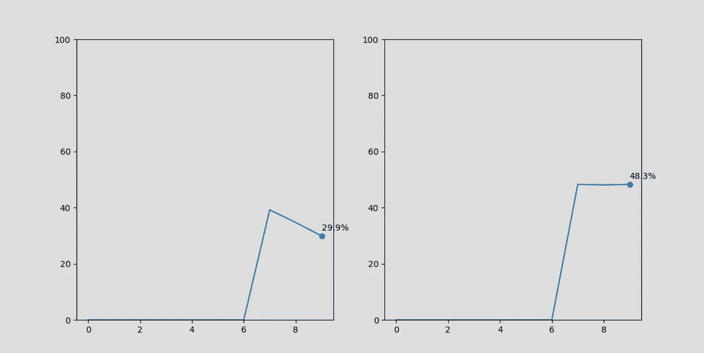
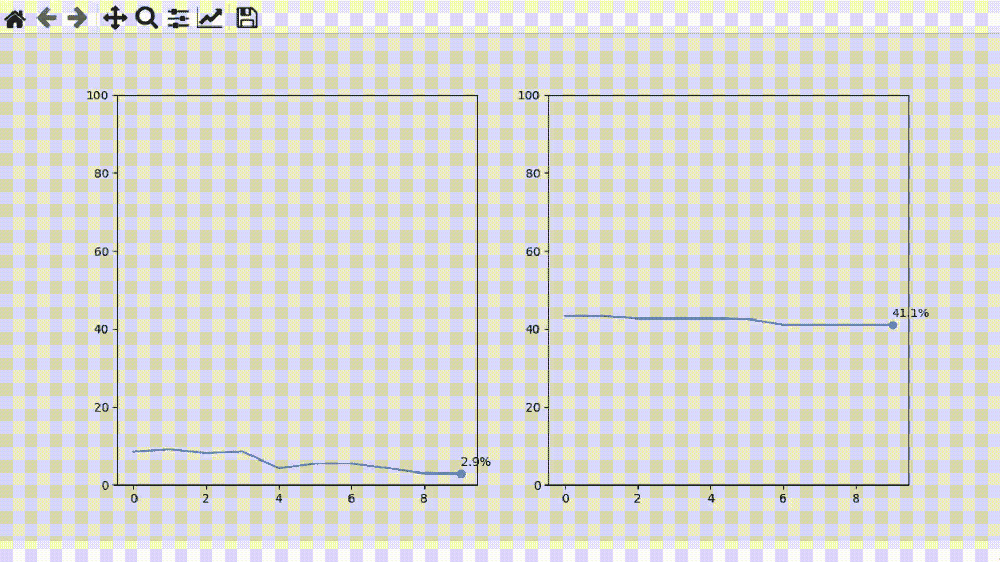
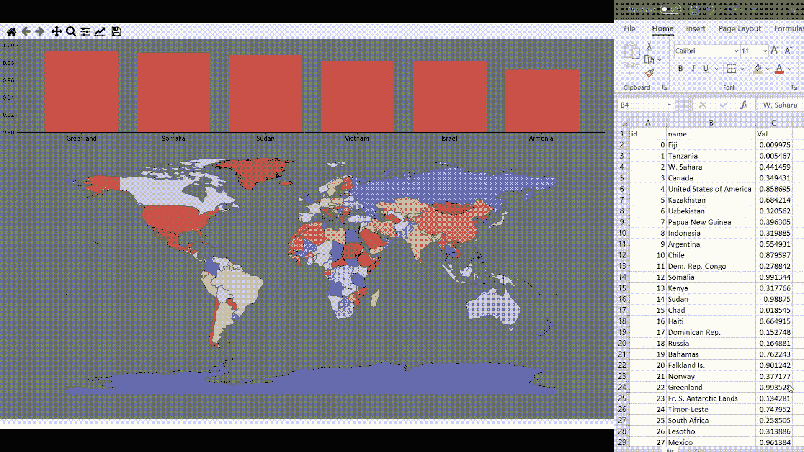

# 用 Matplotlib 绘制实时数据

> 原文：<https://towardsdatascience.com/plotting-live-data-with-matplotlib-d871fac7500b?source=collection_archive---------2----------------------->

## 如何用 Python 的 Matplotlib 可视化实时数据



CPU 和内存可视化—图片由作者提供

无论您是使用传感器、不断从 API 获取数据，还是拥有经常更新的文件，您都可能希望实时分析您的数据。



圆环图时钟—图片由作者提供

本文将探索一种简单的方法，通过 Matplotlib 的 FuncAnimation 使用函数为我们的绘图制作动画。

第一个例子的数据来自操作系统，为了检索这个信息，我们将使用 [psutil](https://psutil.readthedocs.io/en/latest/) 。

```
pip install psutil
```

我们将使用 deques 处理数据，但是您可以修改这个示例，使其适用于大多数集合，比如字典、数据框、列表等等。

在文章的最后，我将快速展示另一个关于熊猫和地质熊猫的例子。

```
import matplotlib.pyplot as plt
import numpy as np
from matplotlib.animation import FuncAnimation
import psutil
import collections
```

让我们从收集和存储数据开始。我们将定义两个填充零的 deques。

```
cpu = collections.deque(np.zeros(10))
ram = collections.deque(np.zeros(10))print("CPU: {}".format(cpu))
print("Memory: {}".format(ram))
```



带零的德克-图片由作者提供

然后我们将创建一个用新数据更新 deques 的函数。它将删除每个队列的最后一个值，并追加一个新值。

```
def my_function():
    cpu.popleft()
    cpu.append(psutil.cpu_percent(interval=1)) ram.popleft()
    ram.append(psutil.virtual_memory().percent)cpu = collections.deque(np.zeros(10))
ram = collections.deque(np.zeros(10))# test
my_function()
my_function()
my_function()print("CPU: {}".format(cpu))
print("Memory: {}".format(ram))
```



Deques 提供一些数据—图片由作者提供

现在我们可以定义人物和支线剧情了。除了更新 deques，我们的函数还需要将这些数据添加到图表中。

```
# function to update the data
def my_function():
    cpu.popleft()
    cpu.append(psutil.cpu_percent(interval=1))
    **ax.plot(cpu)** ram.popleft()
    ram.append(psutil.virtual_memory().percent)
    **ax1.plot(ram)**# start collections with zeros
cpu = collections.deque(np.zeros(10))
ram = collections.deque(np.zeros(10))**# define and adjust figure
fig = plt.figure(figsize=(12,6), facecolor='#DEDEDE')****ax = plt.subplot(121)
ax1 = plt.subplot(122)****ax.set_facecolor('#DEDEDE')
ax1.set_facecolor('#DEDEDE')****# test
my_function()**
**plt.show()**
```



采用单一指标的 CPU 和内存折线图—图片由作者提供

当我们添加 FuncAnimation 时，它会反复调用我们的函数来刷新图表。

但是当我们在同一轴上多次使用`.plot()`时，它不会更新直线，而是绘制新的直线。



CPU 和内存折线图，每个指标对应一条线—图片由作者提供

很难追加到已经绘制的线条上，其他类型的可视化，如地图、条形图和饼图，更新起来更具挑战性。

一个更直接的解决方案是在绘图前清除轴，并在每次迭代时绘制一个新的图。

将`axis.cla()`添加到我们的函数中会得到那个结果。

这样，我们也不需要担心文本、注释或图表的其他元素。每次我们绘图，轴都会重置，函数会重新绘制所有内容。

```
# function to update the data
def my_function():
    # get data
    cpu.popleft()
    cpu.append(psutil.cpu_percent(interval=1))
    ram.popleft()
    ram.append(psutil.virtual_memory().percent) # clear axis
    ax.cla()
    ax1.cla() # plot cpu
    ax.plot(cpu)
    ax.scatter(len(cpu)-1, cpu[-1])
    ax.text(len(cpu)-1, cpu[-1]+2, "{}%".format(cpu[-1]))
    ax.set_ylim(0,100) # plot memory
    ax1.plot(ram)
    ax1.scatter(len(ram)-1, ram[-1])
    ax1.text(len(ram)-1, ram[-1]+2, "{}%".format(ram[-1]))
    ax1.set_ylim(0,100)# start collections with zeros
cpu = collections.deque(np.zeros(10))
ram = collections.deque(np.zeros(10))# define and adjust figure
fig = plt.figure(figsize=(12,6), facecolor='#DEDEDE')
ax = plt.subplot(121)
ax1 = plt.subplot(122)
ax.set_facecolor('#DEDEDE')
ax1.set_facecolor('#DEDEDE')# test
my_function()
my_function()
my_function()
plt.show()
```



采用多种衡量标准的 CPU 和内存折线图—图片由作者提供

我们拥有让我们的图表栩栩如生所需的一切。

现在我们可以添加 FuncAnimation，并将我们的图形和函数作为参数传递。

```
ani = FuncAnimation(fig, my_function, interval=1000)
```

当我们定义这个数字时，我们将它赋给一个名为`fig`的变量。

另一种方法是跳过这一步，依赖 Matplotlib 创建的默认图形。替换第一个参数为`plt.gcf()`，它会自动为我们得到当前的数字。

请注意，我们还在 FuncAnimation 中设置了 1，000 毫秒的间隔。我们不需要把它放在。默认情况下，它会每隔 200 毫秒调用一次函数。

既然我们已经有了一个间隔，我们也可以从`.cpu_percent()`中删除这个间隔。

不涉及太多关于 psutil 的细节，当我们不设置间隔时，它将从最后一次调用函数开始计算——这意味着它返回的第一个值将是零。在那之后，它会像以前一样工作。

最后，FuncAnimation 将调用我们的函数，并使用帧作为第一个参数。因为我们不会为这个参数定义任何自定义值，所以它将作为一个计数器工作，传递迭代次数。

我们唯一要做的就是确保我们的函数可以接收这个参数，即使我们没有使用它。

```
# function to update the data
def my_function(**i**):
    # get data
    cpu.popleft()
    cpu.append(psutil.cpu_percent())
    ram.popleft()
    ram.append(psutil.virtual_memory().percent) # clear axis
    ax.cla()
    ax1.cla() # plot cpu
    ax.plot(cpu)
    ax.scatter(len(cpu)-1, cpu[-1])
    ax.text(len(cpu)-1, cpu[-1]+2, "{}%".format(cpu[-1]))
    ax.set_ylim(0,100) # plot memory
    ax1.plot(ram)
    ax1.scatter(len(ram)-1, ram[-1])
    ax1.text(len(ram)-1, ram[-1]+2, "{}%".format(ram[-1]))
    ax1.set_ylim(0,100)# start collections with zeros
cpu = collections.deque(np.zeros(10))
ram = collections.deque(np.zeros(10))# define and adjust figure
fig = plt.figure(figsize=(12,6), facecolor='#DEDEDE')
ax = plt.subplot(121)
ax1 = plt.subplot(122)
ax.set_facecolor('#DEDEDE')
ax1.set_facecolor('#DEDEDE')**# animate
ani = FuncAnimation(fig, my_function, interval=1000)**plt.show()
```



CPU 和内存可视化—图片由作者提供

[它还活着！](https://www.youtube.com/watch?v=xos2MnVxe-c)

在下一个示例中，我们将使用 Pandas 和 Openpyxl 读取 Excel 文件，使用 Geopandas 绘制地图。当我们更改 Excel 文件中的某些内容并保存它时，绘图应该会反映出差异。

```
import matplotlib.pyplot as plt
import numpy as np
from matplotlib.animation import FuncAnimation
import pandas as pd
import geopandas as gpd# function to update the data
def my_function(i):
    # get data
    try:
        df = pd.read_excel('w.xlsx', engine='openpyxl')
    except:
        print('error reading file') # merge with world map
    world_values = world.merge(df, how='right', 
                               on='name', copy=True) # clear axis
    ax.cla()
    ax1.cla() # plot map
    world_values.plot(column='Val', ax=ax1, 
                      cmap='coolwarm_r', edgecolors='black',
                      linewidths=0.5, alpha=0.8) # remove spines and ticks
    ax1.spines['left'].set_visible(False)
    ax1.spines['right'].set_visible(False)
    ax1.spines['top'].set_visible(False)
    ax1.spines['bottom'].set_visible(False) ax1.set_yticks([])
    ax1.set_xticks([]) # get records with a value higher than 0.97
    alert = world_values[world_values['Val'] > 0.97]
    alert = alert.sort_values('Val', ascending=False) # plot bars
    ax.bar(alert.name, alert.Val, color='#E9493C', alpha=0.8) # limits, labels, and spines
    ax.set_ylim(0.9, 1)
    ax.set_xticklabels(alert.name, fontsize=11)
    ax.spines['right'].set_visible(False)
    ax.spines['top'].set_visible(False)# world map
world = gpd.read_file(gpd.datasets.get_path('naturalearth_lowres'))# define and adjust figure
fig, (ax, ax1) = plt.subplots(2, 1, figsize=(16,12), facecolor='#707576', gridspec_kw={'height_ratios': [1, 3]})ax.set_facecolor('#707576')
ax1.set_facecolor('#707576')# animate
ani = FuncAnimation(fig, my_function, interval=500)fig.tight_layout()
plt.show()
```



地图可视化和 Excel 文件—图片由作者提供

用 Matplotlib 制作的动画可能看起来很吓人，但是它们相对来说很简单。

不同的数据源和可视化可能会带来独特的挑战，但总体而言，流程是相同的。您定义了一个函数来系统地更新您的图表，并使用 FuncAnimation 重复执行该操作。

你可以在这里找到这篇文章[的代码。](https://github.com/Thiagobc23/Matplotlib-real-time-viz)

我还在这个库中添加了另一个用 Matplotlib 绘制时钟的例子。


圆环图时钟—图片由作者提供

感谢阅读我的文章。我希望你喜欢它。