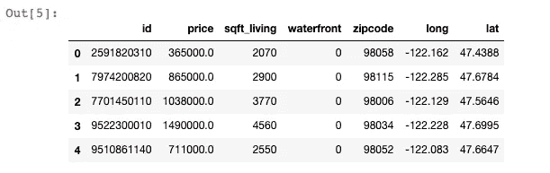
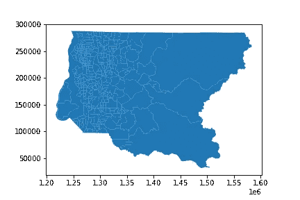
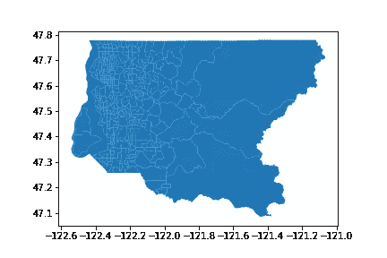
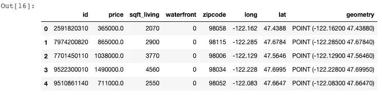
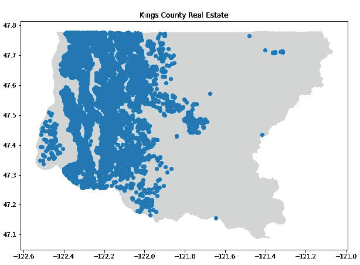
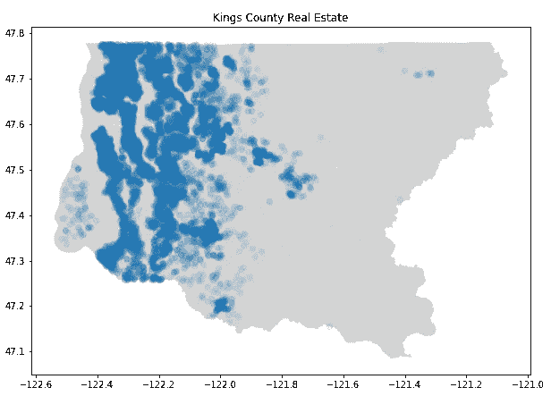
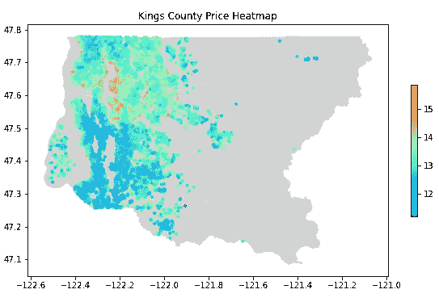
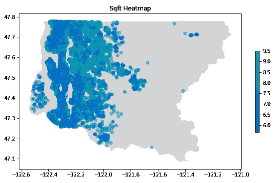

# 用 GeoPandas 绘制地图

> 原文：<https://towardsdatascience.com/plotting-maps-with-geopandas-428c97295a73?source=collection_archive---------1----------------------->

## 地理空间数据绘图初学者指南


托姆·米尔科维奇在 [Unsplash](https://unsplash.com?utm_source=medium&utm_medium=referral) 上拍摄的照片

最近，在我的数据科学项目中，我们接到一个项目，需要创建一个模型来预测房价。我们收到的训练数据集包括与平方英尺、浴室数量、建筑等级等相关的财产数据。我最感兴趣的开始分析的数据是位置数据。我们得到了包含纬度和经度坐标的列，我立即想做的第一件事是创建一个热图，显示房地产价格的分布。

让我们来看看我们的数据:

```
**import** pandas **as** pd
**import** numpy **as** np
**import** geopandas **as** gpd
**import** matplotlib.pyplot **as** plt
**from** shapely.geometry **import** Point, Polygondf = pd.read_csv('kc_house_data_train.csv')
df = df[['id', 'price', 'sqft_living', 'waterfront', 'zipcode', 'long', 'lat']]
df.head()
```



KC 房地产数据，图片由作者提供

## 形状文件

在我们绘制这些坐标之前，我们需要一个“shapefile”来绘制它们。如果你和我一样，是绘制地理空间数据的新手，“shapefiles”是一个非常陌生的话题。幸运的是，我找到了这个精彩的描述:

> [“shape file 格式是一种数字矢量存储格式，用于存储几何位置和相关属性信息。”](https://en.wikipedia.org/wiki/Shapefile)

基本上，像 Python 这样利用 Geopandas 的编码语言可以读取 shapefiles 并将它们转换成您可以在其上绘图的功能地图。令我惊讶的是，shapefiles 很容易从很多开源数据库在线获得。形状文件被指定为。shp’—形状格式/几何文件；但是它们也依赖于相关的。shx' —形状索引格式，以及'.‘DBF’—属性格式文件正常工作。所以，为了利用。shp '文件，您还必须将其他两个强制文件扩展名保存在同一目录中。让我们看看 Python 中的 shapefile。

```
kings_county_map = gpd.read_file('kc_tract_10.shp')
kings_county_map.plot()
```



作者图片

现在我们有了数据集位置的轮廓(华盛顿州金县。)您可能会注意到，我们的轴不是指纬度和经度坐标。这可以使用[坐标参考系统](https://geopandas.org/docs/user_guide/projections.html)或 CRS 进行调整。最常用的 CRS 是 *WGS84* 横向/纵向投影。

```
kings_county_map.to_crs(epsg=4326).plot()
```



作者图片

## 地理数据库数据框架

现在我们已经将 shapefile 映射到了正确的坐标，我们可以开始格式化我们的房地产数据了。为了查看数据帧中的属性所在的位置，我们首先需要将数据重新格式化为“GeoPandas 数据帧”

```
crs = {'init':'EPSG:4326'}
geometry = [Point(xy) for xy in zip(df['long'], df['lat'])]
geo_df = gpd.GeoDataFrame(df, 
                          crs = crs, 
                          geometry = geometry)
```

为了匹配“shapefile ”,我们需要指定相同的 CRS。接下来，我们需要利用 [Shapely](https://geopandas.readthedocs.io/en/latest/gallery/create_geopandas_from_pandas.html) 将我们的纬度和经度数据转换成几何点。最后，将带有“crs”和“geometry”变量的原始数据框传递给 GeoDataFrame 函数将创建“geo_df ”,它是原始数据框的副本，但带有新创建的“geometry”列。

```
geo_df.head()
```



GeoPandas 数据框架，图片由作者提供

## 形象化

现在，我们的 shapefile 和 GeoPandas 数据帧都已正确格式化，我们可以开始可视化房地产数据的有趣部分了！让我们在 shapefile 地图上绘制我们的属性数据的位置。通过利用 Matplotlib 的子图，我们可以在同一轴上绘制两个数据集，并查看属性的位置。

```
fig, ax = plt.subplots(figsize = (10,10))
kings_county_map.to_crs(epsg=4326).plot(ax=ax, color='lightgrey')
geo_df.plot(ax=ax)
ax.set_title('Kings County Real Estate')
```



作者图片

我们可以看到，金县的大部分地产位于该县的西部。尽管如此，由于点的密度很高，很难判断是在北边还是南边有更多的房子。

```
fig, ax = plt.subplots(figsize = (10,10))
kings_county_map.to_crs(epsg=4326).plot(ax=ax, color='lightgrey')
geo_df.plot(ax=ax, alpha = .1 )
ax.set_title('Kings County Real Estate')
plt.savefig('Property Map')
```



作者图片

通过减少 GeoPandas 地块中的 alpha，我们现在可以看到位于该县西北部的房屋更多，因为蓝色地块与南部相比密度更大。

这很好，我们可以看到房产的位置，但在决定合适的房子时，最重要的因素是什么？价格。我们可以使用相同的绘图，但是我们可以在数据框架中指定价格列来创建热图！(*注意，* w *e* [*对数转换*](https://onlinestatbook.com/2/transformations/log.html) *我们的价格数据，以减少异常值如何扭曲我们的数据。*)

```
geo_df['price_log'] = np.log(geo_df['price'])fig, ax = plt.subplots(figsize = (10,10))
kings_county_map.to_crs(epsg=4326).plot(ax=ax, color='lightgrey')
geo_df.plot(column = 'price_log', ax=ax, cmap = 'rainbow',
            legend = True, legend_kwds={'shrink': 0.3}, 
            markersize = 10)
ax.set_title('Kings County Price Heatmap')
plt.savefig('Heat Map')
```



作者图片

最后，我们现在可以很容易地看到价格较高的房屋位于国王县！这是有道理的，因为西北部的红色圆圈包围了西雅图和麦地那，这是比尔盖茨和杰夫·贝索斯的家。)如果我们想看同样的图，但对于平方英尺的物业，我们可以:

```
geo_df['sqft_log'] = np.log(geo_df['sqft_living'])fig, ax = plt.subplots(figsize = (10,10))
kings_county_map.to_crs(epsg=4326).plot(ax=ax, color='lightgrey')
geo_df.plot(column = 'sqft_log', ax=ax, cmap = 'winter',
            legend = True, legend_kwds={'shrink': 0.3},
            alpha = .5)
ax.set_title('Sqft Heatmap')
```



作者图片

我们现在可以看到，随着我们远离西雅图，经度-122.3 以东的房子往往有更多的平方英尺。

## 结论

我希望这篇快速教程有助于理解如何使用 GeoPandas，以及为什么它是如此强大的工具。在任何探索性数据分析过程中，使用 GeoPandas 都是可视化地理空间数据的好方法。它提供了一种对数据集进行推断的方法，最重要的是，它让每个人都可以看到数据。

## 来源

*   [https://geopandas.org/index.html](https://geopandas.org/index.html)
*   https://en.wikipedia.org/wiki/Shapefile
*   【https://www.kingcounty.gov/services/gis/GISData.aspx 
*   [https://onlinestatbook.com/2/transformations/log.html](https://onlinestatbook.com/2/transformations/log.html)
*   [https://matplotlib . org/stable/API/_ as _ gen/matplotlib . py plot . plot . html](https://matplotlib.org/stable/api/_as_gen/matplotlib.pyplot.plot.html)
*   [https://www . CNBC . com/2019/06/25/Medina-wash-home-to-Jeff-be zos-and-bill-gates-running-out-of-money . html](https://www.cnbc.com/2019/06/25/medina-wash-home-to-jeff-bezos-and-bill-gates-running-out-of-money.html)