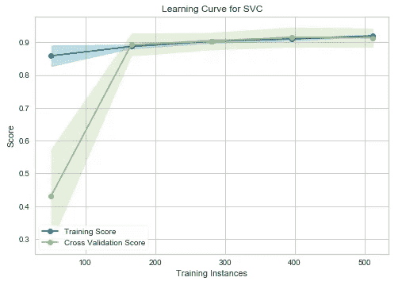
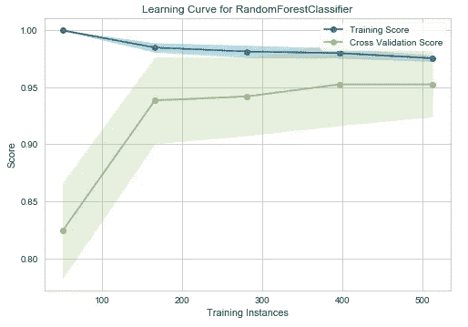
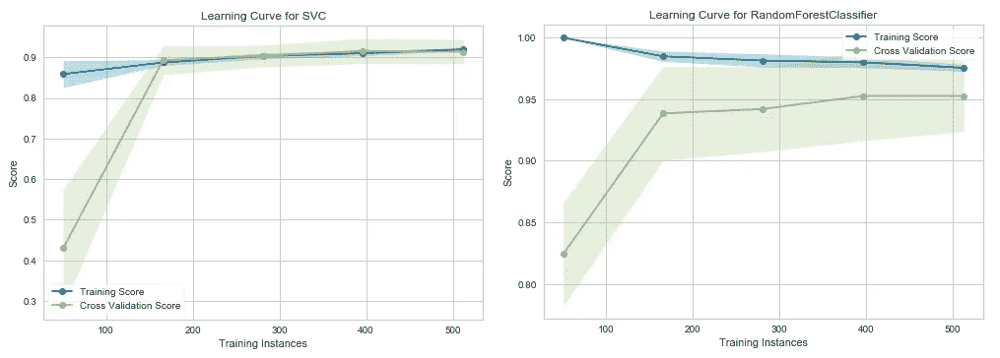

# 用一行代码绘制学习曲线

> 原文：<https://towardsdatascience.com/plotting-the-learning-curve-with-a-single-line-of-code-90a5bbb0f48a?source=collection_archive---------19----------------------->

## 查看您的模型从添加更多训练数据中获益多少


科林·卡特在 [Unsplash](https://unsplash.com/) 上的照片

***学习曲线*** 是任何数据科学家工具箱中的另一个伟大工具。这是一种可视化技术，可以看到我们的模型从添加更多的训练数据中受益多少。它显示了具有不同数量的训练样本的机器学习模型的训练分数和测试分数之间的关系。通常，交叉验证程序在绘制学习曲线时生效。

一个好的 ML 模型非常适合训练数据，也可以推广到新的输入数据。有时，ML 模型可能需要更多的训练实例，以便推广到新的输入数据。添加更多的训练数据有时会有利于模型进行概括，但并不总是如此！我们可以通过查看它的学习曲线来决定是否添加更多的训练数据，以建立一个更具普遍性的模型。

绘制学习曲线通常需要编写许多行代码，并且消耗更多的时间。但是，多亏了 Python **Yellowbrick** 库，现在事情就简单多了！通过正确使用它，我们可以只用一行代码就绘制出学习曲线！在本文中，我们将讨论如何用 Yellowbrick 绘制学习曲线，并学习如何解读它。

## 先决条件

为了充分利用今天的内容，建议阅读我的 [**k-fold 交叉验证浅显易懂的**](/k-fold-cross-validation-explained-in-plain-english-659e33c0bc0) 文章的*“使用 k-fold 交叉验证评估模型的性能”部分。*

除此之外，最好了解**支持向量机**和**随机森林**算法。这是因为，今天，我们根据这些算法绘制学习曲线。如果你不熟悉它们，就看看我写的以下内容。

*   [**支持向量机与 Scikit-learn**](https://medium.com/data-science-365/support-vector-machines-with-scikit-learn-555fa56cef25)
*   [**随机森林——决策树的集合**](/random-forests-an-ensemble-of-decision-trees-37a003084c6c)

# 安装**黄砖**

Yellowbrick 没有默认的 Anaconda 安装程序。您需要手动安装它。要安装它，打开 Anaconda 提示符并运行下面的命令。

```
pip install yellowbrick
```

如果那对你不起作用，用 ***用户*** 标签试试下面的。

```
pip install yellowbrick --user
```

或者你也可以用**康达锻造**频道试试。

```
conda install -c conda-forge yellowbrick
```

或者用 **DistrictDataLabs** 频道试试。

```
conda install -c districtdatalabs yellowbrick
```

以上任何一种方法都会安装最新版本的 Yellowbrick。

# 绘制学习曲线

现在，考虑以下示例代码，其中我们使用 Scikit-learn 内置的**乳腺癌数据集**绘制了一个 **SVM** 和一个**随机森林分类器**的学习曲线。该数据集有 30 个特征和 569 个训练样本。让我们看看添加更多数据将有利于 SVM 和随机森林模型推广到新的输入数据。

## 学习曲线— SVM

等到加载 Python 代码！



(图片由作者提供)

## 学习曲线—随机森林分类器

等到加载 Python 代码！



(图片由作者提供)

# 解释



(图片由作者提供)

在上图中，训练集的准确率标记为**“训练分”**，测试集的准确率标记为**“交叉验证分”**。直到大约 175 个训练实例，SVC(支持向量分类器)模型的训练分数(左图)远大于测试分数。因此，如果当前数据集的训练实例远少于 175 个(例如，大约 100 个)，则添加更多的训练实例将提高泛化能力。但是，在 175 水平之后，该模型可能不会从添加更多的训练数据中受益。对于随机森林分类器(右图)，我们可以看到训练和测试分数尚未收敛，因此该模型可能会受益于添加更多的训练数据(例如，大约 700–1000 个训练实例)。

# 它是如何工作的！

当我们执行 **learning_curve()** 函数时，很多工作都是在幕后进行的。我们只需要运行一行代码来绘制学习曲线。这就是黄砖的力量！ **learning_curve()** 函数的第一个参数应该是 Scikit-learn 估计器(这里是 SVM 或随机森林分类器)。第二个和第三个应该是 **X** (特征矩阵)和 **y** (目标向量)。 **"cv"** 定义交叉验证的折叠数。标准值是 3、5 和 10(这里是 10)。**评分**参数包含模型的评分方法。在分类上，首选**【准确性】****【roc _ AUC】**。回归中常用**【R2】****【负均方误差】**。除此之外，还有许多评估指标。你可以通过访问[这个链接](https://scikit-learn.org/stable/modules/model_evaluation.html)找到他们。

当我们执行 **learning_curve()** 函数时，交叉验证过程在后台发生。正因为如此，我们才输入 **X** 和 **y** 。我们不需要把数据集拆分为 **X_train** 、 **y_train** 、 **X_test** 、 **y_test** 。在交叉验证中，根据 **cv** 中指定的折叠数在内部进行分割。在这里使用交叉验证可以保证模型的准确性分数不会受到随机数据分割过程的太大影响。如果你只是使用 **train_test_split()** 函数*而没有* t 交叉验证，那么根据你在 **train_test_split()** 函数内提供的 **random_state** ，准确率会有很大差异。在交叉验证中，使用 10 次(cv=10)这样迭代的平均值来计算精确度！

# 关键要点

学习曲线是一个很好的工具，你应该把它放在你的机器学习工具包里。它可用于查看您的模型从添加更多训练数据中获益多少。有时，添加更多数据将有利于模型推广到新的输入数据。通常，交叉验证程序在绘制学习曲线时生效，以避免随机数据分割过程的影响。

**学习曲线**不应与**验证曲线**混淆，后者用于绘制单个超参数的影响。两条曲线的功能完全不同。如果你有兴趣了解更多关于验证曲线的知识，你可以阅读我的**[**验证曲线讲解——绘制单个超参数**](/validation-curve-explained-plot-the-influence-of-a-single-hyperparameter-1ac4864deaf8)**的文章。****

****感谢阅读！****

****本教程由[*Rukshan Pramoditha*](https://www.linkedin.com/in/rukshan-manorathna-700a3916b/)*，*数据科学 365 博客作者设计创作。****

****在 https://rukshanpramoditha.medium.com 阅读我的其他文章****

****2021–04–26****