# 火车、公共汽车还是飞机？使用访问和流行度度量对兴趣点进行预测分类

> 原文：<https://towardsdatascience.com/poi-classification-using-visit-and-popularity-metrics-part-1-ae5e94f92077?source=collection_archive---------33----------------------->

## 使用地理空间要素对公交车站、火车站或机场等位置进行分类


图片由安妮·斯普拉特和昂斯普拉什拍摄

本文旨在展示如何使用来自 [SafeGraph](https://www.safegraph.com/) 的适用真实世界数据集，通过监督机器学习进行基本分类。SafeGraph 是一家数据提供商，为数百家企业和类别提供 POI 数据。它向[的学者](https://www.safegraph.com/academics)免费提供数据。对于这个项目，我选择使用 SafeGraph 模式数据，以便将记录分类为各种 POI。模式数据的模式可以在这里找到:[模式信息](https://docs.safegraph.com/v4.0/docs/places-schema#section-patterns)

从商店里众多可供选择的类别中，这个项目着重于不同运输服务的分类。为此项目选择的类别有:

*   公共汽车和其他车辆运输系统
*   铁路运输
*   其他机场运营

这些类别中的每一个都与火车站、汽车站和机场数据的 POI 数据相关联。

本文是使用这些数据的三部分系列文章的第一部分:

*   使用 safegraph 数据和 sklearn 分类器进行 POI 分类
*   使用 PCA 和交叉验证的模型调整
*   使用 spark 深度学习分类器的兴趣点分类
*   单一 NAICS 代码内的 POI 分类(快餐店分类)


图片来自 [Markus Spiske](https://unsplash.com/@markusspiske) 和 Unsplash

下面是为这个项目编写的代码的快照和代码过程的简要描述。这个项目代码的链接可以在这里找到:[笔记本链接](https://colab.research.google.com/drive/13Nzf0HhnP8UnsrCYeunXlha72LFBLH1W?usp=sharing)

**第 1 部分:依赖关系**

以下是该项目的依赖项。我们这个项目需要的包是 P **和 as** ， **NumPy** ， **Seaborn** ，M **atplotlib** ，P **yspark**

```
import pandas as pdimport numpy as npimport seaborn as snsimport matplotlib.pyplot as pltxfrom sklearn.metrics import plot_confusion_matrix
```

— —

```
!apt-get install openjdk-8-jdk-headless -qq > /dev/null!wget -q [https://www-us.apache.org/dist/spark/spark-3.1.2/spark-3.1.2-bin-hadoop2.7.tgz](https://www-us.apache.org/dist/spark/spark-3.1.2/spark-3.1.2-bin-hadoop2.7.tgz)!tar xf spark-3.1.2-bin-hadoop2.7.tgz!pip install -q findspark!pip install pyspark
```

— —

```
import findsparkfindspark.init(“/content/spark-3.1.2-bin-hadoop2.7”)from pyspark.sql import SparkSessionspark = SparkSession.builder.master(“local[*]”).getOrCreate()
```

**第二部分:数据加载**

```
from pydrive.auth import GoogleAuthfrom pydrive.drive import GoogleDrivefrom google.colab import authfrom oauth2client.client import GoogleCredentials auth.authenticate_user()gauth = GoogleAuth()gauth.credentials = GoogleCredentials.get_application_default()drive = GoogleDrive(gauth)def pd_read_csv_drive(id, drive, dtype=None): downloaded = drive.CreateFile({‘id’:id}) downloaded.GetContentFile(‘Filename.csv’) return(pd.read_csv(‘Filename.csv’,dtype=dtype))def get_drive_id(filename): drive_ids = {‘patterns’ : ‘1ReqpLgv50_3mCvZuKLlMdHxwfCPIHmqz’} return(drive_ids[filename])transportation_df = pd_read_csv_drive(get_drive_id(‘patterns’), drive=drive)transportation_df.head(3)
```

输出如下所示(点击图片查看详情):

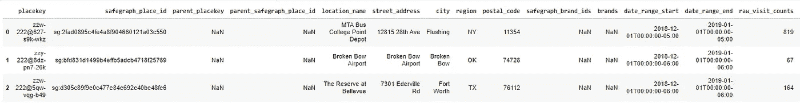

下表是 2018 年 12 月上述三个兴趣点类别的模式数据。选择这个特殊的月份是因为公共交通在假日季节更有可能被利用——从而为每个记录显示更清晰的受欢迎程度和游客指标。

我们将用作分类模型特征的一些列是:

*   **raw_visit_counts —** 在日期范围内，我们的面板中对此兴趣点的访问次数。
*   **raw_visitor_counts —** 在日期范围内，来自我们面板的访问该兴趣点的独立访问者的数量。
*   **每日访问次数—** 在所覆盖的时间段内，每天(当地时间)访问兴趣点的次数。
*   **distance_from_home —** 访客(我们已确定其住所的访客)离家的中间距离，以米为单位。
*   **中值停留时间—** 中值最小停留时间，以分钟为单位。
*   **bucked _ dwell _ times—**关键字是分钟范围，值是在该持续时间内的访问次数
*   **popularity_by_hour —** 将一天中的某个小时映射到当地时间日期范围内每小时的访问量。数组中的第一个元素对应于从午夜到凌晨 1 点的时间
*   **popularity_by_day —** 将一周中的某一天映射到日期范围内每天(当地时间)的访问次数
*   **device_type —** 使用 android 和 ios 访问兴趣点的人数。仅显示至少包含 2 个设备的设备类型，包含少于 5 个设备的任何类别都报告为 4

**第 3 节:数据清理**

第一步是删除不必要的列。

```
transportation_df = transportation_df.drop([‘parent_safegraph_place_id’,’placekey’,’safegraph_place_id’,’parent_placekey’,’parent_placekey’,’safegraph_brand_ids’,’brands’, ‘poi_cbg’], axis = 1)transportation_df.head(3)
```

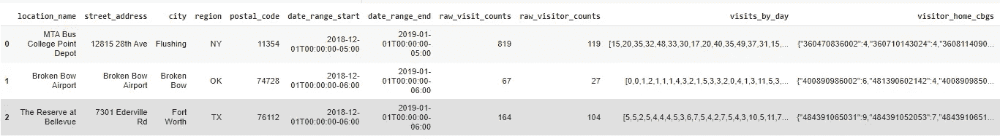

这里我们将**parent _ safe graph _ place _ id**、 **placekey** 、 **parent_placekey** 、 **safegraph_brand_ids** 、 **brands** 、 **poi_cbg** 。这些列与标识符、品牌、人口普查区块组和位置键相关。这些列与这个特定项目的范围无关，因此我们将它们删除。

#创建基础事实类列(帮助函数)

```
def class_definer(record): fixed_record = record.lower() if(‘bus’ in fixed_record): return ‘Bus’ elif(‘airport’ in fixed_record): return ‘Airport’ elif(‘train’ in fixed_record): return ‘Train’ elif(‘metro’ in fixed_record): return ‘Train’ elif(‘transport’ in fixed_record): return ‘Bus’ elif(‘amtrak’ in fixed_record): return ‘Train’ elif(‘bart’ in fixed_record): return ‘Train’ elif(‘cta’ in fixed_record): return ‘Train’ elif(‘mta’ in fixed_record): return ‘Train’ elif(‘transit’ in fixed_record): return ‘Bus’ elif(‘mbta’ in fixed_record): return ‘Train’ elif(‘station’ in fixed_record): return ‘Train’ elif(‘railway’ in fixed_record): return ‘Train’ else: return ‘Unknown’transportation_df['Class'] = transportation_df['location_name'].transform(lambda x: class_definer(x))transportation_df.head(3)
```

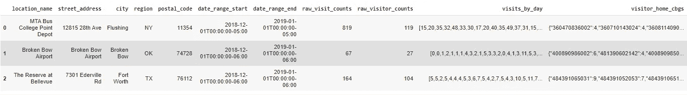

这些代码片段试图创建一个类列来建立监督学习算法(如分类)所需的基础事实。用于此项目的数据带有一些警告，尤其是公交车站数据。NAICS 公交车站类别包括“公交车站和其他交通服务”。该类别尤其包含多个项目，如公交车站、卡车租赁和游艇服务。因此，为了删除不相关的记录，使用了上面的函数。

```
transportation_df = transportation_df[transportation_df[‘Class’] != ‘Unknown’].dropna()transportation_df.head(3)
```

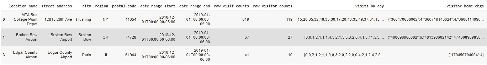

这些未知的列代表了汽车运输记录，这些记录与模式数据中的公共汽车数据一起出现。我们可以放弃这些记录，因为它们并不完全符合公共汽车服务的概念——更倾向于卡车服务、游艇租赁和其他远离公共汽车服务概念的交通服务。

现在，数据被正确格式化，并且有一个可用于分类算法的类列。下一步是格式化数据帧，使所有的特征都能用于分类算法。这个过程需要水平扩展列，例如**按天访问**列和**按小时流行度**列。这些需要水平展开的列中，有些是数组的列，有些是 JSON 的列。我们将首先研究 JSON 列的水平扩展:

为此，我们将使用 pyspark，特别是 from_json 表达式来水平展开列。为此，我们必须首先将 pandas 数据帧转换为 Spark 数据帧。

```
transportation_df = spark.createDataFrame(transportation_df)transportation_df.show(2)
```

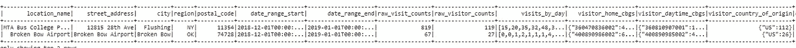

既然数据在 Spark 数据框架中，我们需要为需要展开的 JSON 字符串列创建一个模式。这些模式将显示 JSON 字符串展开时产生的唯一列，以及与该列相关联的数据类型，使用该模式我们可以展开 JSON 字符串列。

```
#Horizontal Explosion of JSON columns using Pysparkfrom pyspark.sql.functions import from_json,exprfrom pyspark.sql.types import StructType, StructField, StringType, ArrayType, IntegerTypeday_schema = StructType( [ StructField(‘Monday’, IntegerType(),True), StructField(‘Tuesday’, IntegerType(),True), StructField(‘Wednesday’, IntegerType(),True), StructField(‘Thursday’, IntegerType(),True), StructField(‘Friday’, IntegerType(),True), StructField(‘Saturday’, IntegerType(),True), StructField(‘Sunday’, IntegerType(),True) ])device_schema = StructType( [ StructField(‘android’, IntegerType(),True), StructField(‘ios’, IntegerType(),True) ])bucketedDT_schema = StructType( [ StructField(‘<5’,IntegerType(),True), StructField(‘5–10’,IntegerType(),True), StructField(‘11–20’,IntegerType(),True), StructField(‘21–60’,IntegerType(),True), StructField(‘61–120’,IntegerType(),True), StructField(‘121–240’,IntegerType(),True), StructField(‘>240’,IntegerType(),True) ])transportation_df = transportation_df.withColumn(‘popularity_by_day’, from_json(‘popularity_by_day’, day_schema)).withColumn(‘device_type’, from_json(‘device_type’, device_schema)).withColumn(‘bucketed_dwell_times’,from_json(‘bucketed_dwell_times’,bucketedDT_schema)).select(‘location_name’,’raw_visit_counts’,’raw_visitor_counts’,’visits_by_day’,‘distance_from_home’,’median_dwell’,‘bucketed_dwell_times.*’,’popularity_by_hour’,’popularity_by_day.*’,‘device_type.*’,’Class’)transportation_df = transportation_df.toPandas()transportation_df.head(3)
```

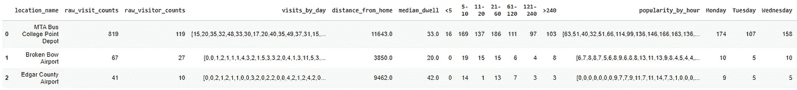

现在 JSON 字符串已经展开，我们可以展开数组列了。由于这在 pandas 中很容易做到，我们可以将数据帧转换回 Pandas 数据帧。数组列的扩展要求用数组填充列，而不是像数组一样格式化的字符串列。Safegraph 模式数据使这些列成为字符串而不是数组，因此第一步是将字符串转换为数组。这可以使用 ast 包中的 literal_eval 函数来完成。从这里，我们可以获取位于每个索引中的单个值，并将它们分解到单独的列中。

```
from ast import literal_evaltransportation_df[‘popularity_by_hour’] = transportation_df[‘popularity_by_hour’].transform(lambda x: literal_eval(x))pops = [‘popularity_’ + str(i) for i in range(1,25)]transportation_df[pops] = pd.DataFrame(transportation_df.popularity_by_hour.to_list(), index=transportation_df.index)transportation_df = transportation_df.drop([‘popularity_by_hour’], axis = 1)transportation_df = transportation_df.reindex()transportation_df.drop(‘visits_by_day’, axis=1, inplace=True)transportation_df.head(3)
```

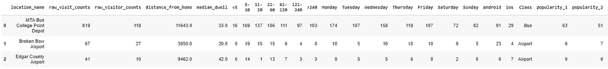

我们需要做的数据清理的最后一部分是使用 Sklearn LabelEncoder 函数将类函数转换为分类模型的数值。

```
from sklearn import preprocessingle = preprocessing.LabelEncoder()le.fit(transportation_df[‘Class’])transportation_df[‘Class’] = le.transform(transportation_df[‘Class’])transportation_df.head(3)
```

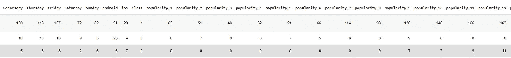

**第四节:分类**


图像来自[翁贝托](https://unsplash.com/@umby)和 Unsplash

因为有 3 个唯一的类，我们需要使用一个多类分类器。我们将尝试高斯朴素贝叶斯、决策树和 K 近邻分类器。首先，我们必须将数据分成测试集和训练集。

```
from sklearn.metrics import confusion_matrixfrom sklearn.model_selection import train_test_splitx_cols = []for item in list(transportation_df.columns):if(item != ‘Class’ and item != ‘location_name’):x_cols.append(item)X = transportation_df[x_cols]y = transportation_df[‘Class’]X_train, X_test, y_train, y_test = train_test_split(X, y, random_state = 0)
```

**高斯朴素贝叶斯分类器:**

这里有一些关于朴素贝叶斯分类器功能的背景知识:[高斯朴素贝叶斯](/naive-bayes-classifier-81d512f50a7c)

```
from sklearn.naive_bayes import GaussianNBgnb = GaussianNB().fit(X_train, y_train)gnb_predictions = gnb.predict(X_test)gnb_predictionsaccuracy = gnb.score(X_test, y_test)print(accuracy)
confusion_matrix(y_test, gnb_predictions)
```

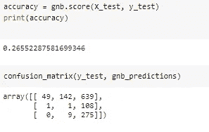

现在，让我们使用热图来可视化结果

```
plot_confusion_matrix(gnb, X_test, y_test, normalize=’true’, values_format = ‘.3f’, display_labels=[‘Airport’,’Bus’,’Train’])
```

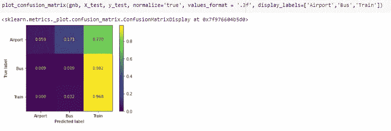

黄色表示高发，紫色表示低发。我们的“正确”预测显示在从左上角到右下角的对角线上。

理想情况下，我们会在对角线上看到黄色，在其他地方看到紫色。

这表明高斯朴素贝叶斯在分类这个特定数据集方面做得不太好。这可能是由于分类器单独考虑每个特征，而没有考虑它们的相关性(因此分类器是“幼稚的”)。当要素具有高相关系数时(如该特定数据集，其中许多要素从一列展开并彼此直接相关),这将使分类器难以正常工作。

该模型的精度约为 26%。热点图显示，许多实际上是机场的值被错误分类为火车站。同样可以说，真正的汽车站被错误地归类为火车站。这表明大多数记录实际上被归类为火车站。

**决策树:**

这里有一些关于决策树分类器功能的背景知识:[决策树](https://medium.com/swlh/decision-tree-classification-de64fc4d5aac)

```
from sklearn.tree import DecisionTreeClassifierdtree_model = DecisionTreeClassifier(max_depth = 3).fit(X_train, y_train)dtree_predictions = dtree_model.predict(X_test)dtree_model.score(X_test,y_test)confusion_matrix(y_test, dtree_predictions)
```

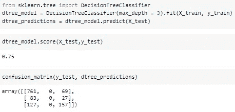

使用热图可视化结果

```
plot_confusion_matrix(dtree_model, X_test, y_test, normalize=’true’, values_format = ‘.3f’, display_labels=[‘Airport’,’Bus’,’Train’])
```

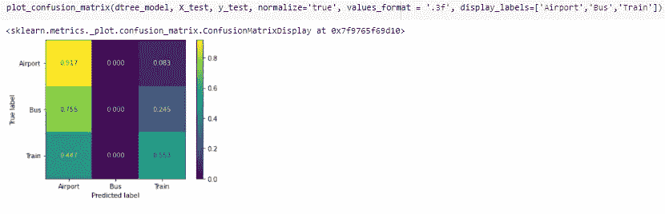

由此可见，决策树模型的表现要比朴素贝叶斯好得多，准确率达到 75%。考虑到这是一个多类分类器，这个精度是相当不错的。

分类器似乎在正确分类机场方面做得非常好，准确率约为 91.7%，表明考虑了数据各种特征之间相关性的模型可以很好地对机场数据进行正确分类。公交车站记录就不一样了，因为没有一个真正的公交车站记录被归类为公交车站。火车站数据似乎表现稍好，将大约 55.3%的真实火车站数据分类为火车站。关于这个特定模型的预测，一个有趣的观察是，没有一个记录被归类为公交车站——无论是正确的还是不正确的。这可能是由于与火车站和机场记录相比，汽车站记录的数量较少，以及决策树算法的性质。决策树算法在使用非常平衡的数据时表现非常好，但在不平衡的数据上表现不如我们这里的情况。

**K-最近邻:**

这里有一些关于 KNN 分类器功能的背景知识: [KNN](https://www.analyticsvidhya.com/blog/2018/03/introduction-k-neighbours-algorithm-clustering/)

```
from sklearn.neighbors import KNeighborsClassifierknn = KNeighborsClassifier(n_neighbors = 22).fit(X_train, y_train)accuracy = knn.score(X_test, y_test)knn_predictions = knn.predict(X_test)confusion_matrix(y_test, knn_predictions)
```

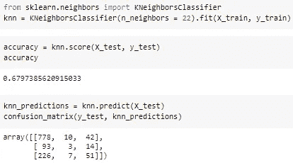

使用热图可视化结果

```
plot_confusion_matrix(knn, X_test, y_test, normalize=’true’, values_format = ‘.3f’, display_labels=[‘Airport’,’Bus’,’Train’])
```

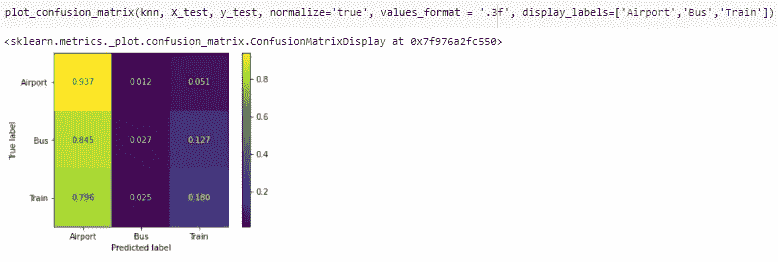

该分类器的准确率约为 68.0%。该分类器在对机场记录进行正确分类方面做得非常好，准确率约为 93.7%。正确分类的公交车站的数量不再是 0，但仍然很低，这也可以归因于不平衡的数据。与决策树模型相比，该分类器在列车分类方面表现稍差，仅将大约 18.3%的真实火车站预测为火车站。

**结论:**

该项目向我们介绍了基于 SafeGraph 模式访问数据的 POI 类别分类。我们的算法在对机场、火车站和公交车站进行分类方面取得了一些成功，所有这些都基于停留时间、游客离家的距离、一天中每个小时的受欢迎程度以及一周中每一天的受欢迎程度。

该系列的下一篇文章(链接即将发布！)将通过调整我们的模型和进行主成分分析来增加我们的分类器的复杂性和能力。

***提问？***

我邀请你在 [SafeGraph 社区](https://www.safegraph.com/academics)的 **#safegraphdata** 频道问他们，这是一个面向数据爱好者的免费 Slack 社区。获得支持、共享您的工作或与 GIS 社区中的其他人联系。通过 SafeGraph 社区，学者们可以免费访问美国、英国和加拿大 700 多万家企业的数据。