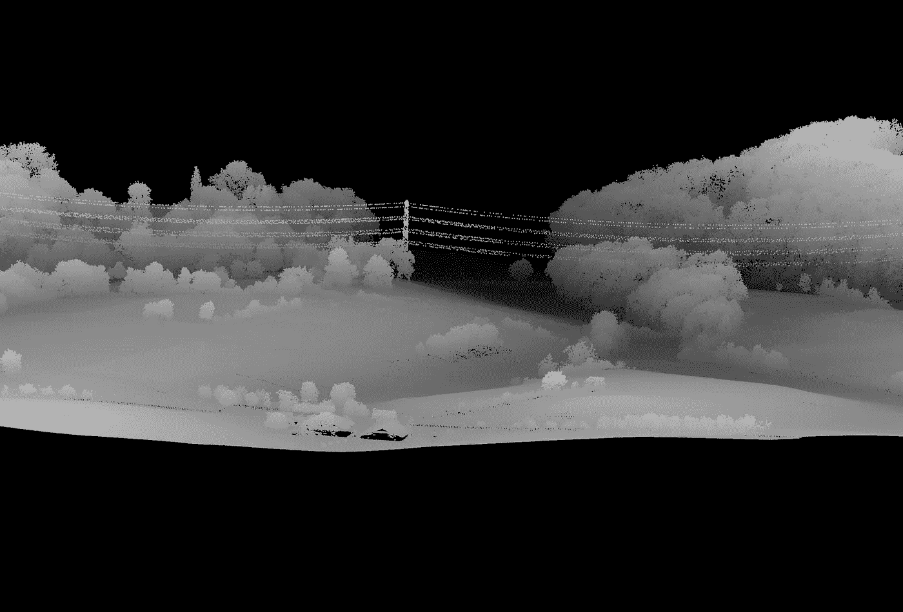
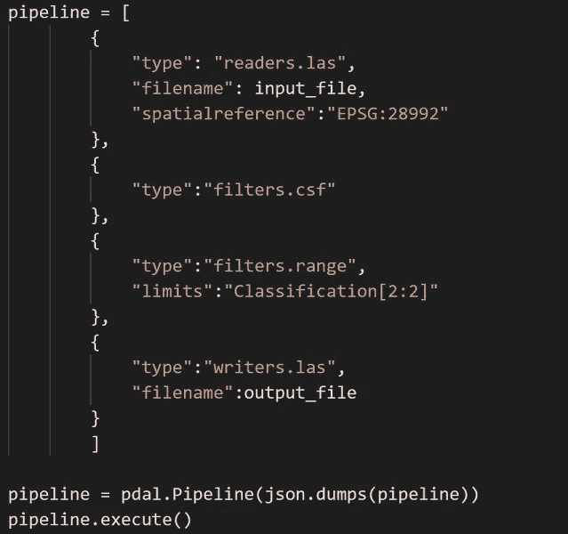
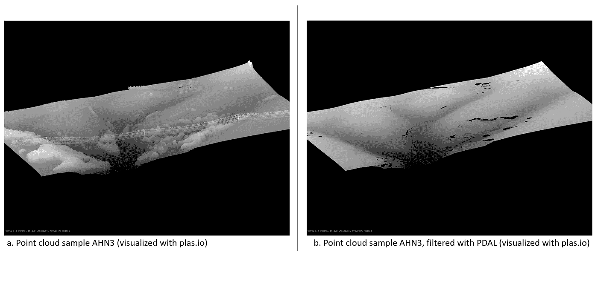
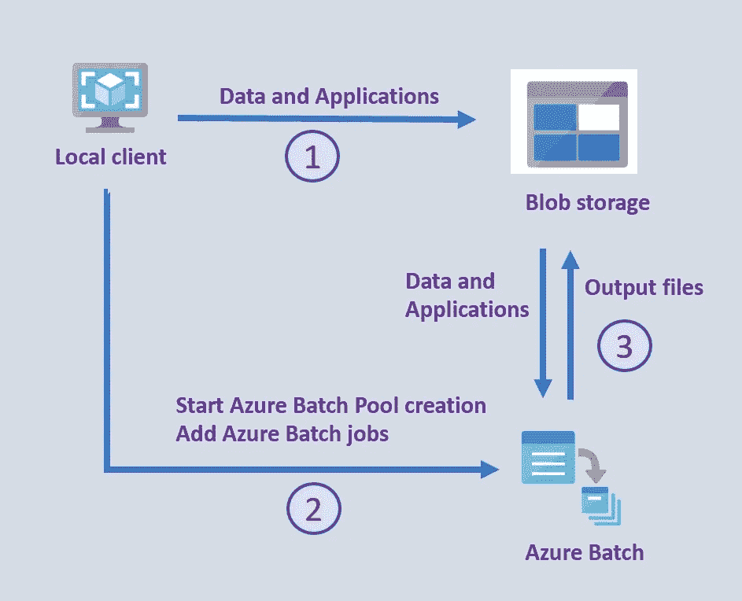

# 云中的点云

> 原文：<https://towardsdatascience.com/point-clouds-in-the-cloud-b7266da4ff25?source=collection_archive---------13----------------------->

## 使用 Azure Batch 和 PDAL 按比例处理激光雷达数据

来自开放数据集 AHN3 的点云样本，用 plas.io 可视化(图由作者提供)

点云存在许多许多的 x，y，z 坐标来描述环境或物体，如建筑物。通过激光技术(LiDAR)获取的点云通常带有额外的测量值和每个坐标的特征。例如，反射强度、返回次数、返回、扫描角度和 RGB 值。换句话说，点云本质上是海量的数据集。在这里，这些大规模数据集的处理通过使用开源点数据抽象库(PDAL)进行演示，并通过 Azure Batch 运行。

## **用 PDAL 处理**

激光雷达数据的处理在这里用开源库 [PDAL](https://pdal.io/) 完成。通过该库，点云数据可以与许多不同的格式相互转换(例如，las、laz、geotif、geojson、ascii、pgpointcloud、hdf5、numpy、tiledDB、ept 等，以及专有数据格式)。此外，该库支持对数据进行[过滤](https://pdal.io/stages/filters.html)操作，如重投影、分类、过滤、DEM 和网格创建等。PDAL 可以作为一个应用程序独立执行，还有一个 Python [PDAL 扩展](https://pypi.org/project/PDAL/)，这样 PDAL 就可以成为你的 Python 应用程序的一部分。这为将自己的处理逻辑或过滤器合并到激光雷达处理中提供了灵活性。PDAL 扩展使用以 json 格式定义并通过 pdal 实现执行的管道。以下管道示例说明了以下所有依赖于 PDAL 内置功能的步骤:

PDAL 管道示例(作者提供的图片)

-读取输入 las 或 laz 文件，带有设定的参考投影(此处为 EPSG:28992，荷兰的投影坐标系)，

-应用 filters.csf(布料模拟过滤器，张等 2016)对地面和非地面点进行分类，

-应用只选择接地回路的滤波器，

-将过滤后的数据写入 las 文件

此管道使用 AHN3 的样本数据集执行，Ahn 3 是荷兰全国激光雷达开放数据集的第三版，位于南林堡地区。下面是使用 [plas.io](https://plas.io/) 创建的两个视觉效果，a)原始数据集，b)使用管道创建的数据集，显示地面返回，基于【】张等人 2016 的[实现](https://pdal.io/stages/filters.csf.html#filters-csf)。

来自开放数据集 AHN3 的点云样本，用 plas.io 可视化(图由作者提供)

## **用天蓝色批秤**

由于数据量和应用于数据的算法类型，处理激光雷达数据是计算密集型的。扩展处理可能是一个挑战。 [Azure Batch](https://docs.microsoft.com/en-us/azure/batch/batch-technical-overview) 是在 Azure 中高效运行大规模并行和高性能计算(HPC)批处理作业的服务。Azure Batch 创建并管理计算节点(虚拟机)池，安装要运行的应用程序，并调度要在节点上运行的作业。在这里，应用程序将是处理激光雷达数据的(Python)脚本。Azure Batch 可以通过 Azure 门户、Azure Batch APIs 和 Azure Batch SDKs 进行管理。由于地理空间和地球科学领域的许多开发人员和研究人员都熟悉 Python，这里使用了 Azure Batch Python SDK。

下图描述了一般概念。通过一个本地 Python 客户端，Azure 批处理计算池在一个已经存在的 Azure 资源组中提供，该资源组具有一个存储帐户和一个 Azure 批处理帐户。使用客户端(1)将应用/脚本和数据上传到 blob 存储器。在下图中)。然后，使用提供的 Azure 批处理帐户凭据，将创建一个计算池，并提交任务和作业(2)。通过这样做，计算池将应用和数据拉至计算节点，执行处理，并将结果推回 blob 存储(3)。为了更好地理解这个概念的实现，这篇博客文章附有一个 PDAL 在 Azure Batch 上的工作示例 [**GitHub repo**](https://github.com/delange/lidar-batch-python/tree/master/lidar-batch-python/src) 。

Azure Batch 的常规设置。1)本地客户端将数据和应用程序文件上传到 Azure Blob 存储，2)使用 Azure Batch 的 Python SDK，本地客户端开始创建 Azure 批处理池，然后可以添加 Azure 批处理作业以在 LiDAR 文件上运行，3) Azure Batch 自动调度作业和任务，执行处理并将输出文件上传到 Azure Blob 存储。(图由作者提供)

为了与 Azure storage 和 Azure Batch 正确通信，客户端环境需要两个 Python 库，它们是 azure-batch 和 azure-storage-blob(这里分别使用 10.0.0 和 12.8.1 版本)。

针对激光雷达数据运行的应用程序/ Python 脚本需要 PDAL 库，建议从 conda-forge 安装。在 Azure Batch Pool 的初始化过程中，首先会下载一个(迷你)conda 环境，以静默模式安装并初始化，这是通过 StartTask.sh 完成的——在上图的步骤 2 中(有关技术解释和示例，请参见 [repo](https://github.com/delange/lidar-batch-python/tree/master/lidar-batch-python/src) )。

创建 Azure 池后，可以提交作业。对于每个输入激光雷达文件，将执行包括 PDAL 管道在内的 Python 脚本，并将输出 las 文件上传到 Azure blob 存储以实现持久性。

根据 LiDAR 文件的大小和数量，以及要运行的管道的复杂性，您可以创建小型(1 个节点)到非常大(> 1000 个节点)的 Azure 批处理池，可以打开也可以不打开自动缩放选项。这只需要重新调整池的规模，Azure Batch 会处理作业调度和管理，因此提供的代码可以用于大型和小型批处理作业，而无需对代码本身进行任何更改。

这里的意见是我的。

## **参考文献**:

Azure Batch 和 PDAL 代码示例:[https://github . com/de lange/lidar-Batch-python/tree/master/lidar-Batch-python/src](https://github.com/delange/lidar-batch-python/tree/master/lidar-batch-python/src)

azure Batch:[https://docs . Microsoft . com/en-us/azure/Batch/Batch-technical-overview](https://docs.microsoft.com/en-us/azure/batch/batch-technical-overview)

Azure 批处理浏览器:[https://azure.github.io/BatchExplorer/](https://azure.github.io/BatchExplorer/)

用于激光雷达处理的 PDAL:[https://pdal.io/](https://pdal.io/)

浏览器中点云渲染的 plas io:[https://plas . io](https://plas.io)

https://www.ahn.nl/国家激光雷达开放数据集 AHN: [荷兰](https://www.ahn.nl/)

一种基于布料模拟的简易机载激光雷达数据滤波方法。*遥感*。2016;8(6):501.https://doi.org/10.3390/rs8060501[https://www.mdpi.com/2072-4292/8/6/501/htm](https://doi.org/10.3390/rs8060501)