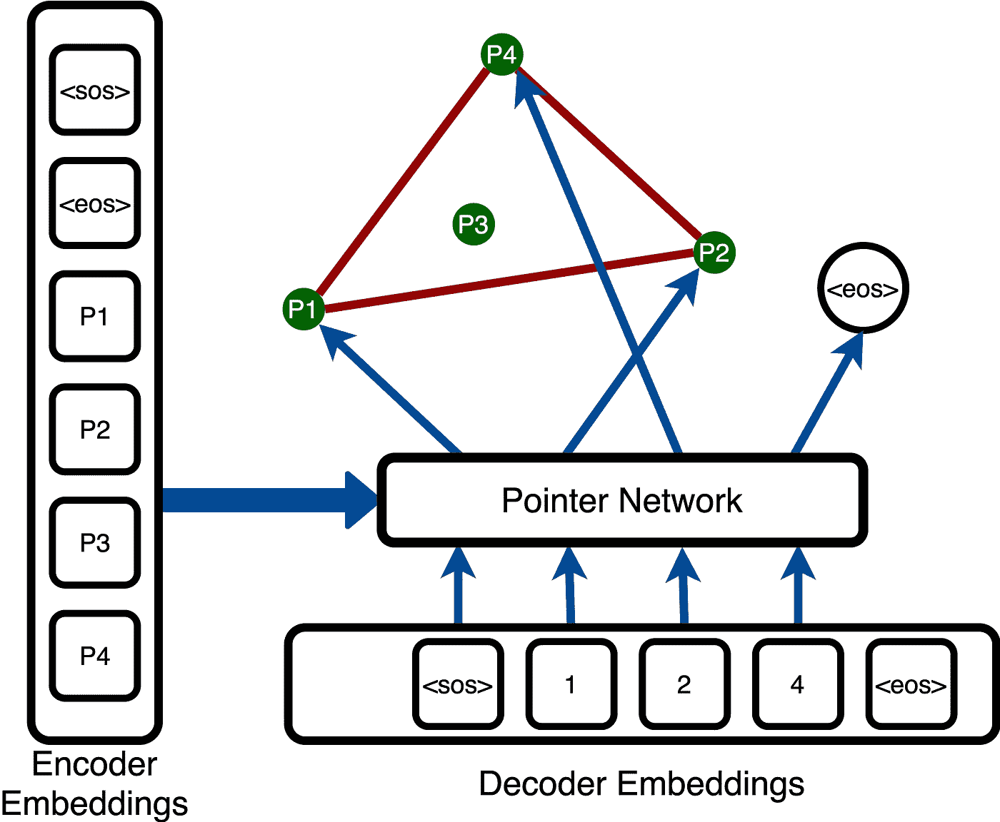
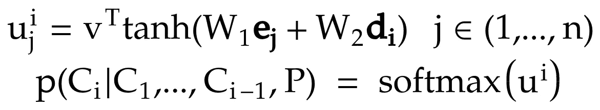
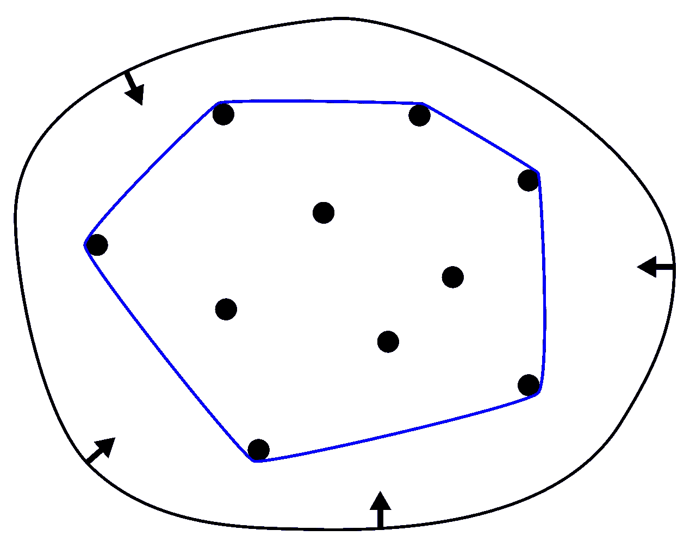
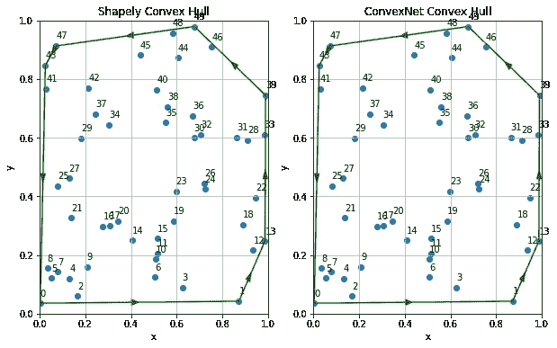
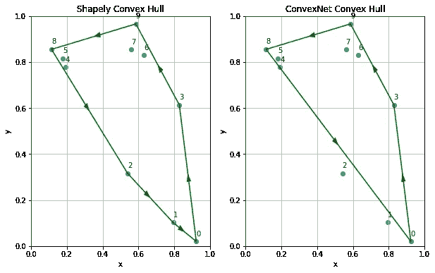

# 带变压器的指针网络

> 原文：<https://towardsdatascience.com/pointer-networks-with-transformers-1a01d83f7543?source=collection_archive---------18----------------------->

## [实践教程](https://towardsdatascience.com/tagged/hands-on-tutorials)

## 是什么让指针网络在今天仍然如此适用？

作者照片。

跟随这款[谷歌 Colab 笔记本](https://colab.research.google.com/drive/1lobspU9b7dTO_HuoX-3nibZspTwfa5aX?usp=sharing)。

[最初的指针网络论文](https://arxiv.org/abs/1506.03134) [ [1](https://arxiv.org/abs/1506.03134) ]最初被 NeurIPS 2015 接受，使得它在深度学习年中相当古老。尽管如此，到目前为止，它已经积累了 1700 多条引用，并继续被集成到现代解决方案中[ [2](https://arxiv.org/abs/1805.11080) ， [3](https://arxiv.org/abs/2002.10880) ]，得到了许多改进[ [4](https://arxiv.org/abs/1611.08307) ， [5](https://ojs.aaai.org//index.php/AAAI/article/view/6492) ]，并激发了替代架构[ [6](https://arxiv.org/abs/1803.08475) ]。它甚至在腾讯人工智能实验室[ [7](https://arxiv.org/abs/2011.13729) ]创建的一个最先进的玩星际争霸 2 的模型中扮演了一个很小但很重要的角色。是什么让指针网络在今天仍然如此适用？

这个简单而优雅的架构解决了序列预测问题中一个微妙的复杂性。假设我们希望预测一个输入序列的索引序列。如果输入的长度是可变的，我们该怎么办？利用现有方法，字典大小(即输入序列索引)必须先验地固定*。*这对于像句子生成这样的输入字典是一组已知字符的问题来说很好。另一方面，组合问题是指针网络出现的地方。指针网络允许我们解决组合优化任务，其中目标是在推理时间而不是在训练时间*定义的输入索引序列。指针网络论文涵盖了三个这样的任务:平面凸包、Delaunay 三角剖分和对称平面旅行推销员问题。*

在 GitHub 上可以找到许多指针网络的实现(你可以在这篇[文章](http://fastml.com/introduction-to-pointer-networks/)中找到一些链接)，但大多数都是在论文发表后不久发表的，并使用基于 LSTM 或 GRU 的编码器，这些编码器后来随着《变形金刚》的成功而不再受欢迎。这篇文章附有一个 Jupyter 笔记本，你可以跟着这里的[一起看。大部分代码改编自 GitHub 用户](https://colab.research.google.com/drive/1lobspU9b7dTO_HuoX-3nibZspTwfa5aX?usp=sharing) [ast0414](https://github.com/ast0414) 的[pointer-networks-py torch](https://github.com/ast0414/pointer-networks-pytorch)repo，解决了整数排序问题。我通过解决平面凸包问题扩展了早期的工作，并用变压器替换了基于 LSTM 的编码器和解码器。

## 应用程序

如前所述，指针网络被应用于组合问题，例如求解平面凸包。指针网络也出现在最近的各种应用中。在 [TStarBot-X](https://arxiv.org/abs/2011.13729) [ [7](https://arxiv.org/abs/2011.13729) ]中，一个玩游戏《星际争霸 2》的 AI 智能体(在其前身[由 DeepMind 创建的 AlphaStar](https://www.nature.com/articles/s41586-019-1724-z) [ [8](https://www.nature.com/articles/s41586-019-1724-z) )中，一个指针网络被用来为给定的动作选择目标单位。 [PolyGen](https://arxiv.org/abs/2002.10880) [ [3](https://arxiv.org/abs/2002.10880) ]，一种独特的 3D 网格生成模型(我在这里写了更多关于[的内容)，采用指针网络将顶点分配给给定的面，一次分配一个面，直到网格拓扑结构构建完成。指针网络甚至被用于在“](/generating-3d-models-with-polygen-and-pytorch-4895f3f61a2e)[具有强化选择句子重写的快速抽象摘要](https://arxiv.org/abs/1805.11080) [ [2](https://arxiv.org/abs/1805.11080) ”中选择很好地概括文档的显著句子。在这篇文章中，我们演示了如何使用指针网络解决平面凸包问题。

# 指针网络是由什么组成的？

指针网络有效地创建了跨越可变数量令牌的注意机制。给定一系列记号 *(t0，T1，…，tn-1)* ，指针网络关注下一个记号 *tn* 的候选输入字典。这些输入候选中的每一个都具有由编码器产生的相关嵌入向量。同样，每个序列令牌都有自己的解码器嵌入。与其他序列预测模型不同，指针网络的构建方式使得输入候选项的数量可以在推理时改变。

指针网络的体系结构。对于每个输出令牌，我们将它的嵌入与输入点的嵌入相结合，以产生对输入点集成员的索引的软最大值。

指针网络的关键创新是具有精心制作的结构的注意力机制。下面的一对公式表达了指针网络逻辑的核心。它首先包括分别乘以编码器嵌入和解码器嵌入的两个可学习的权重，随后是非线性和乘以另一个学习的权重 *v* ，这降低了特征维度。这一层本质上结合了输入和目标嵌入的特征，以创建对应于输入-目标对的激活的二分图。最后，softmax 层表达了与我们的输入嵌入相对应的跨维度的条件概率。我们剩下的(对于批处理中的每一行)是输出序列中任何给定位置的跨输入标记的一行概率。

指针网络由几个可学习的权重组成，后跟输入字典上的 softmax(作者用[https://www.mathcha.io/](https://www.mathcha.io/)创建的照片)。

我们如何将这个表达式翻译成代码？下面的代码片段显示了如何将指针网络实现为 PyTorch 模块。

输入`x_decoder`、`x_encoder`和`mask`分别是由变换器编码器生成的输入嵌入、来自变换器解码器的目标嵌入和屏蔽输入填充的二进制掩码。权重乘法被实现为线性层。此外，softmax 层被屏蔽，从而可以忽略填充和先前预测的标记。

这个模块作为凸包问题整体架构的“任务”层。然而，它被设计为通用的，并且可以应用于涉及一组输入和目标嵌入的其他组合问题。

# 凸包问题

假设我们有一个公告板，上面覆盖着随机放置的图钉。如果我们在这些图钉周围拉伸一条细橡皮筋，使得它包围所有图钉，那么橡皮筋将仅接触图钉组中最外面的点的子集。这个子集在输入点上形成一个凸集*。给定平面点集 *S* ，平面凸包是在所有点上形成凸集的点 *Sc* 的最小子集。由 *S* 中的任何点的子集形成的多边形所覆盖的区域实际上将只覆盖这个凸包的区域的子集。因此，凸包覆盖的区域是集合 *S* 内点的所有子集的并集。*

带箭头的黑色套索是我们的“橡皮筋”，蓝色多边形代表通过将这个“橡皮筋”拟合到我们的点集而形成的凸包(来源:[维基百科](https://en.wikipedia.org/wiki/Convex_hull))。

凸包在数学、统计学、计算机图形学和动物行为学等领域有着广泛的应用。然而，我们只关心凸包作为一个有趣的玩具问题，用指针网络来解决。一组点的凸包是一个组合问题，非常适合用指针网络来解决，我们只需要使用 [Numpy](https://numpy.org/) 和 [Shapely](https://shapely.readthedocs.io/en/stable/manual.html) 就可以轻松地为它生成无限量的训练数据。

我们在(x，y)平面上综合生成均匀分布的样本以用作数据。这些输入点中的每一个都被输入到我们的编码器中，产生一个嵌入，作为我们的输入字典。我们还添加了两个控制标记的一键编码:`<sos>`表示序列的开始，`<eos>`表示序列的结束。因此，这个输入字典的大小取决于我们集合中输入点的数量，加上两个控制标记。指针网络的任务是从该字典中选择标记，以构建凸包序列。更多详情请参见 Google Colab 笔记本。

# 结果

在 Colab 笔记本中，我们在 100，000 个随机生成的输入输出对上训练神经网络，输入长度从 5 到 50 不等。我们还通过应用相同的方法，分别生成长度为 1，000 和 10，000 的验证和测试集。该方法达到了约 81.3%的测试准确率(论文报道为 69.6%)和 99.9%的重叠率(论文报道为 99.9%)。

它产生的凸包非常接近 Shapely 提供的解。在大多数出现错误的情况下，预测的凸包通常与解决方案重叠至少 99%，特别是对于较长的序列(因为单个点对整体区域的贡献较小)。请参阅提供的 Colab 笔记本，亲自尝试并检查代码。

我们基于指针网络的 n=50 的凸包解生成的凸包例子(作者供图)。

n=10 的指针网络生成的凸包例子。少点上的错误导致更大的偏差(作者供图)。

# 结论

指针网络是一种简单但通用的体系结构，它可以合并到神经网络中，用于预测可变长度输入字典上的序列。这篇文章关注的是平面凸包问题，但是它们可以应用于任何我们希望预测一组指向一组编码的索引的问题。

# 参考

[1] Oriol Vinyals，Meire Fortunato，Navdeep Jaitly — [指针网络](https://arxiv.org/abs/1506.03134) (2015)，NeurIPS 2015

[2]延-陈春，莫希特·班萨尔— [快速抽象概括与强化选择句重写](https://arxiv.org/abs/1805.11080) (2018)，ACL 2018

[3]查理·纳什，雅罗斯拉夫·加宁，s·m·阿里·伊斯拉米，彼得·w·巴塔格利亚— [PolyGen:一个三维网格的自回归生成模型](https://arxiv.org/abs/2002.10880) (2020)，ICML 2020

[4] Avishkar Bhoopchand，Tim rocktschel，Earl Barr，Sebastian Riedel — [用稀疏指针网络学习 Python 代码建议](https://arxiv.org/abs/1611.08307) (2016)，ICLR 2017 提交

[5]，，孟，，葛玉斌，，宋，周杰，罗杰波— [利用成对排序预测增强句子排序的指针网络](https://ojs.aaai.org//index.php/AAAI/article/view/6492) (2020)，2020

[6] Wouter Kool，Herke van Hoof，Max Welling — [注意，学会解决路由问题！](https://arxiv.org/abs/1803.08475) (2019)，ICLR 2019

[7]、、熊杰超、、孙星海、、、郭、陈巧波、史腾飞、俞宏生、吴希鹏、张— [TStarBot-X:星际争霸 2 全游戏高效联赛训练开源综合研究](https://arxiv.org/abs/2011.13729) (2020)，腾讯 ai 实验室

[8] Oriol Vinyals，Igor Babuschkin，David Silver — [星际争霸 2 中使用多智能体强化学习的大师级水平](https://www.nature.com/articles/s41586-019-1724-z) (2019)，《自然