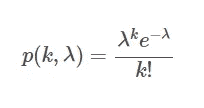

# Python 中的泊松分布和泊松过程—统计

> 原文：<https://towardsdatascience.com/poisson-distribution-and-poisson-process-in-python-statistics-a7aa573c03f4?source=collection_archive---------26----------------------->


美国宇航局在 [Unsplash](https://unsplash.com/s/photos/hurricane?utm_source=unsplash&utm_medium=referral&utm_content=creditCopyText) 拍摄的照片

在本文中，我们将探讨 Python 中的泊松分布和泊松过程。

**目录**

*   介绍
*   什么是泊松过程
*   什么是泊松分布
*   泊松分布示例
*   Python 中的泊松分布示例
*   结论

# 介绍

为了继续学习本教程，我们需要以下 Python 库:scipy、numpy 和 matplotlib。

如果您没有安装它，请打开“命令提示符”(在 Windows 上)并使用以下代码安装它:

```
pip install scipy
pip install numpy
pip install matplotlib
```

# 什么是泊松过程

泊松点过程(或简称为泊松过程)是数学空间中随机分布的点的集合。

由于它的几个性质，泊松过程经常被定义在一条实线上，在这里它可以被认为是一维的随机过程。这进一步允许[建立数学系统](https://amzn.to/3vnkzN2)并研究以随机方式出现的某些事件。

它的一个重要性质是过程中的每个点都随机地独立于过程中的其他点。

作为一个例子，我们可以想到一个在现实生活中可以观察到这种过程的例子。假设您正在研究飓风的历史频率。这确实是一个随机过程，因为今年的飓风数量与去年的飓风数量无关，以此类推。然而，随着时间的推移，你可能会观察到一些趋势，平均频率，等等。

从数学上来说，在这种情况下，点过程取决于某个可能是常数的东西，例如平均速率(例如，打电话的客户的平均数量)。

泊松过程由泊松分布定义。

# 什么是泊松分布？

泊松分布是在给定两种情况下，在固定时间间隔内发生的事件数量的离散概率分布:

1.  事件以某种恒定的平均速率发生。
2.  事件相互独立，与时间无关。

为了在某种背景下说明这一点，考虑一下上一节中飓风频率的例子。

假设我们有 20 年间观察飓风的数据。我们发现每年平均有 7 次飓风。每一年都独立于前几年，这意味着如果我们今年观察到 8 次飓风，并不意味着我们明年会观察到 8 次。

泊松分布的 PMF(概率质量函数)由下式给出:



作者图片

其中:

*   ***λ*** 是由***λ***= E(X)=***μ***给出的实正数
*   ***k*** 是出现的次数
*   ***e*** = 2.71828\)

Pr(X=k)可以读作:*一个区间内 k 个事件的泊松概率*。

泊松分布的 CDF(累积分布函数)由下式给出:


作者图片

# 泊松分布示例

既然我们已经知道了一些要使用的公式，让我们来详细地看一个例子。

回想一下我们在前面几节中提到的飓风数据。我们知道飓风的历史频率是每年 7 次，这就形成了我们的 ***λ*** 值:

**λ= 7**

我们的问题是，今年观测到 5 次飓风的概率是多少？而这就形成了我们的 ***k*** 值:

*= 5*

*使用上一节中的公式，我们可以计算泊松概率:*

**

*作者图片*

*所以明年正好观测到 5 个飓风的概率等于 12.77%。*

*自然，我们对其他频率的概率很好奇。*

# *泊松 PMF(概率质量函数)*

*考虑下表，该表显示了飓风频率的泊松概率(0-15):*

*使用上表，我们可以为该示例创建泊松概率质量函数的以下可视化:*

**

*作者图片*

# *泊松 CDF(累积分布函数)*

*考虑下表，该表显示了飓风频率的泊松累积概率(0-15):*

*使用上表，我们可以为该示例创建以下泊松累积分布函数的可视化:*

**

*作者图片*

*该表还允许我们回答一些有趣的问题。*

*举个例子，如果我们想找出看到最多 5 次飓风的概率(数学上: ***k*** ≤5)会怎么样，我们可以看到是 0.30071 或者 30.07%。*

*另一方面，我们可以对观测到 5 个以上飓风的概率感兴趣(数学上: ***k*** > 5)，这将是 1- ***p*** (5，7)= 1–0.30071 = 0.69929 或 69.93%。*

# *Python 中的泊松分布示例*

*在上一节中，我们手工计算了概率质量函数和累积分布函数。在本节中，我们将使用 Python 再现相同的结果。*

*我们将从导入所需的依赖项开始:*

*接下来，我们将需要一个数组的 ***k*** 值，我们将计算泊松 PMF。在上一节中，我们计算了从 0 到 16 的 16 个值 ***k*** ，所以让我们用这些值创建一个数组:*

*您应该得到:*

```
*[ 0 1 2 3 4 5 6 7 8 9 10 11 12 13 14 15 16]*
```

*在以下章节中，我们将重点介绍如何使用 Python 计算 PMF 和 CDF。*

# *Python 中的泊松 PMF(概率质量函数)*

*为了使用 Python 计算泊松 PMF，我们将使用**。[**scipy . poisson**](https://docs.scipy.org/doc/scipy/reference/generated/scipy.stats.poisson.html)生成器的 pmf()** 方法。它需要两个参数:*

1.  ****k*** 值(我们创建的 **k** 数组)*
2.  ****μ*** 值(在我们的例子中，我们将其设置为 7)*

*现在我们可以用泊松概率值创建一个数组:*

*您应该得到:*

```
*[0.00091 0.00638 0.02234 0.05213 0.09123 0.12772 0.149 0.149 0.13038 0.1014 0.07098 0.04517 0.02635 0.01419 0.00709 0.00331 0.00145]*
```

***注:***

*如果您想以更好的方式打印每个\(k\)值和相应的概率:*

*您应该得到:*

```
*k-value 0 has probability = 0.00091
k-value 1 has probability = 0.00638
k-value 2 has probability = 0.02234
k-value 3 has probability = 0.05213
k-value 4 has probability = 0.09123
k-value 5 has probability = 0.12772
k-value 6 has probability = 0.149
k-value 7 has probability = 0.149
k-value 8 has probability = 0.13038
k-value 9 has probability = 0.1014
k-value 10 has probability = 0.07098
k-value 11 has probability = 0.04517
k-value 12 has probability = 0.02635
k-value 13 has probability = 0.01419
k-value 14 has probability = 0.00709
k-value 15 has probability = 0.00331
k-value 16 has probability = 0.00145*
```

*这与我们在手工计算概率的例子中看到的完全相同。*

# *使用 Python 绘制泊松 PMF*

*我们将需要之前创建的 **k** 值数组以及这一步中的 **pmf** 值数组。*

*使用 **matplotlib** 库，我们可以使用 Python 轻松绘制泊松 PMF:*

*您应该得到:*

**

*作者图片*

# *Python 中的泊松 CDF(累积分布函数)*

*为了使用 Python 计算泊松 CDF，我们将使用**。CDF()**[**scipy . poisson**](https://docs.scipy.org/doc/scipy/reference/generated/scipy.stats.poisson.html)生成器的方法。它需要两个参数:*

1.  ****k*** 值(我们创建的 **k** 数组)*
2.  ****μ*** 值(在我们的例子中，我们将其设置为 7)*

*现在我们可以用泊松累积概率值创建一个数组:*

*您应该得到:*

```
*[0.001 0.007 0.03 0.082 0.173 0.301 0.45 0.599 0.729 0.83 0.901 0.947 0.973 0.987 0.994 0.998 0.999]*
```

***注:***

*如果您想以更好的方式打印每个 ***k*** 值和相应的累积概率:*

*您应该得到:*

```
*k-value 0 has probability = 0.001
k-value 1 has probability = 0.007
k-value 2 has probability = 0.03
k-value 3 has probability = 0.082
k-value 4 has probability = 0.173
k-value 5 has probability = 0.301
k-value 6 has probability = 0.45
k-value 7 has probability = 0.599
k-value 8 has probability = 0.729
k-value 9 has probability = 0.83
k-value 10 has probability = 0.901
k-value 11 has probability = 0.947
k-value 12 has probability = 0.973
k-value 13 has probability = 0.987
k-value 14 has probability = 0.994
k-value 15 has probability = 0.998
k-value 16 has probability = 0.999*
```

*这与我们在手工计算累积概率的例子中看到的完全相同。*

# *使用 Python 绘制泊松 CDF*

*在这一步中，我们将需要之前创建的 **k** 值数组以及 **pmf** 值数组。*

*使用 **matplotlib** 库，我们可以使用 Python 轻松绘制泊松 PMF:*

*您应该得到:*

**

*作者图片*

# *结论*

*在本文中，我们探讨了泊松分布和泊松过程，以及如何在 Python 中创建和绘制泊松分布。*

*如果你有任何问题或对一些编辑有建议，请随时在下面留下评论，并查看更多我的[统计](https://pyshark.com/category/statistics/)文章。*

**原载于 2021 年 11 月 23 日 https://pyshark.com*<https://pyshark.com/poisson-distribution-and-poisson-process-in-python/>**。***