# 现实生活中的泊松过程和泊松分布:模拟一家冰淇淋店的高峰时间

> 原文：<https://towardsdatascience.com/poisson-process-and-poisson-distribution-in-real-life-modeling-peak-times-at-an-ice-cream-shop-b61b74fb812?source=collection_archive---------5----------------------->

## [实践教程](https://towardsdatascience.com/tagged/hands-on-tutorials)


图片作者。

现实世界中的一些现象可以用事物的*计数*来表示。例如，从机场起飞的航班数量，在商店登记处排队的顾客数量，特定地区一年中发生的地震数量。

计数事件是一项相对简单的任务，但是如果你想从仅仅计数事件的发生发展到询问关于*的问题，这些事件在特定的时间单位*内发生的可能性有多大，你需要更强大的工具，比如**[泊松分布](https://en.wikipedia.org/wiki/Poisson_distribution)。**

> **泊松分布模拟来自离散随机变量的给定数量的事件在特定时间间隔内发生的概率。**

**泊松分布以多产数学家[西蒙·丹尼斯·泊松](https://en.wikipedia.org/wiki/Sim%C3%A9on_Denis_Poisson)命名，是一种[离散概率分布](https://en.wikipedia.org/wiki/Probability_distribution#Discrete_probability_distribution)。它模拟了一个离散随机变量中的许多事件在特定时间间隔内发生的概率。**

**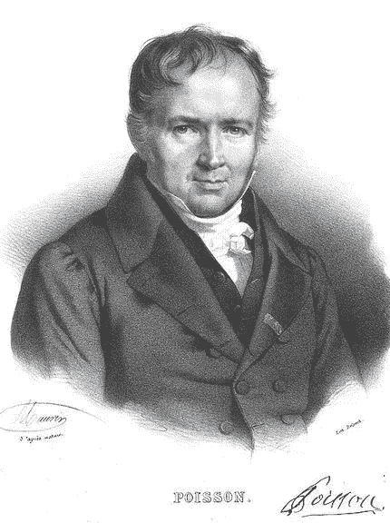**

**西蒙·丹尼斯·泊松([图片来源](https://en.wikipedia.org/wiki/File:Sim%C3%A9onDenisPoisson.jpg))**

# **离散随机变量的概率分布**

****离散随机变量**描述了具有一组特定值的事件【1】。**

**例如，代表*投掷公平硬币*的离散随机变量只能有正面或反面的值。代表*从一副牌中挑选一张牌的离散随机变量*只能有 52 个可能的值，红心 *2，梅花 9，方块皇后，黑桃 a*等等。**

**离散随机变量的概率分布称为[概率质量函数](https://en.wikipedia.org/wiki/Probability_mass_function) (PMF)。它是一个函数，将随机变量的每一个值映射到相应的概率上。**

**例如，遵循泊松分布的随机变量的概率质量函数如下所示。**

**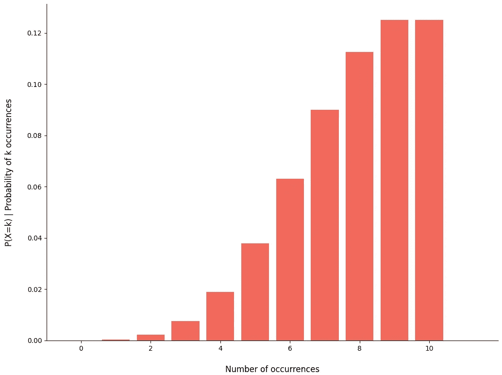**

**服从泊松分布的随机变量的概率质量函数的例子。**

**概率质量函数有三个基本条件:**

*   ****所有概率都是非负的**。**
*   ****每个事件的概率必须在 0 到 1 之间**。*抛硬币并正面朝上的概率*必须介于 0 和 1 之间。**
*   ****所有可能值的概率之和必须等于 1。**抛硬币并得到正面的概率*和*抛硬币并得到正面的概率*之和必须等于 1。***

# **泊松分布和机器学习**

**在机器学习中，泊松分布用于概率模型。例如，在 [**广义线性模型**](https://en.wikipedia.org/wiki/Generalized_linear_model) 中，您可以使用泊松分布来模拟目标变量的分布。**

**在机器学习中，如果响应变量代表一个计数，可以使用泊松分布对其建模。**

**在现实世界的应用中，这些模型被用来预测或模拟复杂的系统，如极端天气事件[2]或 Twitter 消息和维基百科修订历史的级联[3]。**

# **在你朋友的冰淇淋店模拟高峰期**

**你的老朋友珍妮在她所在城市的市中心有一家冰淇淋店。**

**她多次告诉你，她一直关注的一件事是如何为商店配备员工。Jenny 希望确保每个顾客都有最短的等待时间，并且总有人帮助他们，这样顾客体验就是他们能提供的最好的。**

**但是，有时情况并非如此。珍妮已经痛苦地认识到，当商店里有超过 10 名顾客时，没有足够的员工来帮助他们，一些顾客最终因漫长的等待和缺乏帮助而沮丧地离开。**

**你是一名数据科学家，也是 Jenny 的好朋友，所以你是她寻求帮助的第一个人。最终，Jenny 希望你帮助她计算出在任何给定的时间里，她的店里会有多少顾客。**

**思考了一会儿后，你决定重新组织她的问题，这样更符合 Jenny 真正想知道的，*在任何给定的时间内，10 个顾客同时出现在商店的可能性有多大。***

**将这重新定义为一个概率问题，你定义一个随机变量，即*顾客到达珍妮的冰淇淋店*。这立刻让你想到用**二项分布**来建模这个问题。**

# **二项分布**

**[二项式分布](https://en.wikipedia.org/wiki/Binomial_distribution)描述了一系列[伯努利](https://en.wikipedia.org/wiki/Bernoulli_distribution)试验的成功次数。因此，如果你认为一个顾客进入商店是一个*的成功*，这种分布听起来是一个可行的选择。**

**但是，在对到达珍妮冰淇淋店的随机变量*顾客建模之前，您需要知道分布的参数。***

**二项式分布有两个参数:**

*   *****n*** :伯努利试验总次数。**
*   *****p*** :伯努利试验成功的概率。**

**要回答问题*，在任何给定的时间*、*、*内，10 名顾客同时出现在商店的可能性有多大，您需要使用二项式分布的概率质量函数。它看起来像这样:**

**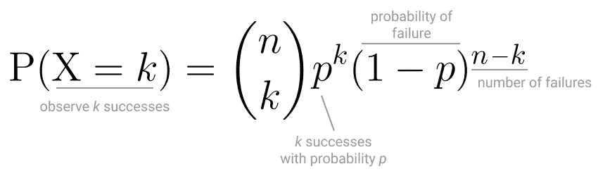**

**二项分布的概率质量函数。**

**到目前为止，您只有参数 *k* ，客户总数。**

**但是你记得珍妮去年告诉过你关于商业区的一系列研究。在其中一项研究中，他们发现，在一个正常的工作日，大约有 7500 人路过市中心，有 10%的几率路人会进入市中心 15 家商店中的一家。**

**这正是你需要的信息！**

**在这种情况下，每个市中心的过路人都代表了一次伯努利试验，成功意味着进入一家商店。根据研究，经过市中心的顾客总数对应于 *n，*并且每个顾客进入珍妮商店的概率相同，为 10%。**

**回到问题*10 个顾客同时在珍妮店里的可能性有多大*你只需要*插入*二项概率质量函数中的参数。**

**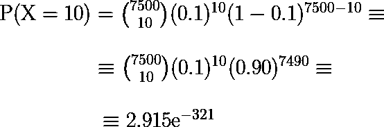**

**手工做这些计算很有挑战性。您可以使用 Python 的 [SciPy 模块](https://docs.scipy.org/doc/scipy/reference/generated/scipy.stats.binom.html#scipy.stats.binom)来完成所有繁重的工作。**

```
from scipy.stats import binomk = 10
n = 7500
p = 0.10print("Probability of having 10 customers at the shop")
print(binom.pmf(k, n, p))
```

**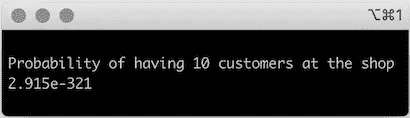**

**这是一个非常小的概率，事实上，这并不完全是珍妮所寻找的。**

**重要的细节是，Jenny 想知道同时有 10 个顾客在商店*的概率*。**

**二项式分布不模拟同时发生的事件。相反，成功发生在一系列的试验中。所以，最终，二项分布并不是这个问题的最佳模型。**

> **二项式分布不模拟同时发生的事件。相反，成功发生在一系列的 *n* 试验中。**

**思考二项分布的这种局限性，以及你可以使用什么工具来回答 Jenny 的问题，你还记得**泊松范式**，也称为泊松近似。**

# **泊松范式**

**泊松范式是这样表述的:**

> ***当您有大量发生概率很小的事件时，那么在固定时间间隔内发生的事件数量的分布近似遵循泊松分布。***

**数学上讲，当 *n 趋于无穷大* (n→无穷大)且概率 *p 趋于零时* (p→ 0)二项分布可以近似为泊松分布。**

**这种近似假设事件是独立的或者*弱相关*。例如，如果事件是独立的，知道 Adam 进入商店也不会给你任何关于 Andrea 进入商店的信息。**

**但是，在现实世界中，有些事件很可能不是完全独立的。如果亚当和安德里亚进了商店，那也能给我一些比安卡进商店的信息。这些事件不是独立的，它们是弱相关的。**

**只要事件是独立的或*弱相关的*，这个假设就成立，你可以将二项式近似为**泊松分布**。**

# **泊松分布**

**了解**泊松范式**会让你更有信心使用**泊松分布**来模拟进入珍妮商店的顾客数量。**

**[泊松分布](https://en.wikipedia.org/wiki/Poisson_distribution#Statistical_inference)描述了在固定时间间隔内以特定速率发生的多个独立事件的概率。与二项式不同，它只有一个参数，即事件发生的频率。**

**因为它都是关于以特定速率发生的事件，所以概率质量函数看起来像这样:**

**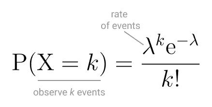**

**泊松分布的概率质量函数。**

**所以，回答问题*10 个顾客同时在珍妮的店里的可能性有多大？*你需要的最后一块是顾客进店率。**

**你没有珍妮商店的具体数据，但根据商业协会的研究，在特定的一天，经过市中心的 7，500 人中有 10%进入了商店。**

**使用您拥有的所有数据，您可以说这 7，500 名顾客中的 10%在 10 个营业小时内进入了 15 家市区商店。因此，您可以计算出*λ*并确定每小时大约有 5 名顾客进入 Jenny 的商店，即每 12 分钟有一名顾客进入。**

**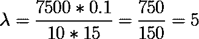**

**计算*、顾客进入市中心商店的比率。***

***要回答 Jenny 的问题，可以在泊松概率质量函数中插入参数 *lambda* 。***

***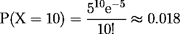***

***在任何给定的时间里，有 1.8%的几率会有 10 个顾客同时出现在珍妮的店里。与 Jenny 的想法相比，这是一个相对较低的值！***

***绘制概率质量函数，你还可以看到商店里同时有多达 10 个顾客的概率。***

***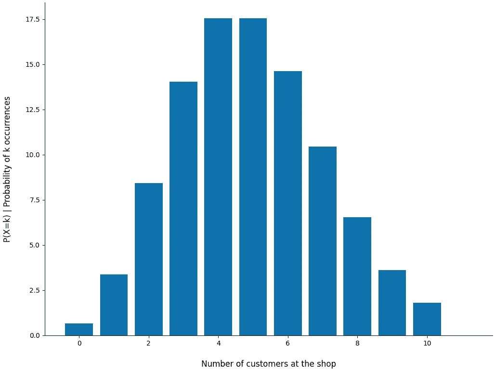***

***比率为 5 的泊松分布的概率质量函数，观察多达 10 个事件。***

***以目前市中心顾客进入商店的速度，Jenny 可以准备在大多数情况下让 4 或 5 个顾客进入商店。***

***以下是如何使用 Python 的 [SciPy 模块](https://docs.scipy.org/doc/scipy/reference/generated/scipy.stats.poisson.html)计算和绘制泊松概率质量函数。***

```
*from scipy.stats import poisson
import numpy as np
import matplotlib.pyplot as plt def poisson_pmf(k, lambda_val):
    *'''
    Calculates and plots the Poisson probability mass function (PMF* *:param k: Number of events to occur at the same time
    :param lambda_val: Lambda value. rate at which the events occur* *:return:
    - Print out the probability that k events occur at the same time with a rate lambda value* *- Plot the PMF from 0 to k occurrences
    '''* x = np.arange(0, step=0.1, stop=k + 1)
    pmf = poisson.pmf(k=x, mu=lambda_val) print("Poisson:: Probability of having 10 customers at the shop")
    print(np.round(poisson.pmf(k=k, mu=lambda_val), 3)) # plotting the PMF
    fig, ax = plt.subplots(1, 1, figsize=(12, 9))

    # removing all borders except bottom
    ax.spines['top'].set_visible(False)
    ax.spines['right'].set_visible(False)

    plt.bar(x, pmf * 100, color='#0F72AC')
    plt.xlabel('Number of customers at the shop', fontsize=12, labelpad=20)
    plt.ylabel('P(X=k) | Probability of k occurrences', fontsize=12, labelpad=20)
    plt.show() poisson_pmf(k=10, lambda_val=5)*
```

***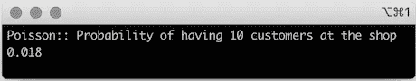***

***Jenny 非常兴奋地得知，大约有 2%的可能性商店变得非常拥挤，他们很难提供优质服务。***

***但她也有点担心。***

***有一个为期三天的周末即将到来，珍妮知道，在这样的日子里，她在厨房里会有更好的帮助。这样，她可以保证冰淇淋不会短缺，而其他员工则负责店面。***

***当厨房真的很忙的时候，珍妮只能每小时检查一次店面。所以她再次寻求你的帮助，想出*那天商店有 10 个顾客的概率是多少*。***

# ***泊松过程***

***等等，什么？*我不是已经回答过这个问题了吗？*，你可能会想。不完全是。***

***仔细想想，你会发现这里有一个新的组件，Jenny 将在一天中的特定时间间隔**检查店面。*****

***虽然泊松分布的概率质量函数为您提供了同时有 10 个顾客在商店的概率，但是时间间隔是固定的。你看到的是一天中给定的一个小时，因为那是速率给你的。***

***现在，珍妮将要在一天中多次检查店面。因此，您需要一个工具来计算事件，即顾客进入商店，但在一个连续的时间框架内。***

***你需要把珍妮的问题重新定义为**泊松过程**。***

***[**泊松过程**](https://en.wikipedia.org/wiki/Poisson_point_process) 是一个具有独立时间增量的统计过程，其中一个时间间隔内发生的事件数量用泊松分布建模，每个事件发生的时间间隔服从[指数分布](https://en.wikipedia.org/wiki/Exponential_distribution)【2】。***

***在实践中，**泊松过程**描述了无限数量的独立且相同分布的事件的发生，每个事件由遵循泊松分布的随机变量描述[4]。***

***这些事件通常被称为**到达**，可以在任意时间发生，因此事件在特定时间点发生的概率为零。这就是为什么泊松分布关注事件或到达之间的**时间**，即到达间隔时间。***

***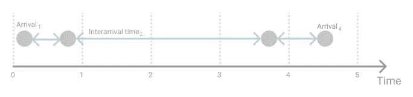***

***五个*时间单位*内四个不同随机变量的到达。***

***概括地说，泊松过程是一个计数过程，包括:***

*   *****在时间间隔 *t* 内发生的至少一个到达**或事件。***
*   *****非负率*λ***，类似泊松分布。***
*   *****独立时间增量*。******
*   *****遵循指数分布的到达间隔时间**。***
*   ***无记忆性，所以到下一个到达的时间独立于先前的到达。这意味着下一个到达的*不知道* *关于过去发生的事情的任何事情。****

***回到珍妮的问题！***

***您将使用与泊松分布的 PMF 非常相似的概率质量函数。***

***在泊松过程中，**预期到达数**结合了速率*λ*和您感兴趣的时间间隔。因为你对连续发生的事件感兴趣。***

***你还必须考虑到达的间隔时间。尽管两个事件不能同时发生，但它们可以在同一时间间隔内的任意时刻发生。***

***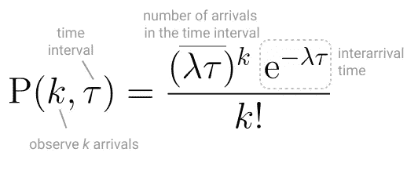***

***泊松过程的概率质量函数。***

***当你看任何给定的小时，在这种情况下是最小的单位时间，泊松过程就相当于泊松分布的概率质量函数。假设你有一个总时间间隔 *t* 等于 1。***

***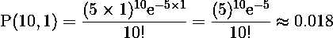***

***但是你想计算一整天的概率。知道珍妮每小时都要去店面签到，总时间间隔 *t* 等于 10。***

***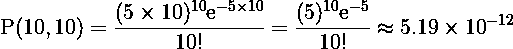***

***这些计算太容易出错，不能用手算。所以你可以再次求助于 Python，为泊松过程编写概率质量函数。***

```
*import mathdef poisson_process(lambda_value, k, t):
   *'''
   Calculates the probability mass function of a Poisson process* *:param lambda_val: Lambda value. rate at which the events occur
   :param k: Number of arrivals to occur at the same time
   :param t: time interval to observe arrivals* *:return:
   - Print out the probability that k arrivals occur at the same time with a rate lambda value during time t
   '''* numerator = np.power(50, 10) * math.exp(-50)
   denominator = math.factorial(10)

   print("Poisson process with\n\tlambda=" + str(lambda_value) + ", " + str(k) + " arrivals, during time interval of " + str(t) + " hours")
   print(numerator/denominator) poisson_process(lambda_value=5, k=10, t=10)*
```

***感谢您的帮助，Jenny 更加自信地认为，在为期 3 天的周末期间，光顾她的商店的顾客将获得 Jenny 和团队所能提供的最佳体验！***

***在商店营业的 10 个小时内，有 10 个顾客同时进入商店的概率非常小！***

***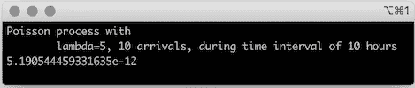***

***现在您知道如何对基于事件计数的真实世界系统和现象建模了！***

***使用泊松分布，您可以计算事件在离散的固定时间间隔内发生的概率。然后，用泊松过程把它扩展到一个连续的时间框架，比如一天的持续时间。***

***希望您喜欢学习泊松分布和泊松过程在现实生活中的应用。***

****感谢阅读！****

# ***参考***

***[1] [离散型随机变量的概率分布(谢弗，张)](https://stats.libretexts.org/Bookshelves/Introductory_Statistics/Book%3A_Introductory_Statistics_(Shafer_and_Zhang)) 2021 .2021 年 1 月 10 日***

***[2]克莱曼婷·达莱兰，托马斯·德意志州，[极端天气事件泊松点过程强度的稳健估计器](https://www.sciencedirect.com/science/article/pii/S2212094713000042?via%3Dihub)，《天气和气候极端》，2013 年第 1 卷，第 69-76 页***

***[3]西马，亚历山大&乔丹，迈克尔。(2010).用泊松过程的级联模拟事件。2010 年 UAI 第 26 届人工智能不确定性会议论文集。546–555.***

***[4] Bertsekas、Dimitri 和 John Tsitsiklis。*概率介绍*。第二版。雅典娜科学公司，2008 年***

****图片由作者提供，除非另有说明。****