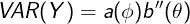

# 泊松回归和广义线性模型

> 原文：<https://towardsdatascience.com/poisson-regression-and-generalised-linear-models-606fe5f7c1fd?source=collection_archive---------7----------------------->

## 泊松回归和广义线性模型的理论介绍

杰斯温·托马斯在 [Unsplash](https://unsplash.com?utm_source=medium&utm_medium=referral) 上的照片

> 注意:在整篇文章中，我错误地将 E[Y]称为目标输出。当我提到 E[Y]时，我隐含的意思是 E[Y|X],因为这是正确的符号！[这里链接的是一个解释这种差异的统计交换线程。](https://stats.stackexchange.com/questions/439463/in-glm-do-we-make-an-assumption-on-the-distribution-of-y-or-the-distribution-of)

[**线性回归**](https://en.wikipedia.org/wiki/Linear_regression) 是大多数数据科学家开始其旅程的第一个算法。对于连续数据，这是一个简单、易于实现和可视化的模型。初学数据的科学家第二常学的算法是 [**逻辑回归**](https://en.wikipedia.org/wiki/Logistic_regression) ，其中模型有二进制输出。大多数人认为这两种算法是完全独立的，但实际上它们是名为 [**广义线性模型(GLMs)**](https://en.wikipedia.org/wiki/Generalized_linear_model) 的同一模型家族的一部分。在本文中，我们将通过一个使用 [**泊松分布**](https://en.wikipedia.org/wiki/Poisson_distribution) **的示例场景来获得关于 GLMs 的直觉。**

# 线性回归基础和局限性

线性回归是一种用于将**线**或**超平面**拟合到数据集的模型，其中输出为**连续**并具有正态分布的**残差。这是数学上的写法:**

LaTeX 作者的方程式

其中***E(Y)****是目标变量的**均值响应**， ***X*** 是预测变量的**矩阵**， ***β*** 是被调整和训练以产生最佳模型的**未知线性系数**。*

*线性回归在**流行病学、金融和经济学**等很多行业都有应用。然而，尽管被用于所有这些领域，它确实有一些缺陷，使得它的预测在某些应用中是多余的。假设你是一名电话接线员，想要**预测你一天会接到多少个电话**。你认为线性回归是一个合适的模型吗？答案是**否**，原因如下:*

*   *调用次数必须大于或等于 0，而在线性回归中，输出可以是负的，也可以是正的。*
*   *调用次数只取整数值**而线性回归可以输出小数值**。*

*这些缺陷以及许多其他缺陷要求我们使用另一种回归算法来模拟预期的调用次数。*

# *泊松分布*

*泊松分布是一种概率分布，用于测量在指定的时间段内**发生多少次以及 *x(调用)*发生的可能性有多大。分布的公式是:***

**

*LaTeX 作者的方程式*

*其中 ***λ*** 是**预期出现的次数，**在我们的例子中是调用。*

*这是将呼叫数量建模为其**离散**并且 ***x*** 和***λ*****只能取大于或等于 0 的值的完美分布。**现在的问题是**如何把**上面的线性回归方程变成泊松回归方程？这可以通过使用**广义线性模型**来实现。*

# *广义线性模型*

*GLM，就像他们的名字一样，是线性回归的概括，其中响应变量采用非正态分布，如泊松或二项式分布。GLM 包含三个核心内容:*

*   **指数分布族的一部分**
*   **线性预测器**
*   **链接功能**

*我们现在将浏览这些内容，并简要推导和解释它们所指的内容。*

## *指数族*

*如果满足以下函数，概率分布被视为 [**指数族**](https://en.wikipedia.org/wiki/Exponential_family) 的一部分:*

**

*LaTeX 作者的方程式*

*这里，θ指的是**自然参数，**是与均值关联的**，**，φ是与方差关联的**标度参数**。此外，a(φ)，b(θ)和 c(y，φ)是待定的函数，但我们不会在本文中详细讨论。*

*通过一些数学操作可以看出，指数族的**均值、 *E(Y)、*和方差、 *VAR(Y)* 、**由下式给出:*

**

*LaTeX 作者的方程式*

**

*LaTeX 作者的方程式*

*根据上面的泊松概率分布公式，我们可以将其改写为指数族形式:*

**

*LaTeX 作者的方程式*

*通过**将系数**与泊松公式和指数公式相匹配，我们得出结论:*

**

*LaTeX 作者的方程式*

*这些是泊松分布的一般已知结果。在文章的后面，我们将解释为什么我们会得到上述值以及它们的重要性。*

## *线性预测器*

*这是解释变量*及其对应的未知系数*的**线性组合**(本质上是求和)，等于目标数据的期望输出***【E(Y)***:***

****

**LaTeX 作者的方程式**

**其中上述系数和解释变量在**矩阵形式**中。**

## **链接功能**

**这是 GLM 最重要的部分。**链接函数， *g()，*'链接'输入变量到输出目标的分配**。**

****

**LaTeX 作者的方程式**

**我个人认为这是**“缩放”我们的输入到我们预期的输出范围**。例如，在逻辑回归中， **Sigmoid 函数**将输出缩放到 0 和 1 之间。事实上，逻辑回归是基于**二项式分布**，它也是指数家族的一部分，因此是 GLM。对于线性回归，链接函数是**恒等函数**，因此它不会转换线性预测值。**

**人们可以通过简单地**猜测允许特定范围输出的函数**来确定链接函数。然而，它们也可以数学推导为 t **，它们与自然参数θ** 的值“关联”。因此，泊松分布的链接函数是**自然对数 *ln()*** 。此外，由于链接函数等于自然参数，这意味着它被称为**规范链接函数**。**

# **把所有的放在一起**

**啊！我们已经到了文章的结尾，现在我们可以把所有这些数学知识放在一起产生我们的**泊松回归公式**。现在我们知道链接函数是**自然对数**，线性回归方程转换为泊松回归方程:**

****

**LaTeX 作者的方程式**

**我们可以看到，将自然对数应用于输出意味着**将总是取正值**，即使线性预测器输出负结果！**

# **结论**

**在这篇文章中，我们探讨了 GLM 的需要和一点他们的数学背景。本文并不全面，因此感兴趣的读者应该更详细地探讨这个主题，以便更好地理解。但是，我希望您会对这篇文章感兴趣，并从中获得一些关于高级统计建模的知识！**

# **和我联系！**

*   **要在媒体上阅读无限的故事，请务必在此注册！ 💜**
*   **😀**
*   **[*LinkedIn*](https://www.linkedin.com/in/egor-howell-092a721b3/)*👔***
*   ***[*推特*](https://twitter.com/EgorHowell) 🖊***
*   **[*github*](https://github.com/egorhowell)*🖥***
*   *****🏅*****

> ***(所有表情符号都是由 [OpenMoji](https://openmoji.org/) 设计的——开源的表情符号和图标项目。许可证: [CC BY-SA 4.0](https://creativecommons.org/licenses/by-sa/4.0/#)***