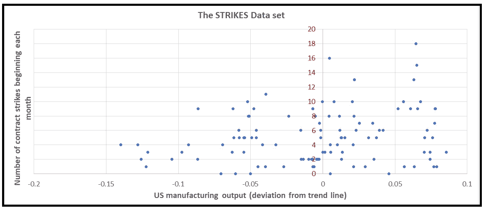
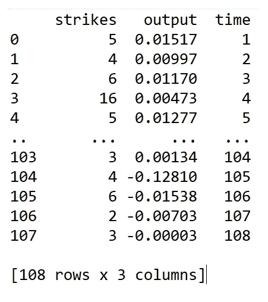
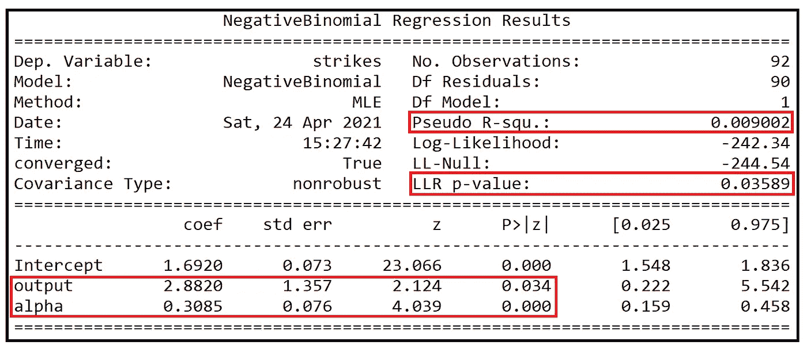
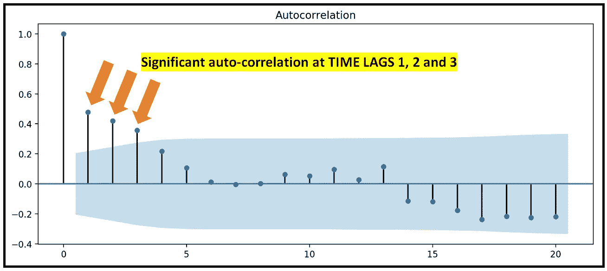
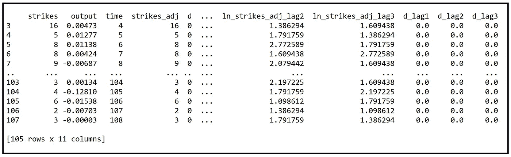
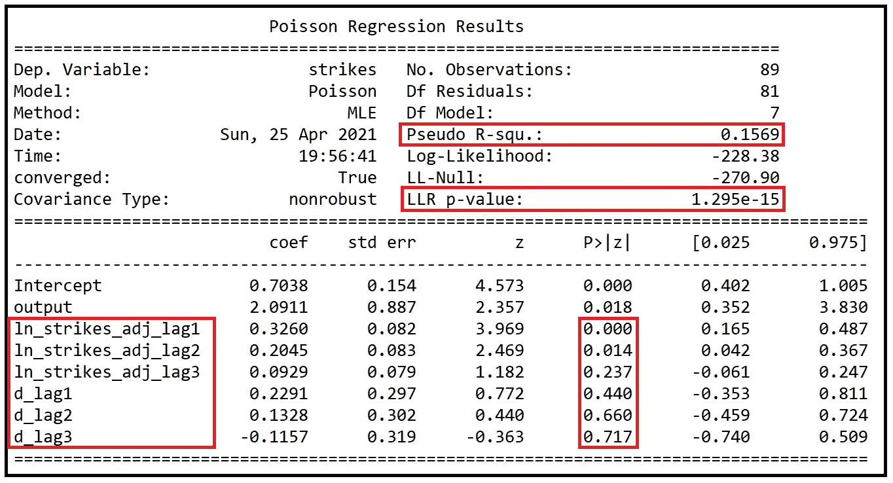
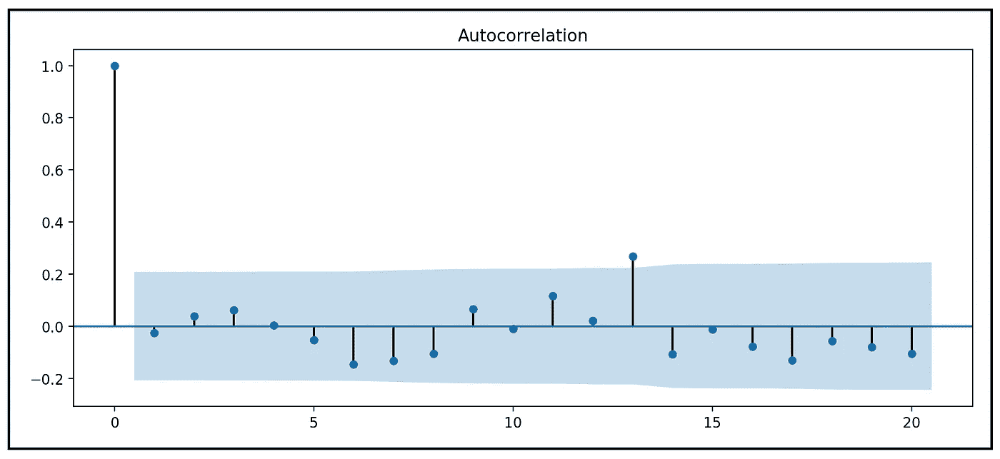

# 时间序列数据集的泊松回归模型

> 原文：<https://towardsdatascience.com/poisson-regression-models-for-time-series-data-sets-54114e68c46d?source=collection_archive---------21----------------------->


图片由 [Clker-Free-Vector-Images](https://pixabay.com/users/clker-free-vector-images-3736/?utm_source=link-attribution&utm_medium=referral&utm_campaign=image&utm_content=35081) 来自 [Pixabay](https://pixabay.com/?utm_source=link-attribution&utm_medium=referral&utm_campaign=image&utm_content=35081) ( [Pixabay 许可](https://pixabay.com/service/license/))

## 如何使用 Python 和 Statsmodels 为计数的时间序列数据集构建泊松回归模型

[泊松](/an-illustrated-guide-to-the-poisson-regression-model-50cccba15958)和[类泊松](/generalized-poisson-regression-for-real-world-datasets-d1ff32607d79)回归模型通常用于基于计数的数据集，即包含整数计数的数据。例如，每小时走进医院急诊室的人数就是这样一组数据。

基于普通最小二乘回归的线性模型或非线性模型，例如基于基于神经网络的回归技术的模型，对于这样的数据集效果不好，因为它们可以预测负值。

如果数据集是计数的**时间序列**，由于时间序列数据通常是自相关的，因此会增加建模的复杂性。以前的计数会影响将来计数的值。如果回归模型不能充分捕捉这些相关性中包含的“信息”，则“无法解释的”信息将以自相关误差的形式泄漏到模型的剩余误差中。在这种情况下，模型的 [**拟合优度**](/the-complete-guide-to-r-squared-adjusted-r-squared-and-pseudo-r-squared-4136650fc06c) 会很差。

解决此问题的常见补救措施如下:

1.  在拟合回归模型之前，检查时间序列是否有季节性，如果有， [**进行季节性调整**](/what-is-time-series-decomposition-and-how-does-it-work-9b67e007ae90) 。这样做，解释了季节性自相关，如果有的话。
2.  **对时间序列**进行一次差分，即 *y_t — y_(t-1)* 对所有的 *t* 和 [**对差分后的时间序列进行白噪声测试**](/the-white-noise-model-1388dbd0a7d) 。如果差分时间序列可以表示为[白噪声](/the-white-noise-model-1388dbd0a7d)，那么原始时间序列就是一个[随机游走](/the-white-noise-model-1388dbd0a7d)。在这种情况下，不需要进一步建模。
3.  对季节性调整的时间序列拟合基于泊松(或相关)计数的回归模型，但*包括因变量* ***y*** *的滞后副本作为回归变量*。

在本文中，我们将解释如何使用**方法(3)** 对计数的时间序列拟合泊松或类泊松模型。

# 制造业罢工数据集

为了说明模型拟合过程，我们将使用以下在回归建模文献中广泛使用的开源数据集:


制造业罢工(数据来源:[美国 BLS](https://www.bls.gov/) 通过 [R 数据集](https://github.com/vincentarelbundock/Rdatasets/blob/master/datasets.csv#L609)

该数据集是一个月度时间序列，显示了从 1968 年到 1976 年每月开始的美国制造业活动与美国制造业合同罢工数量之间的关系。



STRIKES 数据集(来源: [R 数据集](https://github.com/vincentarelbundock/Rdatasets/blob/master/datasets.csv#L609))(图片由[作者](https://sachin-date.medium.com/)提供)

该数据集在 R 中可用，可以使用 [statsmodels 数据集包](https://www.statsmodels.org/devel/datasets/index.html)获取。

因变量 ***y*** 为*击*。

我们将从导入所有必需的包开始:

```
**import** statsmodels.api **as** sm
**import** statsmodels.discrete.discrete_model **as** dm
**import** numpy **as** np
**from** patsy **import** dmatrices
**import** statsmodels.graphics.tsaplots **as** tsa
**from** matplotlib **import** pyplot **as** plt
```

让我们使用 statsmodels 将数据集加载到内存中:

```
strikes_dataset = sm.datasets.**get_rdataset**(dataname=**'StrikeNb'**, package=**'Ecdat'**)
```

打印出数据集:

```
**print**(strikes_dataset.**data**)
```

我们看到以下输出:



我们将前 92 个数据点视为训练集，其余 16 个数据点视为测试数据集

```
strikes_data = strikes_dataset.**data**.**copy**()
strikes_data_train = strikes_data.**query**(**'time<=92'**)strikes_data_test = strikes_data.**query**(**'time>92'**).**reset_index**().**drop**(**'index'**, **axis**=1)
```

打印出因变量的统计数据:

```
**print**(**'Mean='**+str(np.**mean**(strikes_data_train[**'strikes'**])) + **' Variance='**+str(np.**var**(strikes_data_train[**'strikes'**])))
```

我们得到以下输出:

```
Mean=5.5 Variance=14.728260869565217
```

我们看到 ***y*** 过度分散，因此违反了泊松模型的*均值=方差*假设。为了说明过度分散，我们将拟合一个具有以下 NB2 方差函数的 [**负二项式回归模型**](/negative-binomial-regression-f99031bb25b4) :


NB2 模型的方差函数(图片由[作者](https://sachin-date.medium.com/)

这是我们的回归表达式。*打击*是因变量*输出*是我们的解释变量。假设回归截距存在:

```
expr = **'strikes ~ output'**
```

我们将使用 [Patsy](https://patsy.readthedocs.io/en/latest/quickstart.html) 来雕刻出 ***X*** 和 ***y*** 矩阵。Patsy 会自动为 ***X*** 添加一个回归截距列:

```
y_train, X_train = **dmatrices**(expr, strikes_data_train, **return_type**=**'**dataframe**'**)
**print**(y_train)
**print**(X_train)

y_test, X_test = **dmatrices**(expr, strikes_data_test, **return_type**=**'**dataframe**'**)
**print**(y_test)
**print**(X_test)
```

使用 NB2 方差函数构建和训练负二项式回归模型:

```
nb2_model = dm.**NegativeBinomial**(**endog**=y_train, **exog**=X_train, **loglike_method**=**'**nb2**'**)nb2_model_results = nb2_model.**fit**(**maxiter**=100)**print**(nb2_model_results.**summary**())
```

我们得到拟合模型摘要的以下输出:



NB2 模型的模型摘要(图片由[作者](https://sachin-date.medium.com/)提供)

如系数的 p 值(0.034 和 0.000)所示，输出和离差参数α在 95%置信水平下具有统计显著性。

## 适合度

[**伪 R 平方**](/the-complete-guide-to-r-squared-adjusted-r-squared-and-pseudo-r-squared-4136650fc06c) 仅为 0.9%，表明**对训练数据集的拟合质量**非常差。

对数似然比检验的 *p 值*为 *0.03589* ，表明该模型在 *95%* 置信水平下优于仅截距模型(又称零模型)，但在 *99%* 或更高置信水平下则不然。

让我们看看拟合模型的残差的自相关图:



NB2 模型残差的自相关图(图片由[作者](https://sachin-date.medium.com/)提供)

我们可以看到，残差在时间滞后 1、2 和 3 处是自相关的，这表明因变量*与*之间存在自相关，NB2 模型无法完全解释这一点，导致其泄漏到模型的残差中。

总体来说，这个模型的拟合优度很差。

# 建立自回归泊松模型

为了修正自相关残差的情况，我们将引入***【y】***的滞后副本，特别是 *y_(t-1)、y_(t-2)* 和 *y_(t-3)* 作为回归变量以及*输出*变量。

但是我们没有直接引入 *y_(t-k)* 作为回归变量，而是使用*ln[y _(t-k)】*来解决当 *y_(t-k)* 的系数为正时的“模型爆炸”问题。

但是使用 *ln()* 变换产生了如何处理对数未定义的 *y_t* 的零值的问题。

我们使用 Cameron 和 Trivedi 在他们的书*计数数据的回归分析* *(参见第 7.5 节:自回归模型)*中概述的以下技巧来解决这个问题:

我们将为每个感兴趣的时间延迟定义一个新的指标变量 *d_t* ,如下所示:

当 *y_t = 0:* 设置 *d_t=1。*

当 *y_t > 0:* 设置 *d_t=0* 时。

让我们对数据框进行这些更改。

定义一个函数，该函数将设置指示器变量 *d_t* 的值，如上文所定义:

```
**def** indicator_func(x):
    **if** x == 0:
        **return** 1
    **else**:
        **return** 0
```

并使用此函数创建一个新的指标变量列:

```
strikes_data[**'d'**] = strikes_data[**'strikes'**].**apply**(indicator_func)
```

我们还创建一个新列 *strikes_adj* ，如果 *strikes* 为 0，则该列设置为 1，否则将其设置为 *strikes* 的值:

```
strikes_data[**'strikes_adj'**] = np.**maximum**(1, strikes_data[**'strikes'**])
```

现在为 *strikes_adj* 和*d*:创建滞后变量

```
strikes_data[**'ln_strikes_adj_lag1'**] = strikes_data[**'strikes_adj'**].shift(1)
strikes_data[**'ln_strikes_adj_lag2'**] = strikes_data[**'strikes_adj'**].shift(2)
strikes_data[**'ln_strikes_adj_lag3'**] = strikes_data[**'strikes_adj'**].shift(3)

strikes_data[**'d_lag1'**] = strikes_data[**'d'**].shift(1)
strikes_data[**'d_lag2'**] = strikes_data[**'d'**].shift(2)
strikes_data[**'d_lag3'**] = strikes_data[**'d'**].shift(3)
```

删除所有包含空单元格的行:

```
strikes_data = strikes_data.**dropna**()
```

最后取 *ln_strikes_adj_lag1* 、 *ln_strikes_adj_lag2* 和 *ln_strikes_adj_lag3* 的自然对数。回想一下我们要添加 *ln(y_(t_1))* 、 *ln(y_(t_2))* 和 ln( *y_(t_3))* 作为回归变量 *:*

```
strikes_data[**'**ln_strikes_adj_lag1**'**] = np.**log**(strikes_data[**'**ln_strikes_adj_lag1**'**])
strikes_data[**'**ln_strikes_adj_lag2**'**] = np.**log**(strikes_data[**'**ln_strikes_adj_lag2**'**])
strikes_data[**'**ln_strikes_adj_lag3**'**] = np.**log**(strikes_data[**'**ln_strikes_adj_lag3**'**])
```

让我们看看我们的数据框现在是什么样子:

```
**print**(strikes_data)
```



添加了滞后变量的 strikes 数据框

让我们再次将数据框架分为训练数据集和测试数据集:

```
strikes_data_train=strikes_data.**query**(**'time<=92'**)strikes_data_test=strikes_data.**query**(**'time>92'**).**reset_index**().**drop**(**'index'**, **axis**=1)
```

我们的回归表达式也需要更新，以包括滞后变量:

```
expr = **'strikes ~ output + ln_strikes_adj_lag1 + ln_strikes_adj_lag2 + ln_strikes_adj_lag3 + d_lag1 + d_lag2 + d_lag3'**
```

使用 Patsy 雕刻出 y**和 X**矩阵:****

```
***y_train, X_train = **dmatrices**(expr, strikes_data_train, **return_type**='dataframe')**print**(y_train)**print**(X_train)***
```

***最后，我们将在*(****y _ train****，****X _ train****)*上构建并拟合回归模型。这一次，我们将使用简单的泊松回归模型:***

```
**poisson_model = dm.**Poisson**(**endog**=y_train, **exog**=X_train)poisson_model_results = poisson_model.**fit**(**maxiter**=100)**print**(poisson_model_results.**summary**())**
```

**我们看到以下结果:**

****

**具有滞后输出变量的泊松回归模型的训练综述**

## **适合度**

**首先要注意的是，由[伪 R 平方](/the-complete-guide-to-r-squared-adjusted-r-squared-and-pseudo-r-squared-4136650fc06c)测量的拟合优度比早期的 NB2 模型有所提高，从 *0.9%* 提高到 *15.69%* 。这是一个很大的进步。这一次，LLR 测试的 *p 值*也在 *1.295e-15* 处小得几乎为零。这意味着我们可以以接近 100%的信心说滞后变量泊松模型比仅截距模型更好。回想一下，之前我们可以说只有 95%的置信水平。**

**让我们看看这个滞后变量泊松模型的残差的自相关图:**

```
**tsa.**plot_acf**(poisson_model_results.**resid**, **alpha**=0.05)plt.**show**()**
```

**我们看到下面的情节:**

****

**滞后变量泊松模型残差的自相关图(图片由[作者](https://sachin-date.medium.com/)提供)**

**除了在滞后 13 处有非常轻微的显著相关性外，残差与所有其他滞后的相关性都在规定的 alpha 范围内。**

**我们将*走向*的滞后副本添加到泊松模型的回归变量的策略似乎已经解释了*走向*变量中的大部分自相关。**

## **可变重要性**

**最后，让我们从滞后变量泊松模型的训练总结中注意到，虽然*输出*、 *ln_strikes_adj_lag1* 和 *ln_strikes_adj_lag2* 的系数在 *95% c* 置信水平下是显著的，但是第三个滞后 *ln_strikes_adj_lag3* 的系数仅在其表示的 *75%* 置信水平附近是显著的此外，所有三个滞后指标变量 *d_lag1* 、 *d_lag2* 和 *d_lag3* 在 *95%* 置信水平下均不具有统计显著性。**

# **预言；预测；预告**

**让我们使用拟合的滞后变量泊松模型来预测我们之前搁置的测试数据集的命中次数。我们不应该对预测的质量期望过高。请记住，虽然这个模型比以前的 NB2 模型拟合得更好，但伪 R 平方仍然只有 16%。**

**我们将使用 Patsy 来雕刻出( ***y_test*** ， ***X_test*** ):**

```
**y_test, X_test = **dmatrices**(expr, strikes_data_test, **return_type**='dataframe')**print**(y_test)**print**(X_test)**
```

**在 ***X_test*** 上进行预测:**

```
**poisson_predictions = poisson_model_results.**predict**(X_test)**
```

**绘制预测值和实际值:**

```
**predicted_counts=poisson_predictionsactual_counts = y_test[**'strikes'**]fig = plt.**figure**()fig.**suptitle**(**'Predicted versus actual strike counts'**)predicted, = plt.**plot**(X_test.**index**, predicted_counts, **'go-'**, **label**=**'Predicted counts'**)actual, = plt.**plot**(X_test.**index**, actual_counts, **'ro-'**, **label**=**'Actual counts'**)plt.**legend**(**handles**=[predicted, actual])plt.**show**()**
```

**我们得到如下的情节:**

****

**使用滞后变量泊松模型预测的与实际的撞击数(图片由[作者](https://sachin-date.medium.com/)提供)**

# **后续步骤**

**我们可以尝试通过以下修改来提高滞后变量模型的拟合优度:**

*   **除了*输出*之外，还包括*输出*变量的前三个时滞作为回归变量。**
*   **包括*输出*变量和*撞击*变量的时滞值作为回归变量。**
*   **不要使用泊松模型，使用负二项式模型(使用 NB1 或 NB2 方差函数),并将上述种类的滞后变量作为回归变量。**

**此外，使用 statsmodels 提供的[广义线性模型](https://www.statsmodels.org/stable/glm.html)框架来构建和训练泊松或负二项式模型也很有趣。参见下面关于如何建立和训练 GLM 模型的链接。**

# **引用和版权**

## **书**

**Cameron A. Colin，Trivedi Pravin K .， [*计数数据的回归分析*](http://cameron.econ.ucdavis.edu/racd/count.html) ，计量经济学会专论№30，剑桥大学出版社，1998 年。国际标准书号:0521635675**

**McCullagh P .，Nelder John A .， [*广义线性模型*](https://www.routledge.com/Generalized-Linear-Models/McCullagh-Nelder/p/book/9780412317606) ，第二版。，CRC 出版社，1989，ISBN 0412317605，9780412317606**

## **报纸**

**凯南 j .， [*美国制造业的合同罢工持续时间，计量经济学杂志*](https://www.sciencedirect.com/science/article/pii/0304407685900648) ，第 28 卷，1985 年第 1 期，第 5-28 页，ISSN 0304-4076，[https://doi . org/10.1016/0304-4076(85)90064-8。](https://doi.org/10.1016/0304-4076(85)90064-8.) [**PDF 下载链接**](https://www.ssc.wisc.edu/~jkennan/research/JEM85.pdf)**

**Cameron C. A .，Trivedi P. K .， [*泊松模型*](https://www.sciencedirect.com/science/article/pii/030440769090014K) 中过度分散的回归测试，《计量经济学杂志》，第 46 卷，第 3 期，1990 年，第 347-364 页，ISSN 0304-4076，[https://doi . org/10.1016/0304-4076(90)90014-k .](https://doi.org/10.1016/0304-4076(90)90014-K.)**

## **数据集**

**文章中使用的制造业罢工数据集是统计软件中可供公众使用和实验的几个数据集之一，最值得注意的是，这里的[是 R 包](https://rdrr.io/rforge/Ecdat/man/StrikeNb.html)。在 GPL v3 许可下，[文森特·阿雷-本多克](https://github.com/vincentarelbundock)通过[vincentarelbundock.github.io/rdatasets](https://vincentarelbundock.github.io/Rdatasets)已经可以使用 Python 访问数据集。**

## **形象**

**本文中的所有图片版权归 [CC-BY-NC-SA](https://creativecommons.org/licenses/by-nc-sa/4.0/) 所有，除非图片下方提到了不同的来源和版权。**

# **相关文章**

**[](/the-complete-guide-to-r-squared-adjusted-r-squared-and-pseudo-r-squared-4136650fc06c) [## R 平方、调整 R 平方和伪 R 平方完全指南

### 了解如何使用这些方法来评估线性和某些非线性回归模型的拟合优度

towardsdatascience.com](/the-complete-guide-to-r-squared-adjusted-r-squared-and-pseudo-r-squared-4136650fc06c) [](/an-illustrated-guide-to-the-poisson-regression-model-50cccba15958) [## 泊松回归模型图解指南

### 和使用 Python 的泊松回归教程

towardsdatascience.com](/an-illustrated-guide-to-the-poisson-regression-model-50cccba15958) [](/negative-binomial-regression-f99031bb25b4) [## 负二项式回归:逐步指南

### 外加一个关于负二项式回归的 Python 教程

towardsdatascience.com](/negative-binomial-regression-f99031bb25b4) [](/generalized-poisson-regression-for-real-world-datasets-d1ff32607d79) [## 真实世界数据集的广义泊松回归

### 以及用 Python 进行广义泊松回归的分步指南

towardsdatascience.com](/generalized-poisson-regression-for-real-world-datasets-d1ff32607d79) 

*感谢阅读！如果您喜欢这篇文章，请* [***关注我***](https://timeseriesreasoning.medium.com) *获取关于回归和时间序列分析的提示、操作方法和编程建议。***