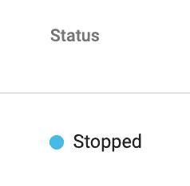
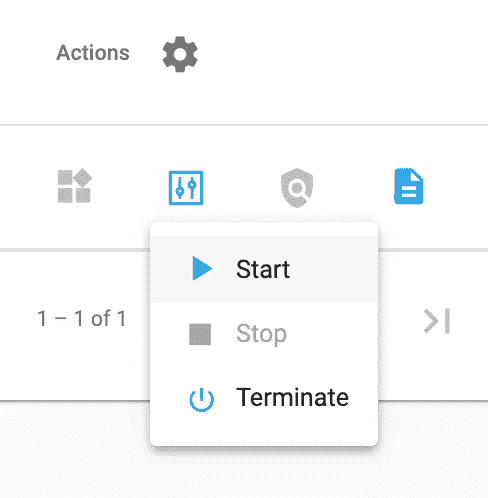
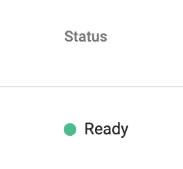
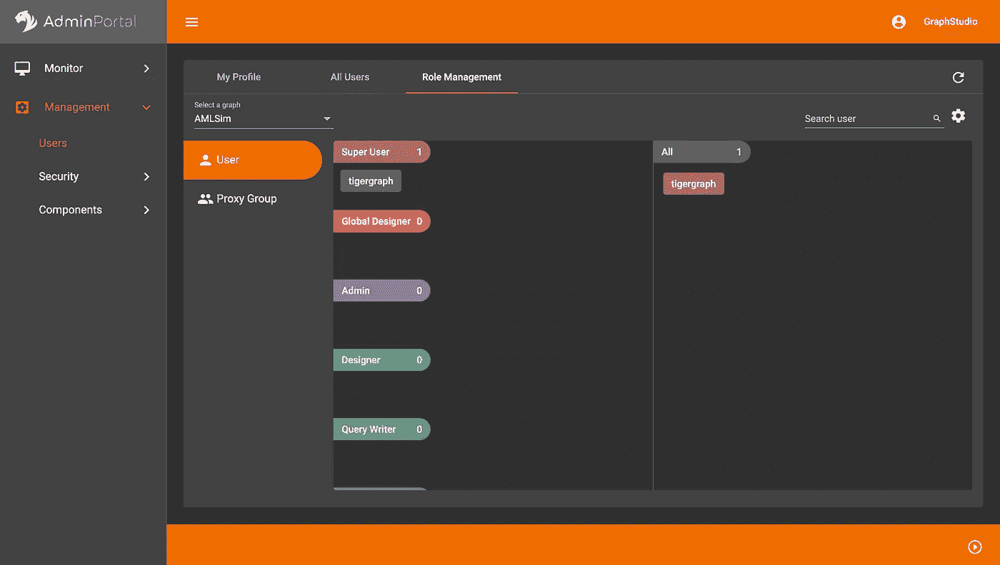
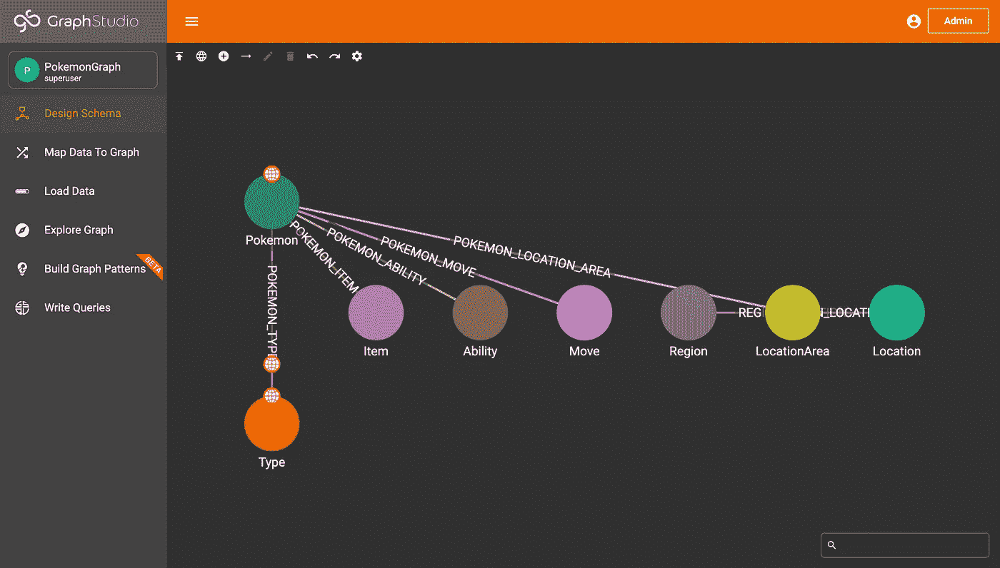

# PokéGraph 第二部分:为 TigerGraph 编写模式更改作业

> 原文：<https://towardsdatascience.com/pok%C3%A9graph-part-ii-writing-schema-change-jobs-for-tigergraph-d6e4d6d4aba0?source=collection_archive---------37----------------------->

## 如何使用 GSQL 和 pyTigerGraph 编写模式更改作业

*注:本博客基于以前的博客:*[*https://towardsdatascience . com/using-API-data-with-tiger graph-ef 98 cc 9293d 3*](/using-api-data-with-tigergraph-ef98cc9293d3)

# 概观

现在我们已经创建了一个图表，有时您可能想要更改模式。也许您想要添加或移除属性，或者您想要一起添加或移除边和顶点。这称为模式更改作业。

# 第一部分:创建连接

> 注意:这里假设你已经创建了一个基本的神奇宝贝图形。如果你还没有，请关注这个博客。

在开始之前，我们需要创建一个到图表的连接。首先，确保您的图表已经开始。为此，请前往[https://tgcloud.io/app/solutions](https://tgcloud.io/app/solutions)。然后，确保您的解决方案“准备就绪”

您的状态可能会显示“已停止”，并带有如下所示的蓝点。



如果你在你的解决方案中看到了这一点，那么它就是“停止的”要使用它，你需要它是绿色的。

如果是这种情况，您需要转到“操作”栏。按下小方框(当您将鼠标悬停在上面时，它会显示“解决方案操作”)。按下“开始”按钮，然后等待，直到您的解决方案状态显示绿色按钮“开始”。这可能需要几分钟时间。



转到解决方案操作，然后单击开始



等到状态显示“就绪”并有一个绿点。

太好了！现在您的解决方案已经启动并准备好了，让我们开始编写模式更改作业吧！

# 第二部分:全局与局部顶点和边

在这里，我们将学习如何创建两种类型的模式更改作业:全局和本地。首先，我们来分析一下两者的区别。

在上一篇博客中，我们创建的顶点和边是全局的。首先，一个解决方案中可以有多个图(尽管我们现在的解决方案中只有一个图)。全局顶点和边可以在不同的图中使用。事实上，当你通过 GraphStudio 以无代码的方式创建一个新图时，它会提示你添加任何全局顶点或边。此外，对于多个图，也可以有多个用户。全局顶点只能由超级用户或全局设计者修改。在管理门户中，您可以添加用户并赋予他们不同的角色。您将看到，目前唯一的管理员只有我们(“tigergraph”用户)。



显示用户的管理门户

相比之下，局部顶点和边只存在于某个图中。管理员和设计者可以修改它们。由于局部顶点和边只在某个图中使用，所以多个图可以有同名的局部顶点和边。

现在我们知道了局部和全局顶点和边之间的区别，让我们运行两个模式更改作业:一个修改全局模式，另一个创建局部模式更改作业。

# 第三部分:创建全局模式变更

神奇宝贝不仅仅是它的名字。我们将向顶点添加三个属性:image(一个神奇宝贝图像的 url 字符串)、weight(一个神奇宝贝重量的整数)和 height(一个神奇宝贝高度的整数)。

由于我们想要修改全局顶点口袋妖怪，我们需要创建一个全局模式更改。要修改顶点(和边)，我们需要使用关键字 ALTER，然后指定顶点(ALTER VERTEX Pokemon)。然后，我们可以选择添加或删除属性。在我们的例子中，我们想要添加属性，然后我们将列出所有必要的属性。

最终的代码将如下所示:

```
ALTER VERTEX Pokemon ADD ATTRIBUTE (image STRING, weight INT, height INT);
```

这段代码将位于一个全局 SCHEMA_CHANGE 作业中，我们称之为 update_schema。创建模式更改作业后，我们需要运行它。因此，总的来说，创建和执行模式更改作业将如下所示:

```
CREATE GLOBAL SCHEMA_CHANGE JOB update_schema {
   ALTER VERTEX Pokemon ADD ATTRIBUTE (image STRING, weight INT, height INT);
}
RUN GLOBAL SCHEMA_CHANGE JOB update_schema
```

# 第四部分:使用模式更改作业添加局部顶点和边

现在我们需要创建更多的顶点和边，我们将这些局部化。我们将使用添加顶点和添加无向边，而不是编写创建顶点和创建无向边。除此之外，其余的语法是相同的。在顶部，我们将创建模式更改作业，并将其命名为 upd，我们将指定它用于 PokemonGraph。最后，我们将安装作业。

> 注意:由于这是一个模式更改作业，我们使用的是添加顶点，而不是创建顶点。

```
CREATE SCHEMA_CHANGE JOB upd FOR GRAPH PokemonGraph { ADD VERTEX Item (PRIMARY_ID item STRING) WITH primary_id_as_attribute="true";
   ADD VERTEX Ability (PRIMARY_ID ability STRING) WITH primary_id_as_attribute="true";
   ADD VERTEX Move (PRIMARY_ID move STRING) WITH primary_id_as_attribute="true";
   ADD VERTEX Region (PRIMARY_ID region STRING) WITH primary_id_as_attribute="true";
   ADD VERTEX LocationArea (PRIMARY_ID location_area STRING) WITH primary_id_as_attribute="true";
   ADD VERTEX Location (PRIMARY_ID location STRING) WITH primary_id_as_attribute="true"; ADD UNDIRECTED EDGE POKEMON_ITEM (FROM Pokemon, TO Item);
   ADD UNDIRECTED EDGE POKEMON_ABILITY (FROM Pokemon, TO Ability);
   ADD UNDIRECTED EDGE POKEMON_MOVE (FROM Pokemon, TO Move);
   ADD UNDIRECTED EDGE POKEMON_LOCATION_AREA (FROM Pokemon, TO LocationArea);
   ADD UNDIRECTED EDGE REGION_LOCATION (FROM Region, TO Location);
   ADD UNDIRECTED EDGE LOCATION_LOCATION_AREA (FROM Location, TO LocationArea);}INSTALL SCHEMA_CHANGE JOB upd
```

一旦我们运行了这个，我们就可以在 GraphStudio 中看到我们的图表模式发生了变化。



更新的模式

您会注意到，在 GraphStudio 中，全局顶点和边用一个小世界符号表示，而局部顶点和边没有这个符号。

# 第五部分:加载数据

现在我们已经更新了我们的模式，让我们提取数据来填充它。我们将从 https://pokeapi.co/的 API 中提取数据。

## 第 V.I 部分:添加地区、位置和位置区域

首先，让我们从 regions 和 locations 端点获取所有信息。我们将从访问区域端点和向上插入区域开始。然后，我们可以向上插入任何连接位置，并用 REGION_LOCATION 边连接区域和位置顶点。为此，我们将向上插入八个神奇宝贝区域，然后插入任何连接位置。请注意，向上插入所有位置将需要很长时间，因此如果需要，您可以添加一个限制。

```
for i in range(1, 9):
   res = requests.get(url = f"https://pokeapi.co/api/v2/region/{i}/").json()
   conn.upsertVertex("Region", res["name"], attributes={"region": res["name"]}) for ty in res["locations"]:
      conn.upsertVertex("Location", ty["name"], attributes={"location": ty["name"]})
      conn.upsertEdge("Region", res["name"], "REGION_LOCATION", "Location", ty["name"]) print(f"Added {res['name']}")
```

接下来，让我们添加更多的位置和位置区域顶点。这里，我们称之为位置端点，并向上插入一个位置顶点。接下来，我们将遍历所有连接的位置区域，向上插入位置区域折点，并用 LOCATION_LOCATION_AREA 边连接位置区域和位置折点。在本例中，我们将只插入九个位置及其所有相应的位置区域。我们可以向上插入更多位置，但加载可能需要一些时间。如果您想要向上插入更多位置和位置区域，您可以修改 for 循环。

```
for i in range(1, 10):
   res = requests.get(url = f"https://pokeapi.co/api/v2/location/{i}/").json()
   conn.upsertVertex("Location", res["name"], attributes={"location": res["name"]}) for ty in res["areas"]:
      conn.upsertVertex("LocationArea", ty["name"], attributes={"location_area": ty["name"]})
      conn.upsertEdge("Location", res["name"], "LOCATION_LOCATION_AREA", "LocationArea", ty["name"]) print(f"Added {res['name']}")
```

## 第五部分 II:上插口袋妖怪和相应的顶点/边

接下来，我们将从 Pokemon 端点向上插入数据。这将包括口袋妖怪的数据，类型，能力，项目，移动顶点及其相应的边缘。

让我们从口袋妖怪顶点开始。与第一次我们向上插入这个顶点的数据相反，现在我们有三个新的属性添加到属性参数中。为 id 为 I 的口袋妖怪发出请求并向上插入顶点的所有数据，如下所示:

```
res = requests.get(url = f"https://pokeapi.co/api/v2/pokemon/{i}/").json()conn.upsertVertex("Pokemon", res["species"]["name"], attributes={"name": res["species"]["name"], "image":  res["sprites"]["other"]["official-artwork"]["front_default"], "weight": res["weight"], "height": res["height"]})
```

> 注意:因为当我们在过去的博客中向上插入数据时，口袋妖怪顶点没有图像、重量和高度属性，所以图形仍将具有这些顶点，但是现有顶点的新属性将默认为空字符串(对于图像)和 0(对于重量和高度)。

接下来，我们将增加种类、能力、物品和招式。然后，我们可以将这些顶点连接到口袋妖怪顶点。

```
for ty in res["types"]:
   conn.upsertVertex("Type", ty["type"]["name"], attributes={"type_id": ty["type"]["name"]})
   conn.upsertEdge("Pokemon", res["species"]["name"], "POKEMON_TYPE", "Type", ty["type"]["name"])for ab in res["abilities"]:
   conn.upsertVertex("Ability", ab["ability"]["name"], attributes={"ability": ab["ability"]["name"]})
   conn.upsertEdge("Pokemon", res["species"]["name"], "POKEMON_ABILITY", "Ability", ab["ability"]["name"])for item in res["held_items"]:
   conn.upsertVertex("Item", item['item']['name'], attributes={"item": item['item']['name']})
   conn.upsertEdge("Pokemon", res["species"]["name"], "POKEMON_ITEM", "Item", item['item']['name'])for mo in res["moves"]:
   conn.upsertVertex("Move", mo["move"]["name"], attributes={"move": mo["move"]["name"]})
   conn.upsertEdge("Pokemon", res["species"]["name"], "POKEMON_MOVE", "Move", mo["move"]["name"])
```

总之，在获取前 19 个口袋妖怪的循环中，我们的代码将如下所示:

```
for i in range(1,20):    res = requests.get(url = f"https://pokeapi.co/api/v2/pokemon/{i}/").json()
   conn.upsertVertex("Pokemon", res["species"]["name"], attributes={"name": res["species"]["name"], "image":  res["sprites"]["other"]["official-artwork"]["front_default"], "weight": res["weight"], "height": res["height"]}) for ty in res["types"]:
      conn.upsertVertex("Type", ty["type"]["name"], attributes={"type_id": ty["type"]["name"]})
      conn.upsertEdge("Pokemon", res["species"]["name"], "POKEMON_TYPE", "Type", ty["type"]["name"]) for ab in res["abilities"]:
      conn.upsertVertex("Ability", ab["ability"]["name"], attributes={"ability": ab["ability"]["name"]})
      conn.upsertEdge("Pokemon", res["species"]["name"], "POKEMON_ABILITY", "Ability", ab["ability"]["name"]) for item in res["held_items"]:
      conn.upsertVertex("Item", item['item']['name'], attributes={"item": item['item']['name']})
      conn.upsertEdge("Pokemon", res["species"]["name"], "POKEMON_ITEM", "Item", item['item']['name']) for mo in res["moves"]:
      conn.upsertVertex("Move", mo["move"]["name"], attributes={"move": mo["move"]["name"]})
      conn.upsertEdge("Pokemon", res["species"]["name"], "POKEMON_MOVE", "Move", mo["move"]["name"]) print("Added " + res["species"]["name"])
```

## 第五部分:连接口袋妖怪和位置数据

最后，是时候弥合口袋妖怪顶点和位置数据(更具体地说，是 LocationArea 顶点)之间的差距了。这里，我们将创建两个 GET 请求:第一个是对/pokemon/{pokemon}端点的请求，以获取 pokemon 的名称。然后，我们将查看/pokemon/{pokemon}/encounters 端点，以获取 pokemon 可能位于的所有 LocationArea 顶点。最后，我们将插入一条 Pokemon 位置 _ 区域边来连接口袋妖怪和位置区域顶点。

```
for i in range(1, 10): res = requests.get(url = f"https://pokeapi.co/api/v2/pokemon/{i}/").json()
   pokemon_name = res["species"]["name"] 
   res = requests.get(url = f"https://pokeapi.co/api/v2/pokemon/{i}/encounters").json( for loc in res:
      conn.upsertEdge("Pokemon", pokemon_name, "POKEMON_LOCATION_AREA", "LocationArea", loc["location_area"]["name"])
```

# 第六部分:祝贺+资源

恭喜你。您创建了两个模式更改作业，一个全局作业和一个本地作业，并且将数据加载到了这个作业中！如果您想了解更多关于 TigerGraph 的信息，加入更多与 TigerGraph 相关的项目，询问关于 TigerGraph 的问题，或者只是与社区讨论 TigerGraph，请随时加入 Discord:

<https://discord.gg/gRHWBZNpxW>  

您可以在开发者门户网站找到更多 TigerGraph 工具:

  

最后，阅读官方文档了解更多信息:

<https://docs.tigergraph.com/dev/gsql-ref/ddl-and-loading/modifying-a-graph-schema> 