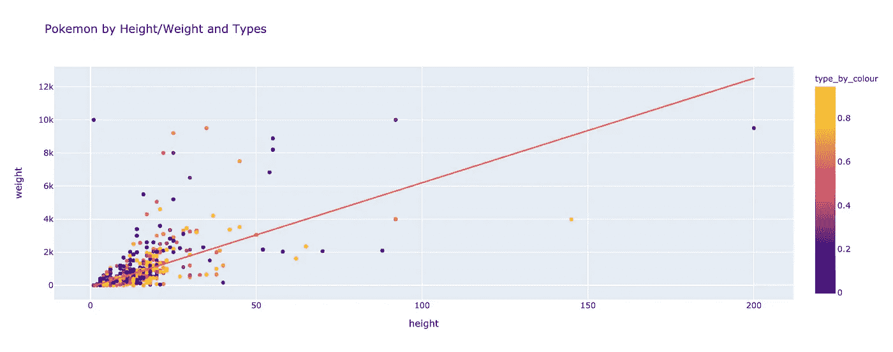
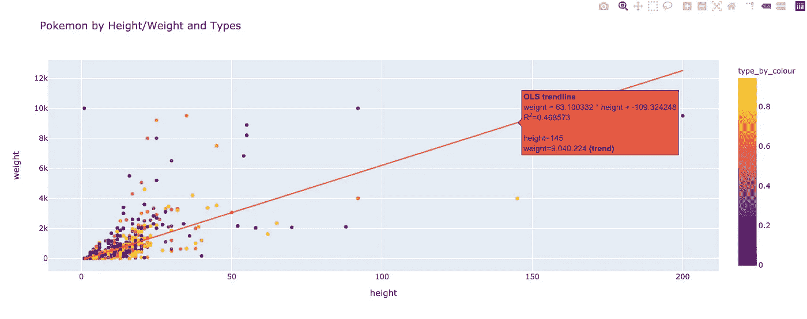
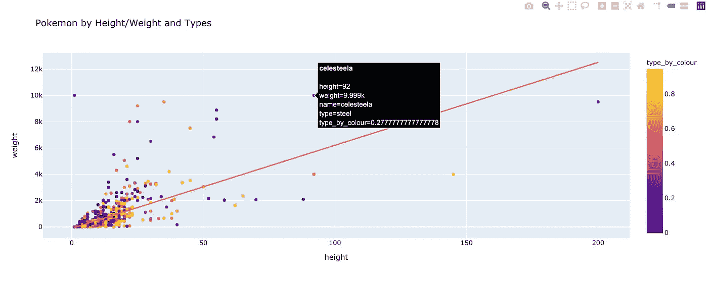
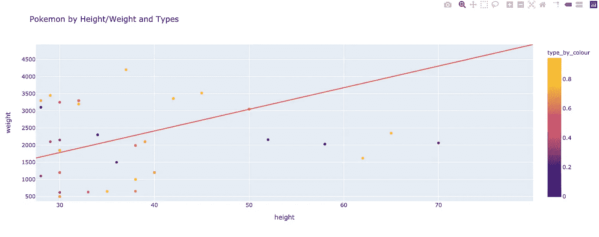

# PokéGraph 第四部分:使用 TigerGraph 和 Plotly Express 进行线性回归

> 原文：<https://towardsdatascience.com/pok%C3%A9graph-part-iv-linear-regression-with-tigergraph-and-plotly-express-d9210247d995?source=collection_archive---------43----------------------->

## 如何使用 Plotly Express 可视化您的 TigerGraph 数据

> 注:本博客假设你有这里的数据:[https://towards data science . com/pok % C3 % a9 graph-part-ii-writing-schema-change-jobs-for-tiger graph-d 6 E4 d 4 ABA 0](/pokégraph-part-ii-writing-schema-change-jobs-for-tigergraph-d6e4d6d4aba0)
> 它是本的更新版本:[https://shre ya-chaud hary . medium . com/linear-regression-with-a-graph-database-e 71 db 5 C1 B3 f 3](https://shreya-chaudhary.medium.com/linear-regression-with-a-graph-database-e71db5c1b3f3)。

# 目标

在过去的博客中，我们已经创建了我们的图表——完成了模式、加载数据和一些模式更改工作——并学习了一点 GSQL。现在，让我们通过创建一个线性回归模型将所有这些放在一起。我们将通过使用 GSQL 来使用我们的 TigerGraph 神奇宝贝数据，然后我们将使用 Plotly Express 将其放入交互式 UI 中。我们的线性回归将使用神奇宝贝的重量和高度，按类型进行颜色编码，并在悬停数据中包含神奇宝贝的名称。我们开始吧！

# 步骤 1:设置解决方案并导入库

首先，你需要准备好你的解决方案。正如以前的博客所显示的，在[https://tgcloud.io/app/solutions](https://tgcloud.io/app/solutions)中，确保你的解决方案旁边有一个绿点，并显示准备好了。

接下来，确保您安装了 pyTigerGraph。在 Colab 中，在其中一个单元格中键入以下内容:

```
!pip install pyTigerGraph
```

安装完成后，你可以将 pyTigerGraph 与 Plotly Express 和 Pandas 一起导入。

```
import pyTigerGraph as tg
import plotly.express as px
import pandas as pd
```

最后，创建与您的图表的连接:

```
conn = tg.TigerGraphConnection(host="https://SUBDOMAIN.i.tgcloud.io", password="PASSWORD", graphname="PokemonGraph")conn.apiToken = conn.getToken(conn.createSecret())
```

当然，用它们各自的值替换子域和密码。

# 步骤二:创建和运行查询

现在，让我们创建一个查询来获取我们需要的所有变量。为此，我们需要重量、高度、类型和名称。所有这些都是全局列表累计累加器。重量和高度将是 INT 类型，类型和名称将是 STRING 类型。最后，我将添加一个最终的全局 type_set SetAccum <string>。这将让我们在最后创建一个彩色地图，对线性回归中的点进行颜色编码。总的来说，我们的变量如下所示:</string>

```
ListAccum<INT> @@heights, @@weights;
ListAccum<STRING> @@names, @@types;
SetAccum<STRING> @@types_set;
```

> 记住:@@代表全局变量，@代表局部变量。

然后，对于我们的种子，我们只需抓取我们所有的神奇宝贝:

```
catchThemAll = {Pokemon.*};
```

现在，对于我们的选择查询，我们将从口袋妖怪顶点开始，经过 Pokemon 类型的边，然后在类型顶点结束。然后，在 ACCUM 子句中，我们将更新所有的累加器。

```
Res = SELECT t FROM catchThemAll:p-(POKEMON_TYPE:e)-Type:t
      ACCUM @@heights+=p.height, @@weights+=p.weight,
            @@names+=p.name, @@types+=t.type_id,
            @@types_set+=t.type_id;
```

> 记住:对于累加器来说，a +=不一定意味着加一个值。可以把它看作是“激活”累加器或给累加器的计算增加一个值(可以是平均值、最大值、最小值、列表、集合等。).

最后，让我们打印出所有的累加器。

```
PRINT @@heights, @@weights, @@names, @@types, @@types_set;
```

太棒了。让我们将所有这些放在一个查询中，并使用 pyTigerGraph 安装它。

```
print(conn.gsql('''DROP QUERY getAttributesCREATE QUERY getAttributes() FOR GRAPH PokemonGraph { ListAccum<INT> @@heights, @@weights;
   ListAccum<STRING> @@names, @@types;
   SetAccum<STRING> @@types_set; catchThemAll = {Pokemon.*}; Res = SELECT t FROM catchThemAll:p-(POKEMON_TYPE:e)-Type:t
         ACCUM @@heights+=p.height, @@weights+=p.weight,
               @@names+=p.name, @@types+=t.type_id,
               @@types_set+=t.type_id; PRINT @@heights, @@weights, @@names, @@types, @@types_set;}INSTALL QUERY getAttributes'''))
```

> 注意:安装可能需要几分钟时间。

太好了！我们快到了！现在让我们使用这些值来创建线性回归。

# 第三步:创建线性回归

首先，让我们运行刚刚编写的查询，并获取第一个打印函数的结果(在索引 0 处)。

```
att = conn.runInstalledQuery("getAttributes")[0]
```

接下来，我们将 att 的值赋给各个 Python 变量。

```
heights, weights, types, names = att["@@heights"], att["@@weights"], att["@@types"], att["@@names"]
```

然后，我们将创建一个彩色地图，并分配价值。在这种情况下，我将取 0-1 之间的所有值，但任何范围都可以。

```
colour_map = {val : num for num, val in (enumerate(att["@@types_set"]))}colours = [colour_map[i]/len(att["@@types_set"]) for i in types]
```

最后，我们将使用我们的数据创建一个熊猫数据框架。

```
d = {'height': heights, 'weight': weights, 'type': types, 'name': names, 'type_by_colour': colours}df = pd.DataFrame(data=d)
```

然后我们可以使用 Plotly Express 绘制它！

```
fig = px.scatter(df, x="height", y="weight", color="type_by_colour", title="Pokemon by Height/Weight and Types", hover_name=names, hover_data=['name', 'type'], trendline="ols")fig.show()
```

volia，我们得到这个线性回归！



结果线性回归

# 第四步:探索线性回归

似乎线性回归不是最好的。如果你将鼠标悬停在线上，你可以看到 R 是 0.468573。您还可以找到关于这条线的其他细节，例如悬停区域的重量和高度值以及这条线的方程。



通过将鼠标悬停在线上，您可以找到关于该线的更多信息。

你可以将鼠标悬停在某个点上，以获得关于口袋妖怪的详细信息。



盘旋在塞莱斯提拉上空

在这种情况下，口袋妖怪是 celesteela，体重 9.999k，身高 92 个单位。Celesteela 是钢的类型。最后，它给出了钢的色数，约为 0.27778。

如果在某个位置单击并拖动，可以放大区域。要缩小，只需双击。



放大线性回归

# 第五步:资源+祝贺！

恭喜你。您使用来自 TigerGraph 的数据用 Plotly Express 创建了一个线性回归！如果您想了解更多关于 TigerGraph 的信息，加入更多与 TigerGraph 相关的项目，询问关于 TigerGraph 的问题，或者只是与社区讨论 TigerGraph，请随时加入 Discord:

[](https://discord.gg/gRHWBZNpxW) [## 加入 TigerGraph Discord 服务器！

### 在 Discord 上查看 TigerGraph 社区——与 569 名其他成员一起闲逛，享受免费的语音和文本聊天。

不和谐. gg](https://discord.gg/gRHWBZNpxW) 

您可以在开发者门户网站找到更多 TigerGraph 工具:

 [## TigerGraph 开发者网站

### 所有 TigerGraph 开发者内容的一站式商店。探索学习、TigerGraph 项目和我们生动的…

developers.tigergraph.com](https://developers.tigergraph.com/) 

了解如何使用 TigerGraph 编写查询:

[](https://docs.tigergraph.com/dev/gsql-ref/querying/select-statement) [## 选择指令

### 注意:从 TigerGraph 2.6 开始，GSQL 查询语言现在有两个版本。两者都可以在…

docs.tigergraph.com](https://docs.tigergraph.com/dev/gsql-ref/querying/select-statement) 

点击此处查看 Plotly Express 的线性回归文档:

 [## plotly.express.scatter - 5.0.0 文档

### 在散点图中，的每一行都由 2D 空间中的符号标记表示。参数数据帧(数据帧或…

plotly.com](https://plotly.com/python-api-reference/generated/plotly.express.scatter)