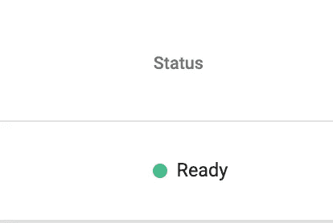
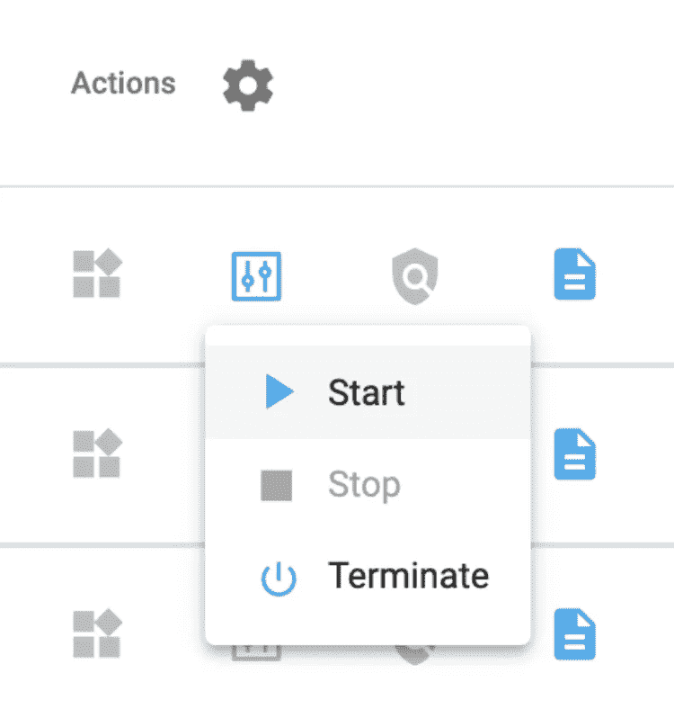

# 神奇宝贝图第五部分:用 TigerGraph、PokéAPI 和 Plotly Dash 创建一个基本的神奇宝贝仪表盘

> 原文：<https://towardsdatascience.com/pok%C3%A9graph-part-v-creating-a-basic-pok%C3%A9mon-dashboard-with-tigergraph-pok%C3%A9api-and-plotly-dash-b86fcf9ed161?source=collection_archive---------29----------------------->

## 使用 TigerGraph 数据创建带有 Plotly Dash 的仪表板

> 注意:这是 PokéGraph 系列的奖金博客。

# 目标

在[过去的博客](/pokégraph-part-iv-linear-regression-with-tigergraph-and-plotly-express-d9210247d995)中，我们能够用我们的 TigerGraph 数据创建可视化。现在，让我们把可视化放在一个仪表板中，我们将使用 Plotly Dash 创建它。在这篇博客中，我们将使用 TigerGraph 在 GSQL 中编写更多的查询，并使用 Plotly Express 创建一个条形图，使用 Plotly Dash 将我们的数据放在一起。我们开始吧！

# 第一部分:设置

## 第一步:开始你的解决方案

前往 https://tgcloud.io/[的](https://tgcloud.io/)，导航至“我的解决方案”选项卡。确保您的解决方案在状态下显示“就绪”。



转到“我的解决方案”并检查状态是否为“就绪”图片作者。

如果您的解决方案显示“停止”，请单击“操作”下方的“解决方案操作”按钮(方框)，然后在下拉列表中按“开始”。



如果您的状态显示“已停止”，请按下方框，然后按下开始按钮。图片作者。

等待溶液启动，圆点变绿。

## 第二步:安装并加载库

接下来，去你的 Colab 笔记本。在那里，安装并导入您的库。

我们需要导入 Jupyter Dash，Plotly Dash 的库，用于在笔记本中创建仪表板。我们还将使用 Dash 库，包括核心和 html 组件以及 Plotly Express。最后，我们将导入 Pandas 来轻松管理从 TigerGraph 到 Plotly 的数据。

```
!pip install -q jupyter-dash
!pip install -q pyTigerGraphfrom jupyter_dash import JupyterDash
import dash_core_components as dcc
import dash_html_components as html
import plotly.express as px
import pyTigerGraph as tg
import pandas as pd
```

太棒了。

## 第三步:连接到您的解决方案

现在，使用 pyTigerGraph，创建一个到您的图形的连接。用适当的值替换子域和密码。

```
conn = tg.TigerGraphConnection(host="https://SUBDOMAIN.i.tgcloud.io", password="PASSWORD", graphname="PokemonGraph")
conn.apiToken = conn.getToken(conn.createSecret())
```

对于我的解决方案，它看起来像这样:

```
conn = tg.TigerGraphConnection(host="https://pokemon.i.tgcloud.io", password="tigergraph", graphname="PokemonGraph")
conn.apiToken = conn.getToken(conn.createSecret())
```

太好了！现在让我们开始为我们的仪表板创建图表吧！

# 第二部分:创建条形图

## 步骤 1:编写一个查询

首先，我们将编写并安装一个简单的查询来计算每种类型的神奇宝贝的数量。为此，我们将创建一个名为 count 的本地 SumAccum 累加器，它将计算连接到每种类型的神奇宝贝顶点的数量。我们将最终返回所有的类型顶点(SELECT 语句的结果)。

```
# Gets number of pokémon of each typeprint(conn.gsql('''USE GRAPH PokemonGraphCREATE QUERY getTypeCount() FOR GRAPH PokemonGraph {/* Gets number of pokémon with each type */SumAccum<Int> @count;
Seed = {Pokemon.*};counts = SELECT tgt FROM Seed:s -(POKEMON_TYPE:e) -:tgt
         ACCUM tgt.@count += 1;PRINT counts;}INSTALL QUERY getTypeCount''', options=[]))
```

## 步骤二:创建一个数据框架

让我们使用我们刚刚编写的查询结果，用 pandas 创建一个数据帧。首先，我们将使用 runInstalledQuery 运行查询。

```
results = conn.runInstalledQuery("getTypeCount")
```

然后，我们将结果放入 Python 列表中。

```
allTypes = []
typeCounts = []for types in results[0]["counts"]:
   allTypes.append(types['v_id'])
   typeCounts.append(types['attributes']['@count'])
```

最后，我们将把它放入一个数据帧中。

```
pokeData = pd.DataFrame(data=list(zip(allTypes, typeCounts)), columns=['Type', 'Count'])
```

不错！现在让我们使用数据框架来创建一个条形图。

## 第三步:创建条形图

现在我们将使用 Plotly Express 和 px.bar 创建我们的数据帧。

```
bar = px.bar(pokeData, x='Type', y='Count', title='Pokemon Type Count')
```

如果您想查看条形图，可以运行 bar.show()

```
bar.show()
```


条形图。图片作者。

太好了！让我们从过去的博客中重新创建线性回归，并准备好绘制它！

# 第三部分:重建线性回归

我们还将包括从[过去的博客](/pokégraph-part-iv-linear-regression-with-tigergraph-and-plotly-express-d9210247d995)的线性回归，所以让我们重新创建它:

```
print(conn.gsql('''USE GRAPH PokemonGraphDROP QUERY getAttributesCREATE QUERY getAttributes() FOR GRAPH PokemonGraph { ListAccum<INT> @@heights, @@weights;
   ListAccum<STRING> @@names, @@types;
   SetAccum<STRING> @@types_set; catchThemAll = {Pokemon.*}; Res = SELECT t FROM catchThemAll:p-(POKEMON_TYPE:e)-Type:t
         ACCUM @@heights+=p.height, @@weights+=p.weight,
               @@names+=p.name, @@types+=t.type_id,
               @@types_set+=t.type_id; PRINT @@heights, @@weights, @@names, @@types, @@types_set;}INSTALL QUERY getAttributes'''))att = conn.runInstalledQuery("getAttributes")[0]heights, weights, types, names = att["@@heights"], att["@@weights"], att["@@types"], att["@@names"]colour_map = {val : num for num, val in (enumerate(att["@@types_set"]))}
colours = [colour_map[i]/len(att["@@types_set"]) for i in types]d = {'height': heights, 'weight': weights, 'type': types, 'name': names, 'type_by_colour': colours}
df = pd.DataFrame(data=d)fig = px.scatter(df, x="height", y="weight", color="type_by_colour", title="Pokemon by Height/Weight and Types", hover_name=names, hover_data=['name', 'type'], trendline="ols")
```

这将导致我们的彩色图表，我们可以使用 fig.show()查看。

```
fig.show()
```


线性回归。图片作者。

现在我们有了两个图表，让我们把它们放在一个仪表板上！

# 第四部分:把它放在一起变成一个仪表板！

让我们最后使用 Plotly Dash 的 html 组件将这两个图表放在一起。这两个图的名字分别是 bar 和 fig，我们就这样引用。

```
app = JupyterDash(__name__)app.layout = html.Div([ html.H1("Pokemon Dashboard Demo"),
   dcc.Graph(id='bar_chart', figure=bar),
   dcc.Graph(id='lin_reg', figure=fig),])
```

最后，我们来运行它！

```
app.run_server(mode='external')
```

这样做的结果是链接到本地托管您的仪表板的位置。


运行服务器的结果。图片作者。

# 第五部分:探索仪表板

哒哒！当你点击它，你会看到两个数字和标题。


仪表板。图片作者。

Plotly 很酷的一点是，你可以将鼠标悬停在该点上以获得更多细节。例如，如果您将鼠标悬停在“normal”栏上，您将能够找到计数并获得类型。


将鼠标悬停在条形图的某个点上。图片作者。

这对于线性回归也是一样的。


悬停在线性回归的一个点上。图片作者。

# 第六部分:祝贺、资源和挑战

恭喜你。您现在已经创建了一个仪表板，其中有两个数字描述您的 TigerGraph 数据！

作为一个挑战，尝试用 Plotly Express 创建另一个可视化，并将其添加到仪表板中。要查看 Plotly Express 的其他可视化效果，请查看此博客:

<https://shreya-chaudhary.medium.com/enhancing-your-kaggle-computations-with-tigergraph-part-ii-creating-visualisations-with-plotly-1197d7707dac>  

接下来，尝试使用您选择的不同 API 创建另一个仪表板。如果您有任何问题或想要展示您的项目，请在此加入 TigerGraph Discord:

<https://discord.gg/gRHWBZNpxW>  

祝你好运！