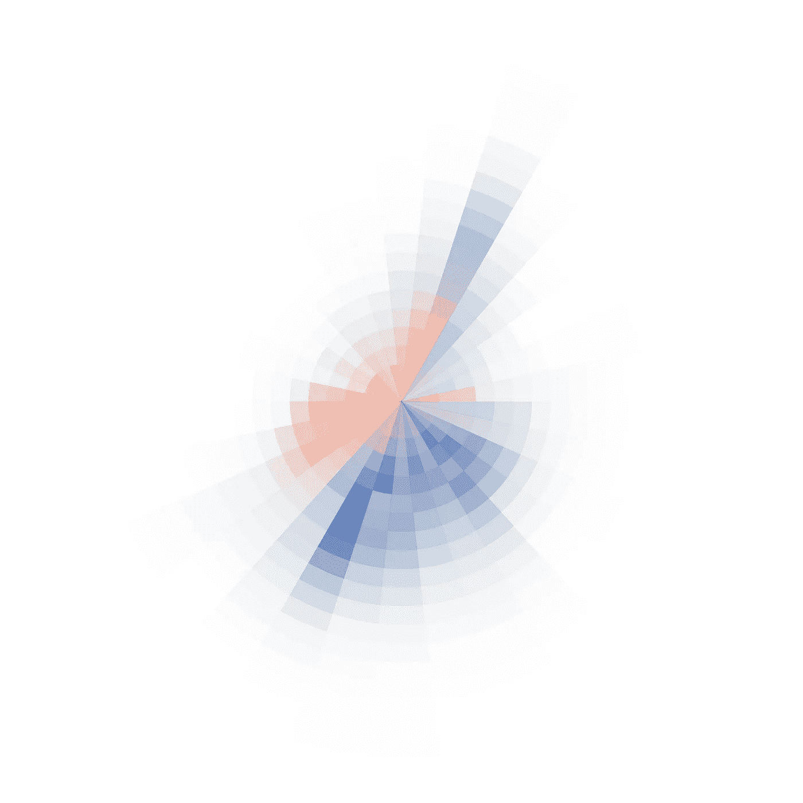
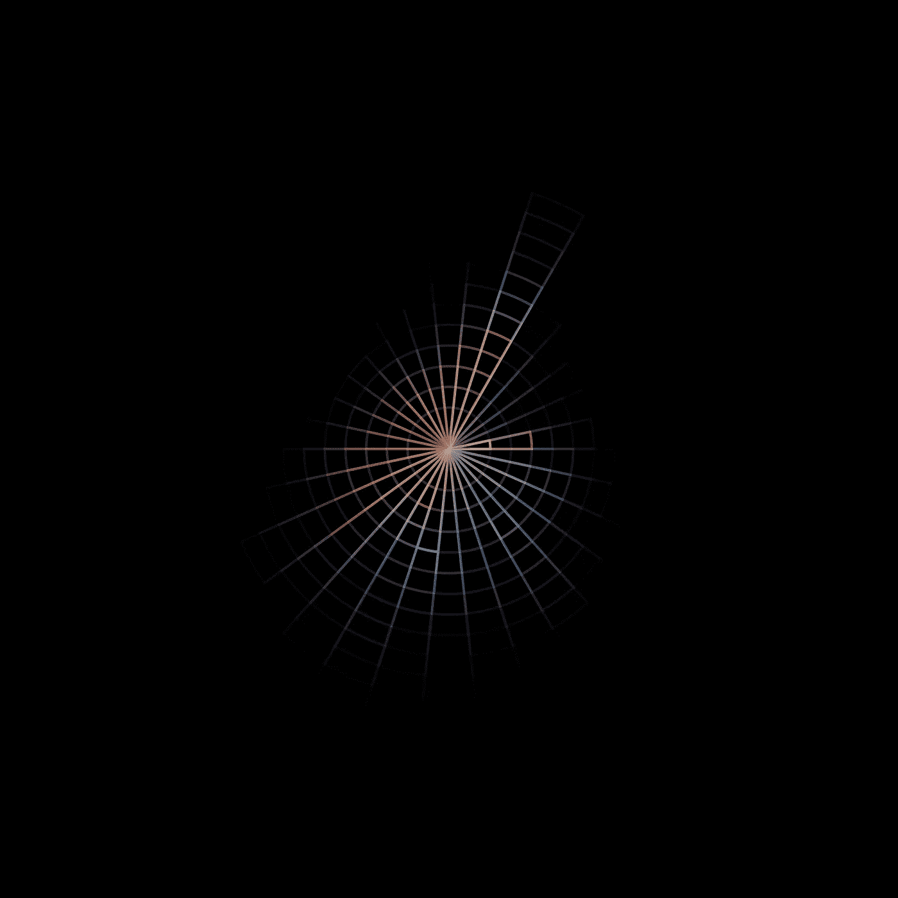

# 使用 Matplotlib 的 Python 中的极坐标热图

> 原文：<https://towardsdatascience.com/polar-heatmaps-in-python-with-matplotlib-d2a09610bc55?source=collection_archive---------23----------------------->

## 使用 matplotlib 补丁构建一些漂亮的东西


极坐标热图显示风速和风向，颜色代表桶内的平均温度。(图片由作者提供)

我真的很喜欢使用 Python + matplotlib，不仅仅是因为它的简单，还因为你可以用它来创建非常干净和巧妙的图像。要放弃的一件事是使用库中预定义的绘图方法，而是查看 matplotlib 中包含的几何图形和面片。

上面的图像纯粹是用几组**楔形**面片创建的。它既干净又漂亮，现在我会告诉你怎么做。看这个例子的时候，想想被标准图的锁链束缚是多么的自由！

## 这个问题

> 风向和风速与平均气温有没有相关性？

这是我在 Kaggle 上看到数据集时问自己的问题:

[](https://www.kaggle.com/selfishgene/historical-hourly-weather-data) [## 2012-2017 年的历史每小时天气数据

### 30 个美国和加拿大城市+ 6 个以色列城市的每小时天气数据

www.kaggle.com](https://www.kaggle.com/selfishgene/historical-hourly-weather-data) 

我想要的结果是有一个极坐标热图，其中每个楔形由该桶中的平均温度来着色。当我在网上寻找是否有什么可以产生一个漂亮干净的图像时，我就倒霉了！

我发现的主要问题是绘图软件看起来总是有点粗糙，如果我要用它来做海报，我希望它看起来更干净更简单。这就是为什么我决定用楔形物体来建造它。

## 代码

按照传统，我们首先导入所需的包:

```
import numpy as np
import pandas as pd
import matplotlib.pyplot as plt
from matplotlib.colors import LinearSegmentedColormap
import matplotlib.patches as mpatches
from matplotlib.collections import PatchCollection
```

我们正在处理几个包，让我们将它们分解开来:

> **numpy:** 非常流行的数值运算和矩阵计算软件包
> 
> **pandas:** 主要用于数据帧功能和数据的加载。
> 
> matplotlib: 我们将用来生成图像的绘图包。它可以用于标准的科学绘图，但非常灵活！

***matplotlib*** 内有一些组件:

> **LinearSegmentedColormap:**用于创建自定义线性颜色渐变功能。
> 
> **匹配:**这是让我们为绘图构建原始形状的部分。
> 
> **PatchCollection:** 取一组补丁，将它们缝合在一起，用于绘图。

现在，我们所有的基本功能都已导入，我们可以继续加载数据文件了。对于这个项目，我使用了风向，风速，当然还有温度。

```
wind_direction = pd.read_csv('../input/historical-hourly-weather-data/wind_direction.csv')wind_speed = pd.read_csv('../input/historical-hourly-weather-data/wind_speed.csv')temperature = pd.read_csv('../input/historical-hourly-weather-data/temperature.csv')
```

上面的数据集实际上包括了许多不同城市的天气数据。因为我来自多伦多地区，我们将选择 ***6*** 作为我们的地块。我们将使用城市变量过滤掉数据，并删除任何 *na* 值，以确保我们有好的数据。

```
city = 'Toronto'wind_direction_list = list(wind_direction[city].dropna())wind_speed_list = list(wind_speed[city].dropna())temperature_list = list(temperature[city].dropna())
```

我们冒险的下一步是提取数据并把它转换成一种好的格式。请记住，有很多方法可以做到这一点，我不是 Python 的超级专家。我所做的就是根据原始数据生成一些列表。我将θ(极角)与风向关联，r(半径)与风速关联，temp 与温度关联。一旦生成了这三个列表，我就用它们来创建一个新的数据帧。

```
r = []; theta = []; temp = []for i,w **in** enumerate(wind_direction_list):
    r.append(wind_speed_list[i])
    theta.append(wind_direction_list[i])
    temp.append(temperature_list[i])df = pd.DataFrame(list(zip(r,theta,temp)),columns =['r','theta','temp'])
```

接下来，我们定义我们想要的直方图的宁滨。根据这些数据，如果您选择较小的网格数(较高的网格数)，您可能会得到间隙，因为在给定的区域中没有数据点。随着网格数的增加，你最终会得到一个极坐标散点图！

```
ntheta = 30; dtheta = 360/ntheta;
nradius = 20; dradius = max(r)/nradius;
```

我们也可以设置我们的颜色映射。我使用了一个漂亮的蓝色到红色的调色板，这是我从网站:[https://coolors.co/](https://coolors.co/)

```
colors = ['#000052','#0c44ac','#faf0ca','#ed0101','#970005'] 

cm = LinearSegmentedColormap.from_list('custom', colors,N=10)cm.set_bad(color='white')
```

现在我们有了一个函数 **cm** ，我们可以调用它来生成 0-1 范围内的颜色。这意味着我们将不得不在这个范围内调整最终温度(将在下一节中完成)。

现在是代码的核心部分。如何生成将要绘制的实际补丁对象？因为我们要在画布上画画，所以我们需要确保不要在我们不想画的东西上画画。这意味着我们将从最大的**半径**开始向下工作。

```
patches = []; avg_temp = []

for nr **in** range(nradius,0,-1):  **# See!  Outside to Inside** start_r = (nr-1)*dradius
    end_r = (nr)*dradius for nt **in** range(0,ntheta):
        start_t = nt*dtheta
        end_t = (nt+1)*dtheta

        stripped = df[(df['r']>=start_r) & (df['r']<end_r) &          
            (df['theta']>=start_t) & (df['theta']<end_t)]

        avg_temp.append(stripped['temp'].mean()) wedge = mpatches.Wedge(0,end_r, start_t, end_t) patches.append(wedge)
```

上面发生了很多事情，让我们来看一下:

1.  首先我们从最大半径向下循环
2.  做一个 360 度的次循环
3.  找到 **r** 和**θ**范围的开始和结束位置
4.  删除数据帧中的行
5.  计算平均温度并附加
6.  创建楔形面片并添加到面片列表中

完成后，我们就差不多完成了。现在，我们可以生成补丁的集合，并使用颜色映射函数和平均温度来单独分配补丁颜色。

```
collection = PatchCollection(patches,linewidth=0.0,
    edgecolor=['#000000' for x **in** avg_temp], 
    facecolor=cm([(x-263.15 )/(303.15 -263.15 ) for x **in** avg_temp]))
```

请注意，我们需要通过一些真实的温度范围来缩放面部颜色。我选择了-10C 到 30C 作为我的范围，但是你可以用它来改变颜色的比例。

现在我们策划！设置大小和 dpi，并将补丁集合添加到映像中。

```
fig = plt.figure(figsize=(40,20), dpi=200,
    edgecolor='w',facecolor='w')ax = fig.add_subplot()ax.add_collection(collection)**# Clean up the image canvas and save!**
plt.axis('equal')
plt.axis('off')
plt.tight_layout()

plt.savefig('toronto.png')
plt.show()
```

嘣！输出:


现在，你可以使用边缘颜色和其他因素来处理这个问题，并获得如下一组好的图像:



## 结论

希望你喜欢这个！如果您有问题，请添加评论。如果你认为有足够的兴趣，我可以为这个小方法做一个 pip 包。