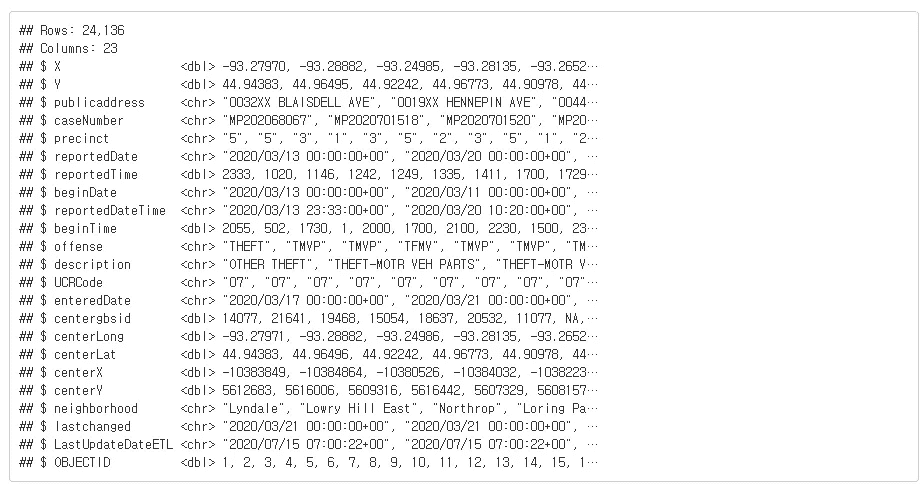
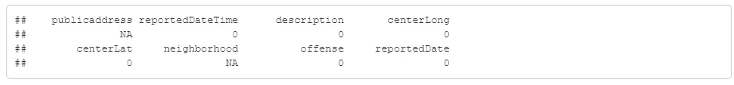
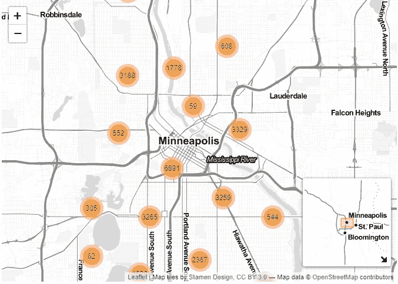
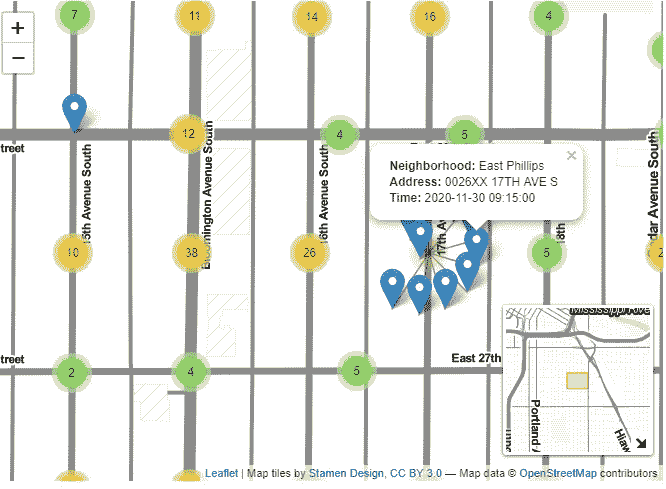
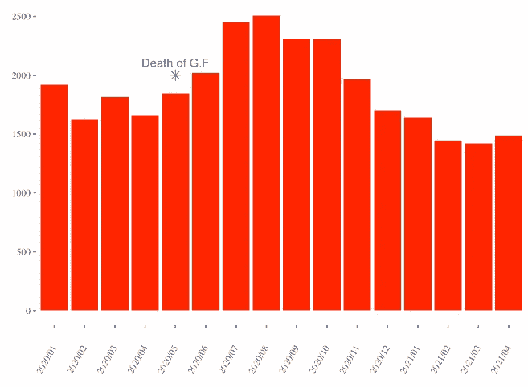
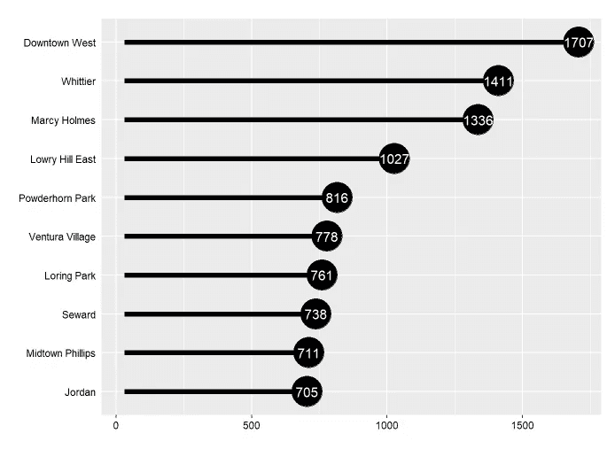

# 明尼阿波利斯的警察事件

> 原文：<https://towardsdatascience.com/police-incidents-trend-in-mn-76d8057703d0?source=collection_archive---------32----------------------->


[伊森·威尔金森](https://unsplash.com/@ethanrwilkinson?utm_source=medium&utm_medium=referral)在 [Unsplash](https://unsplash.com?utm_source=medium&utm_medium=referral) 上拍摄的照片

# 目录

1.  [简介](#87e5)
2.  [快速概述](#f029)
3.  [解释性数据分析](#02b1)
4.  [结论](#41d8)

# **简介**

明尼阿波利斯以其跨州的高品质生活和密西西比河惊人的城市特质而闻名。然而，它也因 2020 年 5 月乔治·弗洛伊德 [**谋杀案而“声名狼藉”。**](https://en.wikipedia.org/wiki/Murder_of_George_Floyd)

那么，在他死后，到目前为止发生了什么变化呢？该分析旨在直观显示明尼阿波利斯市自 2020 年以来的警察事件现状和趋势。

# 快速概述

该数据集可在“ [**开放明尼阿波利斯**](https://opendata.minneapolismn.gov/) ”网站上获得，该网站旨在提供与明尼阿波利斯有关的社会数据。根据该网站的说法，这些数据集是免费共享的，只需最少的许可。

```
***# Import data sets***
incident_2020 <- read_csv("Police_Incidents_2020.csv")
incident_2021 <- read_csv("Police_Incidents_2021.csv")***# Use glimpse() on one of the dataset*** glimpse(incident_2020)
```



我们可能会注意到:

*   重复数据:`X`、`Y`、`centerLong`、`centerLat`
*   多余数据:`precinct`、`UCRCode`、`lastchanged`等
*   检查是否有任何缺失值和不整洁的数据

# 选择/整理列

```
***# Adjust data type and concatenate*** incident_2021$precinct <- as.character(incident_2021$precinct)
incident_raw <- bind_rows(incident_2020, incident_2021)

***# Select relevant columns only*** incident_selected <- incident_raw %>% select(publicaddress, reportedDateTime,description, centerLong,centerLat,neighborhood,offense)

***# Parse datetime on reporteDateTime column*** 
incident_selected$reportedDateTime <- substr(incident_selected$reportedDateTime, 1,16)
incident_selected$reportedDateTime <- as.character(incident_selected$reportedDateTime)
incident_selected$reportedDateTime <- parse_datetime(incident_selected$reportedDateTime, "%Y/%m/%d %H:%M")
incident_selected <- incident_selected %>% mutate(reportedDate = format(reportedDateTime, "%Y/%m")) 

***# Clean NA and zero value row*** colSums(incident_selected ==0)
incident_selected <- incident_selected[incident_selected$centerLong != 0,]
```



(对于`publicaddress`和`neighborhood`，我们将保留那些包含缺失数据的行，因为它们只是字符串)

# **用传单绘制事件图**

如果你还没用过`leaflet`，我强烈建议在你的项目上试试！`leaflet`提供的一个惊人特性是构建一个交互式地图。正如您可能从下图中注意到的，只需几行代码就可以创建自动聚合数据的地图，供您在不同的级别进行检查。

```
*# Plot on map by leaflet*
incident_selected %>% leaflet() %>% 
  addProviderTiles(providers$Stamen.TonerLite) %>% 
  addMarkers(label = incident_selected$description,
             clusterOptions = markerClusterOptions(),
             lng = incident_selected$centerLong, lat = incident_selected$centerLat,
             popup = paste("<b>","Neighborhood:","</b>",
                           incident_selected$neighborhood,"<br>",
                           "<b>","Address:","</b>",
                           incident_selected$publicaddress,"<br>",
                           "<b>","Time:","</b>",
                           incident_selected$reportedDateTime)) %>%
  addMiniMap(toggleDisplay = TRUE,tiles = providers$Stamen.TonerLite)
```



[**点击此处**](https://rpubs.com/BrandonPPP/788810) **查看 Rpub** 的互动地图



[**点击此处**](https://rpubs.com/BrandonPPP/788810) **查看 Rpub** 的互动地图

# **警察事件趋势(2020~)**

你们中的一些人可能还记得 2020 年 5 月发生的事件。是的。正是乔治·弗洛伊德的谋杀引发了全国性的示威游行和纪念仪式。最初，抗议是以和平的方式进行的，但后来变成了破坏行为。

我们来看看从警察事件的数量来看，该事件带来了什么影响。

```
***# Summarise by date and plot*** summarised_incident_selected <- incident_selected %>% 
  filter(reportedDate != "2021/05") %>%
  group_by(reportedDate) %>%
  summarise(num_case = n()) ***# Plot using ggplot***ggplot(summarised_incident_selected, aes(reportedDate, num_case, group=1))+
  geom_col(fill='red')+expand_limits(y = 0)+  theme_tufte()+
  theme(axis.text.x = element_text(angle = 60, hjust = 1, vjust = 0.5))+
  xlab("") + ylab("")+
  annotate("point", x = '2020/05', y = 2000, colour = "blue", size=3,shape=8) +
  annotate("text", x = '2020/05', y = 2000, label = "Death of G.F", colour = "blue", vjust = -1)
```



*   注释显示乔治·弗洛伊德于 2020 年 5 月去世
*   显然，2020 年 5 月后至年底，警察事件总数激增

# 事故最多的十大社区

那么，明尼阿波利斯的哪个地区发生的警察事件最多？换句话说，哪个社区是最危险的游览地？

```
top_10_neighbor <- incident_selected %>% 
  group_by(neighborhood) %>% 
  count(sort=TRUE) %>% ungroup() %>% 
  top_n(10) %>% mutate(neighborhood = fct_reorder(neighborhood,n))

ggplot(top_10_neighbor, aes(n,neighborhood)) +
  geom_point(size = 12) +
  geom_segment(aes(xend = 30, yend = neighborhood), size = 2) +
  geom_text(aes(label = round(n,1)), color = "white", size = 4) +
  *#scale_x_continuous("", expand = c(0,0), limits = c(30,90), position = "top") +*
  scale_color_gradientn(colors = palette) +
  theme(axis.line.y = element_blank(),
      axis.ticks.y = element_blank(),
      axis.text = element_text(color="black"),
      axis.title = element_blank(),
      legend.position = "none")
```



**韦斯特市中心、惠蒂尔、马西·霍姆斯**是排名前三的街区

# 结论

*   如果你忽略了互动地图，你可以在这里找到它
*   从地图上看，大多数事件都集中在明尼阿波利斯市中心和附近地区。
*   乔治·弗洛伊德被谋杀后，明尼阿波利斯的警察事件似乎增加了
*   如果你想找一个住的地方，找除了以上 10 个地区以外的地方会更安全。