# 警察杀人、城市消费和暴力犯罪之间的关系

> 原文：<https://towardsdatascience.com/police-killings-city-spending-and-violent-crime-61754788482b?source=collection_archive---------19----------------------->

## 公共投资与警察暴力探析

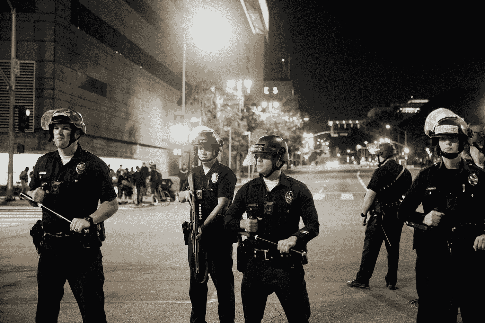

肖恩·李在 [Unsplash](https://unsplash.com?utm_source=medium&utm_medium=referral) 上的照片

在美国，自 2013 年以来，警察平均每年要对 1，101 起报告的死亡事件负责。乔治·弗洛伊德(George Floyd)之死引发了对警察暴行和过度使用武力的抗议，这是 2020 年的一个里程碑式的时刻。抗议者的主要要求之一是进行政策改革，解除警察的经费；这个想法是，将资金从捉襟见肘、过度暴力的警察部队重新分配到改善公共和紧急服务领域，如精神健康、经济适用房和成瘾，将同时减少犯罪和警察杀人。

司法统计局 2006 年的一项研究发现，新招募的警察花在训练枪械技能和自卫上的时间比任何其他技能都多，训练时间的中位数分别为 60 小时和 51 小时；第二高的中位数是健康和健身训练，为 46 小时。警察应对各种各样的紧急情况，包括家庭暴力、吸毒、无家可归或精神疾病。如果他们的训练侧重于使用武力，那么他们就没有适当的装备来应对如此广泛的情况。

评估警察对犯罪的影响一直是犯罪学实证研究的一个挑战，大量文献对警察在场的影响有不同的结论。许多研究着眼于警察数量或巡逻警力对犯罪的影响，但我没有使用警力，而是使用警力支出作为一个城市加强警力的指标。

反对削减警察经费的批评者声称，从警察手中撤资会助长潜在罪犯的气焰，增加犯罪率。本分析的范围是通过探索性分析和具有逐步特征选择的固定效应模型来检查支出因素及其与警察杀人和暴力犯罪的关系。

## 数据源

[**林肯土地政策研究所财政标准化城市数据库**](https://www.lincolninst.edu/research-data/data-toolkits/fiscally-standardized-cities)包含 1977 年至 2017 年美国 150 个最大城市的政府服务收入和支出。
[**美国联邦调查局统一犯罪报告**](https://www.ucrdatatool.gov/abouttheucr.cfm)警察部门自愿报告的每 10 万人中的犯罪实例和比率，这项工作使用 1985 年至 2014 年。
[**绘制警察暴力**](https://mappingpoliceviolence.org/)包括 2013 年至 2020 年超过 8000 起警察杀人事件；从三个众包数据库汇编而成。

## 数据处理

在这项工作中，治安部门报告的犯罪率被删除，因为它们代表的是县而不是市。政府支出包括城市、州和联邦政府的支出，以实际人均美元表示(2017 年)。支出分为 5 类:教育、卫生、交通、治安和环境/住房。UCR/FiSC 和 MPV/FiSC 数据集的组合中分别有 119 个和 138 个城市。因为 UCR 的数据是由警察机构自愿提交的，所以可能会有一些报道偏差。⁴

# 探索性分析

在这一节中，在深入研究合并数据之前，我们将对单个数据集进行简要分析。

## 2013 年至 2020 年间的警察杀人事件

从图 1 中我们可以看到，自 2013 年以来，警察杀人事件相对稳定。谋杀案最少和最多的月份是 2013 年 2 月和 2020 年 5 月，巧合的是这两个月也是乔治·弗洛伊德死亡的月份。平均而言，与秋季和冬季相比，夏季和春季的杀人事件更多。

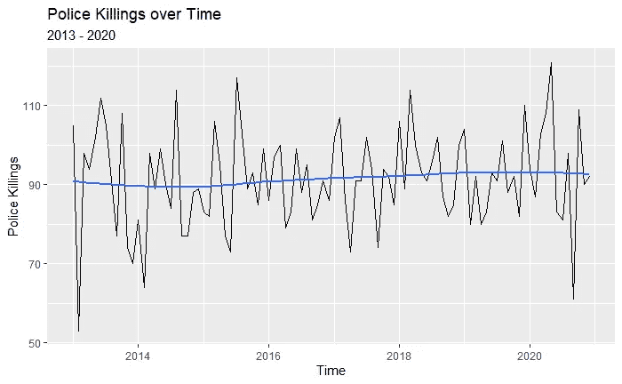

图一

图 2 中的直方图告诉我们，年轻人被警察杀害的比率高于其他年龄组。21 至 35 岁之间的受害者占所有警察杀人案的 44%。虽然大多数是年轻人，但我们可以看到，似乎没有任何年龄组完全逃避我们警察部队的暴行。

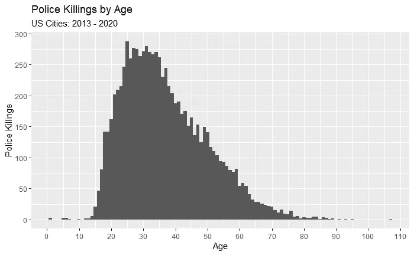

图 2

图 3 中的条形图详细列出了报告杀人事件最多的 10 个警察机构。这 10 家机构占同期所有警察杀人案件的 9.6%。令人担忧的是，LAPD 和洛杉矶县警察局都是排名前三的机构。这份名单并不令人惊讶，他们大多是人口稠密的城市中心，但菲尼克斯第二大杀人案让我质疑他们的训练技术，因为纽约市的人口是它的 5 倍多。

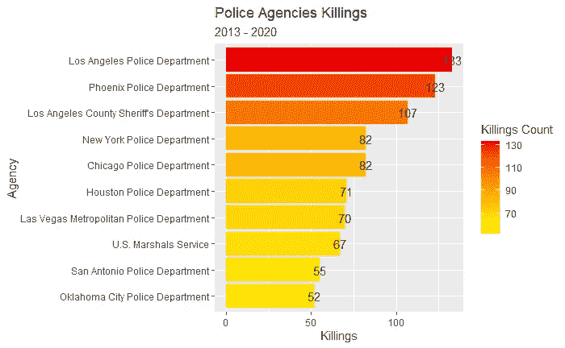

图 3

## 1977 年至 2014 年间的政府支出

左边的图 4 显示了 1977 年至 2014 年不同政府服务的人均支出占总支出的百分比。教育牢牢占据首位，平均支出比例最高，为 34.56%。警察支出从 1977 年的平均 6.74%稳步增长到 2014 年的 8.98%。平均而言，各城市在资金分配的优先顺序上似乎是一致的。

图 5 显示了变异系数(CV ),它被用作离差的度量，以表示相对于平均值的可变性。较高的 CV 值表明在某一特定年份不同城市间变量的差异较大。例如，医疗保健支出的 CV 随着时间的推移而增加，这意味着城市之间在支出占总支出的比例方面存在很大差异。总的来说，城市在如何分配资金方面没有太大的变化；尤其是治安和教育支出一直保持高度一致。

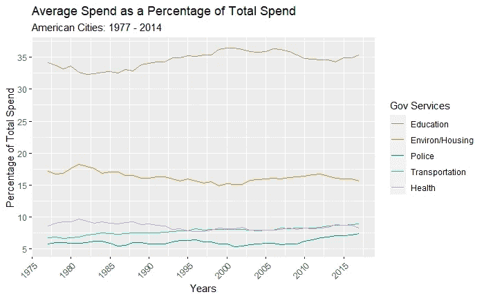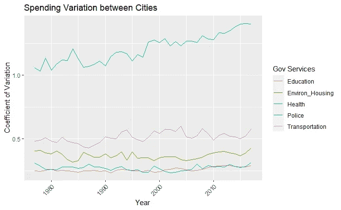

图 4 和图 5

下面的条形图显示了在一段时间内花费最高比例的 10 个城市。佛罗里达州有三个城市进入前 10 名。劳德代尔比排名第二的城市多花 0.8%的预算在警察身上。

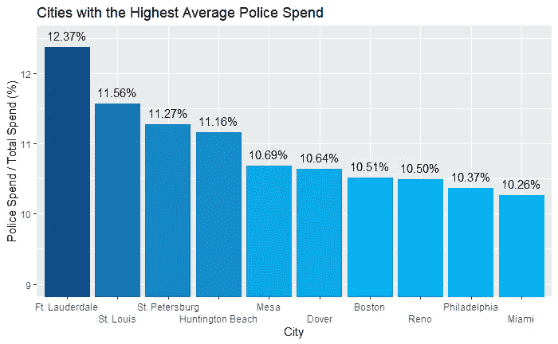

图 6

## 1985 年至 2014 年间的犯罪率

暴力犯罪率从 1993 年每 10 万人 1074 起暴力犯罪的峰值下降到 2014 年每 10 万人 520 起暴力犯罪，下降了 48.42%。总的来说，就犯罪而言，美国比以往任何时候都更安全。

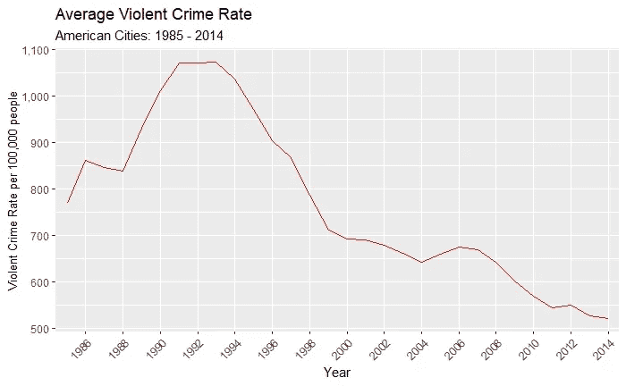

图 7

下面的散点图显示了暴力犯罪率和人口之间的密切联系。有趣的是，在人口密集的城市，犯罪率更高，但它们并不出现在那些将很大一部分开支用于维持治安的城市中。请记住，关联并不意味着高人口导致暴力犯罪或相反。(纽约市和洛杉矶的平均人口分别为 776 万和 366 万，平均犯罪率分别为 1，262 和 1，410，为了便于查看，这两个城市从图中删除了，但它们仍然为趋势线提供了权重)。

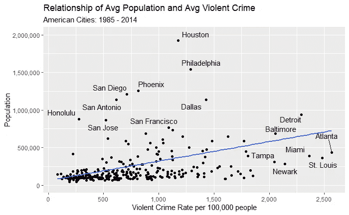

图 8

## 犯罪率和警察杀人与支出合并

下面的图是组合数据集的结果；它们揭示了犯罪率、警察和教育支出以及警察杀人之间的联系。1985 年至 2014 年和 2013 年至 2017 年的犯罪率和支出以及杀人和支出的合并数据。为了合并多个时间序列，我使用了指定日期范围内每个城市的平均值。

左边的图 9 和图 11 显示，平均而言，一个城市的警察支出，作为其总支出的比例，与暴力犯罪率和警察杀人都呈正相关，相关系数分别为 18.68%和 16.09%。与此同时，图 10 和图 12 显示，教育支出与犯罪率的相关性为-31.60%，与杀人的相关性为-24.39%。这告诉我们，我们可以期待发现，在教育上花费更多预算的城市，其暴力犯罪率和警察杀人事件更低。

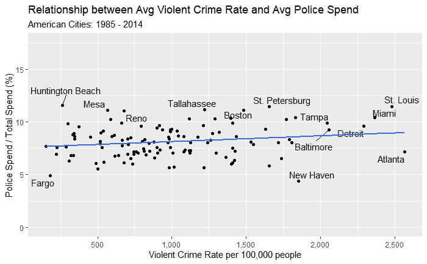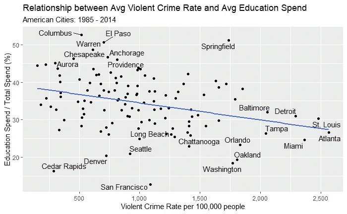

图 9 和 10

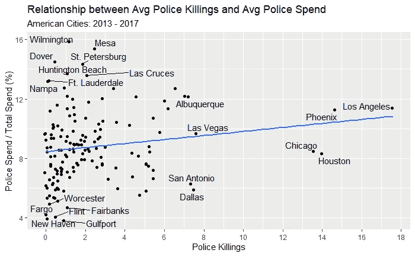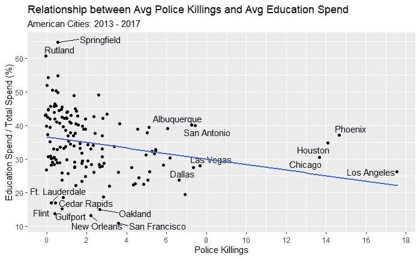

图 11 和 12

从这一探索性分析中可以得出一些重要的结论。

*   自 2013 年以来，警察杀人事件每年都在发生
*   随着时间的推移，城市的资金分配相对稳定
*   警察支出与暴力犯罪和警察杀人呈正相关，而教育支出则相反
*   暴力犯罪大大减少了

# 经验分析

固定效应模型被用来估计政府支出分配对暴力犯罪和警察杀人的影响。固定效应之间的模型是根据城市的平均值估计的，因此去除了由于城市内部随时间变化而产生的信息，这比长期的内部效应更可取。⁵

此外，我对 trajectories⁶的纵向数据进行了 k-means 聚类，以创建一个变量，该变量将使用城市的平均人均总支出来解释不同增长率的影响。下表详细介绍了 4 个集群及其 1985 年至 2014 年的增长率、平均支出以及集群中包含的城市。第四组仅包括一个城市，华盛顿特区，其花费增加了一倍多。

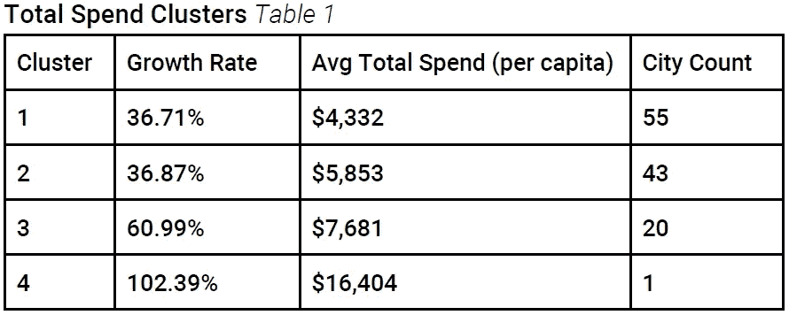

图 13

图 14 中的模型使用教育、福利、治安和环境/住房方面的人均支出作为暴力犯罪率的回归变量。有趣的是，教育、治安和环境/住房之间存在正相关，尽管警察支出变量的强度要高得多。平均而言，人均警察支出每增加 1 美元，每 10 万人的暴力犯罪就会相应增加 1.89 起。此外，福利支出与人均福利支出呈负相关，人均福利支出每增加 1 美元，每 10 万人的暴力犯罪就会相应减少 0.86 起。所创建的聚类变量不包括在该模型中，因为它会引入多重共线性，因为独立变量是人均支出，而不是总支出的比例。

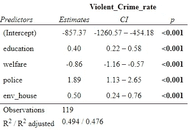

图 14

下一个模型使用支出率而不是人均支出，所以现在可以包括聚类。事实证明，教育支出在任何层面都不具有统计学意义。我们看到犯罪率与福利和交通负相关，同样，警察支出与犯罪率正相关。平均而言，如果一个城市在警察上的预算增加 1 个百分点，那么每 10 万人的暴力犯罪就会相应增加 69.49 起。聚类表明，平均支出更多、增长率更高的城市与更高的暴力犯罪率相关联。

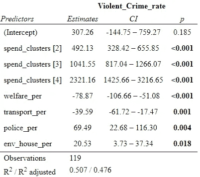

图 15

现在杀人被用作因变量，而不是犯罪率。在任何置信水平下，唯一具有统计意义人均支出项目是警察支出。这一模型可以解释为，平均而言，警察支出每增加 10 美元，警察杀人事件就会相应增加 0.1 起。最初，这似乎不是一个很大的影响，但当它在人类生活中被权衡时，它是很重要的。此外，因为警察支出是唯一具有统计意义的原始支出，我相信这个模型是有用的。

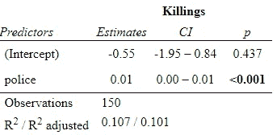

图 16

将自然对数转换应用于之前模型中的两个变量发现，平均而言，人均警察支出增加 1%会导致警察杀人增加 1.20%。为了应用该变换，将常数 0.5 添加到杀人事件中，这样一年中没有杀人事件的城市仍将包括在模型中。

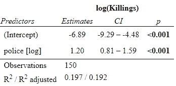

图 17

我们的最终模型使用总支出的百分比来预测自然死亡记录。结果显示，教育与杀人记录呈负相关，而福利和警察则呈正相关。平均而言，警察支出占所有支出的百分比每增加 1 个百分点，杀人案件就会增加 7.0%。虽然福利有一个积极的关联，但这可能与围绕阶级和种族的政策讨论有关，这超出了本工作的范围。

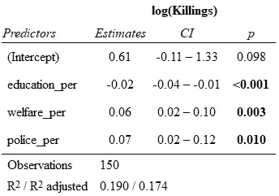

为了简洁起见，我没有讨论完整的模型构建过程，如果您对它们是如何构建的感兴趣，请联系我们。因此，实证分析的主要收获是:

*   无论是人均支出还是占支出的百分比，警察支出都与警察杀人和暴力犯罪率呈显著正相关
*   发展越快的城市犯罪率越高
*   福利支出与暴力犯罪率呈负相关，与警察杀人呈正相关

# 结论

这项工作试图探索取消对警察的资助而支持其他政府服务的效果。探索性数据分析以及固定效应模型用于探索地方支出、警察杀人和暴力犯罪之间的关系。警察经费被发现与暴力犯罪和警察杀人都有积极的关系，甚至当其他服务有积极的关系时，警察支出的影响超过了它们。这一分析的结果认为，取消对警察的资助可能是减少犯罪和警察杀人的一个可行的解决办法。

局限性包括缺乏警方杀人数据和 UCR 的自愿性质。如果所有警察部门都被授权提交所有犯罪及其杀人和过度使用武力事件的数据，那么就可以探索更多的解决方案。另一个限制是这项工作不包括来自县级部门的数据，进一步的研究应该包括县级分析。此外，未来的工作应包括引入变量，如多样性指数和人口密度。

这是一个一般的支出分析，一个更有针对性的检查，比较了波特兰等城市，波特兰刚刚实施了精神健康第一反应 team⁷，这可能为取消警察拨款以支持此类替代方案提供了一个强有力的论据。

# 引文

[1]:里维斯，B. (2009)。*州和地方执法培训学院，2006 年*(美国，司法部，司法项目办公室)。DC，华盛顿:美国司法部，司法项目办公室，司法统计局。https://www.bjs.gov/content/pub/pdf/slleta06.pdf

[2]:史蒂文·莱维特。(1997 年)，《利用警察雇用中的选举周期估计警察对犯罪的影响》，《美国经济评论》，87 年，第 3 期，第 270-90 页，[https://econ papers . repec . org/RePEc:AEA:AEC rev:v:87:y:1997:I:3:p:270-90](https://EconPapers.repec.org/RePEc:aea:aecrev:v:87:y:1997:i:3:p:270-90)。

[3]:迪特利亚，拉斐尔，和沙尔格罗斯基，埃内斯托。(2004)，警察能减少犯罪吗？使用恐怖袭击后的警力配置进行估计，《美国经济评论》，第 94 卷，第 1 期，第 115-133 页

[4]:莱维特，S. D. (1998 年)。犯罪报告与警察的关系:使用统一犯罪报告的意义。定量犯罪学杂志，14 (1)，61–81。[https://doi.org/10.1023/A:1023096425367](https://doi.org/10.1023/A:1023096425367)

[5]:牛角包，y .，，米洛，G. (2008)。R 中的面板数据计量经济学:plm 包。统计软件杂志，27 (2)，1–43。http://dx.doi.org/10.18637/jss.v027.i02

[6]: Genolini C，Ecochard R，Benghezal M，Driss T，Andrieu S，Subtil F (2016) kmlShape:一种根据形状对纵向数据(时间序列)进行聚类的有效方法。PLoS ONE 11(6): e0150738。[https://doi.org/10.1371/journal.pone.0150738](https://doi.org/10.1371/journal.pone.0150738)

[7]:【https://portlandstreetresponse.org/ 