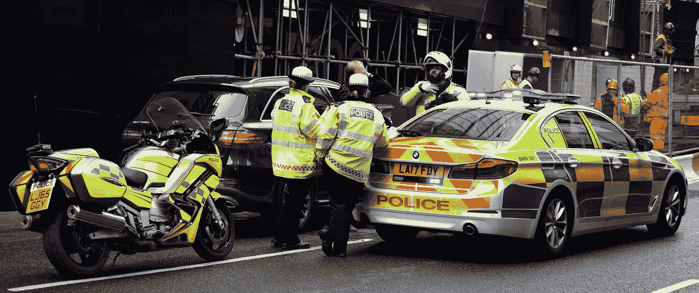
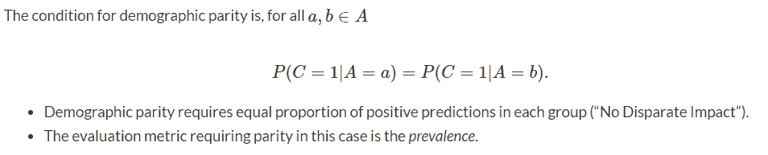
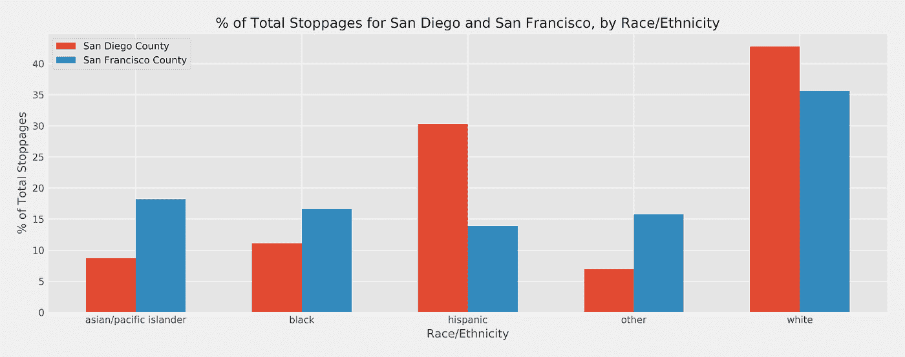
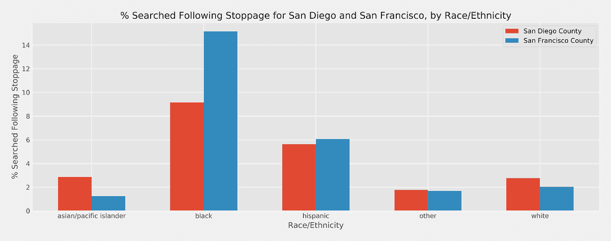
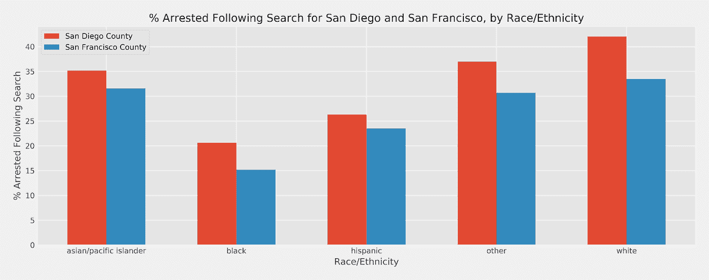
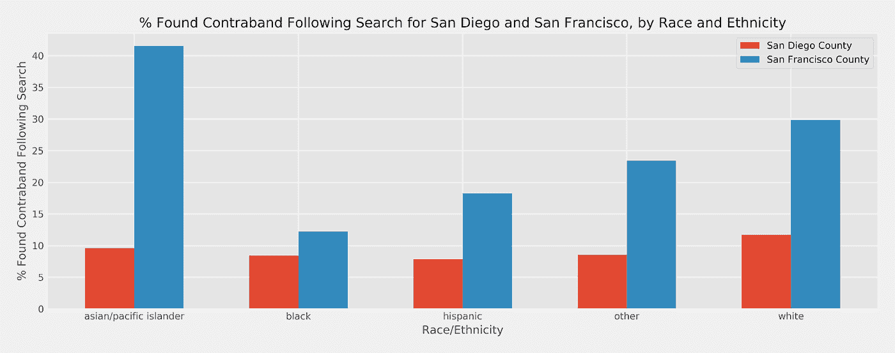
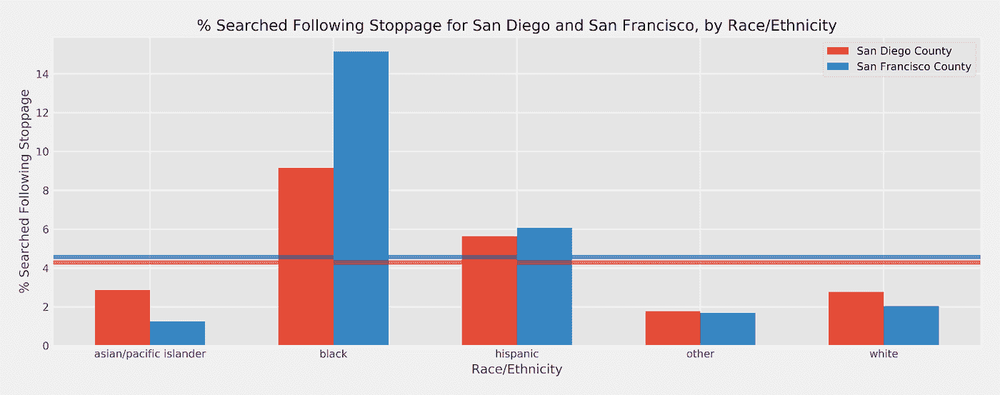
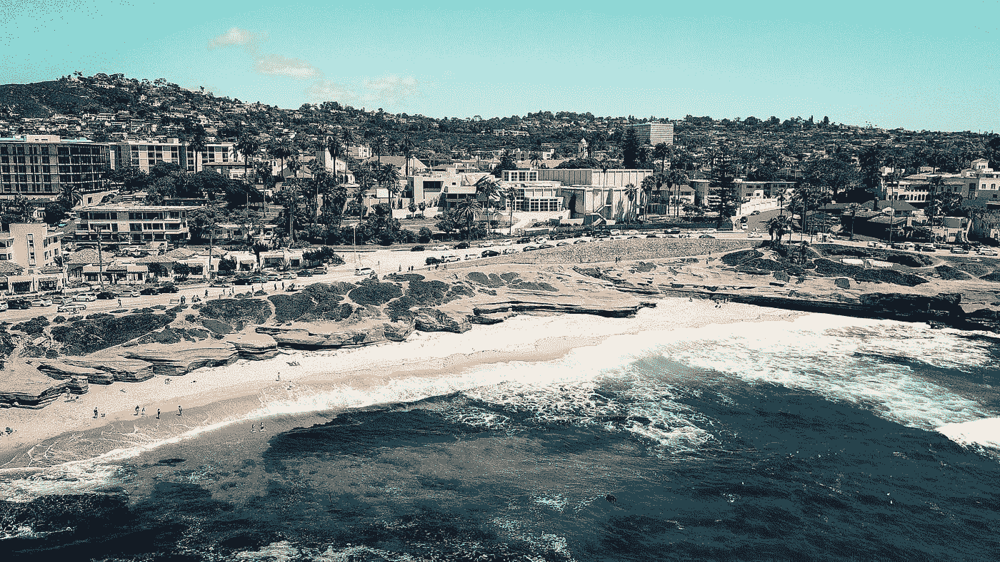
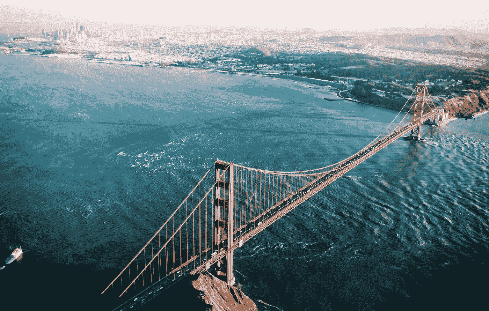

# 警察、交通站、数据和比赛

> 原文：<https://towardsdatascience.com/police-traffic-stops-data-and-race-c37c36a8ac43?source=collection_archive---------28----------------------->

## [变更数据](https://towardsdatascience.com/tagged/data-for-change)

## 通过警察交通堵塞数据探索两个加州大都市之间不平等的差异。

安德烈·普里斯汀斯基帮助研究这个项目。

由[奥利弗·黑尔](https://unsplash.com/@4themorningshoot?utm_source=medium&utm_medium=referral)在 [Unsplash](https://unsplash.com?utm_source=medium&utm_medium=referral) 上拍摄的照片

2021 年 4 月 20 日下午 1 点 30 分，前警官、现已被判谋杀罪的德里克·肖万被判犯有二级无意谋杀、三级谋杀和二级过失杀人罪，此前一起事件导致了受害者乔治·弗洛伊德的死亡。这一死亡事件继续引发广泛的公众反弹，并成为国际运动的先驱，呼吁警察改革。这一信念，一个有许多原因的标志性案例，支撑了许多公民对美国警察机构的方法和行动的共同时代精神。

有大量关于治安偏见的社会学根源的研究，但是，为了本文的目的，我将关注数据并探索两个主要的加州城市“美国最美好的城市”圣地亚哥和“黄金之城”旧金山之间交通中断的不平等。

作为我研究和检查上述统计数据的结果，我的发现突出了一个看似明显的种族差异。在圣地亚哥和旧金山，西班牙裔美国人被搜索的可能性分别比白人高出 2.86%和 4.60%。对于黑人司机，这一比例在各城市分别上升到 6.38%和 13.10%。尽管发现违禁品或逮捕司机的机会没有增加，但停车搜查中的这种差异仍然存在，黑人和西班牙裔司机在搜查后持有违禁品或被捕的比率都较低。

## **实验设置**

在进行这种统计检查时，重要的是要确保收集的数据是准确和全面的，这样才不会歪曲一个像美国警察系统中的种族偏见这样微妙和有争议的问题。幸运的是，斯坦福大学的[开放警务项目](https://openpolicing.stanford.edu/)从我们手中拿走了大量数据收集的负担。该项目汇编了超过 2 亿份地方和州警察局的记录，旨在提供美国交通堵塞的准确和全面的记录。该数据集中包括我们重点研究的两个主要城市:

● **圣地亚哥**与**从 2013 年 12 月到 2017 年 3 月共发生 383，027 起停工事件。**

● **三藩市**与**2006 年 12 月至 2016 年 6 月 905，070 次停工。**

**使用这两个数据集的交集，我们得到 2014 年 1 月至 2016 年 7 月圣地亚哥的大约 300，000 次停工和旧金山的 200，000 次停工，总计 525，581 次。该数据包括 21 个参数，范围从车辆类型到主体人口统计和搜索到发布的逮捕。**

## ****奇偶性****

**为了彻底探索这两个加州大都市之间的种族不平等，必须引入一种新的方法来评估决策系统中应用的公平概念。这种*均等性度量，如其所定义的*，代表了一种简单的观察标准，并有助于探索决策系统(如警察交通拦截)可能如何产生偏差。具体来说，本文将关注下面公式中定义的*人口统计均等*。**

****

**人口统计均等作为一个公式，其中:C 是分类，A 是显著群体(种族)，a/b 代表显著群体内的群体。致谢:[亚伦·弗兰科尔](https://datascience.ucsd.edu/about/faculty/faculty/name/aaron-fraenkel/)。经作者许可重新发布。**

**在警察停工的情况下，满足这一均等措施并不意味着决策系统、警察是公平的，而是均等措施代表了一个观察结果的镜头，尽管这有助于揭示被观察系统内的偏见。更具体地说，人口统计的均等性代表了在交通堵塞后，当对种族进行调整时，所进行的搜索的均等比例。这种方法，加上评估分类器性能的传统指标，有助于量化两个相似城市的成功或失败，而这两个城市的警察机构却大相径庭。**

## ****我们学到了什么？****

**基于数据来源，有许多有趣的结果需要探索、讨论和理解。值得注意的是，虽然警察截停率可能存在偏差，但本文分析了汽车被截停后出现的偏差，因为虽然警察首先截停的人可能存在偏差，但在许多情况下，汽车的型号、形状、年龄和其他因素使警察无法确定他们截停的司机的种族或民族。一旦他们的车被拦下，警察与司机面对面，那么有意识或无意识的偏见就可以以足够确定的程度表现出来，以供分析。考虑到这一点，*图 1* 强调了按城市和种族/民族划分的警察停工百分比。**

****

**图 1:圣地亚哥和旧金山按种族划分的停工情况。图片作者。**

**如*图 1* 所示，与圣地亚哥相比，旧金山的驾驶人口更加多样化，圣地亚哥的大多数司机都是白人或西班牙裔。在本分析的背景下，*图 1* 用于表示每个城市道路上驾驶员的种族或民族分类，因为很难量化驾驶到停车阶段的偏差。具有严格科学意义的是交通中断后会发生什么。警察是选择搜查汽车还是允许公民继续他们的工作？*图 2* 突出显示了停止后与种族/民族相关的搜索百分比。**

****

**图 2:按种族/民族对圣地亚哥和旧金山的搜索细分。图片作者。**

**如*图 2* 所示，黑人司机被搜查的比例明显高于其种族或民族同行。很明显，圣地亚哥和旧金山警察局的搜查率存在差异。这种差异在黑人司机中最为明显，然而，西班牙裔司机也有类似的趋势。**

**鉴于这两个城市的搜查率形成鲜明对比，有人可能会认为，黑人或西班牙裔司机更有可能因某种原因被搜查，这种原因可能包括涉嫌持有违禁品，也可能是犯下重大盗窃汽车等现行犯罪。当考虑停止后的停止率，或"*命中率*"时，这一论点是站不住脚的，如图*图 3* 所示。**

****

**图 3:按种族/民族分列的圣地亚哥和旧金山停车后的逮捕情况。图片作者。**

**在圣地亚哥和旧金山，黑人司机被搜查后逮捕的可能性分别只有 20.58%和 15.15%。这与白人司机因所在城市不同而分别有 42.00%和 33.38%的几率被捕形成鲜明对比。就总逮捕率而言，圣地亚哥县优于旧金山，逮捕了 30.10%的被搜查司机，而旧金山为 21.31%。当考虑车辆停车和搜查后的违禁品命中率时，也可以观察到这种趋势，如图*图 4* 所示。**

****

**图 4:按种族/民族划分的圣地亚哥和旧金山停站后发现的违禁品。图片作者。**

**黑人和西班牙裔司机再次代表了拥有违禁品命中率最低的两个人口统计数据，白人和亚洲/太平洋岛民司机在圣地亚哥县的违规可能性略高，在旧金山的违规可能性明显更高。此外，旧金山私藏违禁品的命中率是圣地亚哥的两倍，分别为 18.21%和 9.16%。**

**黑人或西班牙裔司机与白人或亚洲/太平洋岛民司机之间的差异提出了一个有趣的问题；白人或亚裔/太平洋岛民司机比黑人或西班牙裔司机更有可能持有违禁品或犯罪吗？显然答案是否定的。相反，这种差异加剧了圣地亚哥警察局和旧金山警察局之间的不平等。**

## ****人口均等****

**可以根据计算的流行率来评估人口统计的均等性，流行率是在按种族/族裔的总人口中按种族/族裔进行搜索的决定。这与*图 5* 相当，在图 5 中，一个真正公平的分类器会根据人口命中率在种族/民族之间平均分配搜索。在*图 5* 中，包含了圣地亚哥的红色参考和旧金山的蓝色参考，以举例说明完全相等的搜索率是什么样子。**

****

**图 5:圣地亚哥和旧金山停车后按种族/民族划分的逮捕人数，包括每个城市的公平阈值。图片作者。**

**搜查率的这种差异表明，当选择搜查白人或亚洲/太平洋岛民司机时，官员们更依赖于压倒性的怀疑或重要证据，因此，在这些人口统计中可以看到更高的逮捕率和走私率。这与西班牙裔和黑人的人口统计形成对比，他们被搜查的次数更多，但被逮捕的次数更少，**这表明存在一个影响警察的额外混杂因素**，例如有意识或无意识地偏向于搜查上述人口统计。**

**这一发现反映了分别在圣地亚哥和旧金山进行的类似研究的结果，例如 SDSU 一项关于圣地亚哥警察的研究“从种族角度看交通执法”，该研究发现:**

> **我们的分析中明显的停车后差异表明，在官员的决策中存在隐性偏见
> - [Joshua Chanin、Megan Welsh 和 Dana Nurge(第 572 页)](https://spa.sdsu.edu/documents/Traffic_enforcement.pdf)**

## ****圣地亚哥和旧金山****

****

**圣地亚哥“美国最好的城市”的夏天。[阿米尔·巴舍尔](https://unsplash.com/@24ameer?utm_source=medium&utm_medium=referral)在 [Unsplash](https://unsplash.com?utm_source=medium&utm_medium=referral) 上拍摄的照片**

**很明显，对于圣地亚哥和旧金山来说，警察在交通堵塞搜索中存在不同程度的偏见，这可能是整个警察部门更大偏见的基础。这些县的偏见没有被孤立地研究，而是被串联起来研究的部分原因是，通过研究这些如何相互对比，可以推断出这种不平等的可能解决方案。与旧金山相比，圣地亚哥在寻找“合适”的汽车方面做得更好，因为这些汽车包含了逮捕的理由。圣地亚哥进行这些搜索的命中率几乎比旧金山高 10%，尽管进行交通堵塞搜索的比例更低，为 4.27%，而不是 4.56%。此外，虽然不是最佳的，但圣地亚哥在如何执行这些搜索方面的偏见明显更少，种族歧视比旧金山县更少。**

## ****研究的局限性****

**虽然人们做了很多努力来探索警察拦截搜查中的潜在偏见，但这项研究有几个局限性值得一提。这些限制包括但不限于:**

*   **数据报告:军官是否正确推断了种族并正确记录了遭遇？**
*   **假释作为一个因素:如果司机目前处于假释期，警察被鼓励搜查车辆，不管是否有嫌疑。**
*   **搜查原因:警察搜查汽车需要合理的怀疑，理想情况下，这可以在结果中进行调整，但是许多警察选择不记录他们为什么进行搜查的原因。**
*   **旧数据:使用的数据是过时的(2014-2016 年)，其中许多趋势可能已经被理解并正在改进。**

## ****最后的想法****

****

**旧金山黄金城。照片由[克里斯·莱佩尔特](https://unsplash.com/@cleipelt?utm_source=medium&utm_medium=referral)在 [Unsplash](https://unsplash.com?utm_source=medium&utm_medium=referral) 拍摄**

**正如从圣地亚哥县警察局和旧金山县警察局收集的数据所证明的，存在与被搜查的黑人和西班牙裔司机不成比例的数量相关的潜在混淆变量。如图所示，这一变量与违禁品发现率或逮捕率无关，但很可能与警察自身有意识或无意识的偏见有关。通过将这两个城市放在一起看，我们可以看到圣地亚哥虽然仍然表现出偏见的迹象，但在选择“正确”的汽车进行搜索方面表现得明显更好，同时也表现出较低的种族偏见水平。然而，这种探索并非没有限制，因为许多数据是不一致或不完整的。此外，正如我们试图通过这篇文章探索的那样，警察停车和种族偏见是非常复杂的问题，有无数的警告、细微差别和混淆因素，这些因素有时在数据中没有提及。这种对与车手比赛相关的警察停车搜索的探索代表了对数据的分析，而不一定是实地情况。尽管如此，我希望在探索这个话题时，我可以提高对这些潜在偏见的认识，并鼓励美国县警察局更有力地收集数据，以更好地探索、分析和修正警务机构中目前正在社区中产生冲击波的不成比例的种族偏见。**

## **来源**

**查宁，j .，威尔士，m .，& Nurge，D. (2018)。从种族角度看交通执法:加州圣地亚哥停车后结果的序列分析。*《刑事司法政策评论》，**29*(6–7)，561–583。土井:10/08871 . 48888888881**

**公平性&算法决策。(未注明)。2021 年 5 月 10 日检索，来自[https://afra enkel . github . io/fairness-book/content/03-harms . html](https://afraenkel.github.io/fairness-book/content/03-harms.html)**

**公平性&算法决策。(未注明)。2021 年 5 月 10 日检索，来自[https://afra enkel . github . io/fairness-book/content/05-parity-measures . html](https://afraenkel.github.io/fairness-book/content/05-parity-measures.html)**

**埃里克·李文森。德里克·肖万被判谋杀乔治·弗洛伊德的三项罪名成立。2021 年 4 月 21 日，[www . CNN . com/2021/04/20/us/Derek-chauvin-trial-George-Floyd-considerations/index . html](http://www.cnn.com/2021/04/20/us/derek-chauvin-trial-george-floyd-deliberations/index.html)。**

**斯坦福开放警务项目。(未注明)。检索于 2021 年 5 月 10 日，来自[https://openpolicing.stanford.edu/data/](https://openpolicing.stanford.edu/data/)**

**加州执法停止种族差异。(2020 年 12 月 03 日)。检索于 2021 年 5 月 10 日，来自[https://www . ppic . org/blog/race-alignments-in-California-law-enforcement-stops/](https://www.ppic.org/blog/racial-disparities-in-california-law-enforcement-stops/)**

***所有使用的图片要么是我自己创作的，要么是经作者明确许可使用的。每个图片下都有作者资料的链接。***