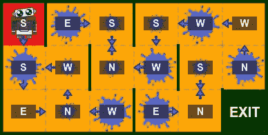

# 策略和价值迭代

> 原文：<https://towardsdatascience.com/policy-and-value-iteration-78501afb41d2?source=collection_archive---------5----------------------->

## [婴儿机器人强化学习指南](https://towardsdatascience.com/tagged/baby-robot-guide)

## 强化学习简介:第 3 部分


[所有图片由作者提供]

# 介绍

机器人宝宝一直在稳步回到妈妈身边。迄今为止，他已经:

*   克服[土匪问题](/multi-armed-bandits-part-1-b8d33ab80697)给自己充电
*   解决了[预测问题](/state-values-and-policy-evaluation-ceefdd8c2369)来评估一个环境中状态的相对值，让他逃离了简单的网格关卡。
*   了解如何将环境表示为[马尔可夫决策过程(MDP)](/markov-decision-processes-and-bellman-equations-45234cce9d25#6c0a) 并使用[贝尔曼方程](/markov-decision-processes-and-bellman-equations-45234cce9d25#9799)进行评估。

在下一部分中，我们将考虑控制问题，并研究如何从对环境状态值的估计中找到最佳策略。

# 密码

本文相关的 [***Jupyter 笔记本***](https://github.com/WhatIThinkAbout/BabyRobot/blob/master/Reinforcement_Learning/Part%203%20-%20Policy%20and%20Value%20Iteration.ipynb) 可以在 Github 上找到。这包含设置和运行下述级别和算法所需的所有代码。

或者，您可以在 Binder 上运行 Jupyter 笔记本来阅读本文:

[](https://mybinder.org/v2/gh/WhatIThinkAbout/BabyRobot/5910c3feb8d8eb525ec79d7f2d257dc326eff85f) [## GitHub:WhatIThinkAbout/baby robot/5910 C3 feb 8d 8 EB 525 EC 79d 7 f2d 257 DC 326 eff 85 f

### 单击运行此交互式环境。来自活页夹项目:可复制、可共享、交互式计算…

mybinder.org](https://mybinder.org/v2/gh/WhatIThinkAbout/BabyRobot/5910c3feb8d8eb525ec79d7f2d257dc326eff85f) 

# 简单网格级别

机器人宝宝发现自己在一个非常小的房间里，所以逃离这里应该不是太大的挑战。唯一的缺点是屋顶一直在漏水，正如我们在上一部分查看 MDPs 时看到的那样，机器人宝宝不喜欢潮湿。水坑拖慢了他的速度，并可能导致他打滑。


图 1:简单的网格级别。水坑需要更长的时间来移动，并可能导致打滑。

我们定义为:

**干方块:**

*   花一个单位的时间通过，所以当移动到一个没有水坑的方块时会得到-1 的奖励。
*   婴儿机器人在没有水坑的情况下不会打滑，所以总会达到目标状态。

**小水坑:**

*   通过要花两倍的时间，所以踏入其中一个会得到-2 的奖励。
*   在小水坑里打滑的概率是 0.4，所以有 0.6 的时间你会达到目标状态，剩下的时间你会打滑并最终处于其他可能的状态之一。

**大水坑:**

*   花 4 倍的时间通过，所以当进入一个包含一个大水坑的方块时奖励-4。
*   打滑的几率会增加，所以你只能以 0.4 的概率达到目标。因此有 0.6%的概率，你会处于另一种可能的状态。

这让问题变得稍微复杂了一些，因为这不再仅仅是选择你想搬到哪个州并获得固定奖励的问题。现在，当选择一个动作时，机器人宝宝可能会移动到一个不是目标状态的状态，而不是收到他所在状态的奖励。


图 2:机器人宝宝想向东朝出口移动，但是在一个大水坑里，所以有可能滑向另一个州。转移到每个可能的下一个状态的转移概率用蓝色表示。每次转换获得的奖励以红色显示。

当打滑确实发生时，通过将打滑的总概率除以可能的非目标状态的数量来确定结果状态。因此，在上面图 2 所示的例子中，机器人宝宝目前正坐在一个大水坑中，想要向东朝出口移动，可能会出现以下状态和奖励:


表 1:图 2 的转移概率——从中间的正方形开始，想向东移动。

# 政策评价

对于简单的网格级别，由于我们有关于系统的完整信息，知道它的所有转移概率和回报，我们可以使用动态编程将贝尔曼方程转变为更新函数。然后可以迭代地应用这些来计算状态值。

贝尔曼期望方程，给出状态值' ***s*** '当继策'***【π'***由下式给出:


等式 1:贝尔曼期望等式给出了政策π下的状态值

其中:

**π *(a|s)*** 是在状态 ***s*** 下采取行动 ***a*** 的概率。
***p(s '，r|s，a)*** 是在状态 **s** 开始并采取行动***a*** 时，移动到下一个状态***' s’***并获得奖励 ***r*** 的概率。
***r*** 是采取此动作后获得的奖励。
***γ*** 是贴现因子。
***【v(s ')】***是下一个状态的值。

> 一个状态的值由所有行为的概率之和，乘以下一个状态和奖励的概率之和，再乘以获得的奖励和你最终所处状态的贴现值给出。

作为一个更新等式，它可以写成:


方程 2:表示为更新函数的贝尔曼期望方程。

这里唯一的区别是，在迭代' ***k+1*** '时，状态' ***s*** 的值是使用在前一次迭代' ***k*** '时已经计算的下一个状态的值来计算的。因此，对一个州的价值的新估计是从以前的估计中得出的。当一个估计基于另一个估计时，这被称为 ***引导*** 。

在上面图 2 所示的例子中，婴儿机器人想要选择从中央广场向东移动的动作，我们使用了确定性策略。换句话说，对于每个州，我们的政策将明确定义应该选择哪个行动。因此，将有一个单一的行动，选择概率为 1，所以上述等式中的行动总和将会消失。

类似地，当使用迭代策略评估时，通常从所有初始状态值估计设置为零开始，因此下一个状态的贴现值也将在第一次迭代中消失。

因此，对于位于网格中心的州，即机器人宝宝当前所在的位置，可以通过对上表中显示的概率和奖励求和来给出对该州价值的第一次估计。所以，对于在这个州选择东方行动的策略，这个州的价值的第一个估计是:


如果不是在该州选择东动作，而是策略定义应该采取北、南或西动作，则州值的第一估计值将由下式给出:


根据这些不考虑未来回报的第一状态估计(因为所有下一状态值当前都为零)，选择向西移动的策略具有最小的负状态值估计。这是因为它的目标状态是一个干燥的正方形，在可能的状态中，它给出了最小的负直接回报。这个估计还不包含任何关于未来奖励的信息，这些信息是我们在网格中找到最佳路径所必需的。此刻，估计的状态值仅给出将保持机器人宝宝最干燥的信息！

上面显示的状态值估计值是为确定性策略计算的值，其中为状态定义了一组操作。如果我们改为使用随机策略，其中行动是随机选择的，那么这些状态值估计值中的每一个将简单地乘以采取行动的概率(贝尔曼方程中的π *(a|s)* 部分)，然后我们将结果相加。

对于中间的正方形，在选择任何动作的概率相等的情况下(因此每个动作被选择的概率为 0.25)，第一个估计的状态值将是:


在所有情况下，这个估计值都是在当前政策下这个状态有多好的度量。为了找到最佳状态，进而让我们找到通过网格的最佳路线，我们需要对网格中的所有其他状态重复我们的计算(通常称为对所有状态进行*扫描*)。对于随机策略，其中一个状态中所有可能的动作都是同样可能的，这给了我们如下所示的状态值估计:


图 3:在随机策略的第一次策略评估迭代之后的状态值估计，其中所有可能的行为(蓝色箭头所示)都是同样可能的。(注:数值四舍五入到小数点后 1 位)。

现在我们已经有了所有状态的初始估计，我们可以使用这些作为下一个状态值，***v(s’)***，在贝尔曼更新方程的下一次迭代中。在策略评估的每次迭代中，策略、转移概率和移动到每个状态的回报保持固定，因此改变的只是估计的下一个状态值。

因此，在下一次迭代中，在折扣因子为 1 的情况下，中心正方形的每个可能动作的估计状态值变为:


对于随机策略，每个动作都是同样可能的，状态值是:


对所有状态重复这一过程，得到我们的第二组估计值，这一次，估计的状态值考虑了下一个状态:


图 4:在随机策略的第二次策略评估迭代之后的状态值估计，其中所有可能的行为(蓝色箭头所示)都是同样可能的。(注:数值四舍五入到小数点后 1 位)。

如果我们重复这个过程并运行到收敛(或者至少直到状态值的变化低于某个小的阈值)，那么我们最终得到如图 5 所示的最终状态值。在这种情况下，收敛发生在 234 次政策评估迭代之后。


图 5:随机政策的政策评估收敛后的最终状态值估计，其中所有可能的行动都是同样可能的。对于阈值 0.001，在 234 次迭代后出现收敛。

最后，如果我们现在根据这些值贪婪地行动，在每个状态中选择移动到最高值(最小负值)的下一个状态的行动，我们得到以下策略:


图 6:根据估计的状态值贪婪地行动形成的最优策略。

对于这个非常简单的层次，在一次策略评估之后，根据状态值贪婪地行动所形成的这个策略是最优策略。对于任何状态，如果机器人宝宝采取该策略指定的行动，然后继续遵循该最优策略，他的期望收益将高于遵循任何其他策略给出的行动。

> 对于有限马尔可夫决策过程(MDP ),其中我们有关于状态转换和回报的全部信息，我们可以使用动态规划将贝尔曼方程转变为一组更新规则。然后，这些可以用于计算当前策略下的状态值。

# 广义策略迭代(GPI)

对于我们上面考虑的非常简单的网格级别，使用初始随机策略，我们能够通过运行策略评估的单次迭代来找到最佳策略，然后通过根据计算的状态值贪婪地行动来改进策略。

实际上，这并不总是可能的。相反，策略评估和策略改进需要运行多次——这种技术被称为***【GPI】***。

在 GPI 下，策略评估用于计算当前策略的状态值。然后，通过对这些价值的贪婪行为，应用策略改进。这改进了当前的策略，并为下一次迭代创建了策略。通过反复应用这种策略评估和改进的循环，策略越来越接近最佳策略，如下所示:


图 7:一般化的策略迭代——重复地应用评估和改进，向最优策略前进。

在广义策略迭代的每一步，将评估当前策略并改进策略。在每次策略改进之后，先前计算的状态值不再有效，因此该过程再次开始。最终这个过程会收敛于最优策略，这也意味着我们会找到最优价值函数。

# 策略迭代

广义策略迭代算法的不同之处在于它们如何交错评估和改进步骤。在策略迭代中，它等待每一步完成后再开始下一步。因此，在每次迭代中，它只会在策略评估收敛后更新策略。

我们可以通过在简单的级别上扩展来测试策略评估，添加更多的状态、水坑和墙来增加挑战。这个新级别如下所示:


图 8:测试策略迭代的扩展级别。

此外，我们将从随机策略切换到使用确定性策略。在这个策略中，如图 9 所示，为每个状态指定了一个操作。



图 9:测试策略迭代的初始确定性策略。

由于某些操作会导致循环状态，并且没有通向退出的路径，因此策略评估将永远不会收敛。因此，要运行策略评估，我们要么需要使用[](/state-values-and-policy-evaluation-ceefdd8c2369#de56)*折扣奖励，要么将评估步骤限制为固定的迭代次数。*

*选择贴现因子方法，并应用值 0.9，策略评估在 75 次迭代中收敛。有了这些生成的状态值，我们就可以积极行动，应用策略改进来生成新的策略。这给出了状态值和新策略，如下面的图 10 所示。*

**

*图 10:第一次运行策略迭代后的状态值和新策略。*

*在策略迭代的第一次运行之后，该策略比初始策略更好，并且现在具有通向退出的最右边的状态。然而，仍然没有从开始状态到退出状态的路径。因此，我们需要运行另一轮策略迭代。收敛状态值和新的改进策略如下所示:*

**

*图 11:第二次运行策略迭代后的状态值和新策略。*

*第二步策略迭代后的策略比上一步略好，但仍未找到最优策略。为此我们需要多跑几步。下面显示了这些，以及每次运行策略评估时达到收敛所需的迭代次数(右边显示的' *Conv* 值)。可以看出，经过 5 步策略迭代，达到最优策略。*

**

*图 12:运行策略迭代，直到发现最佳策略。“Conv”是策略评估收敛所需的每步迭代次数。*

*在上图中，请注意在每个策略迭代步骤之后，达到收敛所需的策略评估迭代次数是如何减少的。这是因为在开始下一次策略评估时，会保留以前策略的收敛状态值。由于新策略基于以前的策略，因此它将具有相似的状态值。因此，使用以前策略的值大大减少了对新策略运行策略评估所需的迭代次数。*

> *策略迭代采用初始策略，对其进行评估，然后使用这些值来创建改进的策略。然后对新生成的策略重复这些评估和改进步骤，以给出更好的策略。这个过程一直持续到，最终，我们得到了最优策略。*

# *价值迭代*

*正如我们已经看到的，策略迭代评估一个策略，然后使用这些值来改进该策略。重复这个过程，直到最终达到最优策略。因此，在最优策略之前的每次迭代中，必须对次优策略进行全面评估。因此，在试图找到最佳策略时，可能会浪费很多精力。*

*再次查看非常简单的网格级别上的策略评估，如下面的图 13 所示。注意蓝色箭头在每次迭代中是如何变化的。这些显示了一个潜在的策略，它是根据当前迭代中可用的状态值贪婪地行动而形成的。*

**

*图 13:策略评估，显示了如果我们在每次迭代中贪婪地行动，策略将如何被更新。*

*以前，我们对这一级别运行策略评估，直到完全收敛，进行 234 次迭代，然后根据收敛的状态值贪婪地采取行动，以获得最佳策略。然而，如果你看看如果我们在每一次迭代中贪婪地行动，策略将如何被更新，你可以看到最佳策略实际上仅在 14 次迭代后就被找到了。我们不需要对完全收敛进行评估。状态值计算的数量可以显著减少，我们仍然可以获得最佳策略。*

*许多 GPI 算法使用这种思想来超越简单的策略迭代，而是在减少数量的策略评估步骤之后改进它们的策略。 ***值迭代*** 将这一思想发挥到了极致，有效地将评估阶段简化为一次状态扫描。此外，为了进一步改进，它将策略评估和策略改进阶段合并到一个更新中。*

*这可以从下面的等式 3 中看出:*

**

*等式三:价值迭代。迭代“k+1”时状态“s”的值是给出最大期望回报的动作的值。*

*在值迭代的迭代' *k+1* ，状态' *s* 的值由在该状态下返回最大期望回报的动作的值给出。*

*一个动作的期望值是由该动作的转移概率之和，乘以进行转移所获得的回报，再加上你最终所处的状态的值给出的。因此，该等式可以重写为:*

**

*等式 4:价值迭代。迭代“k+1”时状态“s”的值是给出最大值的动作的值。一个行为的价值是转移概率的总和乘以从转移中获得的回报，再加上下一个状态的贴现值。*

*在一个状态' *s* '中，我们计算每个动作的价值，方法是对该动作的转移概率求和，乘以立即奖励，再加上下一个状态 *s '，*的贴现奖励，使用该状态的当前值*。*然后，我们选择这些计算值中的最大值，并在下一次迭代“ *k+1* ”时，将其用作状态“ *s* 的值。*

*如果你回头看看方程 2，其中贝尔曼期望方程表示为更新函数，你会发现这些方程实际上是相同的。唯一的区别是，在最初的策略评估等式中，下一个状态值是由策略采取每个动作的概率之和给出的，而现在，在值迭代等式中，我们只是取返回最大值的动作的值。*

*在对简单网格级别的中心方块进行策略评估时，我们之前计算的值如下所示:*

**

*当评估一个随机策略时，其中每个动作都是同样可能的，我们简单地对这 4 个值进行平均，以获得在第一次迭代时估计的状态值。对于值迭代，我们取最大值(最小负值)，在本例中是-2.0。对所有状态都这样做，得到第一组值迭代估计，如下所示:*

**

*图 14:第一次扫描后值迭代下的状态值。*

*我们现在继续，就像我们对策略评估所做的那样，使用我们从当前迭代中计算出的值，来计算下一次迭代中的状态值，并将其运行到收敛。每次迭代的状态值更新如下所示:*

**

*图 15:值迭代运行到收敛(收敛到 2 个小数位实际上发生在 62 次迭代中)*

*一旦估计的状态值已经停止变化，并且已经达到收敛，我们可以根据这些值贪婪地选择以获得最优策略。在这种简单水平的情况下，在 62 次迭代之后，收敛发生并且找到最优策略。*

*因此，策略迭代将评估一个策略，然后根据那些计算出的值贪婪地采取行动以获得下一个策略，值迭代在没有策略的情况下有效地工作。只有在最后，一旦找到了最优值函数，才会从状态值中创建最优策略。*

*对于这个简单的网格级别，只需要 62 次迭代，状态值就可以收敛，并且发现最佳策略。当您将其与运行策略评估收敛所需的 234 次迭代进行比较时，可以看到值迭代是对简单策略迭代的巨大改进。*

*此外，由于每次迭代代表对所有状态的扫描，减少寻找最优策略所需的总迭代次数在更复杂的环境中会有更大的好处，其特征在于更大的状态空间。*

*例如，看一下应用于扩展网格级别的值迭代，我们以前用它来测试策略迭代:*

**

*图 16:扩展网格级别的值迭代的前 30 次迭代。*

*对于这个级别，在 25 次迭代中找到最优策略，尽管在状态值达到收敛之前总共需要 120 次迭代。如果将这与策略迭代进行比较，在策略迭代中总共需要 203 次迭代才能找到最佳状态值，您可以看到性能的巨大提高。*

*该级别的最佳策略和最终收敛状态值如下面的图 17 所示。由于我们在运行值迭代时没有使用折扣因子，因此对于每个状态，这些值表示婴儿机器人从该状态到达出口所需的平均时间步数。*

**

*图 17:策略迭代 120 次后的状态值已经收敛。*

# *摘要*

*通过策略评估，我们已经能够评估强化学习环境中的状态。通过添加策略改进，我们可以采用这些值并形成一个新的、改进的策略。*

*这种政策评估和政策改进的结合被称为 ***广义政策迭代*** (GPI)，通过其应用，初始政策可以被反复评估和改进，直到找到最优政策。*

*在 ***策略迭代*** 中，在每一步，都运行策略评估直到收敛，然后更新策略并重复该过程。*

*相比之下， ***值迭代*** 每一步只做一次策略评估的迭代。然后，对于每个状态，取最大动作值作为估计的状态值。一旦这些状态值收敛到最佳状态值，就可以获得最佳策略。在实践中，这比策略迭代执行得好得多，并且在少得多的步骤中找到最佳状态值函数。*

# *下一步是什么？*

*在我们确切知道从一个状态转移到下一个状态的概率以及每次转移将获得的回报的环境中，我们可以应用动态规划来评估环境中的每个状态，并从中找到最优策略。*

*然而，这些方法实际上并没有学到任何东西。环境的完整模型已经给出，因此没有必要进行任何探索来形成这个模型。*

*在下一部分中，我们将研究蒙特卡罗方法，它不需要对环境有完全的了解，而是从经验中学习。*

**

```
***<** [**Part 2: Markov Decision Processes and Bellman Equations**](/markov-decision-processes-and-bellman-equations-45234cce9d25)*
```