# 带基线策略梯度增强算法

> 原文：<https://towardsdatascience.com/policy-gradient-reinforce-algorithm-with-baseline-e95ace11c1c4?source=collection_archive---------5----------------------->

## [实践教程](https://towardsdatascience.com/tagged/hands-on-tutorials)

## 张量流中的算法与实现

作者照片

策略梯度方法是非常流行的强化学习算法。它们非常有用，因为它们可以直接对策略建模，并且它们在离散和连续空间中都工作。在本文中，我们将:

1.  简要概述政策梯度的基本数学原理；
2.  在 Tensorflow 中实现策略梯度增强算法玩弹球；
3.  比较政策梯度和深 Q 网(DQN)

我假设读者对强化学习的基础有所了解。作为复习，你可以快速看一下我上一篇文章 [**的第一节强化学习算法的结构概述**](/an-overview-of-classic-reinforcement-learning-algorithms-part-1-f79c8b87e5af) 。

我以前也在 Tensorflow 中实现过深度 Q-net (DQN)来玩钢管舞。如果你感兴趣，请点击查看[。:)](/deep-reinforcement-learning-build-a-deep-q-network-dqn-to-play-cartpole-with-tensorflow-2-and-gym-8e105744b998)

# 政策梯度

## 加固

不像许多其他 RL 算法参数化的价值函数(Q 学习，SARSA，DQN 等。)并从最优值函数中导出策略，策略梯度方法通过将策略参数化为:

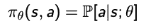

然而，当涉及到优化时，我们仍然必须使用价值函数 *V(θ)* 作为目标函数。我们的目标是最大化 *V(θ)* ，即遵循策略 *π* 的轨迹 *τ* 的预期总回报。注意，值函数 *V(θ)* 是从参数化的策略*π(θ)*中计算出来的，而不是由 *θ* 直接参数化的。

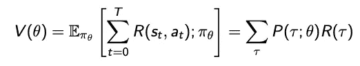

其中τ是状态-动作轨迹:

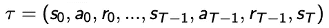

R(τ)是轨迹τ的奖励总和:

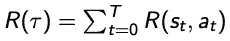

如前所述，目标是找到使 *V(θ)* 最大化的策略的参数 *θ* 。为此，我们通过提升策略的梯度来搜索 *V(θ)* 中的最大值，w.r.t 参数θ。

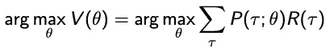

策略 *π(θ)* 通常使用 softmax、高斯或神经网络建模，以确保其可微分。在这里，我们实现了普通策略梯度的一个流行变体:REINFORCE，它利用时间差来计算梯度。更详细的数学推导，请参考[萨顿的第 13 章和巴尔托的书](http://incompleteideas.net/book/RLbook2018.pdf)。

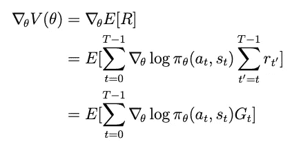

让我们看看训练程序是什么样的。

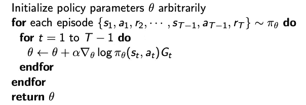

## 带基线的政策梯度

政策梯度方法的一个缺点是由经验收益引起的高方差。减少方差的一个常见方法是从政策梯度的回报中减去基线 *b(s)* 。基线本质上是预期实际回报的代理，它不能给政策梯度带来任何偏差。事实上，价值函数本身就是基线的一个很好的候选。减去基线后我们得到的新项是定义优势 *A_t.*

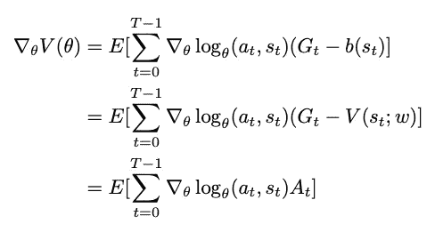

另一方面，还有另一个流行的政策梯度变体:行动者-批评家方法，该方法使用另一个参数化模型 *Q(s，a)* 来逼近优势价值，而不是使用经验回报 *G_t* 。这也有助于以增加偏差为代价减少方差。

基线是一个参数化的价值函数，可以通过减少经验预期收益和基线预测的均方误差来学习。

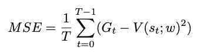

有了基线，我们新的训练循环有 2 个额外的步骤:计算优势和更新基线模型。

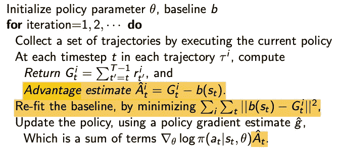

# **Python 实现(Tensorflow 2)**

在本节中，我将演示如何使用 Tensorflow 2 实现带有基线的策略梯度增强算法来玩 Cartpole。关于 CartPole 环境的更多细节，请参考 OpenAI 的[文档](https://gym.openai.com/envs/CartPole-v0/)。完整的代码可以在 [**这里**找到。](https://github.com/VXU1230/Medium-Tutorials/tree/master/policy_gradient)

让我们从创建策略神经网络开始。对于像 Cartpole 这样的简单环境，2 个全连接层就足够了。由于 Cartpole 具有离散的动作空间，我们将分类分布应用于模型输出(logits)和来自它的样本动作，如在`action_distribution()`和`sample_action()`中实现的。

接下来，让我们创建一个基线网络。如前所述，我们使用价值函数作为基线。`forward()`函数以当前状态为输入，输出预测值 *V(s)。*`update()`的输入参数`target`是我们通过玩游戏收集的观察到的平均奖励(回报)，我将稍后讨论。通过最小化返回和预测的均方误差来更新基线网络。

有了上面的两个网络，我们现在可以创建 PolicyGradient 类来完成大部分繁重的工作。我将把类拆分成多个代码片段。

在`init()`函数中，我们初始化模型的所有必要参数，包括我们刚刚定义的策略和基线网络。`self.env`是 Cartpole 环境的一个实例。

随着环境和策略网络的创建，我们可以进行几次部署来收集数据。在每一步，我们从策略网络中采样一个动作，玩一步获得奖励和下一个状态。在所有剧集的结尾，我们收集所有由状态、动作和奖励组成的游戏轨迹。这些轨迹将用于稍后更新策略网络和基线网络。

有了这些收集到的轨迹，我们就可以计算出每个状态的回报。请注意，我们可以通过对从步骤 *t* 到每集结束的所有未来折扣奖励求和，从技术上计算每个回报 *G_t* 。但是，这将导致复杂度为 O(n*n)。为了将其减少到 O(n)，这里我们使用另一种方法:滚动平均。实质上，对于每一集，我们从其返回的最后一个状态 *G_t = r_t* 开始，并以相反的顺序计算返回，以利用关系: *G_t = r_t + gamma * G_t+1* 。

一旦我们有了所有情节的数据，我们就把回报拉平，把这些情节的轨迹分批。之前在基线网络的`update()`函数中，我们有一个输入参数`target`，它正是我们在这里计算的回报。

利用基线网络的预测值 *V(s)* 和经验收益，我们也可以得到优势。

最后，我们拥有了更新策略网络所需的所有组件。记住在政策梯度中，目标是我们通过遵循政策所获得的价值最大化，相当于负值(损失)最小化。

让我们把所有东西放在一起，训练我们的模型。完整的训练逻辑在`train()`中实现，在每一次迭代中，我们重复这个过程:调用`play_game()`得到几个情节轨迹；将轨迹(列表的列表)展平成一批(列表)；使用批数据计算回报和优势；更新基线网络和策略网络。

还有两个更方便的函数可以帮助我们评估策略梯度模型，方法是制作它在 CartPole 环境中的性能视频。

训练完成后，让我们运行代码并呈现一个视频。

我们还可以绘制出所有训练步骤的回报。政策梯度模型能够收敛到 CartPole(200)的最大回报，尽管由于模型的随机性偶尔会出现一些分歧。

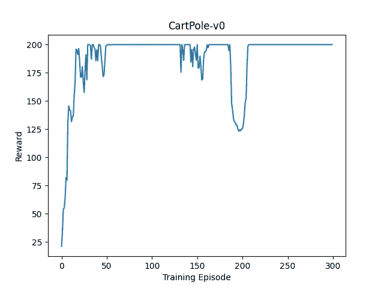

# **结论**

让我们把这个结果和我之前做的 DQN 翻筋斗的结果进行比较。我们实际上可以看到，政策梯度方法达到收敛的速度比 DQN 快得多。事实上，策略梯度方法通常在具有小状态空间的环境中更快，如 CartPole，这要归功于它直接对策略建模的独特设计。

政策梯度方法的最大警告是高方差，这通常通过利用时间结构(加强)、引入基线或增加偏差(行动者-批评家)来解决。同样值得注意是，策略梯度方法只能保证收敛到局部最大值。然而，政策梯度方法在离散和连续空间都非常有效。

我希望你喜欢这篇文章。:)

# 参考

[强化学习，萨顿和巴尔托](http://incompleteideas.net/book/RLbook2018.pdf)

斯坦福 CS234 课程笔记:【https://web.stanford.edu/class/cs234/slides/ 