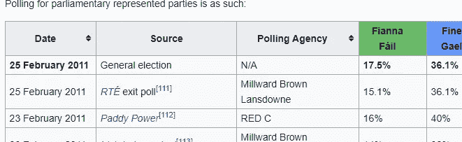
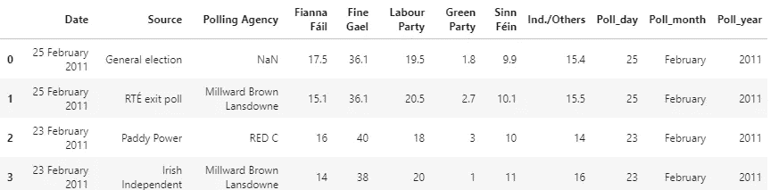

# 用 Python 处理维基百科上的政治投票数据

> 原文：<https://towardsdatascience.com/political-polling-data-from-wikipedia-with-python-b71a9b291d7c?source=collection_archive---------27----------------------->

## 使用 Python 中的 Requests、pandas 和正则表达式从 Wikipedia 中获取和清理爱尔兰政治投票数据，以便为分析做好准备。


阿诺·杰格斯在 [Unsplash](https://unsplash.com?utm_source=medium&utm_medium=referral) 上的照片

# **简介**

在 2011 年的爱尔兰大选中，即将离任的政府中的政党(共和党和绿党)在投票中一败涂地。在 2007 年的大选中赢得了 77 个席位的共和党最终只获得了 20 个席位。绿党失去了他们在 2007 年赢得的所有六个席位。

我想获得民意调查数据，以了解在那个时期爱尔兰政党的公众支持率是如何逐渐下降或上升的。当事人高峰在哪里？支持率的变化是否与当时的特定事件——失业率、新政党领导人等——相一致。？

**要求**

在本文中，我主要关注收集和清理轮询数据。

我们将使用请求库连接到维基百科来获取数据。然后，我们将使用 pandas 库本身将其加载到 pandas 数据帧中。数据不会是完美的，所以我们需要在使用它之前对其进行清理。

模块是 Python 标准库的一部分。但是如果您需要安装 pandas 或 requests，请查看它们文档中的安装部分:

    

我在示例中使用 Jupyter 笔记本(作为 Anaconda Navigator 的一部分)来展示结果。有关如何安装的信息，请参见此处的文档。

# 寻找数据

获取数据的第一步是找到可以处理数据的地方。维基百科有大量关于选举和政治的数据。爱尔兰许多大选的文章都有自上次大选以来的投票数据。[这里的](https://en.wikipedia.org/wiki/2011_Irish_general_election)是我曾经处理过的文章。

# 步骤 1 —发出 HTTP 请求

首先，我们导入我们需要的库和模块。

```
import pandas as pd
import requests
import re
```

接下来，我们将添加我们的数据所在的 URL，以便我们可以轻松地将它传递给访问它的请求。

```
url = "[https://en.wikipedia.org/wiki/2011_Irish_general_election](https://en.wikipedia.org/wiki/2011_Irish_general_election)"
```

现在，我们发出请求，并将响应设置为一个名为 *data* 的变量

```
data = requests.get(url)
```

在*数据*中，我们现在应该在我们的 URL 上有 HTML 数据，以及关于请求的许多其他信息。例如，我们可以检查响应代码以确保请求成功:

```
data.status_code
>>200
```

在本例中是这样的，我们感兴趣的响应部分是 HTML 内容:

```
data.content
```

# 步骤 2-将数据放入熊猫数据框架

熊猫可以使用它的 *read_html()* 方法读取 HTML 表格。该方法将返回您传入的内容中的所有表格，将每个表格转换为 dataframe，并将其存储在一个列表中。

我们可以通过传入 *data.content* 来获取页面上的所有表格，但是我们可以使用 match 参数更具体地获取。

正如熊猫医生所说，使用这个:

> 将返回包含与该正则表达式或字符串匹配的文本的表集。

在维基百科页面上，我们可以看到这几乎是唯一一个关于投票数据的表格。



我们将添加“投票代理”作为匹配参数。

```
tables = pd.read_html(data.content, flavor='bs4', match = "Polling Agency")
```

现在，在表中我们应该有一个数据帧列表(希望只有一个)。如果我们对它运行 *len()* ，我们可以看到情况是这样的:

```
len(tables)
>>1
```

因此，它将是列表中第一个也是唯一一个数据帧。我们将它保存在下面的变量中:

```
polling_data_2011 = tables[0]
```

让我们看看前 20 行:

```
polling_data_2011[0:20]
```

我们可以看到它做得相当不错。看起来没有太多丢失的数据，但是我们需要做一些更新。


# 步骤 3 —清理数据

我们有数据，但正如我们所看到的，有一些问题。

1.  最好也将日期存储在三个单独的列中:日/月/年。那么就更容易看到年复一年的变化。
2.  在*来源*栏中，我们有维基百科的参考号。我们希望去掉它们，因为它们实际上不是源名称的一部分。
3.  我们想删除 *%s* ，这样我们就可以处理数字数据了。
4.  最后，您会注意到在*轮询代理*列中有一些 *NaN* 值。在这种情况下，这是因为这些争吵根本不是民意调查，而是实际的选举结果——我们有通用电气的结果，以及一些欧洲和地方选举结果。我们要做的是创建另一列，将该行分类为选举数据或民意测验数据。这样，如果我们愿意，我们将能够轻松地处理民意调查数据。

## 将日期解析为三列

我们创建了三个想要匹配的正则表达式。一个用于日，一个用于月，一个用于年。然后，我们遍历 date 列中的每个字段，获取其索引和值，并根据值检查正则表达式。然后，我们将找到的值插入到它自己的新列中——我们对所有三个列都这样做。

```
day_re = "[0-9]+"
month_re = "[A-Z][a-z]+"
year_re = "[0-9]{4}"for index, value in polling_data_2011["Date"].items():
    #day
    match = re.search(day_re, value)
    if match:
        polling_data_2011.loc[index,"Poll_day"] = match.group()

    #month
    match = re.search(month_re, value)
    if match:
        polling_data_2011.loc[index, "Poll_month"] = match.group()

    #year
    match = re.search(year_re, value)
    if match:
        polling_data_2011.loc[index, "Poll_year"] = match.group()
```

我们现在有三个新列:


## 清洁源柱

在*信号源*栏中，在每个实际信号源名称后，参考编号以**开头。**

因此，我们遍历*源*列中的字段，类似于我们对日期所做的。然而，这一次，我们将匹配这个正则表达式，并将 new_name 设置为每个字段中直到这个值的所有值。

注意，在 *regex_to_match* 中，我们需要对我们正在搜索的字符进行转义，因为这个字符在 regex 中有特殊的含义。

```
regex_for_reference = "\["for index, value in polling_data_2011["Source"].items():
    ref_match = re.search(regex_for_reference, value)
    if ref_match:
        location = ref_match.span()[0]
        new_name = (value[0:location])
        polling_data_2011.loc[index,"Source"] = new_name
    else:
        polling_data_2011.loc[index,"Source"] = value
```

看起来更整洁:


我想检查一下没有其他明显的错误。维基百科是一个有许多贡献者的来源。也许不同的贡献者输入的名字不同。

让我们看看*源列中的所有唯一值:*

```
polling_data_2011["Source"].unique()
```


我们看到其中一个来源至少在一行中有不同的表达方式——我们需要用句点( *The Sunday Business Post)更新这个来源。)*与其他的一样(*《星期日商业邮报》*)。

让我们改变之前使用的正则表达式，并删除任何存在句点的地方:

```
regex_for_period = "\."for index, value in polling_data_2011["Source"].items():
    period_match = re.search(regex_for_period, value)

    if period_match:
        location = period_match.span()[0]
        new_name = (value[0:location])
        polling_data_2011.loc[index,"Source"] = new_name else:
        polling_data_2011.loc[index,"Source"] = value
```

我也在*民调机构*一栏做了同样的检查。没有问题。

## 将带有%的列转换成我们可以处理的数字数据

这里，我们将从每个包含%的字段中删除它。让我们对每个政党都这样做。我们遍历列，然后遍历每列中的字段。在找到%之前，我们只保留所有内容。

注意:我们可以在这里使用 *find()* (以及在其他一些情况下)来代替 *re* ，但是我们将坚持使用 *re* 来保持一致。

```
regex_to_find_percent = "%"
columns = ["Fianna Fáil", "Fine Gael", "Labour Party", "Green Party", "Sinn Féin", "Ind./Others"]for column in columns:
    for index, value in polling_data_2011[column].items():
        match = re.search(regex_to_find_percent, value)
        if match:
            match_index = match.span()[0]
            new_value = (value[0:match_index])
            polling_data_2011.loc[index, column] = new_value
```

看起来不错:



我们现在需要将这些列转换为 float 类型，这样我们就可以对它们使用 pandas describe 方法()等方法来查看最小值、最大值和平均值等信息。

```
for column in columns:
    polling_data_2011[column] = polling_data_2011[column].astype(float)
```

现在 describe()方法为我们提供了一些关于数据的描述性统计数据。

```
polling_data_2011.describe()
```


## 从选举数据中分离民意测验数据

在上表中，我们知道有几行不是民意测验数据。让我们对每一列进行分类，这样我们就知道我们在做什么了。然后，如果我们愿意，我们将能够只处理民意调查数据。

实际上，我将把它分为三类:选举结果、民意调查和出口民调。我之所以这么做，是因为后两者虽然是民调，但略有不同。出口民调是基于投票后对人们的采访，而标准的民意调查是关于一个人打算如何投票。

我们将在 source 列的每个字段中检查“*选举*”和*“投票后调查”*的实例。我们还将说明它何时会以大写字母出现在句子的开头。如果我们匹配选举，我们在名为 *Poll_type 的新列中放一个 E。*如果我们匹配出口投票，我们将 EP 放入 *Poll_type* 列。如果我们两个都不符合，我们假设这是一个民意调查——op。

```
election_regex = "[Ee]lection"
exit_poll_regex = "[Ee]xit poll"
for index, value in polling_data_2011["Source"].items():
    election_match = re.search(election_regex, value)
    exit_poll_match = re.search(exit_poll_regex, value)
    if election_match: 
        polling_data_2011.loc[index, "Poll_type"] = "E"
    if exit_poll_match:
        polling_data_2011.loc[index, "Poll_type"] = "EP"
    if not election_match and not exit_poll_match:
        polling_data_2011.loc[index, "Poll_type"] = "OP"
```

# 步骤 4 —检查我们的数据

现在我们有了最终的表格，让我们做一些检查以确保数据是正确的。

从维基百科页面的快速浏览中，我们可以看到在此期间有一次投票后调查，以及 2007 年和 2011 年的一次大选。让我们按 Poll_year 和 Poll_type 创建一个数据透视表，以确保我们与原始表相匹配。

```
polling_data_2011.pivot_table(index=["Poll_year","Poll_type"])
```


在上表中，我们可以看到每年的选举结果都与维基百科页面上报道的相符。例如，2011 年:


根据原始数据，我们可以预测未来几年的选举和出口民调。数据现在看起来很好，随时可以使用。

获取这些数据的过程非常简单。获得我想要的特定表并进行必要的数据清理非常容易。

在未来，我想看看管理日期列的其他选项，并探索使用我已经完成的工作来获得额外的数据有多容易。

所有代码和表格的图片都是作者拍摄的。本文的 Jupyter 笔记本可以在这里找到:

<https://github.com/LiamConnors/Medium-articles> 