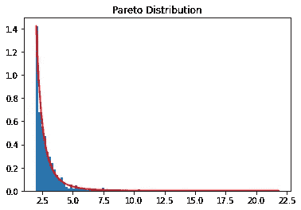

# Python 中的多态性:概率分析

> 原文：<https://towardsdatascience.com/polymorphism-in-python-probability-analysis-dc57727d90c8?source=collection_archive---------11----------------------->

## 使用 Python 进行面向对象编程


来源:图片由 [geralt](https://pixabay.com/users/geralt-9301/) 从 [Pixabay](https://pixabay.com/illustrations/monitor-binary-binary-system-1307227/) 拍摄

数据科学家经常面临编写所谓“意大利面条式代码”的指责。也就是说，代码在技术上完成了一项任务，但并不总是可复制的或以最佳方式布局的。

从这个角度来看，**多态性**——面向对象编程中的核心概念——在允许在一个特定类中实现多个功能方面有很大的价值。这使得用户能够更容易地同时使用相似的函数，同时通过将这些函数组合在一起确保代码的可维护性。

对于没有计算机科学背景的人来说，这听起来有些抽象——面向对象编程的主要功能之一是确保代码是有组织的和可重复的。这在确保维护方面节省了大量时间，因为程序的规模总是在增长。

让我们通过使用多态和 numpy 实现一系列概率计算来看看这是如何工作的。

# 概率分析

在这个例子中，让我们看看如何使用多态性在一个更大的类中存储大量的概率计算。

首先，让我们定义一个大类，我们将使用它来定义概率计算的各种“子类”:

```
class Probability:
    def __init__(self, name):
        self.name = namedef __str__(self):
        return self.name
```

## 二项式概率

二项式概率是一种离散概率，它计算给定一定次数的试验，一定次数的成功的概率。

numpy.org 给出了这样一个计算的例子，要求计算 9 口成功概率为 0.1 的油井全部失败的概率。

现在，想象一下这个场景。假设我们希望创建一个程序，将各种概率的计算存储在不同的函数中——每个函数都包含在一个类中。此外，通过调用该类，我们可以定义在尝试查找累积失败概率时希望计算的尝试次数。

该类定义如下，包含概率为 **5%** 、 **10%** 和 **15%** 的独立函数嵌套在该类中:

注意 *self.length* 表示调用函数时我们将指定的尝试次数。

例如，让我们指定 10 次试验，并计算期望概率中的失败概率:

```
>>> a = Binomial(10)
>>> print(a)
>>> print(a.fact())
>>> print(a.binomial5())
>>> print(a.binomial10())
>>> print(a.binomial15())Binomial
Probability of failure according to the Binomial Distribution.
0.5
0.6
0.1
```

我们看到，在 5%的成功几率下，失败的概率是 50%。在 10%时，它是 60%，而在 15%时，它下降到 10%。

把试验次数增加到 1000 次怎么样？

```
>>> a = Binomial(1000)
>>> print(a)
>>> print(a.fact())
>>> print(a.binomial5())
>>> print(a.binomial10())
>>> print(a.binomial15())Binomial
Probability of failure according to the Binomial Distribution.
0.623
0.363
0.259
```

在 5%的时候，现在的概率是 62.3%。在 10%时，这一比例为 36.3%，而在 15%时，这一比例为 25.9%。

从现实世界的角度来看，人们可能希望设计一个计算机程序，它可以在大量的试验中自发地产生许多失败概率，并且除概率率之外的参数也可以变化。使用多态性可以灵活地做到这一点。

## 帕累托分布

现在，考虑这个场景。假设我们希望从[帕累托分布](https://numpy.org/doc/stable/reference/random/generated/numpy.random.pareto.html)中生成样本。帕累托分布是一种幂律分布，其中[分布](https://www.statisticshowto.com/pareto-distribution/)的尾部很重。换句话说，大部分数据包含在分布的尾部:



来源:Jupyter 笔记本输出

具体来说，让我们用形状 3 和模式 1、2、3 生成三个独立的分布。

正如我们所看到的，帕累托分布的形状是恒定的，而模式是变化的。每个模式(模式 1、模式 2、模式 3)都被定义为一个函数，其中模式的值是不同的。同样， *self.length* 定义了我们希望生成的试验次数。

```
>>> b = Pareto(10)
>>> print(b)
>>> print(b.fact())
>>> print(b.mode1())
>>> print(b.mode2())
>>> print(b.mode3())Pareto
Sample generated in accordance with the Pareto Distribution.
[1.36412427 1.10291466 1.47183876 1.66282503 1.18855344 1.08670931
 1.01762507 1.04154705 1.48818185 1.47923808]
[2.28969839 3.64922758 3.48322786 3.71563878 2.02763407 4.14306486
 2.04481284 3.57690852 4.38221439 3.50612773]
[3.89360177 5.44499969 3.00307348 8.11591885 3.83083417 4.82244346
 5.91314304 3.16790445 3.06548931 3.91090296]
```

让我们尝试 1000 次试验。

```
>>> b = Pareto(1000)
>>> print(b)
>>> print(b.fact())
>>> print(b.mode1())
>>> print(b.mode2())
>>> print(b.mode3())Pareto
Sample generated in accordance with the Pareto Distribution.
[ 1.04522737  1.13748388  2.64986056  1.01188388  1.92169205  ...
  1.56696587  1.1202479   2.08817365  1.46907723]
[ 2.59499208  2.2019354   3.78301714  3.33741161  2.08731817  ...
  3.23218408  2.48797598  2.47920052  2.2045201 ]
[ 4.44148781  7.86723551  6.78859869  3.24117621  3.47112606  ...
  3.03165741  3.20184443  4.11208707  3.37364986]
```

正如我们所看到的，多态性通过允许不同的类存储在另一个更大的具有单一名称的类中，为函数数组提供了更多的结构。

虽然在这个例子中，少数函数在技术上可以单独运行，但在具有数千个甚至数百万个函数的计算机程序的环境中，这就成了一个严重的问题。

使用多态性为这些函数提供结构，可以更好地维护代码，并在将程序投入生产时提高效率。

从数据科学的角度来看，知道如何实现面向对象编程是非常有价值的。即使一个人不是软件工程师，并且通常不维护程序的库或生产考虑事项——知道什么时候应该使用面向对象编程会使实现适当的生产和版本控制过程变得容易得多。

# 结论

在本文中，您已经看到:

*   为什么多态在计算机编程中很重要
*   如何使用多态将函数合并到一个只有一个名字的类中
*   使用多态性计算概率

像计算机编程中的许多概念一样，面向对象编程关注的是效率。例如，正如使用不正确的数据类型会导致内存使用效率低下一样，单独存储函数会使程序更难维护。面向对象编程旨在解决这个问题。

非常感谢您的宝贵时间，非常感谢您的任何问题或反馈。你可以在[michael-grogan.com](https://www.michael-grogan.com/)找到更多我的数据科学内容。

# 参考

*   [numpy . org:numpy . random . binomial](https://numpy.org/doc/stable/reference/random/generated/numpy.random.binomial.html)
*   [numpy . org:numpy . random . Pareto](https://numpy.org/doc/stable/reference/random/generated/numpy.random.pareto.html)
*   [编程:Python 中的多态性](https://www.programiz.com/python-programming/polymorphism)
*   [statisticshowto.com:什么是帕累托分布？](https://www.statisticshowto.com/pareto-distribution/)

*免责声明:本文是在“原样”的基础上编写的，没有任何担保。它旨在提供数据科学概念的概述，不应被解释为专业建议。本文中的发现和解释是作者的发现和解释，不被本文中提到的任何第三方认可或隶属于任何第三方。作者与本文提及的任何第三方无任何关系。*