# 多项式内插法

> 原文：<https://towardsdatascience.com/polynomial-interpolation-3463ea4b63dd?source=collection_archive---------0----------------------->

## [实践教程](https://towardsdatascience.com/tagged/hands-on-tutorials)

## 涵盖拉格朗日多项式插值、牛顿多项式插值和样条插值

多项式插值——照片由 [Edgar Castrejon](https://unsplash.com/@edgarraw?utm_source=unsplash&utm_medium=referral&utm_content=creditCopyText) 在 [Unsplash](https://unsplash.com/s/photos/color?utm_source=unsplash&utm_medium=referral&utm_content=creditCopyText) 上拍摄

# 插入文字

假设您对跟踪菜园全天的温度感兴趣。您每小时精确测量一次温度，最终得到以下 24 个温度测量值:

在 Python 中准备数据集以便跟进

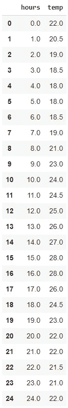

多项式插值每小时的温度

您可以使用任何工具将这些数据绘制在图表上，以获得所谓的散点图:每个测量值都有一个点。

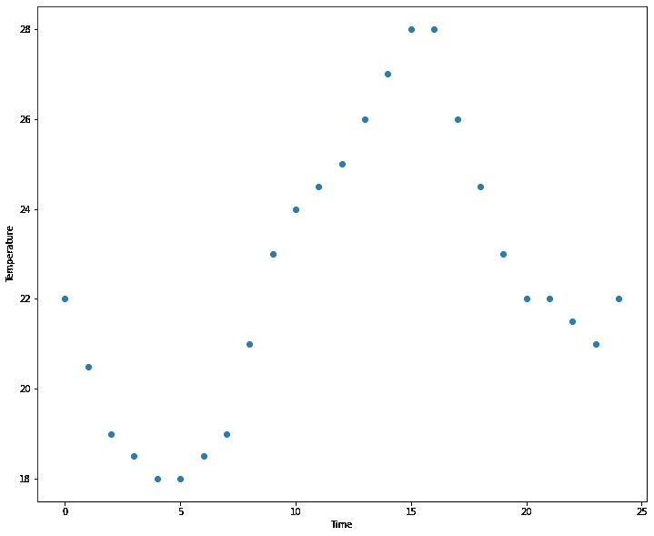

散点图包含没有插值的测量值(每小时一次)

您可能感兴趣的下一步是将散点图转换成线形图。然而，您在数据点之间没有任何数据，因此您没有关于如何绘制线条的确切信息。

您可以使用插值来实现这一点。**插值是智能估计数据点之间的值的任务。**

# 插值方法

您可以使用许多不同的方法进行插值。最简单的方法是**线性插值**，你从每个数据点到下一个数据点画一条直线。虽然简单，但这种方法通常是错误的，因为它创建了一个有很多“角度”的图:

线性内插法

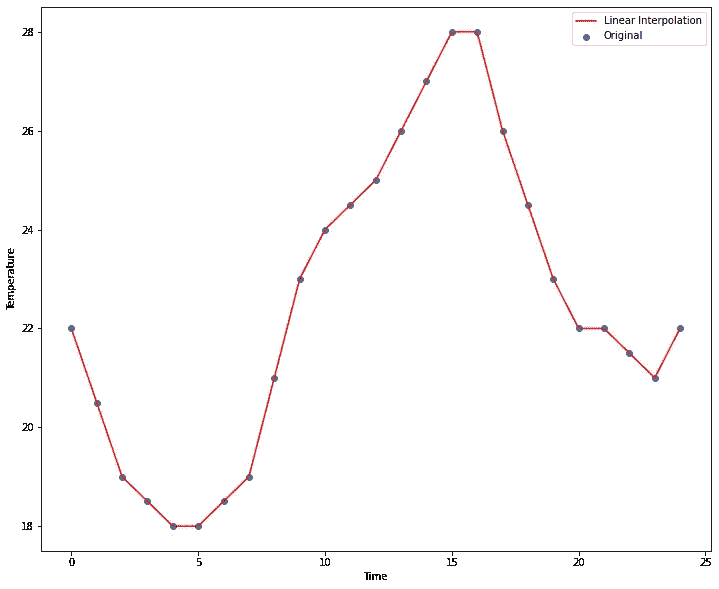

线性插值从每个点到下一个点绘制直线

另一种基本的插值方法是**最近邻插值**，其中使用最近邻来估计每个值。例如，您可以使用 11 点的测量值作为 10:30 到 11:30 的估计值，然后使用 12 点的测量值作为 11:30 到 12:30 的估计值，依此类推。你会得到这样一个图表:

最近邻插值

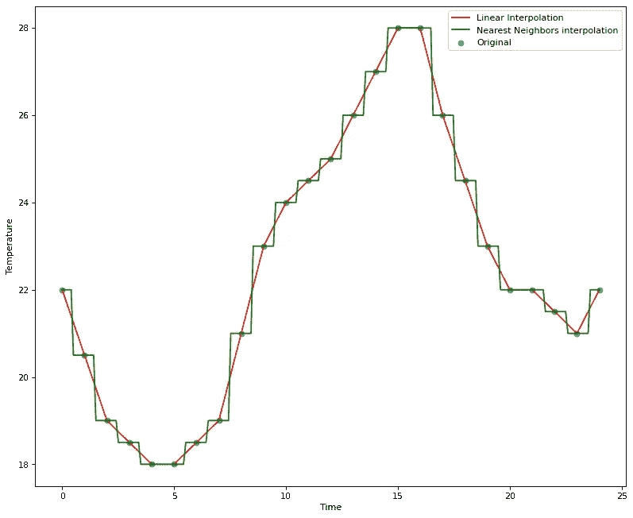

最近邻插值法使用最近的测量温度值来估计某个时间点的温度

这个图看起来可能很奇怪:它被称为分段图。线中没有连续性，因为一旦达到阈值，估计值就从一个邻居“跳到”另一个邻居。在我们的示例中，阈值是半小时，但是这当然会根据您正在处理的示例而有所不同。

# 多项式内插法

**多项式插值**是一种改进的插值方法，试图找到最适合您的数据的多项式函数。如果你不擅长数学，就把多项式函数想象成一个由许多函数组成的数学家族。

让我们来看看多项式的定义:

> 多项式被定义为由变量和系数组成的表达式，只涉及变量的加、减、乘和非负整数幂运算。

然而，这是一个非常宽泛的定义:仍然有许多不同的功能遵守这一规则。多项式家族中有如此多不同的多项式，您总能找到适合您的数据的多项式。

多项式的次数由公式中的最大幂来定义。例如，一个 2 次多项式中有一个 x 的平方，一个 3 次多项式中有一个 3 次方，等等。让我们看一些多项式的例子来理解多项式函数的各种可能性。

## 二次多项式的一个例子

二次多项式是抛物线。下面的函数就是一个例子:

`y = 1 + x + x**2`

它看起来如下:

二次多项式

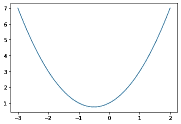

二次多项式的一个例子:抛物线

## 三次多项式的一个例子

三次多项式是三次多项式。下面的函数就是一个例子:

`y = 1 + x + x**2 + x**3`

它看起来如下:

三次多项式

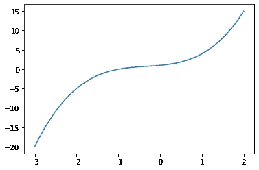

三次多项式的一个例子:三次多项式

## 6 次多项式的一个例子

高次多项式可以采用非常复杂的形式。下面的函数就是一个例子:

`y = 1/100 * (x**6 — 2x**5-26x**4+28x**3+145x**2-26x-80 )`

它看起来如下:

六次多项式

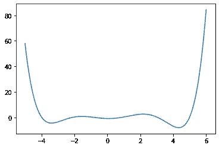

六次多项式的一个例子

正如你在图表中看到的，多项式允许你定义非常复杂的形状。同时，**曲线保持比通过线性插值或最近邻插值获得的曲线更加平滑**。这是多项式插值如今成为大多数用例的首选插值方法的主要原因。

# 多项式插值方法

多项式插值的确切目标是找到到达数据集各点的最低可能次数的多项式。最低次可归结为多项式的最简单形式。

每个数据集只有一个最简单的多项式:有且只有一个正确的多项式，目标是找到它。然而，在本文中，我们将讨论多项式插值的三种常用方法:

*   **拉格朗日**多项式插值
*   **牛顿**多项式插值，也叫**牛顿整除差插值多项式**
*   **样条**插值，更具体地说是**三次样条**插值

**拉格朗日多项式**和**牛顿多项式**给出完全相同的结果，然而它们通过不同的计算得出结果。拉格朗日和牛顿方法产生穿过数据点的最小阶的**多项式函数。**

**样条插值**略有不同，因为它不是估算一个多项式，而是估算一个**分段多项式**。“真正的”多项式插值可能需要一个非常复杂的多项式来精确地遍历所有数据点。当复杂度变得太高时，多项式可能呈现出*极不稳定的曲线*，在数据点之间包含许多不需要的尖峰。

**样条插值**是这个问题的解决方案，因为它在数据子集上定义了*多个更简单的多项式*。这在流畅和简单之间取得了巨大的平衡。样条插值是许多插值问题的首选解决方案。

现在让我们更深入地讨论一下这三种插值方法。

# 拉格朗日多项式插值

我们要看的第一种多项式插值方法是拉格朗日多项式插值。这是一种方法，允许您找到通过数据集所有点的最低阶多项式。

# 拉格朗日插值公式

在这篇文章中，我们不去探究拉格朗日插值公式为什么起作用的数学证明，但是我们将看看如何手动使用它。

下面是**拉格朗日插值公式**:

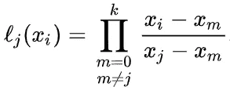

拉格朗日插值公式(第一部分)

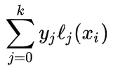

拉格朗日插值公式(下)

从第 2 部分开始理解更容易。第 2 部分基本上是说，对于数据集中的每组 x 和 y 值，将 y 值乘以 x 值的“第 1 部分计算”。

必须为每个 x 值单独进行第 1 部分的计算。计算可以理解如下。对于除了问题中的 x 值之外的每个 x 值(调用问题 j 中的 x 值和所有其他的 m)，将获得`(x — m) / (j-m)`。然后你把它们的乘积。

## 关于拉格朗日多项式插值的一个手工小例子

假设您有三个数据点:

(x = 2，y = 4)
(x = 4，y = 16)
(x = 6，y = 36)

首先计算每个数据点的拉格朗日插值公式的第 1 部分:

*   对于第一个数据点:

*[(x—4)/(2—4)]*[(x—6)/(2—6)]*

*   对于第二个数据点

*[(x-2)/(4-2)]*[(x-6)/(4-6)]*

*   对于第三个数据点

*[(x-2)/(6–2)]*[(x-4)/(6–4)]*

然后，对每个数据点组合，取 y 和 x 的第一部分解的乘积之和:

4 **[(x-4)/(2–4)]*[(x-6)/(2–6)]
+16 *[(x-2)/(4–2)]*[(x-6)/(4–6)]
+36 *[(x-2)/(6–2)]*[(x-4)/(6–4)]*

之后，你可以简化公式，你应该得到 x**2。

## 用 Python 求拉格朗日多项式插值

很高兴看到如何手动解决拉格朗日多项式插值，但这是一个很大的工作。现在让我们看看如何利用 Python 工具自动寻找最佳多项式。当然，大多数科学计算程序中都存在替代方案。

让我们从刚才手动做的同一个例子开始

Python 中的拉格朗日多项式插值

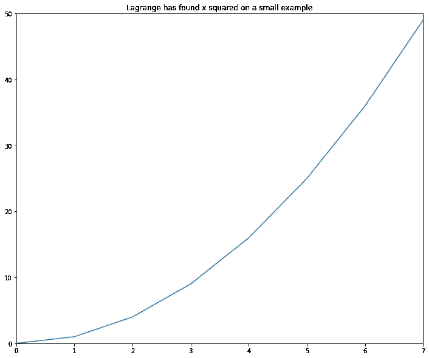

使用 Python 的 Scipy 实现拉格朗日多项式插值是成功的小例子

在本例中，拉格朗日多项式插值的快速实现是成功的:x 的平方已经被正确识别。

现在，最大的问题是:我们能使用拉格朗日多项式插值来为我们的菜园例子的温度找到一个多项式吗？这个例子显然要复杂得多，需要一个非常复杂的多项式。让我们看看当我们将 Scipy 工具应用于这个问题时会发生什么:

Python 中的拉格朗日多项式插值

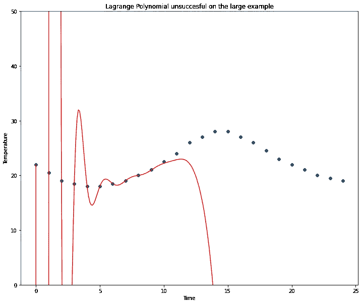

使用 Python 的拉格朗日插值的 Scipy 实现在大型示例中失败

很明显，拉格朗日方法**明显没有**找到这个美国案例的多项式。这不是问题，甚至是意料之中的行为。Scipy 文档声明:

> **警告**:该实现在数值上不稳定。不要期望能够使用超过 20 个点，即使它们是最佳选择。

既然我们知道拉格朗日多项式插值无法处理如此大的插值示例，那么让我们继续研究牛顿多项式插值方法，看看它是否能给出更好的结果。

# 牛顿多项式插值

现在让我们看看牛顿求最低阶多项式的方法。这种方法应该给出与拉格朗日多项式插值完全相同的答案，但是它使用不同的计算方法。

## 牛顿差分插值多项式

牛顿多项式法有时也被称为**牛顿差分插值多项式。**这是因为多项式的系数是用一种叫做除法的方法计算的，这种方法是由艾萨克·牛顿发明的。

您的 x 点必须等间距排列，以使用正向 Netwon 多项式方法。公式如下

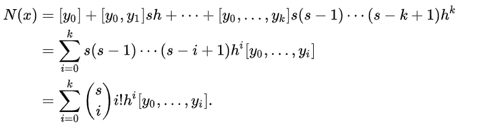

牛顿差分插值多项式

## 拉格朗日多项式与牛顿多项式

牛顿多项式比拉格朗日多项式有一些实际的优点。它允许向计算中添加更多的数据点，而无需重新进行整个计算。

## Python 中的牛顿多项式插值

要进行牛顿多项式插值，我们需要找到一个实现，因为它在 Scipy 中没有实现。您可以使用以下 Python 代码进行牛顿多项式插值(归功于 StackOverflow):

Python 中的牛顿多项式插值

让我们首先在带有 x 平方函数的小数据示例上测试牛顿多项式插值代码:

Python 中的牛顿多项式插值

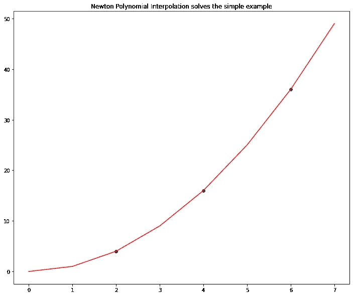

牛顿多项式插值成功的小例子

如图所示，牛顿多项式插值已成功找到基于三个数据点的函数 x 平方。目前是好消息。现在，让我们看看是否可以对我们菜园的温度数据使用同样的技术！

Python 中的牛顿多项式插值

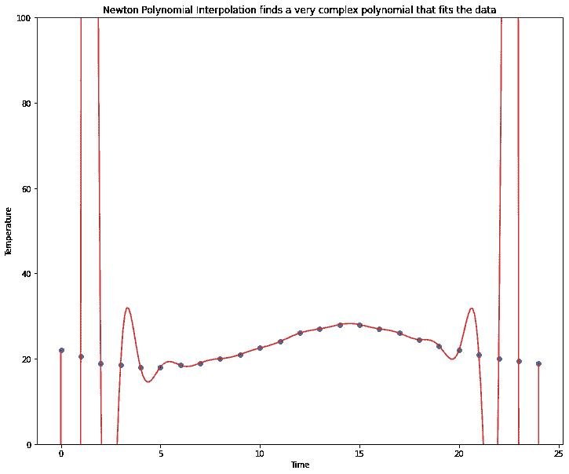

牛顿多项式插值找到了一个关于大数据量多项式过于复杂的例子

当看这个图时，你会看到，在某种程度上，牛顿实现比拉格朗日实现更好:至少牛顿遍历了所有的数据点。

然而，这个解决方案有一个严重的问题:这个多项式太复杂了，因此，它估计了从午夜到凌晨 5 点和从晚上 8 点到午夜的极端温度峰值。

这清楚地表明了**多项式插值在其官方定义**中的劣势。您强制模型找到一个且仅一个多项式来拟合您的所有数据点，但您的数据实际上并不遵循完美的多项式。**因此，解决方案通常是一个强制的、过于复杂的多项式，在某些位置会有一些极端的误差。**

让我们来发现这个问题的解决方案:**样条插值**。

# 样条插值

样条插值与前两种插值方法有很大不同。你可以认为拉格朗日法和牛顿法是纯多项式插值:它们实际上只使用一个多项式函数进行插值。

样条插值是多项式插值的一种变体，它不仅仅适合一个复杂的多项式，而是适合许多较小次数的多项式。这样，你可以避免拟合太复杂的多项式，最终得到一条更平滑的曲线，插值误差更小。

## 三次样条插值

要进行样条插值，您需要从每个点到下一个点拟合一个多项式。当你把它们放在一起时，你会得到许多组成完整插值函数的子函数。

当然，线的每一段的开始和结束值必须与前一段或后一段相对应。只有当**使用三次或更复杂的多项式**时，才能做到这一点。

使用三次样条还有一个好处，你**可以避免拟合过于复杂的曲线**，就像我们在牛顿法中看到的那样。因此，样条插值的标准方法是**只使用三次样条。**

## Python 中的三次样条插值

大多数科学软件提出了三次样条插值的方法。让我们看看如何在 Python 中使用 Scipy 实现三次样条插值。我们将从三个数据点的小例子开始。

Python 中的三次样条插值

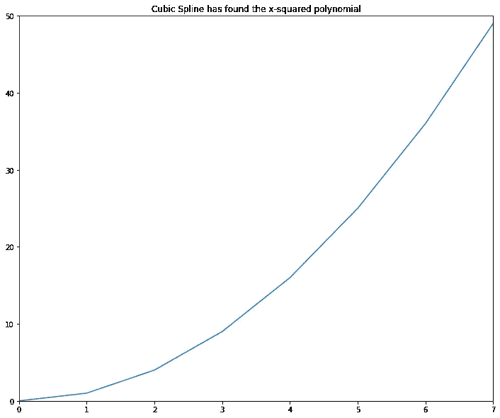

三次样条插值成功的小例子

毫不奇怪:就像拉格朗日和牛顿一样，三次样条也找到了 x 平方函数。让我们看看它在菜园温度数据上的表现。

Python 中的三次样条插值

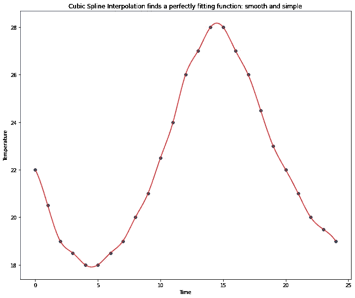

三次样条插值在大数据集上是成功的

正如你所看到的，三次样条提出了一个非常“自然”的插值。它比您之前看到的线性插值或最近邻插值平滑得多。同时，它比拉格朗日和牛顿提出的“纯”多项式方法要简单得多。

线性和最近邻插值可能仍然发现其理论简单性的优势，并且拉格朗日和牛顿插值在非常简单的数据上仍然具有优势，该数据完美地表示低阶多项式。然而，样条插值的平滑性和简单性使其成为当今许多插值挑战的首选方法。

# 关键要点

*   在本文中，您已经发现了**五种插值方法**，其中三种方法为**多项式插值**。
*   **线性插值**是最简单的插值方法，因为它包括在每个数据点和下一个数据点之间绘制直线。**最近邻插值**使用最近的测量值作为中间值的估计值。
*   **拉格朗日多项式插值**和**牛顿多项式插值**(或牛顿差分插值多项式)是两种确定性地找到穿过所有数据点的最低阶多项式的方法。
*   **样条插值**，尤其是**三次样条插值**，是一种更灵活的替代方法，可以找到分段多项式。这允许降低所用多项式的阶数，具有更简单和更接近实际的优点。这是以在分段函数中使用许多多项式而不是定义一个整体多项式为代价的。

我希望这篇文章对你有用。不要犹豫，继续关注更多的数学、统计和数据内容！