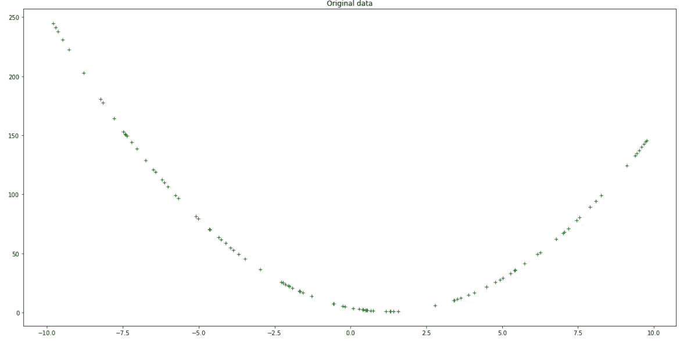

# 多项式回归-从零开始的梯度下降

> 原文：<https://towardsdatascience.com/polynomial-regression-gradient-descent-from-scratch-279db2936fe9?source=collection_archive---------7----------------------->

## 没有图书馆，没有问题


Jonny Caspari 在 [Unsplash](https://unsplash.com?utm_source=medium&utm_medium=referral) 上的照片

梯度下降是一种需要理解的重要算法，因为它是机器学习和深度学习中使用的许多更高级算法的基础。因此，掌握梯度下降的内部工作原理对任何打算进一步探索最大似然算法的人都有很大的好处。

最好的学习方法是边做边学，所以在这篇文章中，我将介绍梯度下降过程是如何工作的，而不使用 ML 库，比如 scikit-learn。在日常工作中，使用这样的库当然更快更整洁，但是关于学习过程，我发现手工实现的练习对于这种特定的算法是非常宝贵的。

# 梯度下降的目标—第一步

梯度下降的目标是相对于原始数据最小化模型预测的误差。在本文的上下文中，我们将研究二次多项式模型，也称为二次方程:


绘制时，二次多项式看起来像这样:



作者图片

## 多项式回归

我们在这里特别关注**多项式回归**，其中自变量 *x* 和因变量 *y* 之间的关系被建模为 *x* 中的 n 次多项式。简而言之，我们的二次多项式 *a、b* 和 *c* 的系数将被估计、评估和改变，直到我们可以精确地将一条线拟合到输入的 *x* 数据。梯度下降是这个过程中的优化步骤，它改变并改进这些系数的值。

我们现在将看看如何创建和绘制这样一条曲线，然后构建一个初始模型来拟合这些数据，然后我们将使用梯度下降法对其进行优化和改进。如果我们能得到一个准确描述数据的模型，希望它应该能够准确预测另一组 *x* 值的 *y* 值。

我们可以开始为二次多项式方程(𝑎𝑥 +𝑏𝑥+𝑐)选择系数，该方程将分布我们将尝试建模的数据:

这些将是我们希望预测模型尽可能接近的基础/地面真实模型的系数。接下来，我们需要一个二次多项式的评估函数，在给定一组系数和给定输入𝑥的情况下，它将返回相应的𝑦:

当 *x=* 3 *:* 时，我们可以看到它的作用

```
7
```

## 创建数据和基础模型

定义一些我们希望预测 y(输出)的 x 数据(输入):


多项式 2x -5x + 4 = 0 的曲线—作者

这很好，但我们可以通过让事情更现实来改进这一点。您可以将噪声或“抖动”添加到值中，以便它们可以类似于真实世界的数据:

测试一下:

```
7
Should get value in the range 3 - 116.233537936801398
```

这个更新的函数将接受二阶多项式和抖动值 *j* 的输入，以向该输入添加噪声，从而为我们提供比完美曲线更真实的输出:


带抖动的原始数据—作者

当我们建立我们的预测模型，并用梯度下降优化它时，希望我们能尽可能接近这些值。

# 建模的第一步——尝试随机模型

建模的第一步涉及生成和存储二次多项式(𝑦=𝑎𝑥 +𝑏𝑥+𝑐).)的随机系数这将是我们的初始模型，它很可能不那么准确，我们将致力于改进它，直到它与数据足够吻合。

```
(7, 6, 3)
```

通过根据输入值计算预测输出值来检查此模型的准确性:


原始数据与首次随机预测—作者

从上图可以明显看出，这个带有随机系数的新模型并不完全符合我们的数据。为了获得其不正确程度的量化度量，我们计算模型的[均方误差](https://en.wikipedia.org/wiki/Mean_squared_error)损失。这是*实际*和*预测*输出的*平方差*之和的*平均值*；


```
47922.39790821987
```

相当大的数量。现在，让我们看看是否可以通过使用梯度下降优化模型来改善这一相当高的损失指标。

## 梯度下降和减少损失

我们希望改进我们的模型。因此我们想改变其系数 *a* 、 *b* 和 *c* 以减小误差。因此，我们需要了解每个系数如何影响误差。这是通过计算损失函数*相对于各个系数的每个* *的* ***的偏导数来实现的。***

在这种情况下，我们使用 MSE 作为损失函数，这是我们希望计算偏导数的函数:


我们模型的输出预测为:


因此，损失可以重新表述为:


在这种特殊情况下，损失函数的偏导数如下:


*   如果计算每个导数的值，就会得到每个系数的 ***梯度*** 。
*   这些值给出了针对每个特定系数的损失函数的*斜率*。
*   它们表明你是否应该增加或减少它来减少损失，以及增加多少才是安全的。

给定系数𝑎、𝑏和𝑐，计算出的梯度𝑔𝑎、𝑔𝑏和𝑔𝑐以及学习率𝑙𝑟，通常可以更新系数，使得它们的新的更新值定义如下:


一旦你把新的模型应用到数据中，你的损失应该会减少。

## 减少损失

我们需要一个梯度计算函数，给定二次多项式的系数，以及一组输入𝑥和相应的一组实际输出𝑦将返回每个系数各自的梯度。

我们现在要:

*   使用上面的函数来计算我们表现不佳的随机模型的梯度，
*   相应地调整模型的系数，
*   验证模型的损失现在变小了——动力局起作用了！

让我们设定一个初始学习率进行实验。这应该保持很小，以避免错过全局最小值，但也不要太小，以至于花费很长时间或陷入局部最小值。lr = 0.0001 是一个很好的起点。

```
New model coeffs: 5.290395171471687 5.903335222089396 2.9704266522693037Now have smaller model loss: 23402.14716735533 vs 47922.39790821987
```

通过将训练数据、原始随机模型和更新的低损耗模型绘制在一起，将这种改进可视化:


改进了梯度下降迭代一次后的精确度-作者

# 多次迭代梯度下降

我们差不多准备好了。最后一步是在多个时期(循环或迭代)内迭代执行梯度下降。)随着每一个时代的到来，我们都希望看到以降低损失和更好地模型拟合原始数据的形式的改进。

让我们改进上面的 *calc_gradient_2nd_poly* 函数，使其更适用于迭代梯度下降过程:

这将被称为*梯度下降*功能的一部分:

最后，让我们训练 1500 个纪元，看看我们的模型是否学到了什么:


相当接近原始数据！—作者

这个经过训练的模型在完整的训练周期后显示出巨大的进步。我们可以通过检查其最终预测系数 *a* 、 *b* 和 *c* 来进一步检查:

```
Final Coefficients predicted: (2.0133237089326155, -4.9936501002139275, 3.1596042252126195)
Original Coefficients: [2, -5, 4]
```

不太远！比最初的随机模型有了很大的改进。查看培训损失减少的图表可以获得进一步的见解:


跨时代减少损失—作者

我们观察到，模型损耗接近于零，这给了我们更精确的系数。我们还可以看到，经过大约 400 个周期后，损耗没有明显改善，显然不需要 1500 个周期。另一种策略是在训练步骤中添加某种条件，当达到某个最小损失阈值时停止训练。这将防止模型的过度训练和潜在的过度拟合。

我希望你喜欢这个多项式回归的梯度下降。某些概念乍一看很难理解，但是随着时间的推移，如果我们坚持足够长的时间，我们就会熟悉问题的“螺母和螺栓”。我发现这个练习对我来说确实如此，而且我觉得这是一次值得的学习经历。

如果你喜欢这个故事，请考虑在[媒体](https://mark-garvey.medium.com/)上关注我。你可以在 https://mark-garvey.com/的[上找到更多](https://mark-garvey.com/)

在 LinkedIn 上找我:【https://www.linkedin.com/in/mark-garvey/ 